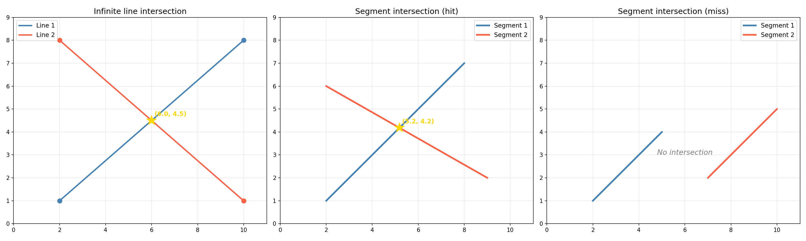
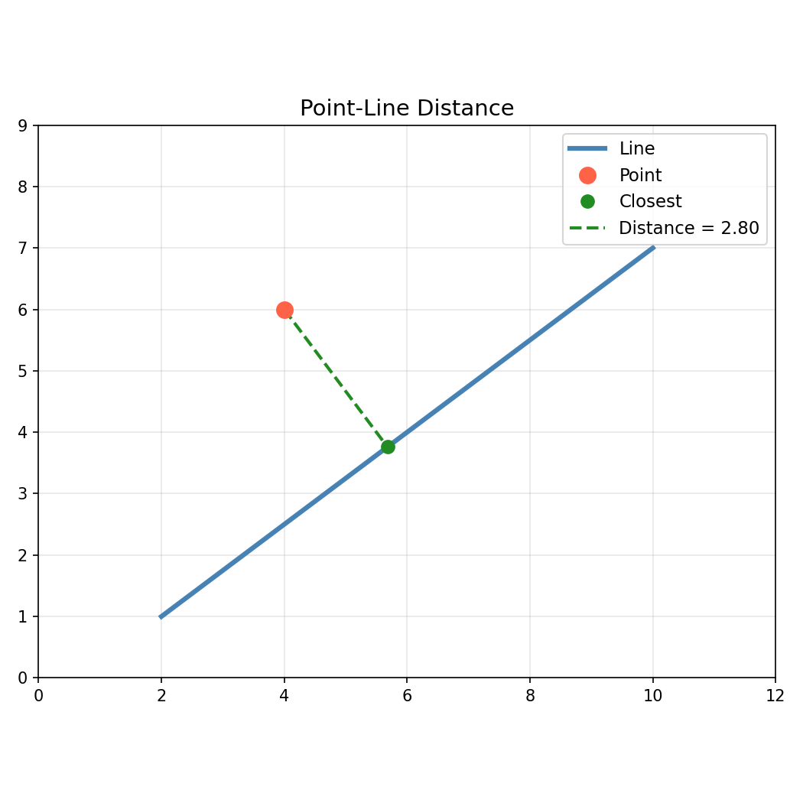

Line segment geometry queries.

Provides line-line intersection (infinite lines), line-segment intersection, closest point on a line
or segment to a given point, line-segment-vs-polygon intersections, point-on-segment tests,
point-in-rectangle tests, rectangle containment checks, and angle-at-vertex computation.

## Functions

### `does_line_segment_intersect_circle()`

`does_line_segment_intersect_circle(p1: types.Point, p2: types.Point, circle_center: types.Point, circle_radius: float) -> bool`

Check if a line segment intersects a circle.

**Returns:** True if the segment intersects the circle.

| Parameter       | Type          | Description                |
| --------------- | ------------- | -------------------------- |
| `p1`            | `types.Point` | Start of the line segment. |
| `p2`            | `types.Point` | End of the line segment.   |
| `circle_center` | `types.Point` | Circle center (x, y).      |
| `circle_radius` | `float`       | Circle radius.             |
| _Returns_       | `bool`        |                            |
| _Complexity_    |               | O(1) time, O(1) space      |

### `does_line_segment_intersect_rect()`

`does_line_segment_intersect_rect(p1: types.Point, p2: types.Point, rect: types.Rect) -> bool`

Check if a line segment intersects a rectangle.

**Returns:** True if the segment intersects the rectangle.

| Parameter    | Type          | Description                             |
| ------------ | ------------- | --------------------------------------- |
| `p1`         | `types.Point` | Start of the line segment.              |
| `p2`         | `types.Point` | End of the line segment.                |
| `rect`       | `types.Rect`  | Rectangle (x_min, y_min, x_max, y_max). |
| _Returns_    | `bool`        |                                         |
| _Complexity_ |               | O(1) time, O(1) space                   |

### `get_angle_at_vertex()`

`get_angle_at_vertex(p0: types.Point, p1: types.Point, p2: types.Point) -> float`

Compute the angle at vertex p1.

**Returns:** Angle in radians.

| Parameter    | Type          | Description           |
| ------------ | ------------- | --------------------- |
| `p0`         | `types.Point` | Previous point.       |
| `p1`         | `types.Point` | Vertex point.         |
| `p2`         | `types.Point` | Next point.           |
| _Returns_    | `float`       |                       |
| _Complexity_ |               | O(1) time, O(1) space |

### `get_line_closest_point()`

`get_line_closest_point(line_p1: types.Point, line_p2: types.Point, x: float, y: float) -> types.Point`

Get the closest point on an **infinite line** to a given point. The result may lie beyond the
segment endpoints (unclamped projection).

**Returns:** Closest point (x, y) on the infinite line.

| Parameter    | Type          | Description                   |
| ------------ | ------------- | ----------------------------- |
| `line_p1`    | `types.Point` | First point on the line.      |
| `line_p2`    | `types.Point` | Second point on the line.     |
| `x`          | `float`       | X coordinate of target point. |
| `y`          | `float`       | Y coordinate of target point. |
| _Returns_    | `types.Point` |                               |
| _Complexity_ |               | O(1) time, O(1) space         |

### `get_line_line_intersection()`

`get_line_line_intersection(p1: types.Point, p2: types.Point, p3: types.Point, p4: types.Point) -> Optional[types.Point]`

Get the intersection of two infinite lines.

**Returns:** Intersection point (x, y) or None.

| Parameter    | Type                    | Description             |
| ------------ | ----------------------- | ----------------------- |
| `p1`         | `types.Point`           | First point on line 1.  |
| `p2`         | `types.Point`           | Second point on line 1. |
| `p3`         | `types.Point`           | First point on line 2.  |
| `p4`         | `types.Point`           | Second point on line 2. |
| _Returns_    | `Optional[types.Point]` |                         |
| _Complexity_ |                         | O(1) time, O(1) space   |

_Line-line and segment intersection_

### `get_line_segment_closest_point()`

`get_line_segment_closest_point(seg_p1: types.Point, seg_p2: types.Point, x: float, y: float) -> tuple[float, types.Point, float]`

Get closest point on a line segment to a point.

**Returns:** Tuple of (parameter, closest_point, distance).

| Parameter    | Type                               | Description                   |
| ------------ | ---------------------------------- | ----------------------------- |
| `seg_p1`     | `types.Point`                      | Start of the line segment.    |
| `seg_p2`     | `types.Point`                      | End of the line segment.      |
| `x`          | `float`                            | X coordinate of target point. |
| `y`          | `float`                            | Y coordinate of target point. |
| _Returns_    | `tuple[float, types.Point, float]` |                               |
| _Complexity_ |                                    | O(1) time, O(1) space         |

### `get_line_segment_intersection()`

`get_line_segment_intersection(p1: types.Point, p2: types.Point, p3: types.Point, p4: types.Point) -> Optional[types.Point]`

Get the intersection of two line segments.

**Returns:** Intersection point (x, y) or None.

| Parameter    | Type                    | Description           |
| ------------ | ----------------------- | --------------------- |
| `p1`         | `types.Point`           | Start of segment 1.   |
| `p2`         | `types.Point`           | End of segment 1.     |
| `p3`         | `types.Point`           | Start of segment 2.   |
| `p4`         | `types.Point`           | End of segment 2.     |
| _Returns_    | `Optional[types.Point]` |                       |
| _Complexity_ |                         | O(1) time, O(1) space |

### `get_line_segment_length()`

`get_line_segment_length(p1: types.Point, p2: types.Point) -> float`

Compute the length of a line segment.

**Returns:** Distance between the two points.

| Parameter    | Type          | Description           |
| ------------ | ------------- | --------------------- |
| `p1`         | `types.Point` | Start point (x, y).   |
| `p2`         | `types.Point` | End point (x, y).     |
| _Returns_    | `float`       |                       |
| _Complexity_ |               | O(1) time, O(1) space |

### `get_line_segment_polygon_intersections()`

`get_line_segment_polygon_intersections(p1: types.Point, p2: types.Point, polygon: Sequence[types.Polygon]) -> list[float]`

Get t-values where a line segment intersects a polygon.

**Returns:** List of t-values of intersection points.

| Parameter    | Type                      | Description                |
| ------------ | ------------------------- | -------------------------- |
| `p1`         | `types.Point`             | Start of the line segment. |
| `p2`         | `types.Point`             | End of the line segment.   |
| `polygon`    | `Sequence[types.Polygon]` | Polygon to check against.  |
| _Returns_    | `list[float]`             |                            |
| _Complexity_ |                           | O(n) time, O(1) space      |

### `get_point_line_distance()`

`get_point_line_distance(point: types.Point, line_p1: types.Point, line_p2: types.Point) -> float`

Get the distance from a point to a **line segment**. The projection is clamped to the segment, so
distance is measured to the nearest endpoint when the perpendicular falls outside.

**Returns:** Distance (clamped to segment).

| Parameter    | Type          | Description                  |
| ------------ | ------------- | ---------------------------- |
| `point`      | `types.Point` | Point (x, y).                |
| `line_p1`    | `types.Point` | First point on the segment.  |
| `line_p2`    | `types.Point` | Second point on the segment. |
| _Returns_    | `float`       |                              |
| _Complexity_ |               | O(1) time, O(1) space        |

_Perpendicular distance from a point to a line_

### `is_point_on_line_segment()`

`is_point_on_line_segment(point: types.Point, seg_p1: types.Point, seg_p2: types.Point) -> bool`

Check if a point is on a line segment.

**Returns:** True if the point lies on the segment.

| Parameter    | Type          | Description                |
| ------------ | ------------- | -------------------------- |
| `point`      | `types.Point` | Point (x, y) to test.      |
| `seg_p1`     | `types.Point` | Start of the line segment. |
| `seg_p2`     | `types.Point` | End of the line segment.   |
| _Returns_    | `bool`        |                            |
| _Complexity_ |               | O(1) time, O(1) space      |
