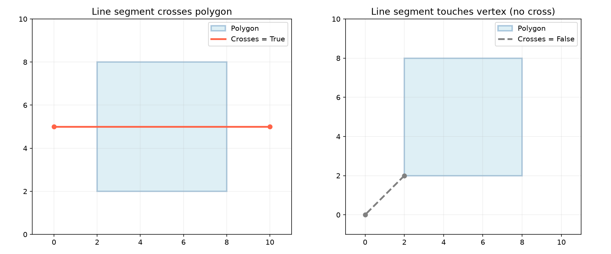
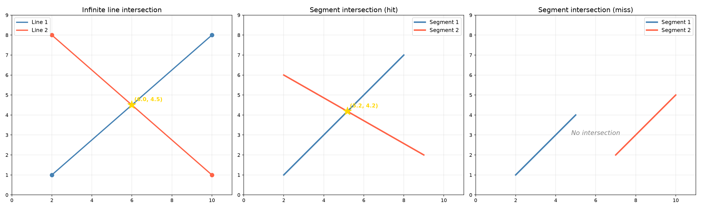
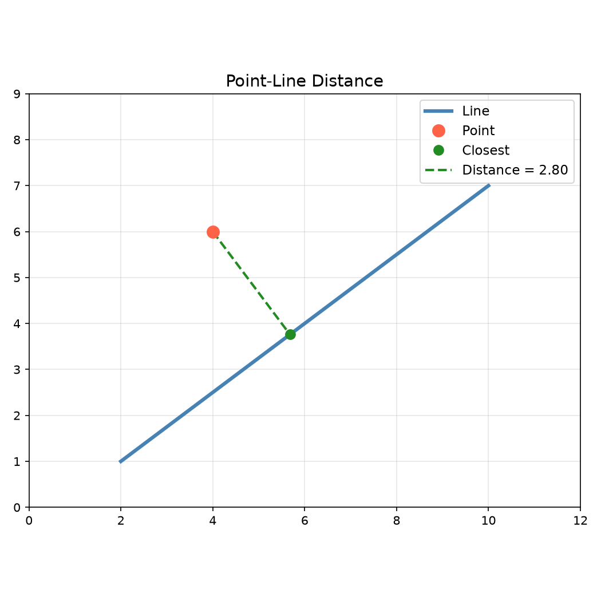
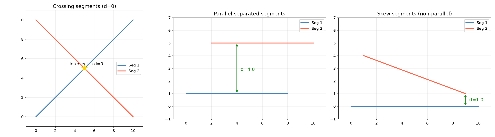
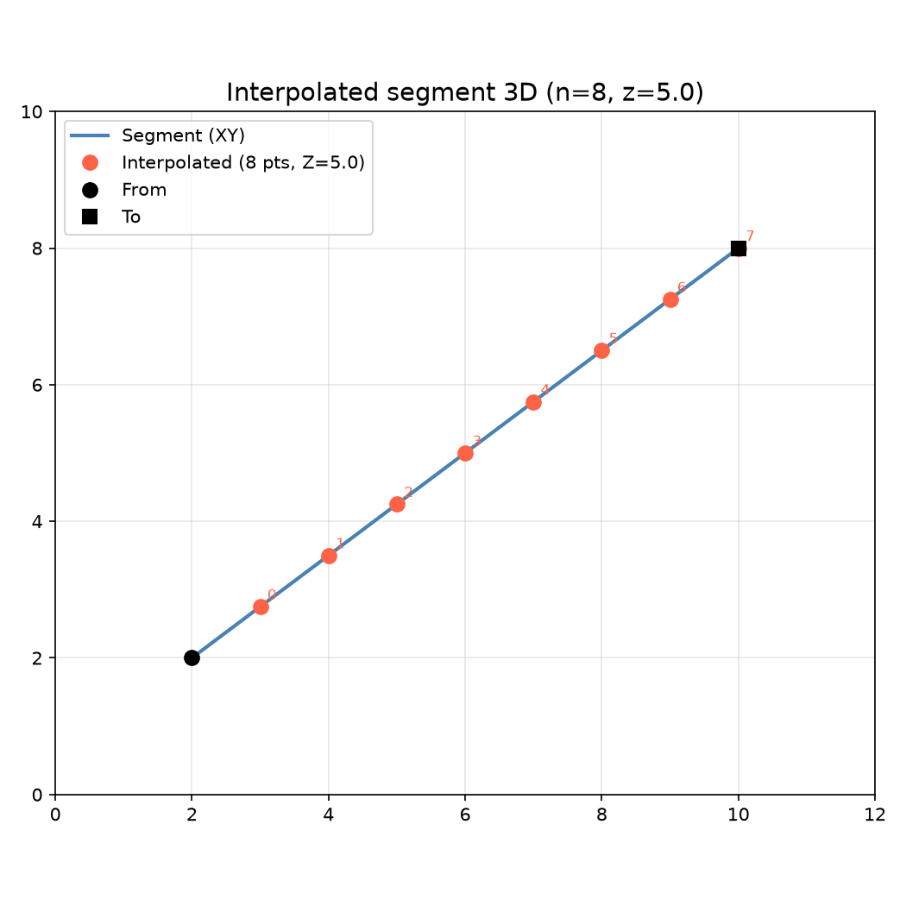
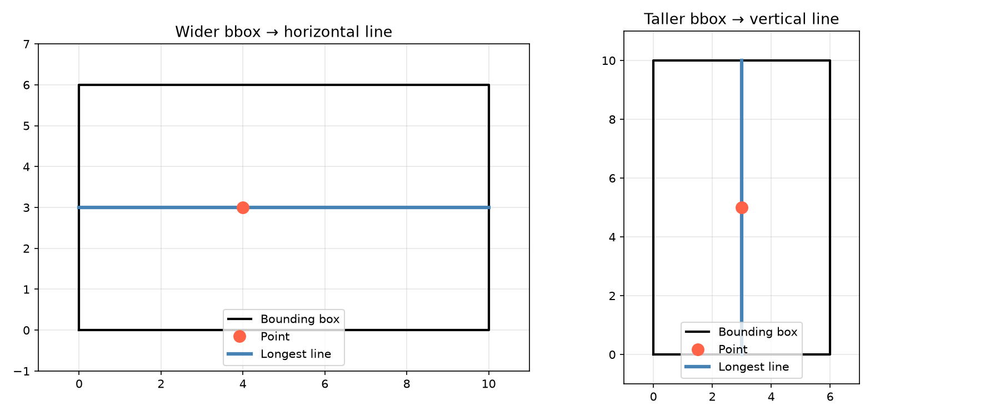

Line segment geometry queries.

Provides line-line intersection (infinite lines), line-segment intersection, closest point on a line
or segment to a given point, line-segment-vs-polygon intersections, point-on-segment tests,
point-in-rectangle tests, rectangle containment checks, and angle-at-vertex computation.

## Functions

### `does_line_cross_polygon()`

```python
does_line_cross_polygon(
    a: types.Point,
    b: types.Point,
    polygon: list[types.Point],
) -> bool
```

Check if a line segment crosses the interior of a polygon.

Returns `True` when the segment *strictly* crosses the polygon boundary — touching a vertex or
grazing an edge at an endpoint is **not** considered a crossing.

| Parameter    | Type                | Description                                         |
| ------------ | ------------------- | --------------------------------------------------- |
| `a`          | `types.Point`       | Segment start point (x, y).                         |
| `b`          | `types.Point`       | Segment end point (x, y).                           |
| `polygon`    | `list[types.Point]` | Polygon vertices [(x1, y1), (x2, y2), ...].         |
| _Returns_    | `bool`              | `True` if the segment crosses the polygon interior. |
| _Complexity_ |                     | O(n) time, O(1) space                               |



*Check whether a line segment crosses the interior of a polygon. Left: crossing segment (red).
Right: segment that only touches the boundary (gray, no cross).*

### `does_line_segment_intersect_circle()`

```python
does_line_segment_intersect_circle(
    p1: types.Point,
    p2: types.Point,
    circle_center: types.Point,
    circle_radius: float,
) -> bool
```

Check if a line segment intersects a circle.

| Parameter       | Type          | Description                                |
| --------------- | ------------- | ------------------------------------------ |
| `p1`            | `types.Point` | Start of the line segment.                 |
| `p2`            | `types.Point` | End of the line segment.                   |
| `circle_center` | `types.Point` | Circle center (x, y).                      |
| `circle_radius` | `float`       | Circle radius.                             |
| _Returns_       | `bool`        | True if the segment intersects the circle. |
| _Complexity_    |               | O(1) time, O(1) space                      |

### `does_line_segment_intersect_rect()`

```python
does_line_segment_intersect_rect(
    p1: types.Point,
    p2: types.Point,
    rect: types.Rect,
) -> bool
```

Check if a line segment intersects a rectangle.

| Parameter    | Type          | Description                                   |
| ------------ | ------------- | --------------------------------------------- |
| `p1`         | `types.Point` | Start of the line segment.                    |
| `p2`         | `types.Point` | End of the line segment.                      |
| `rect`       | `types.Rect`  | Rectangle (x_min, y_min, x_max, y_max).       |
| _Returns_    | `bool`        | True if the segment intersects the rectangle. |
| _Complexity_ |               | O(1) time, O(1) space                         |

### `get_angle_at_vertex()`

```python
get_angle_at_vertex(p0: types.Point, p1: types.Point, p2: types.Point) -> float
```

Compute the angle at vertex p1.

| Parameter    | Type          | Description           |
| ------------ | ------------- | --------------------- |
| `p0`         | `types.Point` | Previous point.       |
| `p1`         | `types.Point` | Vertex point.         |
| `p2`         | `types.Point` | Next point.           |
| _Returns_    | `float`       | Angle in radians.     |
| _Complexity_ |               | O(1) time, O(1) space |

### `get_interior_angle()`

```python
get_interior_angle(p0: types.Point, p1: types.Point, p2: types.Point) -> float
```

Interior angle at vertex `p1` formed by edges `p0→p1` and `p1→p2`.

Returns 0.0 when any two adjacent points coincide (degenerate input).

| Parameter    | Type          | Description                   |
| ------------ | ------------- | ----------------------------- |
| `p0`         | `types.Point` | Previous point.               |
| `p1`         | `types.Point` | Vertex point.                 |
| `p2`         | `types.Point` | Next point.                   |
| _Returns_    | `float`       | Angle in radians in `[0, π]`. |
| _Complexity_ |               | O(1) time, O(1) space         |

### `get_line_closest_point()`

```python
get_line_closest_point(
    line_p1: types.Point,
    line_p2: types.Point,
    x: float,
    y: float,
) -> types.Point
```

Get the closest point on an **infinite line** to a given point. The result may lie beyond the
segment endpoints (unclamped projection).

| Parameter    | Type          | Description                                |
| ------------ | ------------- | ------------------------------------------ |
| `line_p1`    | `types.Point` | First point on the line.                   |
| `line_p2`    | `types.Point` | Second point on the line.                  |
| `x`          | `float`       | X coordinate of target point.              |
| `y`          | `float`       | Y coordinate of target point.              |
| _Returns_    | `types.Point` | Closest point (x, y) on the infinite line. |
| _Complexity_ |               | O(1) time, O(1) space                      |

### `get_line_line_intersection()`

```python
get_line_line_intersection(
    p1: types.Point,
    p2: types.Point,
    p3: types.Point,
    p4: types.Point,
) -> Optional[types.Point]
```

Get the intersection of two infinite lines.

| Parameter    | Type                    | Description                        |
| ------------ | ----------------------- | ---------------------------------- |
| `p1`         | `types.Point`           | First point on line 1.             |
| `p2`         | `types.Point`           | Second point on line 1.            |
| `p3`         | `types.Point`           | First point on line 2.             |
| `p4`         | `types.Point`           | Second point on line 2.            |
| _Returns_    | `Optional[types.Point]` | Intersection point (x, y) or None. |
| _Complexity_ |                         | O(1) time, O(1) space              |



*Line-line and segment intersection*

### `get_line_segment_closest_point()`

```python
get_line_segment_closest_point(
    seg_p1: types.Point,
    seg_p2: types.Point,
    x: float,
    y: float,
) -> tuple[float, types.Point, float]
```

Get closest point on a line segment to a point.

| Parameter    | Type                               | Description                                    |
| ------------ | ---------------------------------- | ---------------------------------------------- |
| `seg_p1`     | `types.Point`                      | Start of the line segment.                     |
| `seg_p2`     | `types.Point`                      | End of the line segment.                       |
| `x`          | `float`                            | X coordinate of target point.                  |
| `y`          | `float`                            | Y coordinate of target point.                  |
| _Returns_    | `tuple[float, types.Point, float]` | Tuple of (parameter, closest_point, distance). |
| _Complexity_ |                                    | O(1) time, O(1) space                          |

### `get_line_segment_intersection()`

```python
get_line_segment_intersection(
    p1: types.Point,
    p2: types.Point,
    p3: types.Point,
    p4: types.Point,
) -> Optional[types.Point]
```

Get the intersection of two line segments.

| Parameter    | Type                    | Description                        |
| ------------ | ----------------------- | ---------------------------------- |
| `p1`         | `types.Point`           | Start of segment 1.                |
| `p2`         | `types.Point`           | End of segment 1.                  |
| `p3`         | `types.Point`           | Start of segment 2.                |
| `p4`         | `types.Point`           | End of segment 2.                  |
| _Returns_    | `Optional[types.Point]` | Intersection point (x, y) or None. |
| _Complexity_ |                         | O(1) time, O(1) space              |

### `get_line_segment_length()`

```python
get_line_segment_length(p1: types.Point, p2: types.Point) -> float
```

Compute the length of a line segment.

| Parameter    | Type          | Description                      |
| ------------ | ------------- | -------------------------------- |
| `p1`         | `types.Point` | Start point (x, y).              |
| `p2`         | `types.Point` | End point (x, y).                |
| _Returns_    | `float`       | Distance between the two points. |
| _Complexity_ |               | O(1) time, O(1) space            |

### `get_line_segment_polygon_intersections()`

```python
get_line_segment_polygon_intersections(
    p1: types.Point,
    p2: types.Point,
    polygon: Sequence[types.Polygon],
) -> list[float]
```

Get t-values where a line segment intersects a polygon.

| Parameter    | Type                      | Description                              |
| ------------ | ------------------------- | ---------------------------------------- |
| `p1`         | `types.Point`             | Start of the line segment.               |
| `p2`         | `types.Point`             | End of the line segment.                 |
| `polygon`    | `Sequence[types.Polygon]` | Polygon to check against.                |
| _Returns_    | `list[float]`             | List of t-values of intersection points. |
| _Complexity_ |                           | O(n) time, O(1) space                    |

### `get_point_line_distance()`

```python
get_point_line_distance(
    point: types.Point,
    line_p1: types.Point,
    line_p2: types.Point,
) -> float
```

Get the distance from a point to a **line segment**. The projection is clamped to the segment, so
distance is measured to the nearest endpoint when the perpendicular falls outside.

| Parameter    | Type          | Description                    |
| ------------ | ------------- | ------------------------------ |
| `point`      | `types.Point` | Point (x, y).                  |
| `line_p1`    | `types.Point` | First point on the segment.    |
| `line_p2`    | `types.Point` | Second point on the segment.   |
| _Returns_    | `float`       | Distance (clamped to segment). |
| _Complexity_ |               | O(1) time, O(1) space          |



*Perpendicular distance from a point to a line*

### `get_segment_segment_distance()`

```python
get_segment_segment_distance(
    a: tuple[float, float],
    b: tuple[float, float],
    c: tuple[float, float],
    d: tuple[float, float],
) -> float
```

Minimum Euclidean distance between two line segments.

| Parameter    | Type                  | Description                                |
| ------------ | --------------------- | ------------------------------------------ |
| `a`          | `tuple[float, float]` | Start of segment 1.                        |
| `b`          | `tuple[float, float]` | End of segment 1.                          |
| `c`          | `tuple[float, float]` | Start of segment 2.                        |
| `d`          | `tuple[float, float]` | End of segment 2.                          |
| _Returns_    | `float`               | Minimum distance between the two segments. |
| _Complexity_ |                       | O(1) time, O(1) space                      |



*Minimum Euclidean distance between two line segments. Left: crossing segments (distance 0). Centre:
parallel separated segments. Right: skew (non-parallel) segments.*

### `interpolated_segment_3d()`

```python
interpolated_segment_3d(
    from_x: float,
    from_y: float,
    to_x: float,
    to_y: float,
    z: float,
    n: int,
) -> list[tuple[float, float, float]]
```

Generate linearly interpolated 3D points along a 2D segment.

Returns *n* points from *from* to *to* at height *z*. The start is **not** included; the end *is*
included.

| Parameter    | Type                               | Description                   |
| ------------ | ---------------------------------- | ----------------------------- |
| `from_x`     | `float`                            | X coordinate of the start.    |
| `from_y`     | `float`                            | Y coordinate of the start.    |
| `to_x`       | `float`                            | X coordinate of the end.      |
| `to_y`       | `float`                            | Y coordinate of the end.      |
| `z`          | `float`                            | Z height for all points.      |
| `n`          | `int`                              | Number of points to generate. |
| _Returns_    | `list[tuple[float, float, float]]` | List of `(x, y, z)` points.   |
| _Complexity_ |                                    | O(n) time, O(1) space         |



*Linearly interpolated 3D points along a 2D segment*

### `is_point_on_line_segment()`

```python
is_point_on_line_segment(
    point: types.Point,
    seg_p1: types.Point,
    seg_p2: types.Point,
) -> bool
```

Check if a point is on a line segment.

| Parameter    | Type          | Description                            |
| ------------ | ------------- | -------------------------------------- |
| `point`      | `types.Point` | Point (x, y) to test.                  |
| `seg_p1`     | `types.Point` | Start of the line segment.             |
| `seg_p2`     | `types.Point` | End of the line segment.               |
| _Returns_    | `bool`        | True if the point lies on the segment. |
| _Complexity_ |               | O(1) time, O(1) space                  |

### `longest_line_through_point()`

```python
longest_line_through_point(
    pt: tuple[float, float],
    bbox: tuple[float, float, float, float],
) -> tuple[tuple[float, float], tuple[float, float]]
```

Find the longest axis-aligned line through a point within a rectangle.

Returns `(start, end)` — a horizontal line when the bounding box is wider than tall, otherwise a
vertical line.

| Parameter    | Type                                              | Description                                       |
| ------------ | ------------------------------------------------- | ------------------------------------------------- |
| `pt`         | `tuple[float, float]`                             | `(x, y)` point.                                   |
| `bbox`       | `tuple[float, float, float, float]`               | `(x_min, y_min, x_max, y_max)` rectangle.         |
| _Returns_    | `tuple[tuple[float, float], tuple[float, float]]` | `((x1, y1), (x2, y2))` start and end of the line. |
| _Complexity_ |                                                   | O(1) time, O(1) space                             |



*Find the longest axis-aligned line through a point within a bounding box. Left: wider box gives a
horizontal line. Right: taller box gives a vertical line.*
