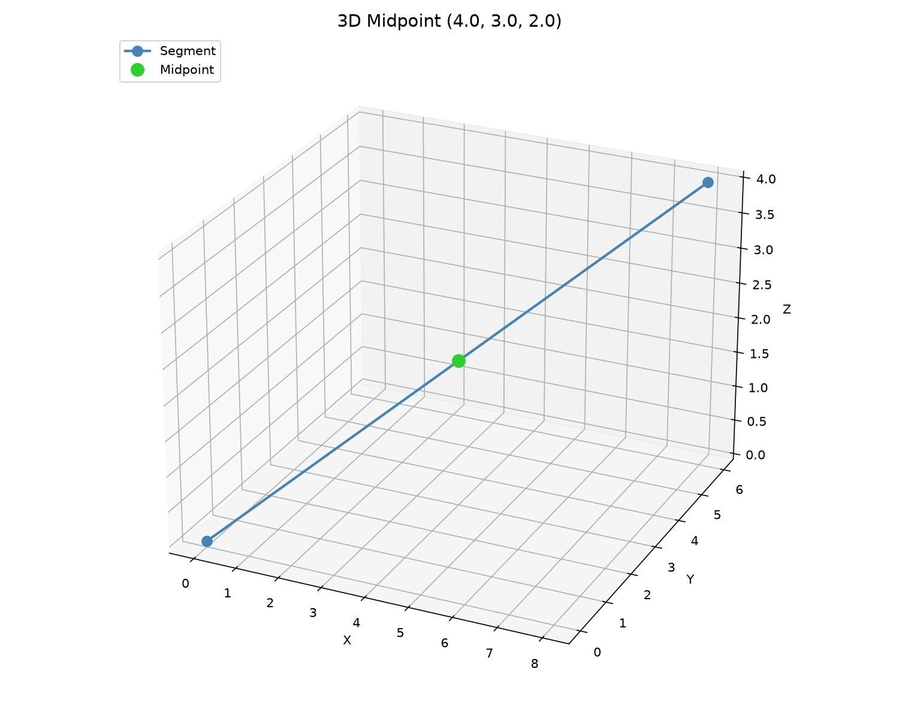

Individual point operations.

Provides equality testing within a configurable tolerance, midpoint computation between two points,
circumcenter of three points, and applying a 4x4 affine transformation matrix to a single point.

## Functions

### `are_points_equal()`

```python
are_points_equal(
    p1: types.Point3D,
    p2: types.Point3D,
    tolerance: float,
) -> bool
```

Check if two 3D points are equal within tolerance.

| Parameter    | Type            | Description                                |
| ------------ | --------------- | ------------------------------------------ |
| `p1`         | `types.Point3D` | First point (x, y, z).                     |
| `p2`         | `types.Point3D` | Second point (x, y, z).                    |
| `tolerance`  | `float`         | Maximum allowed difference.                |
| _Returns_    | `bool`          | True if points are equal within tolerance. |
| _Complexity_ |                 | O(1) time, O(1) space                      |

### `circumcenter()`

```python
circumcenter(
    a: types.Point3D,
    b: types.Point3D,
    c: types.Point3D,
) -> Optional[types.Point3D]
```

Compute the circumcenter of three 3D points.

Returns the center of the unique circle passing through all three points. Returns `None` when the
points are collinear.

| Parameter    | Type                      | Description                                    |
| ------------ | ------------------------- | ---------------------------------------------- |
| `a`          | `types.Point3D`           | First point (x, y, z).                         |
| `b`          | `types.Point3D`           | Second point (x, y, z).                        |
| `c`          | `types.Point3D`           | Third point (x, y, z).                         |
| _Returns_    | `Optional[types.Point3D]` | Circumcenter (x, y, z) or `None` if collinear. |
| _Complexity_ |                           | O(1) time, O(1) space                          |


_Circumcenter of three 3D points with circumcircle_

### `midpoint()`

```python
midpoint(p1: types.Point3D, p2: types.Point3D) -> types.Point3D
```

Get the midpoint between two 3D points.

| Parameter    | Type            | Description             |
| ------------ | --------------- | ----------------------- |
| `p1`         | `types.Point3D` | First point (x, y, z).  |
| `p2`         | `types.Point3D` | Second point (x, y, z). |
| _Returns_    | `types.Point3D` | Midpoint (x, y, z).     |
| _Complexity_ |                 | O(1) time, O(1) space   |



_Midpoint of a 3D segment_

### `transform_point()`

```python
transform_point(
    matrix: Sequence[Sequence[float]],
    x: float,
    y: float,
    z: float,
) -> types.Point3D
```

Apply an affine transformation matrix to a 3D point.

| Parameter    | Type                        | Description                       |
| ------------ | --------------------------- | --------------------------------- |
| `matrix`     | `Sequence[Sequence[float]]` | 4x4 affine transformation matrix. |
| `x`          | `float`                     | X coordinate.                     |
| `y`          | `float`                     | Y coordinate.                     |
| `z`          | `float`                     | Z coordinate.                     |
| _Returns_    | `types.Point3D`             | Transformed point (x, y, z).      |
| _Complexity_ |                             | O(1) time, O(1) space             |
