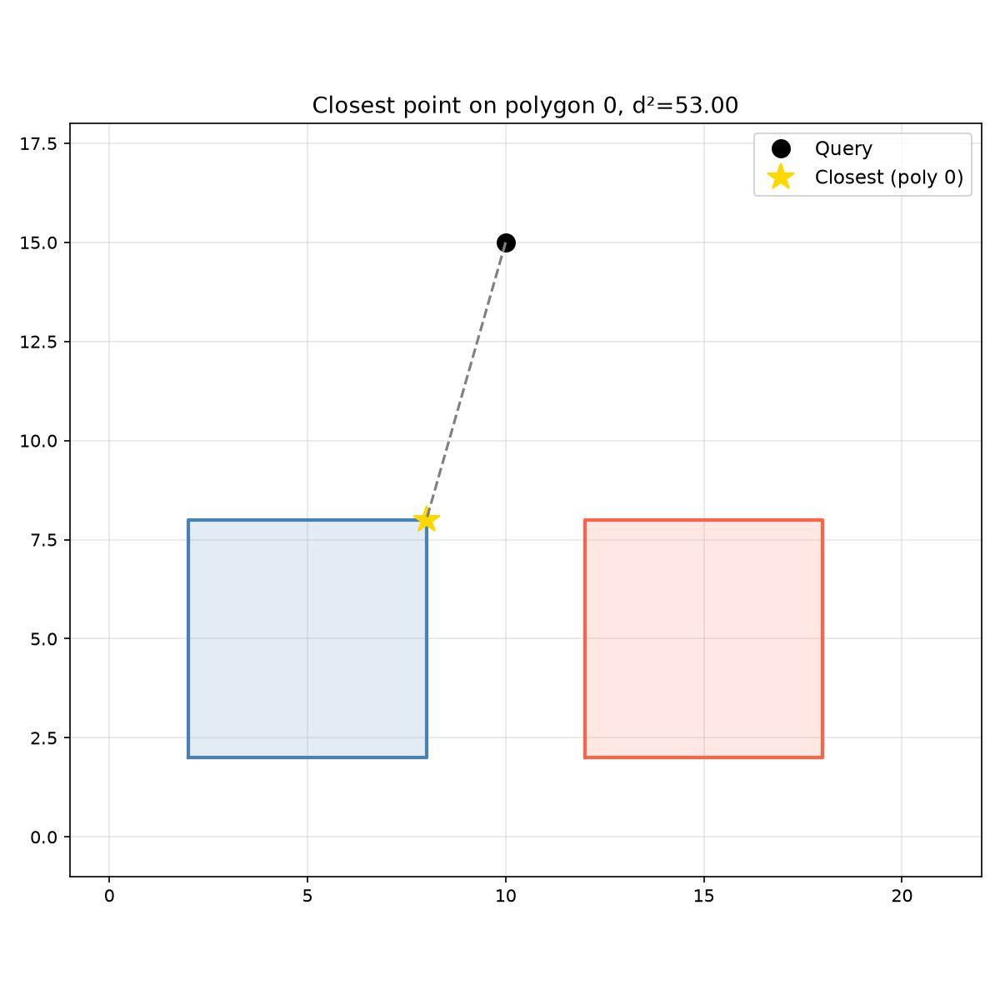
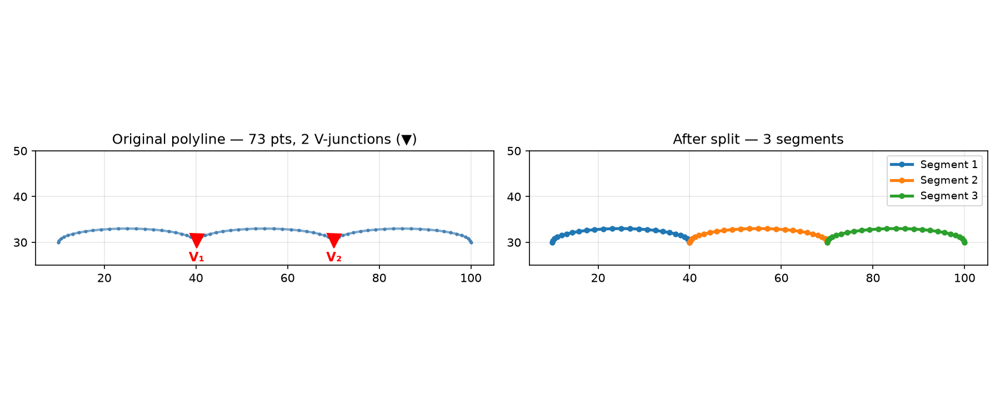

## JoinStyle

Corner join style for polygon offset operations.

- `JoinStyle.Miter`: Extends edges until they meet (default).
- `JoinStyle.Round`: Adds a circular arc at the corner.
- `JoinStyle.Square`: Extends edges by the offset distance.

## Functions

### `apply_minimum_curvature()`

```python
apply_minimum_curvature(
    polygon: Sequence[types.Point],
    r_min: float,
) -> list[types.Polygon]
```

Fillet tight internal corners to a minimum radius.

Offsets inward by `r_min` (Miter), then outward by `r_min` (Round). Acts as a high-pass curvature
filter — sharp corners are rounded to exactly `r_min` while the overall shape is preserved.

| Parameter    | Type                    | Description                       |
| ------------ | ----------------------- | --------------------------------- |
| `polygon`    | `Sequence[types.Point]` | Polygon as (x, y) points.         |
| `r_min`      | `float`                 | Minimum allowed curvature radius. |
| _Returns_    | `list[types.Polygon]`   | Filleted polygon(s).              |
| _Complexity_ |                         | O(n)                              |


_Minimum curvature fillet applied to a triangle_

### `clean_polygon()`

```python
clean_polygon(
    polygon: Sequence[types.Point],
    tolerance: Optional[float] = None,
) -> Optional[types.Polygon]
```

Clean a polygon by removing near-duplicate points.

| Parameter    | Type                      | Description                           |
| ------------ | ------------------------- | ------------------------------------- |
| `polygon`    | `Sequence[types.Point]`   | Input polygon as (x, y) points.       |
| `tolerance`  | `Optional[float] = None`  | Distance tolerance for deduplication. |
| _Returns_    | `Optional[types.Polygon]` | Cleaned polygon or None.              |
| _Complexity_ |                           | O(n)                                  |


_`clean_polygon` removes near-duplicate vertices_

### `does_path_sweep_intersect_polygon()`

```python
does_path_sweep_intersect_polygon(
    path: Sequence[types.Point],
    radius: float,
    obstacles: Sequence[types.Polygon],
) -> bool
```

Check if a disk swept along a path intersects any obstacle polygon.

Returns True when the Minkowski sweep of a disk of _radius_ along _path_ intersects any polygon in
_obstacles_.

| Parameter    | Type                      | Description                                |
| ------------ | ------------------------- | ------------------------------------------ |
| `path`       | `Sequence[types.Point]`   | Open polyline as (x, y) points.            |
| `radius`     | `float`                   | Disk radius.                               |
| `obstacles`  | `Sequence[types.Polygon]` | List of obstacle polygons.                 |
| _Returns_    | `bool`                    | True if any obstacle intersects the sweep. |
| _Complexity_ |                           | O(n \* m)                                  |


_Tests whether the Minkowski sweep of a disk along a polyline intersects any obstacle polygon_

### `flip_polygon()`

```python
flip_polygon(
    polygon: Sequence[types.Point],
    flip_h: bool,
    flip_v: bool,
) -> types.Polygon
```

Flip a polygon horizontally and/or vertically.

| Parameter    | Type                    | Description                   |
| ------------ | ----------------------- | ----------------------------- |
| `polygon`    | `Sequence[types.Point]` | Polygon as (x, y) points.     |
| `flip_h`     | `bool`                  | Whether to flip horizontally. |
| `flip_v`     | `bool`                  | Whether to flip vertically.   |
| _Returns_    | `types.Polygon`         | Flipped polygon.              |
| _Complexity_ |                         | O(n)                          |

### `flip_polygon_numpy()`

```python
flip_polygon_numpy(
    polygon: numpy.NDArray,
    flip_h: bool,
    flip_v: bool,
) -> numpy.NDArray
```

Flip a polygon from numpy array.

| Parameter    | Type            | Description                     |
| ------------ | --------------- | ------------------------------- |
| `polygon`    | `numpy.NDArray` | Polygon as a 2D numpy array.    |
| `flip_h`     | `bool`          | Whether to flip horizontally.   |
| `flip_v`     | `bool`          | Whether to flip vertically.     |
| _Returns_    | `numpy.NDArray` | Flipped polygon as numpy array. |
| _Complexity_ |                 | O(n)                            |

### `flip_polygons()`

```python
flip_polygons(
    polygons: Sequence[types.Polygon],
    flip_h: bool,
    flip_v: bool,
) -> list[types.Polygon]
```

Flip multiple polygons.

| Parameter    | Type                      | Description                   |
| ------------ | ------------------------- | ----------------------------- |
| `polygons`   | `Sequence[types.Polygon]` | List of polygons to flip.     |
| `flip_h`     | `bool`                    | Whether to flip horizontally. |
| `flip_v`     | `bool`                    | Whether to flip vertically.   |
| _Returns_    | `list[types.Polygon]`     | Flipped polygons.             |
| _Complexity_ |                           | O(n \* m)                     |

### `flip_polygons_numpy()`

```python
flip_polygons_numpy(
    polygons: Sequence[numpy.NDArray],
    flip_h: bool,
    flip_v: bool,
) -> list[numpy.NDArray]
```

Flip polygons from numpy arrays.

| Parameter    | Type                      | Description                   |
| ------------ | ------------------------- | ----------------------------- |
| `polygons`   | `Sequence[numpy.NDArray]` | List of 2D numpy arrays.      |
| `flip_h`     | `bool`                    | Whether to flip horizontally. |
| `flip_v`     | `bool`                    | Whether to flip vertically.   |
| _Returns_    | `list[numpy.NDArray]`     | List of flipped numpy arrays. |
| _Complexity_ |                           | O(n \* m)                     |

### `get_circle_polygon()`

```python
get_circle_polygon(
    center: types.Point,
    radius: float,
    n: int = 64,
) -> types.Polygon
```

Approximate a circle as an n-gon polygon.

| Parameter    | Type            | Description                       |
| ------------ | --------------- | --------------------------------- |
| `center`     | `types.Point`   | Centre point (x, y).              |
| `radius`     | `float`         | Circle radius.                    |
| `n`          | `int = 64`      | Number of sides (default 64).     |
| _Returns_    | `types.Polygon` | Polygon as list of (x, y) points. |
| _Complexity_ |                 | O(n)                              |


_`get_circle_polygon` approximates a circle as an n-sided polygon_

### `get_polygon_area()`

```python
get_polygon_area(polygon: Sequence[types.Point]) -> float
```

Get the unsigned area of a polygon.

| Parameter    | Type                    | Description               |
| ------------ | ----------------------- | ------------------------- |
| `polygon`    | `Sequence[types.Point]` | Polygon as (x, y) points. |
| _Returns_    | `float`                 | Unsigned area.            |
| _Complexity_ |                         | O(n)                      |

### `get_polygon_boundary_distance()`

```python
get_polygon_boundary_distance(
    a: Sequence[tuple[float, float]],
    b: Sequence[tuple[float, float]],
) -> float
```

Minimum midpoint-to-segment distance between the boundaries of two polygons.

Uses segment midpoints rather than raw segment-segment distance to avoid false positives from
polygons that merely touch at a shared vertex.

| Parameter    | Type                            | Description                      |
| ------------ | ------------------------------- | -------------------------------- |
| `a`          | `Sequence[tuple[float, float]]` | First polygon as (x, y) points.  |
| `b`          | `Sequence[tuple[float, float]]` | Second polygon as (x, y) points. |
| _Returns_    | `float`                         | Minimum boundary distance.       |
| _Complexity_ |                                 | O(n \* m)                        |

### `get_polygon_bounds()`

```python
get_polygon_bounds(polygon: Sequence[types.Point]) -> types.Rect
```

Get the bounding rectangle of a polygon.

| Parameter    | Type                    | Description                                         |
| ------------ | ----------------------- | --------------------------------------------------- |
| `polygon`    | `Sequence[types.Point]` | Polygon as (x, y) points.                           |
| _Returns_    | `types.Rect`            | Bounding rectangle as (x_min, y_min, x_max, y_max). |
| _Complexity_ |                         | O(n)                                                |

### `get_polygon_centroid()`

```python
get_polygon_centroid(polygon: Sequence[types.Point]) -> types.Point
```

Get the centroid of a polygon.

| Parameter    | Type                    | Description               |
| ------------ | ----------------------- | ------------------------- |
| `polygon`    | `Sequence[types.Point]` | Polygon as (x, y) points. |
| _Returns_    | `types.Point`           | Centroid point (x, y).    |
| _Complexity_ |                         | O(n)                      |


_`get_polygon_centroid` computes the geometric center_

### `get_polygon_closest_point()`

```python
get_polygon_closest_point(
    polygon: Sequence[types.Point],
    x: float,
    y: float,
) -> tuple[float, tuple[float, float], float] | None
```

Find the closest point on a polygon boundary to (x, y).

| Parameter | Type                                                   | Description                                            |
| --------- | ------------------------------------------------------ | ------------------------------------------------------ |
| `polygon` | `Sequence[types.Point]`                                | Polygon as (x, y) points.                              |
| `x`       | `float`                                                | X coordinate.                                          |
| `y`       | `float`                                                | Y coordinate.                                          |
| _Returns_ | `tuple[float, tuple[float, float], float] &#124; None` | (t, (cx, cy), distance_squared) or None if degenerate. |

### `get_polygon_convex_hull()`

```python
get_polygon_convex_hull(polygon: Sequence[types.Point]) -> types.Polygon
```

Get the convex hull of a polygon.

| Parameter    | Type                    | Description                    |
| ------------ | ----------------------- | ------------------------------ |
| `polygon`    | `Sequence[types.Point]` | Polygon as (x, y) points.      |
| _Returns_    | `types.Polygon`         | Convex hull as list of points. |
| _Complexity_ |                         | O(n log n)                     |


_`get_polygon_convex_hull` wraps polygon in convex hull_

### `get_polygon_edges()`

```python
get_polygon_edges(
    polygon: Sequence[types.Point],
) -> list[tuple[types.Point, types.Point]]
```

Get the edges of a polygon.

| Parameter    | Type                                    | Description                         |
| ------------ | --------------------------------------- | ----------------------------------- |
| `polygon`    | `Sequence[types.Point]`                 | Polygon as (x, y) points.           |
| _Returns_    | `list[tuple[types.Point, types.Point]]` | List of ((x1, y1), (x2, y2)) edges. |
| _Complexity_ |                                         | O(n)                                |

### `get_polygon_group_bounds()`

```python
get_polygon_group_bounds(polygons: Sequence[types.Polygon]) -> types.Rect
```

Get the bounding rectangle of a group of polygons.

| Parameter    | Type                      | Description                                         |
| ------------ | ------------------------- | --------------------------------------------------- |
| `polygons`   | `Sequence[types.Polygon]` | List of polygons.                                   |
| _Returns_    | `types.Rect`              | Bounding rectangle as (x_min, y_min, x_max, y_max). |
| _Complexity_ |                           | O(n \* m)                                           |


_`get_polygon_group_bounds` all polygons within a rect_

### `get_polygon_perimeter()`

```python
get_polygon_perimeter(polygon: Sequence[types.Point]) -> float
```

Get the perimeter of a polygon.

| Parameter    | Type                    | Description               |
| ------------ | ----------------------- | ------------------------- |
| `polygon`    | `Sequence[types.Point]` | Polygon as (x, y) points. |
| _Returns_    | `float`                 | Perimeter length.         |
| _Complexity_ |                         | O(n)                      |

### `get_polygon_signed_area()`

```python
get_polygon_signed_area(polygon: Sequence[types.Point]) -> float
```

Get the signed area of a polygon.

| Parameter    | Type                    | Description                                      |
| ------------ | ----------------------- | ------------------------------------------------ |
| `polygon`    | `Sequence[types.Point]` | Polygon as (x, y) points.                        |
| _Returns_    | `float`                 | Signed area (positive for CCW, negative for CW). |
| _Complexity_ |                         | O(n)                                             |

### `get_polygon_vertex_centroid()`

```python
get_polygon_vertex_centroid(
    polygon: Sequence[tuple[float, float]],
) -> tuple[float, float]
```

Arithmetic mean of polygon vertices (vertex-average centroid).

Unlike **get_polygon_centroid** (area-weighted shoelace centroid), this is useful for concave
polygons where the area centroid lies outside the boundary.

| Parameter    | Type                            | Description                     |
| ------------ | ------------------------------- | ------------------------------- |
| `polygon`    | `Sequence[tuple[float, float]]` | Polygon as (x, y) points.       |
| _Returns_    | `tuple[float, float]`           | Vertex-average centroid (x, y). |
| _Complexity_ |                                 | O(n)                            |

### `get_polygons_closest_point()`

```python
get_polygons_closest_point(
    polygons: Sequence[types.Polygon],
    x: float,
    y: float,
) -> tuple[int, float, tuple[float, float], float] | None
```

Find the closest point on any polygon in a list to (x, y).

| Parameter  | Type                                                        | Description                                             |
| ---------- | ----------------------------------------------------------- | ------------------------------------------------------- |
| `polygons` | `Sequence[types.Polygon]`                                   | List of polygons as (x, y) points.                      |
| `x`        | `float`                                                     | X coordinate.                                           |
| `y`        | `float`                                                     | Y coordinate.                                           |
| _Returns_  | `tuple[int, float, tuple[float, float], float] &#124; None` | (polygon_index, t, (cx, cy), distance_squared) or None. |



_Closest point on multiple polygons_

### `get_polygons_difference()`

```python
get_polygons_difference(
    poly1: Sequence[types.Point],
    poly2: Sequence[types.Point],
) -> list[types.Polygon]
```

Get the difference of two polygons.

| Parameter    | Type                    | Description                     |
| ------------ | ----------------------- | ------------------------------- |
| `poly1`      | `Sequence[types.Point]` | First polygon as (x, y) points. |
| `poly2`      | `Sequence[types.Point]` | Second polygon to subtract.     |
| _Returns_    | `list[types.Polygon]`   | Difference polygon(s).          |
| _Complexity_ |                         | O(n log n)                      |


_Polygon difference_

### `get_polygons_group_difference()`

```python
get_polygons_group_difference(
    subject: Sequence[types.Polygon],
    clip: Sequence[types.Polygon],
) -> list[types.Polygon]
```

Subtract clip polygons from subject polygons.

| Parameter    | Type                      | Description                |
| ------------ | ------------------------- | -------------------------- |
| `subject`    | `Sequence[types.Polygon]` | Subject polygons.          |
| `clip`       | `Sequence[types.Polygon]` | Clip polygons to subtract. |
| _Returns_    | `list[types.Polygon]`     | Difference polygon(s).     |
| _Complexity_ |                           | O(n log n)                 |

### `get_polygons_group_intersection()`

```python
get_polygons_group_intersection(
    subject: Sequence[types.Polygon],
    clip: Sequence[types.Polygon],
) -> list[types.Polygon]
```

Intersect two groups of polygons (subject & clip).

| Parameter    | Type                      | Description              |
| ------------ | ------------------------- | ------------------------ |
| `subject`    | `Sequence[types.Polygon]` | Subject polygons.        |
| `clip`       | `Sequence[types.Polygon]` | Clip polygons.           |
| _Returns_    | `list[types.Polygon]`     | Intersection polygon(s). |
| _Complexity_ |                           | O(n log n)               |

### `get_polygons_intersection()`

```python
get_polygons_intersection(
    poly1: Sequence[types.Point],
    poly2: Sequence[types.Point],
) -> list[types.Polygon]
```

Get the intersection of two polygons.

| Parameter    | Type                    | Description                      |
| ------------ | ----------------------- | -------------------------------- |
| `poly1`      | `Sequence[types.Point]` | First polygon as (x, y) points.  |
| `poly2`      | `Sequence[types.Point]` | Second polygon as (x, y) points. |
| _Returns_    | `list[types.Polygon]`   | Intersection polygon(s).         |
| _Complexity_ |                         | O(n log n)                       |


_Polygon intersection_

### `get_polygons_union()`

```python
get_polygons_union(polygons: Sequence[types.Polygon]) -> list[types.Polygon]
```

Get the union of multiple polygons.

| Parameter    | Type                      | Description                |
| ------------ | ------------------------- | -------------------------- |
| `polygons`   | `Sequence[types.Polygon]` | List of polygons to union. |
| _Returns_    | `list[types.Polygon]`     | Union polygon(s).          |
| _Complexity_ |                           | O(n log n)                 |


_Polygon union_

### `get_polyline_bounds()`

```python
get_polyline_bounds(polyline: Sequence[types.Point]) -> types.Rect
```

Get the bounding rectangle of an open polyline.

| Parameter    | Type                    | Description                                         |
| ------------ | ----------------------- | --------------------------------------------------- |
| `polyline`   | `Sequence[types.Point]` | Polyline as (x, y) points.                          |
| _Returns_    | `types.Rect`            | Bounding rectangle as (x_min, y_min, x_max, y_max). |
| _Complexity_ |                         | O(n)                                                |

### `get_polyline_closest_point()`

```python
get_polyline_closest_point(
    polyline: Sequence[tuple[float, float]],
    point: tuple[float, float],
) -> tuple[int, float] | None
```

Find the closest edge and parametric position on an open polyline.

Each edge of the polyline is tested, and the closest one is returned as `(edge_index, t)` where `t`
in [0, 1] is the parametric position along that edge.

| Parameter  | Type                            | Description                                                        |
| ---------- | ------------------------------- | ------------------------------------------------------------------ |
| `polyline` | `Sequence[tuple[float, float]]` | Open polyline as (x, y) points.                                    |
| `point`    | `tuple[float, float]`           | Query point (x, y).                                                |
| _Returns_  | `tuple[int, float] &#124; None` | `(edge_index, t)` or None if the polyline has fewer than 2 points. |


_`get_polyline_closest_point` finds the closest point on an open polyline to a query point,
returning the edge index and parametric position_

### `get_segment_swept_polygon()`

```python
get_segment_swept_polygon(
    a: types.Point,
    b: types.Point,
    radius: float,
) -> list[types.Polygon]
```

Compute the swept area of a line segment with a given radius.

Returns a rectangle (the Minkowski sum of the segment with a disk of _radius_) plus two disks at the
endpoints. Useful for toolpath clearance tracking and roughing simulation.

| Parameter    | Type                  | Description                                  |
| ------------ | --------------------- | -------------------------------------------- |
| `a`          | `types.Point`         | Start point (x, y).                          |
| `b`          | `types.Point`         | End point (x, y).                            |
| `radius`     | `float`               | Offset radius.                               |
| _Returns_    | `list[types.Polygon]` | List of polygons (rectangle + two end-caps). |
| _Complexity_ |                       | O(n)                                         |


_`get_segment_swept_polygon` computes the swept area of a line segment with a given radius_

### `is_almost_equal()`

```python
is_almost_equal(a: float, b: float, tolerance: Optional[float] = None) -> bool
```

Check if two floats are almost equal.

| Parameter    | Type                     | Description           |
| ------------ | ------------------------ | --------------------- | ----- | ------------ |
| `a`          | `float`                  | First float.          |
| `b`          | `float`                  | Second float.         |
| `tolerance`  | `Optional[float] = None` | Comparison tolerance. |
| _Returns_    | `bool`                   | True if               | a - b | < tolerance. |
| _Complexity_ |                          | O(1)                  |

### `is_point_inside_polygon()`

```python
is_point_inside_polygon(
    point: types.Point,
    polygon: Sequence[types.Point],
) -> bool
```

Check if a point is inside a polygon.

| Parameter    | Type                    | Description                          |
| ------------ | ----------------------- | ------------------------------------ |
| `point`      | `types.Point`           | Point (x, y) to test.                |
| `polygon`    | `Sequence[types.Point]` | Polygon as (x, y) points.            |
| _Returns_    | `bool`                  | True if point is inside the polygon. |
| _Complexity_ |                         | O(n)                                 |

### `is_polygon_clockwise()`

```python
is_polygon_clockwise(points: Sequence[types.Point2DOr3D]) -> bool
```

Check if a polygon has clockwise winding.

| Parameter    | Type                          | Description                             |
| ------------ | ----------------------------- | --------------------------------------- |
| `points`     | `Sequence[types.Point2DOr3D]` | Sequence of (x, y) or (x, y, z) points. |
| _Returns_    | `bool`                        | True if the polygon is clockwise.       |
| _Complexity_ |                               | O(n)                                    |

### `is_polygon_convex()`

```python
is_polygon_convex(polygon: Sequence[types.Point]) -> bool
```

Check if a polygon is convex.

| Parameter    | Type                    | Description                    |
| ------------ | ----------------------- | ------------------------------ |
| `polygon`    | `Sequence[types.Point]` | Polygon as (x, y) points.      |
| _Returns_    | `bool`                  | True if the polygon is convex. |
| _Complexity_ |                         | O(n)                           |

### `normalize_polygons()`

```python
normalize_polygons(
    polygons: Sequence[types.Polygon],
) -> tuple[list[types.Polygon], float, float]
```

Normalize polygons (outer CCW, inner CW).

| Parameter    | Type                                       | Description                                   |
| ------------ | ------------------------------------------ | --------------------------------------------- |
| `polygons`   | `Sequence[types.Polygon]`                  | List of polygons to normalize.                |
| _Returns_    | `tuple[list[types.Polygon], float, float]` | Tuple of (normalized_polygons, min_x, min_y). |
| _Complexity_ |                                            | O(n log n)                                    |

### `normalize_polygons_numpy()`

```python
normalize_polygons_numpy(
    polygons: Sequence[numpy.NDArray],
) -> tuple[list[numpy.NDArray], float, float]
```

Normalize polygons from numpy arrays.

| Parameter    | Type                                       | Description                                 |
| ------------ | ------------------------------------------ | ------------------------------------------- |
| `polygons`   | `Sequence[numpy.NDArray]`                  | Sequence of 2D numpy arrays.                |
| _Returns_    | `tuple[list[numpy.NDArray], float, float]` | Tuple of (normalized_arrays, min_x, min_y). |
| _Complexity_ |                                            | O(n log n)                                  |

### `offset_polygon()`

```python
offset_polygon(
    polygon: Sequence[types.Point],
    offset: float,
    join_style: JoinStyle = JoinStyle.Miter,
) -> list[types.Polygon]
```

Offset (inflate/deflate) a polygon.

| Parameter    | Type                          | Description                                                 |
| ------------ | ----------------------------- | ----------------------------------------------------------- |
| `polygon`    | `Sequence[types.Point]`       | Polygon as (x, y) points.                                   |
| `offset`     | `float`                       | Offset distance (positive to inflate, negative to deflate). |
| `join_style` | `JoinStyle = JoinStyle.Miter` | Corner join style (default: `JoinStyle.Miter`).             |
| _Returns_    | `list[types.Polygon]`         | Offset polygon(s).                                          |
| _Complexity_ |                               | O(n log n)                                                  |


_Polygon offset — miter vs round vs square join styles_

### `point_in_polygon_numpy()`

```python
point_in_polygon_numpy(point: types.Point, polygon: numpy.NDArray) -> bool
```

Check if point is in polygon from numpy array.

| Parameter    | Type            | Description                          |
| ------------ | --------------- | ------------------------------------ |
| `point`      | `types.Point`   | Point (x, y) to test.                |
| `polygon`    | `numpy.NDArray` | Polygon as a 2D numpy array.         |
| _Returns_    | `bool`          | True if point is inside the polygon. |
| _Complexity_ |                 | O(n)                                 |

### `point_line_distance()`

```python
point_line_distance(
    point: types.Point,
    line_start: types.Point,
    line_end: types.Point,
) -> float
```

Compute the distance from a point to a line.

| Parameter    | Type          | Description              |
| ------------ | ------------- | ------------------------ |
| `point`      | `types.Point` | Point (x, y).            |
| `line_start` | `types.Point` | Line start point (x, y). |
| `line_end`   | `types.Point` | Line end point (x, y).   |
| _Returns_    | `float`       | Perpendicular distance.  |
| _Complexity_ |               | O(1)                     |

### `polygon_area_numpy()`

```python
polygon_area_numpy(polygon: numpy.NDArray) -> float
```

Get the area of a polygon from numpy array.

| Parameter    | Type            | Description                  |
| ------------ | --------------- | ---------------------------- |
| `polygon`    | `numpy.NDArray` | Polygon as a 2D numpy array. |
| _Returns_    | `float`         | Signed area.                 |
| _Complexity_ |                 | O(n)                         |

### `polygon_bounds_numpy()`

```python
polygon_bounds_numpy(polygon: numpy.NDArray) -> types.Rect
```

Get bounds of a polygon from numpy array.

| Parameter    | Type            | Description                                         |
| ------------ | --------------- | --------------------------------------------------- |
| `polygon`    | `numpy.NDArray` | Polygon as a 2D numpy array.                        |
| _Returns_    | `types.Rect`    | Bounding rectangle as (x_min, y_min, x_max, y_max). |
| _Complexity_ |                 | O(n)                                                |

### `polygon_group_bounds_numpy()`

```python
polygon_group_bounds_numpy(polygons: Sequence[numpy.NDArray]) -> types.Rect
```

Get bounds of polygon group from numpy arrays.

| Parameter    | Type                      | Description                                         |
| ------------ | ------------------------- | --------------------------------------------------- |
| `polygons`   | `Sequence[numpy.NDArray]` | Sequence of 2D numpy arrays.                        |
| _Returns_    | `types.Rect`              | Bounding rectangle as (x_min, y_min, x_max, y_max). |
| _Complexity_ |                           | O(n \* m)                                           |

### `polygon_perimeter_numpy()`

```python
polygon_perimeter_numpy(polygon: numpy.NDArray) -> float
```

Get the perimeter of a polygon from numpy array.

| Parameter    | Type            | Description                  |
| ------------ | --------------- | ---------------------------- |
| `polygon`    | `numpy.NDArray` | Polygon as a 2D numpy array. |
| _Returns_    | `float`         | Perimeter length.            |
| _Complexity_ |                 | O(n)                         |

### `polygons_intersect()`

```python
polygons_intersect(
    p1: Sequence[types.Point],
    p2: Sequence[types.Point],
    min_area: float = 0,
) -> bool
```

Check if two polygons intersect.

| Parameter    | Type                    | Description                          |
| ------------ | ----------------------- | ------------------------------------ |
| `p1`         | `Sequence[types.Point]` | First polygon as (x, y) points.      |
| `p2`         | `Sequence[types.Point]` | Second polygon as (x, y) points.     |
| `min_area`   | `float = 0`             | Minimum intersection area threshold. |
| _Returns_    | `bool`                  | True if polygons intersect.          |
| _Complexity_ |                         | O(n \* m)                            |

### `polygons_intersect_numpy()`

```python
polygons_intersect_numpy(
    poly1: numpy.NDArray,
    poly2: numpy.NDArray,
    min_area: float = 0,
) -> bool
```

Check if polygons intersect from numpy arrays.

| Parameter    | Type            | Description                          |
| ------------ | --------------- | ------------------------------------ |
| `poly1`      | `numpy.NDArray` | First polygon as a 2D numpy array.   |
| `poly2`      | `numpy.NDArray` | Second polygon as a 2D numpy array.  |
| `min_area`   | `float = 0`     | Minimum intersection area threshold. |
| _Returns_    | `bool`          | True if polygons intersect.          |
| _Complexity_ |                 | O(n \* m)                            |

### `resample_polygon()`

```python
resample_polygon(
    polygon: Sequence[tuple[float, float]],
    spacing: float,
) -> list[tuple[float, float]]
```

Resample a closed polygon by inserting evenly-spaced points along each edge so that no segment is
longer than _spacing_.

The result is a closed polyline (last point connects back to first conceptually, but is not
duplicated).

| Parameter    | Type                            | Description                                 |
| ------------ | ------------------------------- | ------------------------------------------- |
| `polygon`    | `Sequence[tuple[float, float]]` | Polygon as (x, y) points.                   |
| `spacing`    | `float`                         | Maximum allowed segment length.             |
| _Returns_    | `list[tuple[float, float]]`     | Resampled polygon as list of (x, y) points. |
| _Complexity_ |                                 | O(n \* m)                                   |

### `resample_polyline()`

```python
resample_polyline(
    polyline: Sequence[tuple[float, float]],
    max_len: float,
) -> list[tuple[float, float]]
```

Resample an open 2D polyline so consecutive points are at most _max_len_ apart.

New points are linearly interpolated along each segment that exceeds the threshold. The first and
last points are always preserved.

| Parameter    | Type                            | Description                     |
| ------------ | ------------------------------- | ------------------------------- |
| `polyline`   | `Sequence[tuple[float, float]]` | Open polyline as (x, y) points. |
| `max_len`    | `float`                         | Maximum allowed segment length. |
| _Returns_    | `list[tuple[float, float]]`     | Resampled polyline.             |
| _Complexity_ |                                 | O(n \* m)                       |

### `rotate_polygon()`

```python
rotate_polygon(polygon: Sequence[types.Point], angle: float) -> types.Polygon
```

Rotate a polygon by an angle.

| Parameter    | Type                    | Description                |
| ------------ | ----------------------- | -------------------------- |
| `polygon`    | `Sequence[types.Point]` | Polygon as (x, y) points.  |
| `angle`      | `float`                 | Rotation angle in degrees. |
| _Returns_    | `types.Polygon`         | Rotated polygon.           |
| _Complexity_ |                         | O(n)                       |

### `rotate_polygon_numpy()`

```python
rotate_polygon_numpy(polygon: numpy.NDArray, angle: float) -> numpy.NDArray
```

Rotate a polygon from numpy array.

| Parameter    | Type            | Description                     |
| ------------ | --------------- | ------------------------------- |
| `polygon`    | `numpy.NDArray` | Polygon as a 2D numpy array.    |
| `angle`      | `float`         | Rotation angle in degrees.      |
| _Returns_    | `numpy.NDArray` | Rotated polygon as numpy array. |
| _Complexity_ |                 | O(n)                            |

### `rotate_polygons()`

```python
rotate_polygons(
    polygons: Sequence[types.Polygon],
    angle: float,
) -> list[types.Polygon]
```

Rotate multiple polygons by an angle.

| Parameter    | Type                      | Description                 |
| ------------ | ------------------------- | --------------------------- |
| `polygons`   | `Sequence[types.Polygon]` | List of polygons to rotate. |
| `angle`      | `float`                   | Rotation angle in degrees.  |
| _Returns_    | `list[types.Polygon]`     | Rotated polygons.           |
| _Complexity_ |                           | O(n \* m)                   |

### `rotate_polygons_numpy()`

```python
rotate_polygons_numpy(
    polygons: Sequence[numpy.NDArray],
    angle: float,
) -> list[numpy.NDArray]
```

Rotate polygons from numpy arrays.

| Parameter    | Type                      | Description                   |
| ------------ | ------------------------- | ----------------------------- |
| `polygons`   | `Sequence[numpy.NDArray]` | Sequence of 2D numpy arrays.  |
| `angle`      | `float`                   | Rotation angle in degrees.    |
| _Returns_    | `list[numpy.NDArray]`     | List of rotated numpy arrays. |
| _Complexity_ |                           | O(n \* m)                     |

### `scale_polygon()`

```python
scale_polygon(
    polygon: Sequence[types.Point],
    scale: float,
    scale_y: Optional[float] = None,
) -> types.Polygon
```

Scale a polygon.

| Parameter    | Type                     | Description                                |
| ------------ | ------------------------ | ------------------------------------------ |
| `polygon`    | `Sequence[types.Point]`  | Polygon as (x, y) points.                  |
| `scale`      | `float`                  | X (and Y if scale_y is None) scale factor. |
| `scale_y`    | `Optional[float] = None` | Y scale factor (optional).                 |
| _Returns_    | `types.Polygon`          | Scaled polygon.                            |
| _Complexity_ |                          | O(n)                                       |

### `split_polyline_at_v_junctions()`

```python
split_polyline_at_v_junctions(
    polyline: Sequence[tuple[float, float]],
    angle_threshold: float,
) -> list[list[tuple[float, float]]]
```

Split a polyline at V-junction vertices where the interior angle is much sharper than both
neighbours.

Each resulting sub-polyline is trimmed with `trim_polyline_angular_ends`.

| Parameter         | Type                              | Description                 |
| ----------------- | --------------------------------- | --------------------------- |
| `polyline`        | `Sequence[tuple[float, float]]`   | Sequence of (x, y) points.  |
| `angle_threshold` | `float`                           | Angle threshold in radians. |
| _Returns_         | `list[list[tuple[float, float]]]` | List of sub-polylines.      |
| _Complexity_      |                                   | O(n) time, O(n) space       |



_Three semi-arcs (hills) form two V-junctions where they meet. The function splits the polyline at
those points and trims each segment's angular ends._

### `to_clipper_numpy()`

```python
to_clipper_numpy(polygon: Sequence[numpy.NDArray]) -> list[tuple[int, int]]
```

Convert a numpy polygon to Clipper integer coordinates.

| Parameter    | Type                      | Description                    |
| ------------ | ------------------------- | ------------------------------ |
| `polygon`    | `Sequence[numpy.NDArray]` | Sequence of 2D numpy arrays.   |
| _Returns_    | `list[tuple[int, int]]`   | List of (x, y) integer tuples. |
| _Complexity_ |                           | O(n \* m)                      |

### `translate_bounds()`

```python
translate_bounds(bounds: types.Rect, dx: float, dy: float) -> types.Rect
```

Translate a bounding rectangle.

| Parameter    | Type         | Description                                      |
| ------------ | ------------ | ------------------------------------------------ |
| `bounds`     | `types.Rect` | Bounding rectangle (x_min, y_min, x_max, y_max). |
| `dx`         | `float`      | X translation.                                   |
| `dy`         | `float`      | Y translation.                                   |
| _Returns_    | `types.Rect` | Translated bounding rectangle.                   |
| _Complexity_ |              | O(1)                                             |

### `translate_polygon()`

```python
translate_polygon(
    polygon: Sequence[types.Point],
    dx: float,
    dy: float,
) -> types.Polygon
```

Translate a polygon.

| Parameter    | Type                    | Description               |
| ------------ | ----------------------- | ------------------------- |
| `polygon`    | `Sequence[types.Point]` | Polygon as (x, y) points. |
| `dx`         | `float`                 | X translation.            |
| `dy`         | `float`                 | Y translation.            |
| _Returns_    | `types.Polygon`         | Translated polygon.       |
| _Complexity_ |                         | O(n)                      |

### `translate_polygon_numpy()`

```python
translate_polygon_numpy(
    polygon: numpy.NDArray,
    dx: float,
    dy: float,
) -> numpy.NDArray
```

Translate a polygon from numpy array.

| Parameter    | Type            | Description                        |
| ------------ | --------------- | ---------------------------------- |
| `polygon`    | `numpy.NDArray` | Polygon as a 2D numpy array.       |
| `dx`         | `float`         | X translation.                     |
| `dy`         | `float`         | Y translation.                     |
| _Returns_    | `numpy.NDArray` | Translated polygon as numpy array. |
| _Complexity_ |                 | O(n)                               |

### `translate_polygons()`

```python
translate_polygons(
    polygons: Sequence[types.Polygon],
    dx: float,
    dy: float,
) -> list[types.Polygon]
```

Translate a list of polygons.

| Parameter    | Type                      | Description                    |
| ------------ | ------------------------- | ------------------------------ |
| `polygons`   | `Sequence[types.Polygon]` | List of polygons to translate. |
| `dx`         | `float`                   | X translation.                 |
| `dy`         | `float`                   | Y translation.                 |
| _Returns_    | `list[types.Polygon]`     | Translated polygons.           |
| _Complexity_ |                           | O(n \* m)                      |

### `translate_polygons_numpy()`

```python
translate_polygons_numpy(
    polygons: Sequence[numpy.NDArray],
    dx: float,
    dy: float,
) -> list[numpy.NDArray]
```

Translate polygons from numpy arrays.

| Parameter    | Type                      | Description                      |
| ------------ | ------------------------- | -------------------------------- |
| `polygons`   | `Sequence[numpy.NDArray]` | Sequence of 2D numpy arrays.     |
| `dx`         | `float`                   | X translation.                   |
| `dy`         | `float`                   | Y translation.                   |
| _Returns_    | `list[numpy.NDArray]`     | List of translated numpy arrays. |
| _Complexity_ |                           | O(n \* m)                        |

### `trim_polyline_angular_ends()`

```python
trim_polyline_angular_ends(
    polygon: Sequence[tuple[float, float]],
    start: int,
    length: int,
    angle_threshold_rad: float,
) -> tuple[int, int]
```

Trim vertices from both ends of a contiguous subsequence where the interior angle jumps sharply.

Detects "transition" vertices at the boundary between two differently- curved regions of a closed
polygon. The function iteratively trims such vertices from the start and end of the subsequence
until no more trimming occurs or the sequence is too short.

| Parameter             | Type                            | Description                                            |
| --------------------- | ------------------------------- | ------------------------------------------------------ |
| `polygon`             | `Sequence[tuple[float, float]]` | Closed polygon as (x, y) points.                       |
| `start`               | `int`                           | Start index of the subsequence.                        |
| `length`              | `int`                           | Length of the subsequence.                             |
| `angle_threshold_rad` | `float`                         | Angle threshold in radians.                            |
| _Returns_             | `tuple[int, int]`               | `(new_start, new_length)` within the original polygon. |


_`trim_polyline_angular_ends` removes transition vertices from both ends of a contiguous subsequence
where the interior angle jumps sharply. Here a 10-vertex cut (indices 1–10) with angles ranging
59°→180°→59° is trimmed to 8 vertices using a 25° threshold._

### `trim_polyline_at()`

```python
trim_polyline_at(
    polyline: Sequence[tuple[float, float]],
    a: tuple[float, float],
    b: tuple[float, float],
) -> list[tuple[float, float]]
```

Trim a polyline to the portion between two points.

Each point is projected onto the nearest edge of the polyline. The returned polyline goes from the
projection of _a_ to the projection of _b_, preserving intermediate vertices.

| Parameter  | Type                            | Description                     |
| ---------- | ------------------------------- | ------------------------------- |
| `polyline` | `Sequence[tuple[float, float]]` | Open polyline as (x, y) points. |
| `a`        | `tuple[float, float]`           | Start point to trim at.         |
| `b`        | `tuple[float, float]`           | End point to trim at.           |
| _Returns_  | `list[tuple[float, float]]`     | Trimmed polyline.               |


_`trim_polyline_at` trims a polyline between two points_
