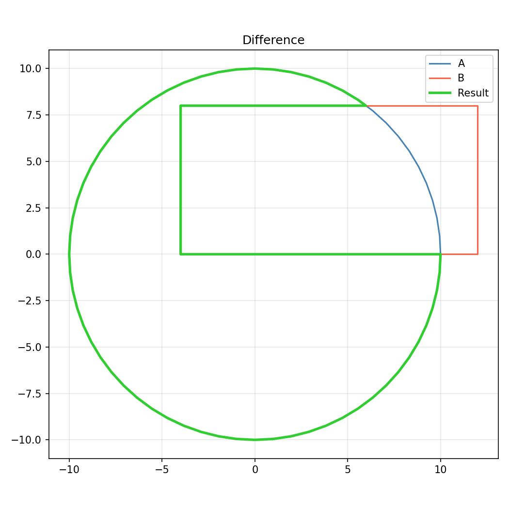
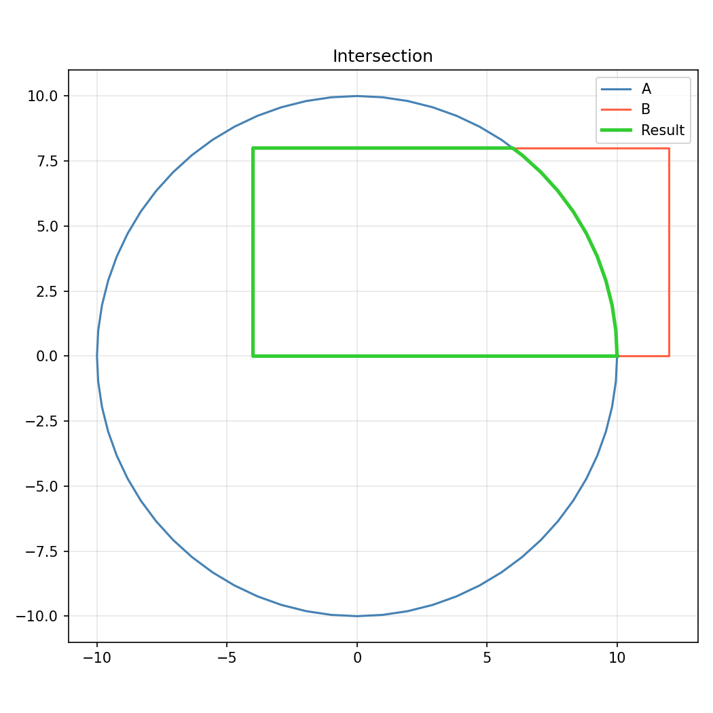
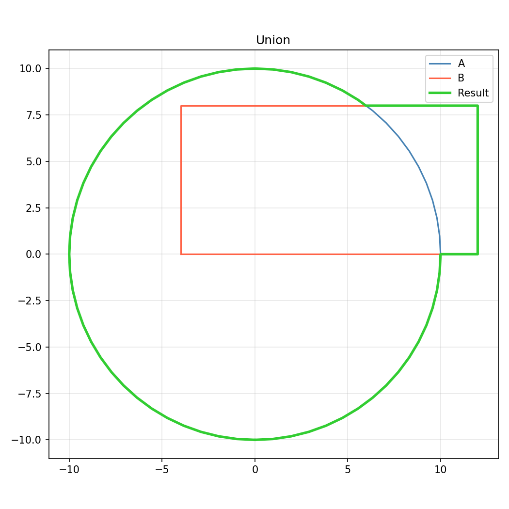
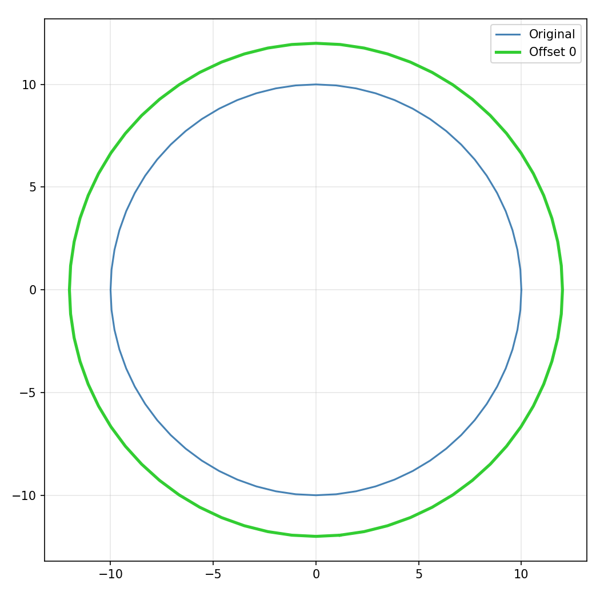

## Functions

### `clean_polygon()`

`clean_polygon(polygon: collections.abc.Sequence[types.Point], tolerance: Optional[float] = None) -> Optional[types.Polygon]`

Clean a polygon by removing near-duplicate points.

**Returns:** Cleaned polygon or None.

| Parameter   | Type                                    | Description                           |
| ----------- | --------------------------------------- | ------------------------------------- |
| `polygon`   | `collections.abc.Sequence[types.Point]` | Input polygon as (x, y) points.       |
| `tolerance` | `Optional[float] = None`                | Distance tolerance for deduplication. |
| _Returns_   | `Optional[types.Polygon]`               |                                       |

### `flip_polygon()`

`flip_polygon(polygon: collections.abc.Sequence[types.Point], flip_h: bool, flip_v: bool) -> types.Polygon`

Flip a polygon horizontally and/or vertically.

**Returns:** Flipped polygon.

| Parameter | Type                                    | Description                   |
| --------- | --------------------------------------- | ----------------------------- |
| `polygon` | `collections.abc.Sequence[types.Point]` | Polygon as (x, y) points.     |
| `flip_h`  | `bool`                                  | Whether to flip horizontally. |
| `flip_v`  | `bool`                                  | Whether to flip vertically.   |
| _Returns_ | `types.Polygon`                         |                               |

### `flip_polygon_numpy()`

`flip_polygon_numpy(polygon: numpy.NDArray, flip_h: bool, flip_v: bool) -> Any`

Flip a polygon from numpy array.

**Returns:** Flipped polygon as numpy array.

| Parameter | Type            | Description                   |
| --------- | --------------- | ----------------------------- |
| `polygon` | `numpy.NDArray` | Polygon as a 2D numpy array.  |
| `flip_h`  | `bool`          | Whether to flip horizontally. |
| `flip_v`  | `bool`          | Whether to flip vertically.   |
| _Returns_ | `Any`           |                               |

### `flip_polygons()`

`flip_polygons(polygons: Any, flip_h: bool, flip_v: bool) -> list[types.Polygon]`

Flip multiple polygons.

**Returns:** Flipped polygons.

| Parameter  | Type                  | Description                   |
| ---------- | --------------------- | ----------------------------- |
| `polygons` | `Any`                 | List of polygons to flip.     |
| `flip_h`   | `bool`                | Whether to flip horizontally. |
| `flip_v`   | `bool`                | Whether to flip vertically.   |
| _Returns_  | `list[types.Polygon]` |                               |

### `flip_polygons_numpy()`

`flip_polygons_numpy(polygons: list, flip_h: bool, flip_v: bool) -> Any`

Flip polygons from numpy arrays.

**Returns:** List of flipped numpy arrays.

| Parameter  | Type   | Description                   |
| ---------- | ------ | ----------------------------- |
| `polygons` | `list` | List of 2D numpy arrays.      |
| `flip_h`   | `bool` | Whether to flip horizontally. |
| `flip_v`   | `bool` | Whether to flip vertically.   |
| _Returns_  | `Any`  |                               |

### `get_polygon_area()`

`get_polygon_area(polygon: collections.abc.Sequence[types.Point]) -> float`

Get the unsigned area of a polygon.

**Returns:** Unsigned area.

| Parameter | Type                                    | Description               |
| --------- | --------------------------------------- | ------------------------- |
| `polygon` | `collections.abc.Sequence[types.Point]` | Polygon as (x, y) points. |
| _Returns_ | `float`                                 |                           |

### `get_polygon_bounds()`

`get_polygon_bounds(polygon: collections.abc.Sequence[types.Point]) -> types.Rect`

Get the bounding rectangle of a polygon.

**Returns:** Bounding rectangle as (x_min, y_min, x_max, y_max).

| Parameter | Type                                    | Description               |
| --------- | --------------------------------------- | ------------------------- |
| `polygon` | `collections.abc.Sequence[types.Point]` | Polygon as (x, y) points. |
| _Returns_ | `types.Rect`                            |                           |

### `get_polygon_centroid()`

`get_polygon_centroid(polygon: collections.abc.Sequence[types.Point]) -> types.Point`

Get the centroid of a polygon.

**Returns:** Centroid point (x, y).

| Parameter | Type                                    | Description               |
| --------- | --------------------------------------- | ------------------------- |
| `polygon` | `collections.abc.Sequence[types.Point]` | Polygon as (x, y) points. |
| _Returns_ | `types.Point`                           |                           |

### `get_polygon_convex_hull()`

`get_polygon_convex_hull(polygon: collections.abc.Sequence[types.Point]) -> types.Polygon`

Get the convex hull of a polygon.

**Returns:** Convex hull as list of points.

| Parameter | Type                                    | Description               |
| --------- | --------------------------------------- | ------------------------- |
| `polygon` | `collections.abc.Sequence[types.Point]` | Polygon as (x, y) points. |
| _Returns_ | `types.Polygon`                         |                           |

### `get_polygon_edges()`

`get_polygon_edges(polygon: collections.abc.Sequence[types.Point]) -> list[tuple[types.Point, types.Point]]`

Get the edges of a polygon.

**Returns:** List of ((x1, y1), (x2, y2)) edges.

| Parameter | Type                                    | Description               |
| --------- | --------------------------------------- | ------------------------- |
| `polygon` | `collections.abc.Sequence[types.Point]` | Polygon as (x, y) points. |
| _Returns_ | `list[tuple[types.Point, types.Point]]` |                           |

### `get_polygon_group_bounds()`

`get_polygon_group_bounds(polygons: Any) -> types.Rect`

Get the bounding rectangle of a group of polygons.

**Returns:** Bounding rectangle as (x_min, y_min, x_max, y_max).

| Parameter  | Type         | Description       |
| ---------- | ------------ | ----------------- |
| `polygons` | `Any`        | List of polygons. |
| _Returns_  | `types.Rect` |                   |

### `get_polygon_perimeter()`

`get_polygon_perimeter(polygon: collections.abc.Sequence[types.Point]) -> float`

Get the perimeter of a polygon.

**Returns:** Perimeter length.

| Parameter | Type                                    | Description               |
| --------- | --------------------------------------- | ------------------------- |
| `polygon` | `collections.abc.Sequence[types.Point]` | Polygon as (x, y) points. |
| _Returns_ | `float`                                 |                           |

### `get_polygon_signed_area()`

`get_polygon_signed_area(polygon: collections.abc.Sequence[types.Point]) -> float`

Get the signed area of a polygon.

**Returns:** Signed area (positive for CCW, negative for CW).

| Parameter | Type                                    | Description               |
| --------- | --------------------------------------- | ------------------------- |
| `polygon` | `collections.abc.Sequence[types.Point]` | Polygon as (x, y) points. |
| _Returns_ | `float`                                 |                           |

### `get_polygons_difference()`

`get_polygons_difference(poly1: collections.abc.Sequence[types.Point], poly2: collections.abc.Sequence[types.Point]) -> list[types.Polygon]`

Get the difference of two polygons.

**Returns:** Difference polygon(s).

| Parameter | Type                                    | Description                     |
| --------- | --------------------------------------- | ------------------------------- |
| `poly1`   | `collections.abc.Sequence[types.Point]` | First polygon as (x, y) points. |
| `poly2`   | `collections.abc.Sequence[types.Point]` | Second polygon to subtract.     |
| _Returns_ | `list[types.Polygon]`                   |                                 |

_Polygon difference_

### `get_polygons_group_difference()`

`get_polygons_group_difference(subject: Sequence[types.Polygon], clip: Sequence[types.Polygon]) -> list[types.Polygon]`

Subtract clip polygons from subject polygons.

**Returns:** Difference polygon(s).

| Parameter | Type                      | Description                |
| --------- | ------------------------- | -------------------------- |
| `subject` | `Sequence[types.Polygon]` | Subject polygons.          |
| `clip`    | `Sequence[types.Polygon]` | Clip polygons to subtract. |
| _Returns_ | `list[types.Polygon]`     |                            |

### `get_polygons_group_intersection()`

`get_polygons_group_intersection(subject: Sequence[types.Polygon], clip: Sequence[types.Polygon]) -> list[types.Polygon]`

Intersect two groups of polygons (subject & clip).

**Returns:** Intersection polygon(s).

| Parameter | Type                      | Description       |
| --------- | ------------------------- | ----------------- |
| `subject` | `Sequence[types.Polygon]` | Subject polygons. |
| `clip`    | `Sequence[types.Polygon]` | Clip polygons.    |
| _Returns_ | `list[types.Polygon]`     |                   |

### `get_polygons_intersection()`

`get_polygons_intersection(poly1: collections.abc.Sequence[types.Point], poly2: collections.abc.Sequence[types.Point]) -> list[types.Polygon]`

Get the intersection of two polygons.

**Returns:** Intersection polygon(s).

| Parameter | Type                                    | Description                      |
| --------- | --------------------------------------- | -------------------------------- |
| `poly1`   | `collections.abc.Sequence[types.Point]` | First polygon as (x, y) points.  |
| `poly2`   | `collections.abc.Sequence[types.Point]` | Second polygon as (x, y) points. |
| _Returns_ | `list[types.Polygon]`                   |                                  |

_Polygon intersection_

### `get_polygons_union()`

`get_polygons_union(polygons: Any) -> list[types.Polygon]`

Get the union of multiple polygons.

**Returns:** Union polygon(s).

| Parameter  | Type                  | Description                |
| ---------- | --------------------- | -------------------------- |
| `polygons` | `Any`                 | List of polygons to union. |
| _Returns_  | `list[types.Polygon]` |                            |

_Polygon union_

### `is_almost_equal()`

`is_almost_equal(a: float, b: float, tolerance: Optional[float] = None) -> bool`

Check if two floats are almost equal.

**Returns:** True if |a - b| < tolerance.

| Parameter   | Type                     | Description           |
| ----------- | ------------------------ | --------------------- |
| `a`         | `float`                  | First float.          |
| `b`         | `float`                  | Second float.         |
| `tolerance` | `Optional[float] = None` | Comparison tolerance. |
| _Returns_   | `bool`                   |                       |

### `is_point_inside_polygon()`

`is_point_inside_polygon(point: types.Point, polygon: collections.abc.Sequence[types.Point]) -> bool`

Check if a point is inside a polygon.

**Returns:** True if point is inside the polygon.

| Parameter | Type                                    | Description               |
| --------- | --------------------------------------- | ------------------------- |
| `point`   | `types.Point`                           | Point (x, y) to test.     |
| `polygon` | `collections.abc.Sequence[types.Point]` | Polygon as (x, y) points. |
| _Returns_ | `bool`                                  |                           |

### `is_polygon_clockwise()`

`is_polygon_clockwise(points: collections.abc.Sequence[types.Point2DOr3D]) -> bool`

Check if a polygon has clockwise winding.

**Returns:** True if the polygon is clockwise.

| Parameter | Type                                          | Description                             |
| --------- | --------------------------------------------- | --------------------------------------- |
| `points`  | `collections.abc.Sequence[types.Point2DOr3D]` | Sequence of (x, y) or (x, y, z) points. |
| _Returns_ | `bool`                                        |                                         |

### `is_polygon_convex()`

`is_polygon_convex(polygon: collections.abc.Sequence[types.Point]) -> bool`

Check if a polygon is convex.

**Returns:** True if the polygon is convex.

| Parameter | Type                                    | Description               |
| --------- | --------------------------------------- | ------------------------- |
| `polygon` | `collections.abc.Sequence[types.Point]` | Polygon as (x, y) points. |
| _Returns_ | `bool`                                  |                           |

### `normalize_polygons()`

`normalize_polygons(polygons: Any) -> tuple[list[types.Polygon], float, float]`

Normalize polygons (outer CCW, inner CW).

**Returns:** Tuple of (normalized_polygons, min_x, min_y).

| Parameter  | Type                                       | Description                    |
| ---------- | ------------------------------------------ | ------------------------------ |
| `polygons` | `Any`                                      | List of polygons to normalize. |
| _Returns_  | `tuple[list[types.Polygon], float, float]` |                                |

### `normalize_polygons_numpy()`

`normalize_polygons_numpy(polygons: collections.abc.Sequence[numpy.NDArray]) -> tuple[list[numpy.NDArray], float, float]`

Normalize polygons from numpy arrays.

**Returns:** Tuple of (normalized_arrays, min_x, min_y).

| Parameter  | Type                                       | Description                  |
| ---------- | ------------------------------------------ | ---------------------------- |
| `polygons` | `collections.abc.Sequence[numpy.NDArray]`  | Sequence of 2D numpy arrays. |
| _Returns_  | `tuple[list[numpy.NDArray], float, float]` |                              |

### `offset_polygon()`

`offset_polygon(polygon: collections.abc.Sequence[types.Point], offset: float) -> list[types.Polygon]`

Offset (inflate/deflate) a polygon.

**Returns:** Offset polygon(s).

| Parameter | Type                                    | Description                                                 |
| --------- | --------------------------------------- | ----------------------------------------------------------- |
| `polygon` | `collections.abc.Sequence[types.Point]` | Polygon as (x, y) points.                                   |
| `offset`  | `float`                                 | Offset distance (positive to inflate, negative to deflate). |
| _Returns_ | `list[types.Polygon]`                   |                                                             |

_Polygon offset (outward)_

### `point_in_polygon_numpy()`

`point_in_polygon_numpy(point: types.Point, polygon: numpy.NDArray) -> bool`

Check if point is in polygon from numpy array.

**Returns:** True if point is inside the polygon.

| Parameter | Type            | Description                  |
| --------- | --------------- | ---------------------------- |
| `point`   | `types.Point`   | Point (x, y) to test.        |
| `polygon` | `numpy.NDArray` | Polygon as a 2D numpy array. |
| _Returns_ | `bool`          |                              |

### `point_line_distance()`

`point_line_distance(point: types.Point, line_start: types.Point, line_end: types.Point) -> float`

Compute the distance from a point to a line.

**Returns:** Perpendicular distance.

| Parameter    | Type          | Description              |
| ------------ | ------------- | ------------------------ |
| `point`      | `types.Point` | Point (x, y).            |
| `line_start` | `types.Point` | Line start point (x, y). |
| `line_end`   | `types.Point` | Line end point (x, y).   |
| _Returns_    | `float`       |                          |

### `polygon_area_numpy()`

`polygon_area_numpy(polygon: numpy.NDArray) -> float`

Get the area of a polygon from numpy array.

**Returns:** Signed area.

| Parameter | Type            | Description                  |
| --------- | --------------- | ---------------------------- |
| `polygon` | `numpy.NDArray` | Polygon as a 2D numpy array. |
| _Returns_ | `float`         |                              |

### `polygon_bounds_numpy()`

`polygon_bounds_numpy(polygon: numpy.NDArray) -> types.Rect`

Get bounds of a polygon from numpy array.

**Returns:** Bounding rectangle as (x_min, y_min, x_max, y_max).

| Parameter | Type            | Description                  |
| --------- | --------------- | ---------------------------- |
| `polygon` | `numpy.NDArray` | Polygon as a 2D numpy array. |
| _Returns_ | `types.Rect`    |                              |

### `polygon_group_bounds_numpy()`

`polygon_group_bounds_numpy(polygons: collections.abc.Sequence[numpy.NDArray]) -> types.Rect`

Get bounds of polygon group from numpy arrays.

**Returns:** Bounding rectangle as (x_min, y_min, x_max, y_max).

| Parameter  | Type                                      | Description                  |
| ---------- | ----------------------------------------- | ---------------------------- |
| `polygons` | `collections.abc.Sequence[numpy.NDArray]` | Sequence of 2D numpy arrays. |
| _Returns_  | `types.Rect`                              |                              |

### `polygon_perimeter_numpy()`

`polygon_perimeter_numpy(polygon: numpy.NDArray) -> float`

Get the perimeter of a polygon from numpy array.

**Returns:** Perimeter length.

| Parameter | Type            | Description                  |
| --------- | --------------- | ---------------------------- |
| `polygon` | `numpy.NDArray` | Polygon as a 2D numpy array. |
| _Returns_ | `float`         |                              |

### `polygons_intersect()`

`polygons_intersect(p1: collections.abc.Sequence[types.Point], p2: collections.abc.Sequence[types.Point], min_area: float = 0) -> bool`

Check if two polygons intersect.

**Returns:** True if polygons intersect.

| Parameter  | Type                                    | Description                          |
| ---------- | --------------------------------------- | ------------------------------------ |
| `p1`       | `collections.abc.Sequence[types.Point]` | First polygon as (x, y) points.      |
| `p2`       | `collections.abc.Sequence[types.Point]` | Second polygon as (x, y) points.     |
| `min_area` | `float = 0`                             | Minimum intersection area threshold. |
| _Returns_  | `bool`                                  |                                      |

### `polygons_intersect_numpy()`

`polygons_intersect_numpy(poly1: numpy.NDArray, poly2: numpy.NDArray, min_area: float = 0) -> bool`

Check if polygons intersect from numpy arrays.

**Returns:** True if polygons intersect.

| Parameter  | Type            | Description                          |
| ---------- | --------------- | ------------------------------------ |
| `poly1`    | `numpy.NDArray` | First polygon as a 2D numpy array.   |
| `poly2`    | `numpy.NDArray` | Second polygon as a 2D numpy array.  |
| `min_area` | `float = 0`     | Minimum intersection area threshold. |
| _Returns_  | `bool`          |                                      |

### `rotate_polygon()`

`rotate_polygon(polygon: collections.abc.Sequence[types.Point], angle: float) -> types.Polygon`

Rotate a polygon by an angle.

**Returns:** Rotated polygon.

| Parameter | Type                                    | Description                |
| --------- | --------------------------------------- | -------------------------- |
| `polygon` | `collections.abc.Sequence[types.Point]` | Polygon as (x, y) points.  |
| `angle`   | `float`                                 | Rotation angle in degrees. |
| _Returns_ | `types.Polygon`                         |                            |

### `rotate_polygon_numpy()`

`rotate_polygon_numpy(polygon: numpy.NDArray, angle: float) -> Any`

Rotate a polygon from numpy array.

**Returns:** Rotated polygon as numpy array.

| Parameter | Type            | Description                  |
| --------- | --------------- | ---------------------------- |
| `polygon` | `numpy.NDArray` | Polygon as a 2D numpy array. |
| `angle`   | `float`         | Rotation angle in degrees.   |
| _Returns_ | `Any`           |                              |

### `rotate_polygons()`

`rotate_polygons(polygons: Any, angle: float) -> list[types.Polygon]`

Rotate multiple polygons by an angle.

**Returns:** Rotated polygons.

| Parameter  | Type                  | Description                 |
| ---------- | --------------------- | --------------------------- |
| `polygons` | `Any`                 | List of polygons to rotate. |
| `angle`    | `float`               | Rotation angle in degrees.  |
| _Returns_  | `list[types.Polygon]` |                             |

### `rotate_polygons_numpy()`

`rotate_polygons_numpy(polygons: collections.abc.Sequence[numpy.NDArray], angle: float) -> Any`

Rotate polygons from numpy arrays.

**Returns:** List of rotated numpy arrays.

| Parameter  | Type                                      | Description                  |
| ---------- | ----------------------------------------- | ---------------------------- |
| `polygons` | `collections.abc.Sequence[numpy.NDArray]` | Sequence of 2D numpy arrays. |
| `angle`    | `float`                                   | Rotation angle in degrees.   |
| _Returns_  | `Any`                                     |                              |

### `scale_polygon()`

`scale_polygon(polygon: collections.abc.Sequence[types.Point], scale: float, scale_y: Optional[float] = None) -> types.Polygon`

Scale a polygon.

**Returns:** Scaled polygon.

| Parameter | Type                                    | Description                                |
| --------- | --------------------------------------- | ------------------------------------------ |
| `polygon` | `collections.abc.Sequence[types.Point]` | Polygon as (x, y) points.                  |
| `scale`   | `float`                                 | X (and Y if scale_y is None) scale factor. |
| `scale_y` | `Optional[float] = None`                | Y scale factor (optional).                 |
| _Returns_ | `types.Polygon`                         |                                            |

### `to_clipper_numpy()`

`to_clipper_numpy(polygon: collections.abc.Sequence[numpy.NDArray]) -> list[tuple[int, int]]`

Convert a numpy polygon to Clipper integer coordinates.

**Returns:** List of (x, y) integer tuples.

| Parameter | Type                                      | Description                  |
| --------- | ----------------------------------------- | ---------------------------- |
| `polygon` | `collections.abc.Sequence[numpy.NDArray]` | Sequence of 2D numpy arrays. |
| _Returns_ | `list[tuple[int, int]]`                   |                              |

### `translate_bounds()`

`translate_bounds(bounds: types.Rect, dx: float, dy: float) -> types.Rect`

Translate a bounding rectangle.

**Returns:** Translated bounding rectangle.

| Parameter | Type         | Description                                      |
| --------- | ------------ | ------------------------------------------------ |
| `bounds`  | `types.Rect` | Bounding rectangle (x_min, y_min, x_max, y_max). |
| `dx`      | `float`      | X translation.                                   |
| `dy`      | `float`      | Y translation.                                   |
| _Returns_ | `types.Rect` |                                                  |

### `translate_polygon()`

`translate_polygon(polygon: collections.abc.Sequence[types.Point], dx: float, dy: float) -> types.Polygon`

Translate a polygon.

**Returns:** Translated polygon.

| Parameter | Type                                    | Description               |
| --------- | --------------------------------------- | ------------------------- |
| `polygon` | `collections.abc.Sequence[types.Point]` | Polygon as (x, y) points. |
| `dx`      | `float`                                 | X translation.            |
| `dy`      | `float`                                 | Y translation.            |
| _Returns_ | `types.Polygon`                         |                           |

### `translate_polygon_numpy()`

`translate_polygon_numpy(polygon: numpy.NDArray, dx: float, dy: float) -> Any`

Translate a polygon from numpy array.

**Returns:** Translated polygon as numpy array.

| Parameter | Type            | Description                  |
| --------- | --------------- | ---------------------------- |
| `polygon` | `numpy.NDArray` | Polygon as a 2D numpy array. |
| `dx`      | `float`         | X translation.               |
| `dy`      | `float`         | Y translation.               |
| _Returns_ | `Any`           |                              |

### `translate_polygons()`

`translate_polygons(polygons: Any, dx: float, dy: float) -> list[types.Polygon]`

Translate a list of polygons.

**Returns:** Translated polygons.

| Parameter  | Type                  | Description                    |
| ---------- | --------------------- | ------------------------------ |
| `polygons` | `Any`                 | List of polygons to translate. |
| `dx`       | `float`               | X translation.                 |
| `dy`       | `float`               | Y translation.                 |
| _Returns_  | `list[types.Polygon]` |                                |

### `translate_polygons_numpy()`

`translate_polygons_numpy(polygons: collections.abc.Sequence[numpy.NDArray], dx: float, dy: float) -> Any`

Translate polygons from numpy arrays.

**Returns:** List of translated numpy arrays.

| Parameter  | Type                                      | Description                  |
| ---------- | ----------------------------------------- | ---------------------------- |
| `polygons` | `collections.abc.Sequence[numpy.NDArray]` | Sequence of 2D numpy arrays. |
| `dx`       | `float`                                   | X translation.               |
| `dy`       | `float`                                   | Y translation.               |
| _Returns_  | `Any`                                     |                              |
