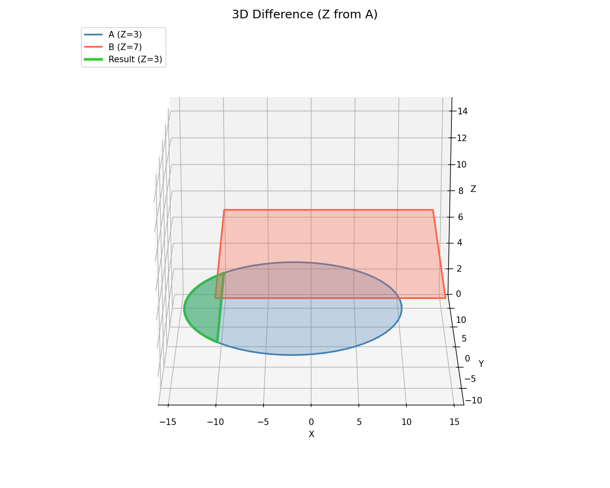
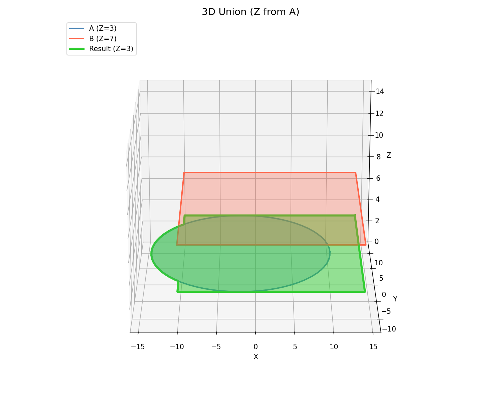

## Functions

### `get_polygons_difference_3d()`

```python
get_polygons_difference_3d(poly1: Any, poly2: Any) -> list[types.Polygon3D]
```

Compute the difference of two 3D polygons (poly1 - poly2).

| Parameter | Type                    | Description                                  |
| --------- | ----------------------- | -------------------------------------------- |
| `poly1`   | `Any`                   | Subject 3D polygon.                          |
| `poly2`   | `Any`                   | Clip 3D polygon.                             |
| _Returns_ | `list[types.Polygon3D]` | Difference result with Z from first polygon. |



_3D polygon difference (A − B) — Z from A_

### `get_polygons_group_difference_3d()`

```python
get_polygons_group_difference_3d(
    subject: Any,
    clip: Any,
) -> list[types.Polygon3D]
```

Group difference of 3D polygons (subject - clip).

| Parameter | Type                    | Description                                          |
| --------- | ----------------------- | ---------------------------------------------------- |
| `subject` | `Any`                   | Subject group of 3D polygons.                        |
| `clip`    | `Any`                   | Clip group of 3D polygons.                           |
| _Returns_ | `list[types.Polygon3D]` | Difference result with Z from first subject polygon. |

### `get_polygons_group_intersection_3d()`

```python
get_polygons_group_intersection_3d(
    subject: Any,
    clip: Any,
) -> list[types.Polygon3D]
```

Group intersection of 3D polygons (subject ∩ clip).

| Parameter | Type                    | Description                                            |
| --------- | ----------------------- | ------------------------------------------------------ |
| `subject` | `Any`                   | Subject group of 3D polygons.                          |
| `clip`    | `Any`                   | Clip group of 3D polygons.                             |
| _Returns_ | `list[types.Polygon3D]` | Intersection result with Z from first subject polygon. |

### `get_polygons_intersection_3d()`

```python
get_polygons_intersection_3d(poly1: Any, poly2: Any) -> list[types.Polygon3D]
```

Compute the intersection of two 3D polygons (XY-plane, Z preserved).

| Parameter | Type                    | Description                                    |
| --------- | ----------------------- | ---------------------------------------------- |
| `poly1`   | `Any`                   | First 3D polygon.                              |
| `poly2`   | `Any`                   | Second 3D polygon.                             |
| _Returns_ | `list[types.Polygon3D]` | Intersection result with Z from first polygon. |


_3D polygon intersection — Z from first polygon_

### `get_polygons_union_3d()`

```python
get_polygons_union_3d(polygons: Any) -> list[types.Polygon3D]
```

Compute the union of 3D polygons (XY-plane, Z preserved).

| Parameter  | Type                    | Description                             |
| ---------- | ----------------------- | --------------------------------------- |
| `polygons` | `Any`                   | List of 3D polygons.                    |
| _Returns_  | `list[types.Polygon3D]` | Union result with Z from first polygon. |



_3D polygon union — Z from first polygon_

### `offset_polygon_3d()`

```python
offset_polygon_3d(polygon: Any, offset: float) -> list[types.Polygon3D]
```

Offset (inflate/deflate) a closed 3D polygon.

| Parameter | Type                    | Description                                           |
| --------- | ----------------------- | ----------------------------------------------------- |
| `polygon` | `Any`                   | Input 3D polygon.                                     |
| `offset`  | `float`                 | Offset distance (positive = grow, negative = shrink). |
| _Returns_ | `list[types.Polygon3D]` | Offset polygons with Z from input.                    |


_3D polygon offset — Z preserved from input_
