## Functions

### `flip_polygon_3d()`

```python
flip_polygon_3d(
    polygon: Sequence[types.Point3D],
    flip_h: bool = False,
    flip_v: bool = False,
    flip_z: bool = False,
) -> types.Polygon3D
```

Flip a 3D polygon horizontally, vertically, and/or along Z.

| Parameter    | Type                      | Description                              |
| ------------ | ------------------------- | ---------------------------------------- |
| `polygon`    | `Sequence[types.Point3D]` | Polygon as (x, y, z) points.             |
| `flip_h`     | `bool = False`            | Whether to flip horizontally (negate X). |
| `flip_v`     | `bool = False`            | Whether to flip vertically (negate Y).   |
| `flip_z`     | `bool = False`            | Whether to flip along Z (negate Z).      |
| _Returns_    | `types.Polygon3D`         | Flipped polygon.                         |
| _Complexity_ |                           | O(n)                                     |

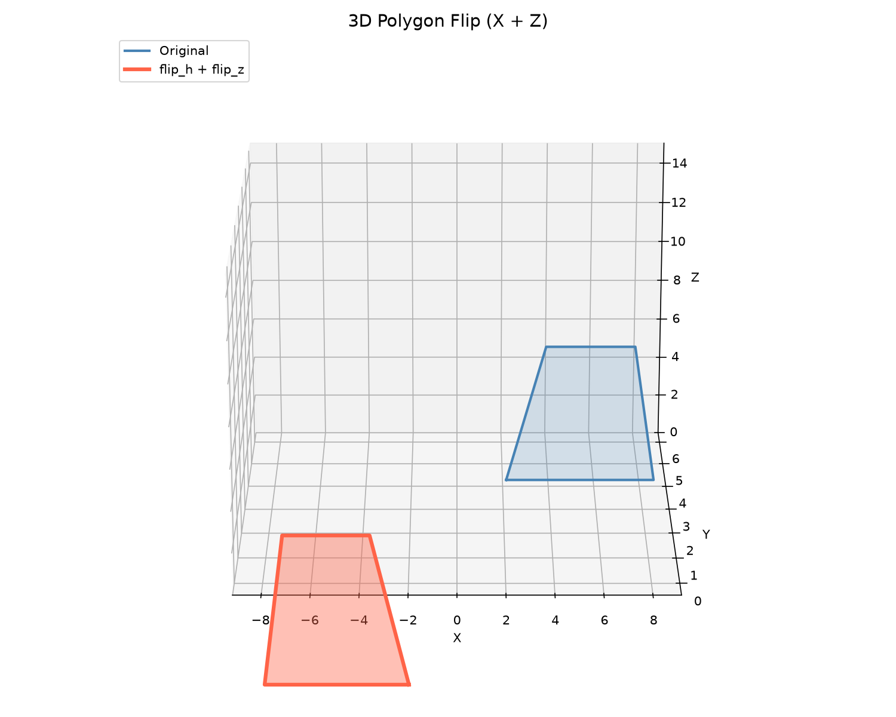

_3D polygon flipped horizontally and along Z_

### `flip_polygons_3d()`

```python
flip_polygons_3d(
    polygons: Sequence[types.Polygon3D],
    flip_h: bool = False,
    flip_v: bool = False,
    flip_z: bool = False,
) -> list[types.Polygon3D]
```

Flip multiple 3D polygons.

| Parameter    | Type                        | Description                              |
| ------------ | --------------------------- | ---------------------------------------- |
| `polygons`   | `Sequence[types.Polygon3D]` | List of 3D polygons.                     |
| `flip_h`     | `bool = False`              | Whether to flip horizontally (negate X). |
| `flip_v`     | `bool = False`              | Whether to flip vertically (negate Y).   |
| `flip_z`     | `bool = False`              | Whether to flip along Z (negate Z).      |
| _Returns_    | `list[types.Polygon3D]`     | Flipped polygons.                        |
| _Complexity_ |                             | O(n \* m)                                |

### `get_polygon_bounds_3d()`

```python
get_polygon_bounds_3d(polygon: Sequence[types.Point3D]) -> types.Rect3D
```

Get the 3D bounding box of a polygon.

| Parameter    | Type                      | Description                                                 |
| ------------ | ------------------------- | ----------------------------------------------------------- |
| `polygon`    | `Sequence[types.Point3D]` | Polygon as (x, y, z) points.                                |
| _Returns_    | `types.Rect3D`            | Bounding box as (x_min, y_min, x_max, y_max, z_min, z_max). |
| _Complexity_ |                           | O(n)                                                        |

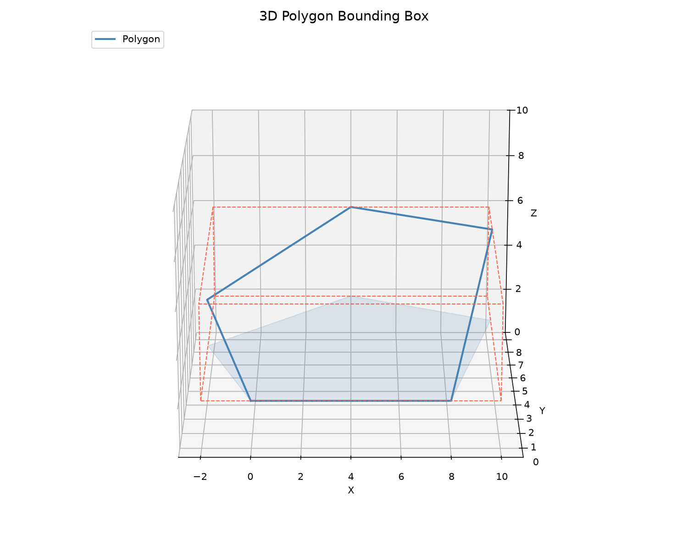

_3D bounding box (Rect3D)_

### `get_polygon_centroid_3d()`

```python
get_polygon_centroid_3d(polygon: Sequence[types.Point3D]) -> types.Point3D
```

Get the centroid of a 3D polygon.

XY centroid from shoelace formula, Z from average.

| Parameter    | Type                      | Description                  |
| ------------ | ------------------------- | ---------------------------- |
| `polygon`    | `Sequence[types.Point3D]` | Polygon as (x, y, z) points. |
| _Returns_    | `types.Point3D`           | Centroid point (x, y, z).    |
| _Complexity_ |                           | O(n)                         |

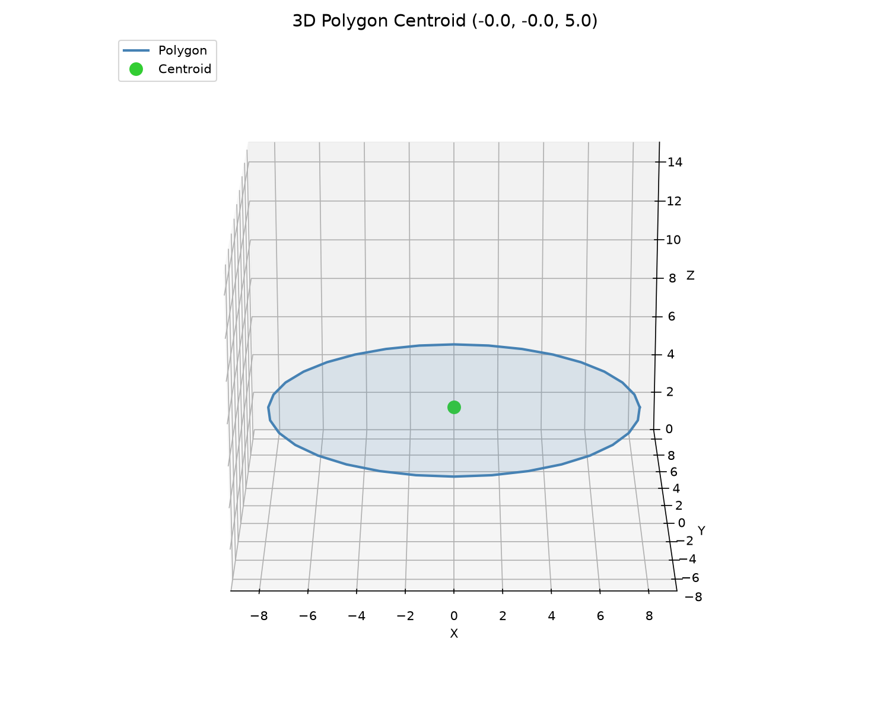

_3D centroid - XY via shoelace, Z as average_

### `get_polygon_convex_hull_3d()`

```python
get_polygon_convex_hull_3d(polygon: Sequence[types.Point3D]) -> types.Polygon3D
```

Get the convex hull of a 3D polygon (XY-plane, Z from first vertex).

| Parameter    | Type                      | Description                              |
| ------------ | ------------------------- | ---------------------------------------- |
| `polygon`    | `Sequence[types.Point3D]` | Polygon as (x, y, z) points.             |
| _Returns_    | `types.Polygon3D`         | Convex hull as list of (x, y, z) points. |
| _Complexity_ |                           | O(n log n)                               |

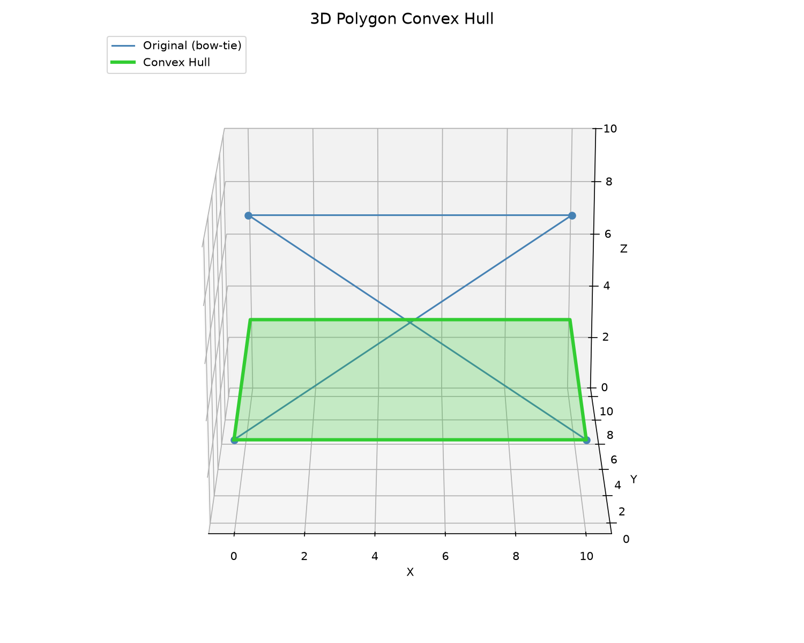

_3D convex hull (XY-plane, Z from first hull vertex)_

### `get_polygon_edges_3d()`

```python
get_polygon_edges_3d(
    polygon: Sequence[types.Point3D],
) -> list[tuple[types.Point3D, types.Point3D]]
```

Get the edges of a 3D polygon.

| Parameter    | Type                                        | Description                                 |
| ------------ | ------------------------------------------- | ------------------------------------------- |
| `polygon`    | `Sequence[types.Point3D]`                   | Polygon as (x, y, z) points.                |
| _Returns_    | `list[tuple[types.Point3D, types.Point3D]]` | List of ((x1, y1, z1), (x2, y2, z2)) edges. |
| _Complexity_ |                                             | O(n)                                        |

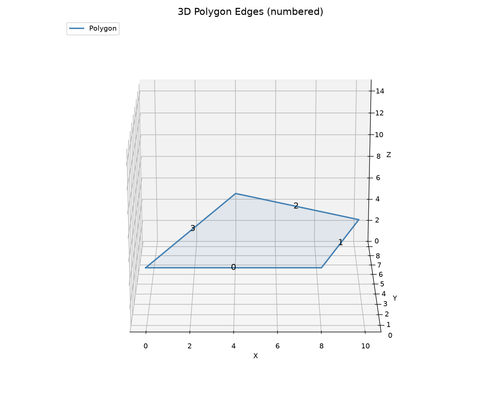

_3D polygon edges as (start, end) pairs_

### `get_polygon_group_bounds_3d()`

```python
get_polygon_group_bounds_3d(
    polygons: Sequence[types.Polygon3D],
) -> types.Rect3D
```

Get the 3D bounding box of a group of polygons.

| Parameter    | Type                        | Description                                                 |
| ------------ | --------------------------- | ----------------------------------------------------------- |
| `polygons`   | `Sequence[types.Polygon3D]` | List of 3D polygons.                                        |
| _Returns_    | `types.Rect3D`              | Bounding box as (x_min, y_min, x_max, y_max, z_min, z_max). |
| _Complexity_ |                             | O(n \* m)                                                   |

### `get_polygon_perimeter_3d()`

```python
get_polygon_perimeter_3d(polygon: Sequence[types.Point3D]) -> float
```

Get the perimeter of a 3D polygon using full 3D edge lengths.

| Parameter    | Type                      | Description                  |
| ------------ | ------------------------- | ---------------------------- |
| `polygon`    | `Sequence[types.Point3D]` | Polygon as (x, y, z) points. |
| _Returns_    | `float`                   | Perimeter length.            |
| _Complexity_ |                           | O(n)                         |

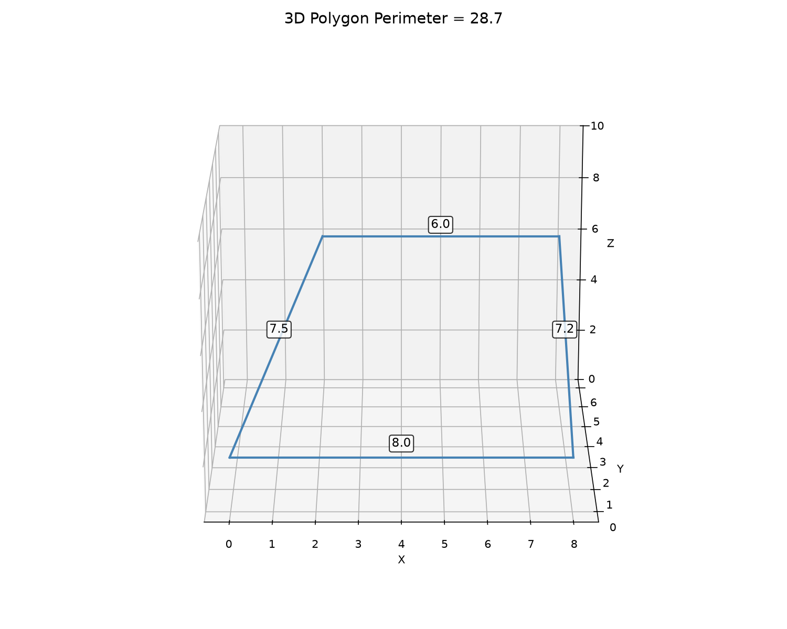

_3D polygon perimeter using full 3D edge lengths_

### `get_polygons_difference_3d()`

```python
get_polygons_difference_3d(
    poly1: Sequence[types.Point3D],
    poly2: Sequence[types.Point3D],
) -> list[types.Polygon3D]
```

Compute the difference of two 3D polygons (poly1 - poly2).

| Parameter | Type                      | Description                                  |
| --------- | ------------------------- | -------------------------------------------- |
| `poly1`   | `Sequence[types.Point3D]` | Subject 3D polygon.                          |
| `poly2`   | `Sequence[types.Point3D]` | Clip 3D polygon.                             |
| _Returns_ | `list[types.Polygon3D]`   | Difference result with Z from first polygon. |


_3D polygon difference (A - B) — Z from A_

### `get_polygons_group_difference_3d()`

```python
get_polygons_group_difference_3d(
    subject: Sequence[types.Polygon3D],
    clip: Sequence[types.Polygon3D],
) -> list[types.Polygon3D]
```

Group difference of 3D polygons (subject - clip).

| Parameter | Type                        | Description                                          |
| --------- | --------------------------- | ---------------------------------------------------- |
| `subject` | `Sequence[types.Polygon3D]` | Subject group of 3D polygons.                        |
| `clip`    | `Sequence[types.Polygon3D]` | Clip group of 3D polygons.                           |
| _Returns_ | `list[types.Polygon3D]`     | Difference result with Z from first subject polygon. |

### `get_polygons_group_intersection_3d()`

```python
get_polygons_group_intersection_3d(
    subject: Sequence[types.Polygon3D],
    clip: Sequence[types.Polygon3D],
) -> list[types.Polygon3D]
```

Group intersection of 3D polygons (subject ∩ clip).

| Parameter | Type                        | Description                                            |
| --------- | --------------------------- | ------------------------------------------------------ |
| `subject` | `Sequence[types.Polygon3D]` | Subject group of 3D polygons.                          |
| `clip`    | `Sequence[types.Polygon3D]` | Clip group of 3D polygons.                             |
| _Returns_ | `list[types.Polygon3D]`     | Intersection result with Z from first subject polygon. |

### `get_polygons_intersection_3d()`

```python
get_polygons_intersection_3d(
    poly1: Sequence[types.Point3D],
    poly2: Sequence[types.Point3D],
) -> list[types.Polygon3D]
```

Compute the intersection of two 3D polygons (XY-plane, Z preserved).

| Parameter | Type                      | Description                                    |
| --------- | ------------------------- | ---------------------------------------------- |
| `poly1`   | `Sequence[types.Point3D]` | First 3D polygon.                              |
| `poly2`   | `Sequence[types.Point3D]` | Second 3D polygon.                             |
| _Returns_ | `list[types.Polygon3D]`   | Intersection result with Z from first polygon. |

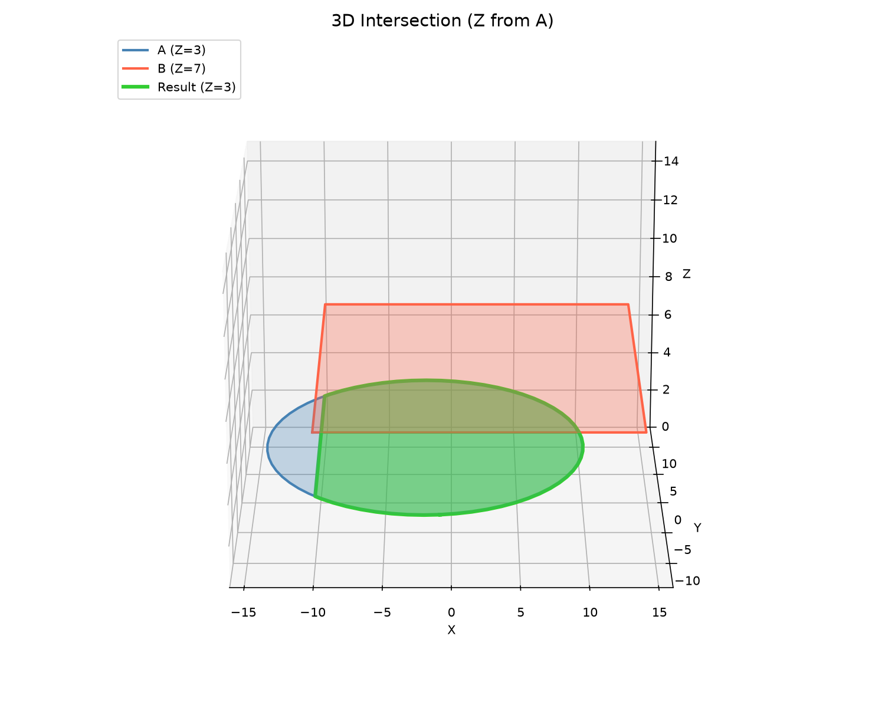

_3D polygon intersection — Z from first polygon_

### `get_polygons_union_3d()`

```python
get_polygons_union_3d(
    polygons: Sequence[types.Polygon3D],
) -> list[types.Polygon3D]
```

Compute the union of 3D polygons (XY-plane, Z preserved).

| Parameter  | Type                        | Description                             |
| ---------- | --------------------------- | --------------------------------------- |
| `polygons` | `Sequence[types.Polygon3D]` | List of 3D polygons.                    |
| _Returns_  | `list[types.Polygon3D]`     | Union result with Z from first polygon. |


_3D polygon union — Z from first polygon_

### `get_polyline_end_tangent_3d()`

```python
get_polyline_end_tangent_3d(polyline: Sequence[types.Point3D]) -> types.Point
```

Normalised tangent direction at the last point of a 3D polyline.

Returns the normalised XY direction from the second-to-last point to the last point. Falls back to
`(1.0, 0.0)` when the polyline has fewer than 2 points or the last edge has zero length.

| Parameter    | Type                      | Description                            |
| ------------ | ------------------------- | -------------------------------------- |
| `polyline`   | `Sequence[types.Point3D]` | Polyline as (x, y, z) points.          |
| _Returns_    | `types.Point`             | Normalised (dx, dy) tangent direction. |
| _Complexity_ |                           | O(1)                                   |

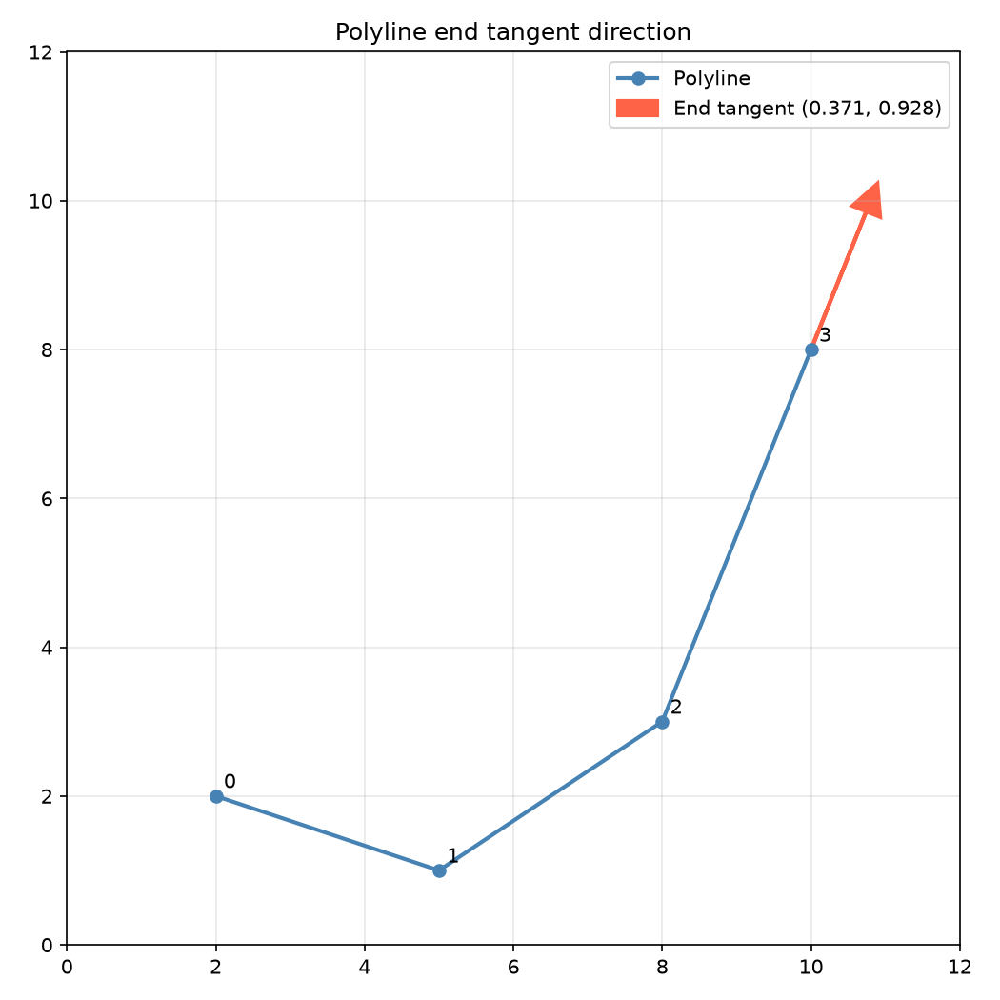

_Normalised end tangent direction of a 3D polyline_

### `offset_polygon_3d()`

```python
offset_polygon_3d(
    polygon: Sequence[types.Point3D],
    offset: float,
) -> list[types.Polygon3D]
```

Offset (inflate/deflate) a closed 3D polygon.

| Parameter | Type                      | Description                                           |
| --------- | ------------------------- | ----------------------------------------------------- |
| `polygon` | `Sequence[types.Point3D]` | Input 3D polygon.                                     |
| `offset`  | `float`                   | Offset distance (positive = grow, negative = shrink). |
| _Returns_ | `list[types.Polygon3D]`   | Offset polygons with Z from input.                    |

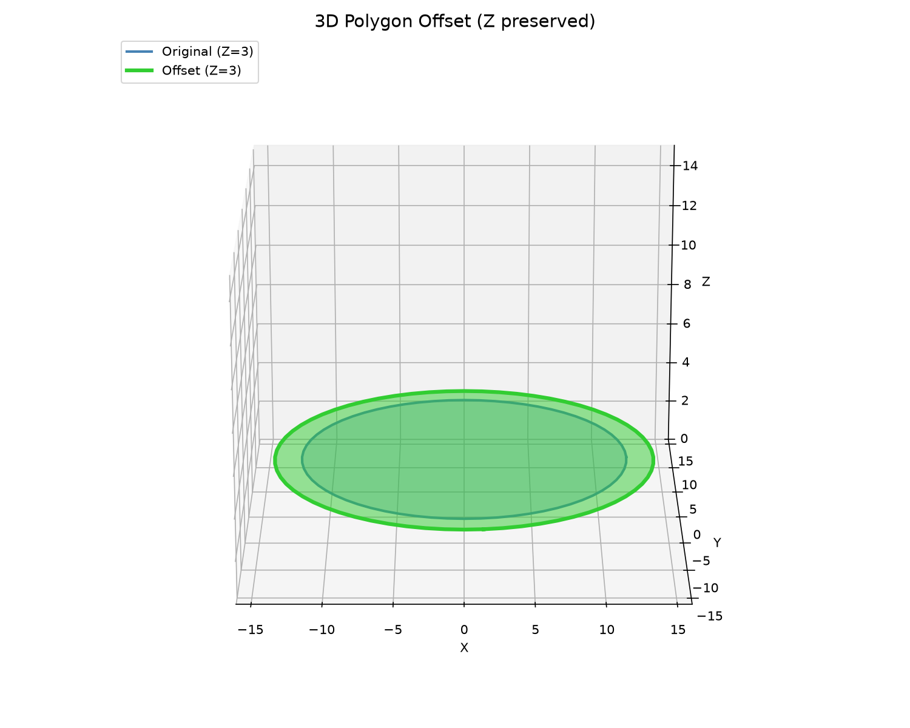

_3D polygon offset — Z preserved from input_

### `offset_polyline_3d()`

```python
offset_polyline_3d(
    polyline: Sequence[types.Point3D],
    distance: float,
    closed: bool = False,
) -> types.Polygon3D
```

Offset a 3D polyline in true 3D (edge-plane miter).

Unlike **offset_polygon_3d** (which projects to XY, offsets, then lifts back), this function offsets
each vertex in the local plane of its two adjacent edges. This gives a _true 3D offset_ suitable for
non-planar polylines.

Positive distance offsets to the _left_ of the traversal direction.

| Parameter    | Type                      | Description                                                                                                                                                                                    |
| ------------ | ------------------------- | ---------------------------------------------------------------------------------------------------------------------------------------------------------------------------------------------- |
| `polyline`   | `Sequence[types.Point3D]` | Input 3D vertices as `(x, y, z)` points.                                                                                                                                                       |
| `distance`   | `float`                   | Offset distance (positive = left, negative = right).                                                                                                                                           |
| `closed`     | `bool = False`            | When `True`, the polyline is treated as a closed ring (last vertex connects back to first). When `False` (default), the first and last vertices are offset perpendicular to their single edge. |
| _Returns_    | `types.Polygon3D`         | Offset polyline with the same number of vertices.                                                                                                                                              |
| _Complexity_ |                           | O(n)                                                                                                                                                                                           |

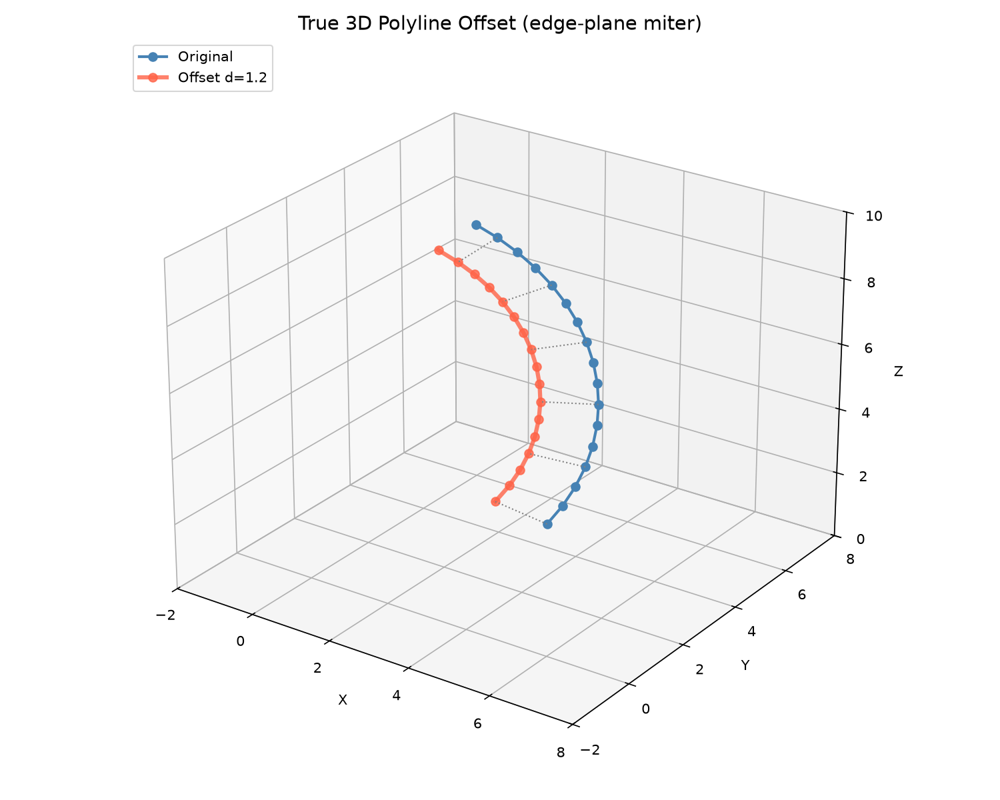

_True 3D polyline offset (edge-plane miter)_

### `rotate_polygon_3d()`

```python
rotate_polygon_3d(
    polygon: Sequence[types.Point3D],
    angle: float,
) -> types.Polygon3D
```

Rotate a 3D polygon around the Z axis (XY rotation, Z preserved).

| Parameter    | Type                      | Description                  |
| ------------ | ------------------------- | ---------------------------- |
| `polygon`    | `Sequence[types.Point3D]` | Polygon as (x, y, z) points. |
| `angle`      | `float`                   | Rotation angle in degrees.   |
| _Returns_    | `types.Polygon3D`         | Rotated polygon.             |
| _Complexity_ |                           | O(n)                         |

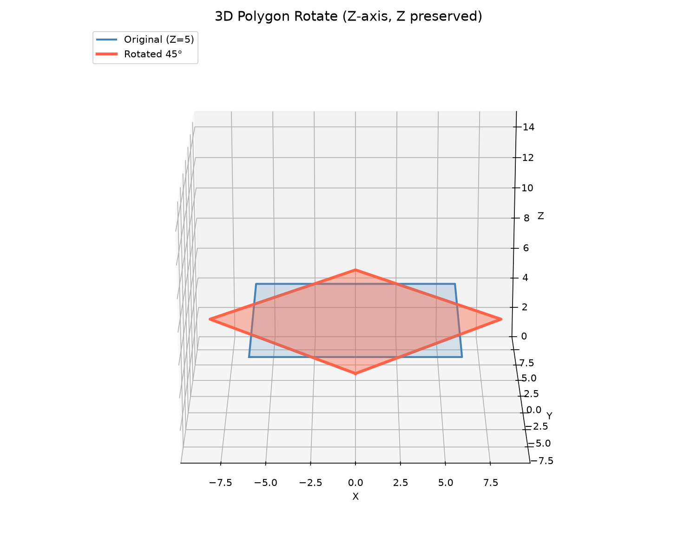

_3D polygon rotated around Z axis (Z preserved)_

### `rotate_polygons_3d()`

```python
rotate_polygons_3d(
    polygons: Sequence[types.Polygon3D],
    angle: float,
) -> list[types.Polygon3D]
```

Rotate multiple 3D polygons around the Z axis.

| Parameter    | Type                        | Description                |
| ------------ | --------------------------- | -------------------------- |
| `polygons`   | `Sequence[types.Polygon3D]` | List of 3D polygons.       |
| `angle`      | `float`                     | Rotation angle in degrees. |
| _Returns_    | `list[types.Polygon3D]`     | Rotated polygons.          |
| _Complexity_ |                             | O(n \* m)                  |

### `scale_polygon_3d()`

```python
scale_polygon_3d(
    polygon: Sequence[types.Point3D],
    scale: float,
    scale_y: Optional[float] = None,
    scale_z: Optional[float] = None,
) -> types.Polygon3D
```

Scale a 3D polygon.

| Parameter    | Type                      | Description                                           |
| ------------ | ------------------------- | ----------------------------------------------------- |
| `polygon`    | `Sequence[types.Point3D]` | Polygon as (x, y, z) points.                          |
| `scale`      | `float`                   | X (and Y/Z if scale_y/scale_z are None) scale factor. |
| `scale_y`    | `Optional[float] = None`  | Y scale factor (optional).                            |
| `scale_z`    | `Optional[float] = None`  | Z scale factor (optional).                            |
| _Returns_    | `types.Polygon3D`         | Scaled polygon.                                       |
| _Complexity_ |                           | O(n)                                                  |

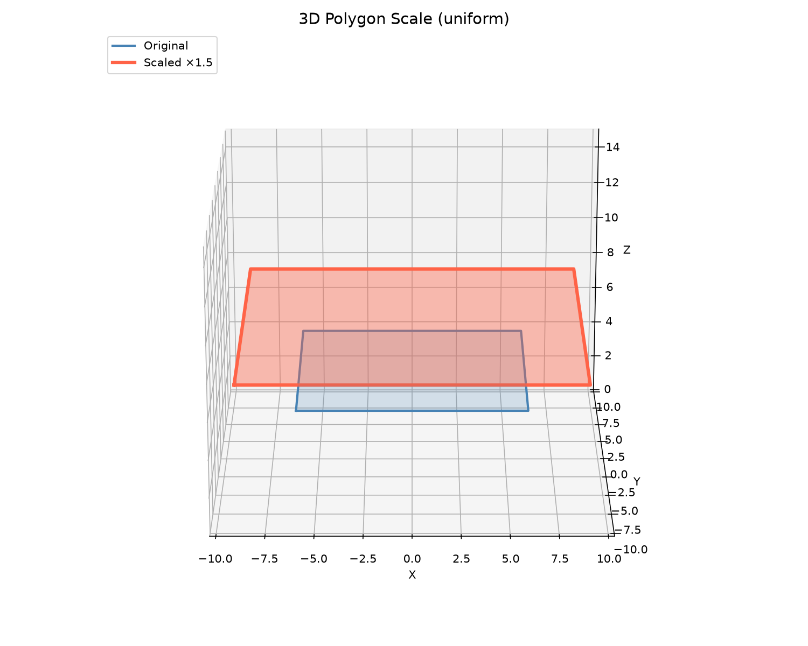

_3D polygon scaled uniformly_

### `translate_polygon_3d()`

```python
translate_polygon_3d(
    polygon: Sequence[types.Point3D],
    dx: float,
    dy: float,
    dz: float = 0,
) -> types.Polygon3D
```

Translate a 3D polygon.

| Parameter    | Type                      | Description                  |
| ------------ | ------------------------- | ---------------------------- |
| `polygon`    | `Sequence[types.Point3D]` | Polygon as (x, y, z) points. |
| `dx`         | `float`                   | X translation.               |
| `dy`         | `float`                   | Y translation.               |
| `dz`         | `float = 0`               | Z translation.               |
| _Returns_    | `types.Polygon3D`         | Translated polygon.          |
| _Complexity_ |                           | O(n)                         |

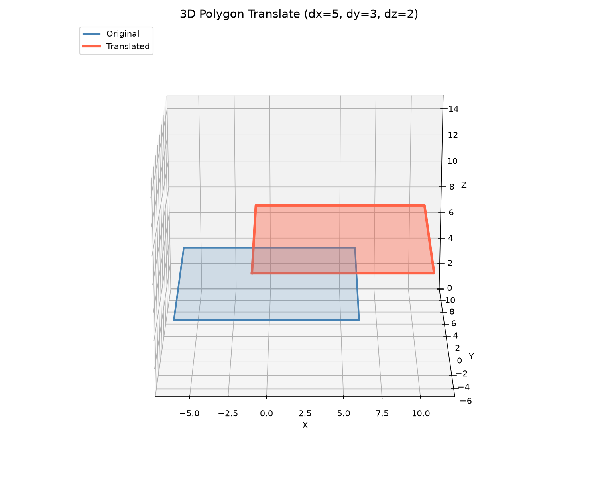

_3D polygon translated by dx, dy, dz_

### `translate_polygons_3d()`

```python
translate_polygons_3d(
    polygons: Sequence[types.Polygon3D],
    dx: float,
    dy: float,
    dz: float = 0,
) -> list[types.Polygon3D]
```

Translate a list of 3D polygons.

| Parameter    | Type                        | Description          |
| ------------ | --------------------------- | -------------------- |
| `polygons`   | `Sequence[types.Polygon3D]` | List of 3D polygons. |
| `dx`         | `float`                     | X translation.       |
| `dy`         | `float`                     | Y translation.       |
| `dz`         | `float = 0`                 | Z translation.       |
| _Returns_    | `list[types.Polygon3D]`     | Translated polygons. |
| _Complexity_ |                             | O(n \* m)            |
