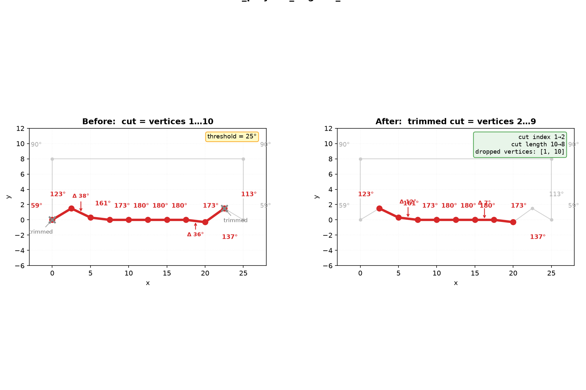

## Functions

### `get_polyline_bounds()`

```python
get_polyline_bounds(polyline: Sequence[types.Point]) -> types.Rect
```

Get the bounding rectangle of an open polyline.

| Parameter    | Type                    | Description                                         |
| ------------ | ----------------------- | --------------------------------------------------- |
| `polyline`   | `Sequence[types.Point]` | Polyline as (x, y) points.                          |
| _Returns_    | `types.Rect`            | Bounding rectangle as (x_min, y_min, x_max, y_max). |
| _Complexity_ |                         | O(n)                                                |

### `get_polyline_closest_point()`

```python
get_polyline_closest_point(
    polyline: Sequence[tuple[float, float]],
    point: tuple[float, float],
) -> tuple[int, float] | None
```

Find the closest edge and parametric position on an open polyline.

Each edge of the polyline is tested, and the closest one is returned as `(edge_index, t)` where `t`
in [0, 1] is the parametric position along that edge.

| Parameter  | Type                            | Description                                                        |
| ---------- | ------------------------------- | ------------------------------------------------------------------ |
| `polyline` | `Sequence[tuple[float, float]]` | Open polyline as (x, y) points.                                    |
| `point`    | `tuple[float, float]`           | Query point (x, y).                                                |
| _Returns_  | `tuple[int, float] &#124; None` | `(edge_index, t)` or None if the polyline has fewer than 2 points. |


*`get_polyline_closest_point` finds the closest point on an open polyline to a query point,
returning the edge index and parametric position*

### `resample_polyline()`

```python
resample_polyline(
    polyline: Sequence[tuple[float, float]],
    max_len: float,
) -> list[tuple[float, float]]
```

Resample an open 2D polyline so consecutive points are at most *max_len* apart.

New points are linearly interpolated along each segment that exceeds the threshold. The first and
last points are always preserved.

| Parameter    | Type                            | Description                     |
| ------------ | ------------------------------- | ------------------------------- |
| `polyline`   | `Sequence[tuple[float, float]]` | Open polyline as (x, y) points. |
| `max_len`    | `float`                         | Maximum allowed segment length. |
| _Returns_    | `list[tuple[float, float]]`     | Resampled polyline.             |
| _Complexity_ |                                 | O(n * m)                        |

### `split_polyline_at_v_junctions()`

```python
split_polyline_at_v_junctions(
    polyline: Sequence[tuple[float, float]],
    angle_threshold: float,
) -> list[list[tuple[float, float]]]
```

Split a polyline at V-junction vertices where the interior angle is much sharper than both
neighbours.

Each resulting sub-polyline is trimmed with `trim_polyline_angular_ends`.

| Parameter         | Type                              | Description                 |
| ----------------- | --------------------------------- | --------------------------- |
| `polyline`        | `Sequence[tuple[float, float]]`   | Sequence of (x, y) points.  |
| `angle_threshold` | `float`                           | Angle threshold in radians. |
| _Returns_         | `list[list[tuple[float, float]]]` | List of sub-polylines.      |
| _Complexity_      |                                   | O(n) time, O(n) space       |


*Three semi-arcs (hills) form two V-junctions where they meet. The function splits the polyline at
those points and trims each segment's angular ends.*

### `trim_polyline_angular_ends()`

```python
trim_polyline_angular_ends(
    polygon: Sequence[tuple[float, float]],
    start: int,
    length: int,
    angle_threshold_rad: float,
) -> tuple[int, int]
```

Trim vertices from both ends of a contiguous subsequence where the interior angle jumps sharply.

Detects "transition" vertices at the boundary between two differently- curved regions of a closed
polygon. The function iteratively trims such vertices from the start and end of the subsequence
until no more trimming occurs or the sequence is too short.

| Parameter             | Type                            | Description                                            |
| --------------------- | ------------------------------- | ------------------------------------------------------ |
| `polygon`             | `Sequence[tuple[float, float]]` | Closed polygon as (x, y) points.                       |
| `start`               | `int`                           | Start index of the subsequence.                        |
| `length`              | `int`                           | Length of the subsequence.                             |
| `angle_threshold_rad` | `float`                         | Angle threshold in radians.                            |
| _Returns_             | `tuple[int, int]`               | `(new_start, new_length)` within the original polygon. |



*`trim_polyline_angular_ends` removes transition vertices from both ends of a contiguous subsequence
where the interior angle jumps sharply. Here a 10-vertex cut (indices 1–10) with angles ranging
59°→180°→59° is trimmed to 8 vertices using a 25° threshold.*

### `trim_polyline_at()`

```python
trim_polyline_at(
    polyline: Sequence[tuple[float, float]],
    a: tuple[float, float],
    b: tuple[float, float],
) -> list[tuple[float, float]]
```

Trim a polyline to the portion between two points.

Each point is projected onto the nearest edge of the polyline. The returned polyline goes from the
projection of *a* to the projection of *b*, preserving intermediate vertices.

| Parameter  | Type                            | Description                     |
| ---------- | ------------------------------- | ------------------------------- |
| `polyline` | `Sequence[tuple[float, float]]` | Open polyline as (x, y) points. |
| `a`        | `tuple[float, float]`           | Start point to trim at.         |
| `b`        | `tuple[float, float]`           | End point to trim at.           |
| _Returns_  | `list[tuple[float, float]]`     | Trimmed polyline.               |


*`trim_polyline_at` trims a polyline between two points*
