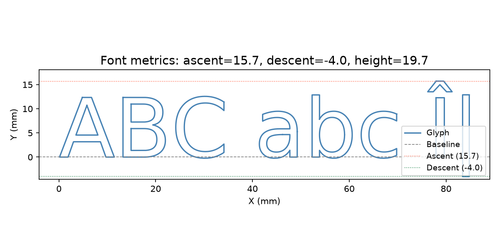
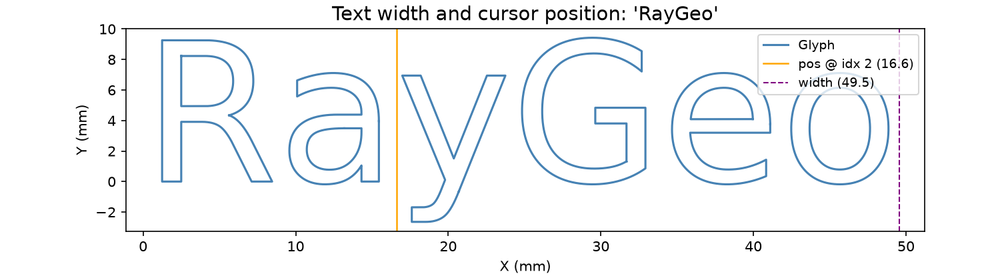
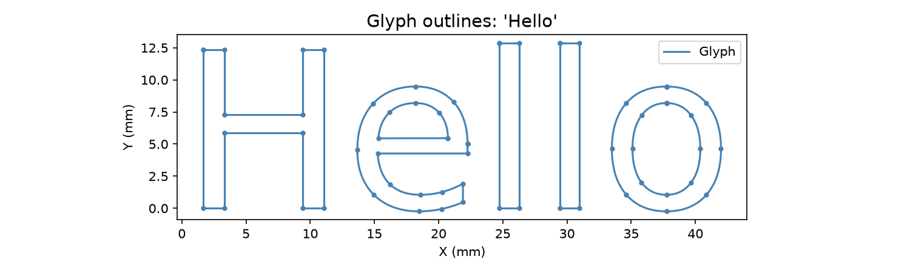

## FontConfig

### `bold`

```python
bold: bool
```

### `extra`

```python
extra: dict
```

### `family`

```python
family: str
```

### `font_family`

```python
font_family: str
```

### `font_size`

```python
font_size: float
```

### `italic`

```python
italic: bool
```

### `size`

```python
size: float
```

### `copy()`

```python
copy() -> FontConfig
```

| Parameter | Type         | Description |
| --------- | ------------ | ----------- |
| _Returns_ | `FontConfig` |             |

### `from_dict()`

```python
from_dict(data: Optional[dict]) -> FontConfig
```

| Parameter | Type             | Description |
| --------- | ---------------- | ----------- |
| `data`    | `Optional[dict]` |             |
| _Returns_ | `FontConfig`     |             |

### `get_font_metrics()`

```python
get_font_metrics() -> tuple[float, float, float]
```

| Parameter | Type                         | Description |
| --------- | ---------------------------- | ----------- |
| _Returns_ | `tuple[float, float, float]` |             |



*Ascent, descent, and height above the baseline*

### `get_text_position()`

```python
get_text_position(text: str, index: int) -> float
```

| Parameter | Type    | Description |
| --------- | ------- | ----------- |
| `text`    | `str`   |             |
| `index`   | `int`   |             |
| _Returns_ | `float` |             |

### `get_text_width()`

```python
get_text_width(text: str) -> float
```

| Parameter | Type    | Description |
| --------- | ------- | ----------- |
| `text`    | `str`   |             |
| _Returns_ | `float` |             |



*Text advance width and cursor position markers*

### `to_dict()`

```python
to_dict() -> dict
```

| Parameter | Type   | Description |
| --------- | ------ | ----------- |
| _Returns_ | `dict` |             |

## Functions

### `text_to_geometry()`

```python
text_to_geometry(
    text: str,
    font_config: geo.shape.text.FontConfig,
) -> geo.Geometry
```

Convert a text string to a Geometry containing the glyph outlines.

| Parameter     | Type                        | Description |
| ------------- | --------------------------- | ----------- |
| `text`        | `str`                       |             |
| `font_config` | `geo.shape.text.FontConfig` |             |
| _Returns_     | `geo.Geometry`              |             |



*Glyph outlines rendered as vector geometry*
