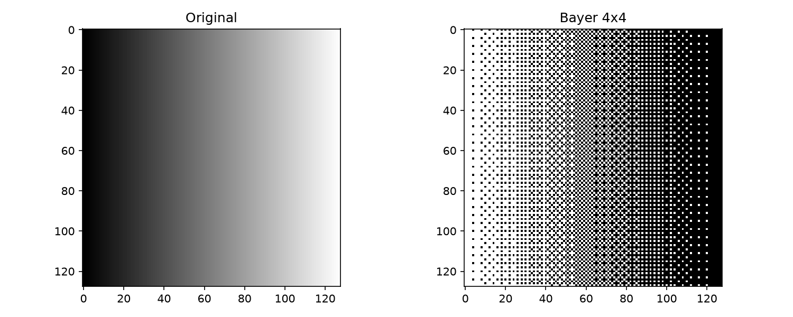
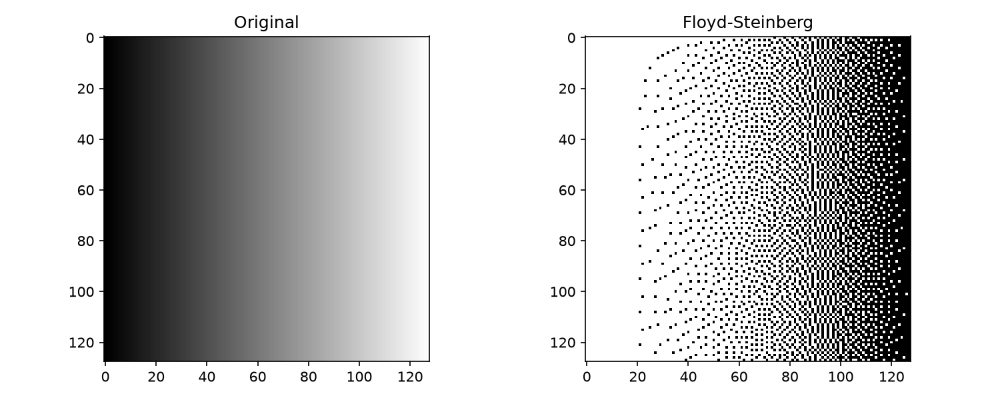
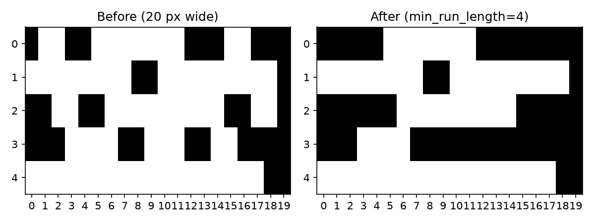

## Functions

### `apply_bayer_dither()`

```python
apply_bayer_dither(
    grayscale: numpy.NDArray[numpy.uint8],
    bayer_matrix: numpy.NDArray[numpy.float32],
    invert: bool,
    cell_size: int = 1,
) -> numpy.NDArray[numpy.uint8]
```

Apply ordered (Bayer) dithering using a threshold matrix.

| Parameter      | Type                           | Description                            |
| -------------- | ------------------------------ | -------------------------------------- |
| `grayscale`    | `numpy.NDArray[numpy.uint8]`   | 2D grayscale image as uint8 array.     |
| `bayer_matrix` | `numpy.NDArray[numpy.float32]` | 2D Bayer threshold matrix as float32.  |
| `invert`       | `bool`                         | If True, invert the output.            |
| `cell_size`    | `int = 1`                      | Pixel grouping size for the threshold. |
| _Returns_      | `numpy.NDArray[numpy.uint8]`   | 2D binary uint8 array (values 0 or 1). |
| _Complexity_   |                                | O(w\*h)                                |



*Bayer 4x4 ordered dithering*

### `apply_floyd_steinberg_dither()`

```python
apply_floyd_steinberg_dither(
    grayscale: numpy.NDArray[numpy.uint8],
    invert: bool,
) -> numpy.NDArray[numpy.uint8]
```

Apply Floyd-Steinberg error-diffusion dithering.

| Parameter    | Type                         | Description                                    |
| ------------ | ---------------------------- | ---------------------------------------------- |
| `grayscale`  | `numpy.NDArray[numpy.uint8]` | 2D grayscale image as uint8 array.             |
| `invert`     | `bool`                       | If True, invert the output (swap black/white). |
| _Returns_    | `numpy.NDArray[numpy.uint8]` | 2D binary uint8 array (values 0 or 1).         |
| _Complexity_ |                              | O(w\*h)                                        |



*Floyd-Steinberg dithering*

### `apply_minimum_run_length()`

```python
apply_minimum_run_length(
    binary: numpy.NDArray[numpy.uint8],
    min_run_length: int,
) -> numpy.NDArray[numpy.uint8]
```

Remove binary runs shorter than the given minimum.

| Parameter        | Type                         | Description                                    |
| ---------------- | ---------------------------- | ---------------------------------------------- |
| `binary`         | `numpy.NDArray[numpy.uint8]` | 2D binary uint8 array (values 0 or 1).         |
| `min_run_length` | `int`                        | Minimum run length to keep.                    |
| _Returns_        | `numpy.NDArray[numpy.uint8]` | 2D binary uint8 array with short runs removed. |
| _Complexity_     |                              | O(w\*h)                                        |



*Minimum run length applied to binary image*
