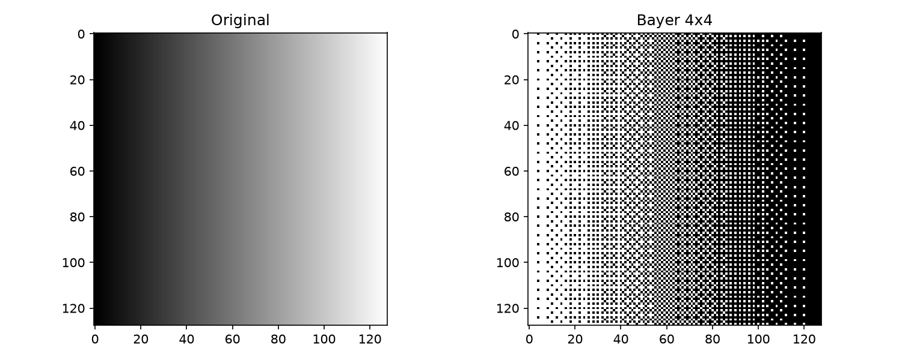
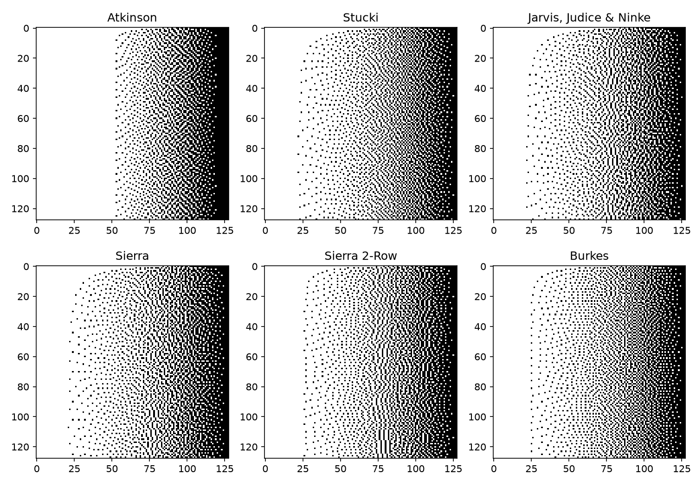
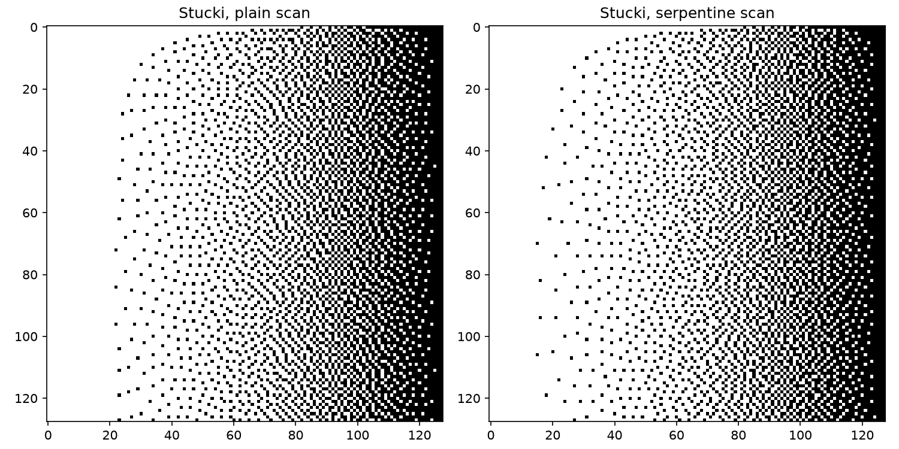
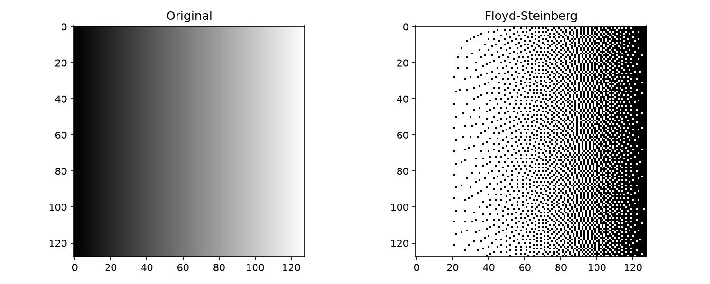
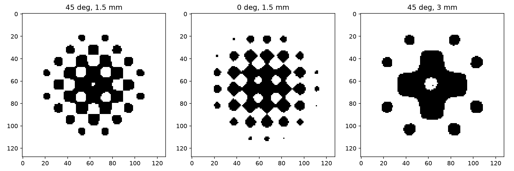
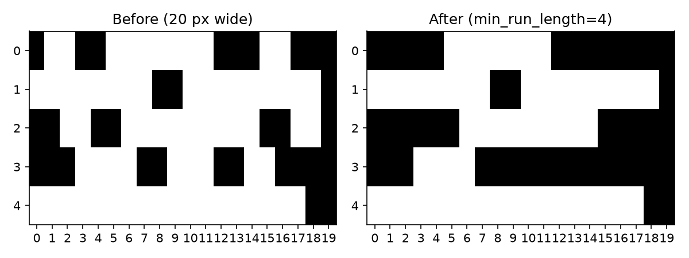
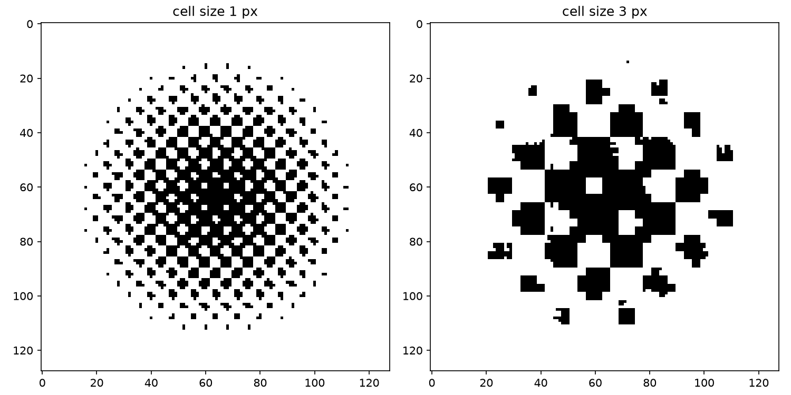

## Functions

### `apply_bayer_dither()`

```python
apply_bayer_dither(
    grayscale: numpy.NDArray[numpy.uint8],
    bayer_matrix: numpy.NDArray[numpy.float32],
    invert: bool,
    cell_size: int = 1,
) -> numpy.NDArray[numpy.uint8]
```

Apply ordered (Bayer) dithering using a threshold matrix.

| Parameter      | Type                           | Description                            |
| -------------- | ------------------------------ | -------------------------------------- |
| `grayscale`    | `numpy.NDArray[numpy.uint8]`   | 2D grayscale image as uint8 array.     |
| `bayer_matrix` | `numpy.NDArray[numpy.float32]` | 2D Bayer threshold matrix as float32.  |
| `invert`       | `bool`                         | If True, invert the output.            |
| `cell_size`    | `int = 1`                      | Pixel grouping size for the threshold. |
| _Returns_      | `numpy.NDArray[numpy.uint8]`   | 2D binary uint8 array (values 0 or 1). |
| _Complexity_   |                                | O(w\*h)                                |



*Bayer 4x4 ordered dithering*

### `apply_error_diffusion_dither()`

```python
apply_error_diffusion_dither(
    grayscale: numpy.NDArray[numpy.uint8],
    kernel: str,
    invert: bool = False,
    serpentine: bool = False,
) -> numpy.NDArray[numpy.uint8]
```

Error-diffusion dithering with a named kernel.

Dithers in linear light. Available kernels: atkinson, burkes, floyd_steinberg, jarvis_judice_ninke,
sierra, sierra_2row, sierra_lite, stucki.

**Raises:** `ValueError` — If the kernel name is not recognized.

| Parameter    | Type                         | Description                                                                      |
| ------------ | ---------------------------- | -------------------------------------------------------------------------------- |
| `grayscale`  | `numpy.NDArray[numpy.uint8]` | 2D grayscale image as uint8 array.                                               |
| `kernel`     | `str`                        | Name of the error-diffusion kernel to use.                                       |
| `invert`     | `bool = False`               | If True, invert the output (swap black/white).                                   |
| `serpentine` | `bool = False`               | Scan odd rows right-to-left, mirroring the kernel. Avoids directional artifacts. |
| _Returns_    | `numpy.NDArray[numpy.uint8]` | 2D binary uint8 array (values 0 or 1, 1 marks dark).                             |
| _Complexity_ |                              | O(w\*h)                                                                          |



*Error-diffusion kernel comparison*



*Stucki kernel with plain and serpentine scan*

### `apply_floyd_steinberg_dither()`

```python
apply_floyd_steinberg_dither(
    grayscale: numpy.NDArray[numpy.uint8],
    invert: bool,
) -> numpy.NDArray[numpy.uint8]
```

Apply Floyd-Steinberg error-diffusion dithering.

| Parameter    | Type                         | Description                                    |
| ------------ | ---------------------------- | ---------------------------------------------- |
| `grayscale`  | `numpy.NDArray[numpy.uint8]` | 2D grayscale image as uint8 array.             |
| `invert`     | `bool`                       | If True, invert the output (swap black/white). |
| _Returns_    | `numpy.NDArray[numpy.uint8]` | 2D binary uint8 array (values 0 or 1).         |
| _Complexity_ |                              | O(w\*h)                                        |



*Floyd-Steinberg dithering*

### `apply_halftone_dither()`

```python
apply_halftone_dither(
    grayscale: numpy.NDArray[numpy.uint8],
    cell_size_mm: float,
    angle_degrees: float,
    pixels_per_mm: tuple[float, float] = (1, 1),
    invert: bool = False,
) -> numpy.NDArray[numpy.uint8]
```

Amplitude-modulated halftone screen with round dots.

The screen is laid out in millimetres, so dots stay round on non-square pixels. Dot area tracks
darkness: a pixel is set when its brightness is below the share of the cell that the spot function
ranks at or under it.

**Raises:** `ValueError` — If pixels_per_mm is not positive.

| Parameter       | Type                           | Description                                                                           |
| --------------- | ------------------------------ | ------------------------------------------------------------------------------------- |
| `grayscale`     | `numpy.NDArray[numpy.uint8]`   | 2D grayscale image as uint8 array.                                                    |
| `cell_size_mm`  | `float`                        | Distance between dot centres in mm. Non-positive values fall back to one-pixel cells. |
| `angle_degrees` | `float`                        | Rotation of the dot grid in degrees.                                                  |
| `pixels_per_mm` | `tuple[float, float] = (1, 1)` | (x, y) image resolution in pixels per mm.                                             |
| `invert`        | `bool = False`                 | If True, invert the output (swap black/white).                                        |
| _Returns_       | `numpy.NDArray[numpy.uint8]`   | 2D binary uint8 array (values 0 or 1, 1 marks dark).                                  |
| _Complexity_    |                                | O(w\*h)                                                                               |



*Halftone screens at different angles and cell sizes*

### `apply_minimum_run_length()`

```python
apply_minimum_run_length(
    binary: numpy.NDArray[numpy.uint8],
    min_run_length: int,
) -> numpy.NDArray[numpy.uint8]
```

Remove binary runs shorter than the given minimum.

| Parameter        | Type                         | Description                                    |
| ---------------- | ---------------------------- | ---------------------------------------------- |
| `binary`         | `numpy.NDArray[numpy.uint8]` | 2D binary uint8 array (values 0 or 1).         |
| `min_run_length` | `int`                        | Minimum run length to keep.                    |
| _Returns_        | `numpy.NDArray[numpy.uint8]` | 2D binary uint8 array with short runs removed. |
| _Complexity_     |                              | O(w\*h)                                        |



*Minimum run length applied to binary image*

### `apply_newsprint_dither()`

```python
apply_newsprint_dither(
    grayscale: numpy.NDArray[numpy.uint8],
    cell_size: int = 1,
    pixels_per_mm: tuple[float, float] = (1, 1),
    invert: bool = False,
) -> numpy.NDArray[numpy.uint8]
```

Clustered-dot ordered dithering (newsprint screen).

Tiles an 8x8 threshold matrix whose dots sit on a 45 degree lattice. Cells are kept square in
millimetres using pixels_per_mm, so the screen does not stretch on non-square pixels.

**Raises:** `ValueError` — If pixels_per_mm is not positive.

| Parameter       | Type                           | Description                                          |
| --------------- | ------------------------------ | ---------------------------------------------------- |
| `grayscale`     | `numpy.NDArray[numpy.uint8]`   | 2D grayscale image as uint8 array.                   |
| `cell_size`     | `int = 1`                      | Screen cell size in pixels.                          |
| `pixels_per_mm` | `tuple[float, float] = (1, 1)` | (x, y) image resolution in pixels per mm.            |
| `invert`        | `bool = False`                 | If True, invert the output (swap black/white).       |
| _Returns_       | `numpy.NDArray[numpy.uint8]`   | 2D binary uint8 array (values 0 or 1, 1 marks dark). |
| _Complexity_    |                                | O(w\*h)                                              |



*Newsprint clustered-dot screen at two cell sizes*
