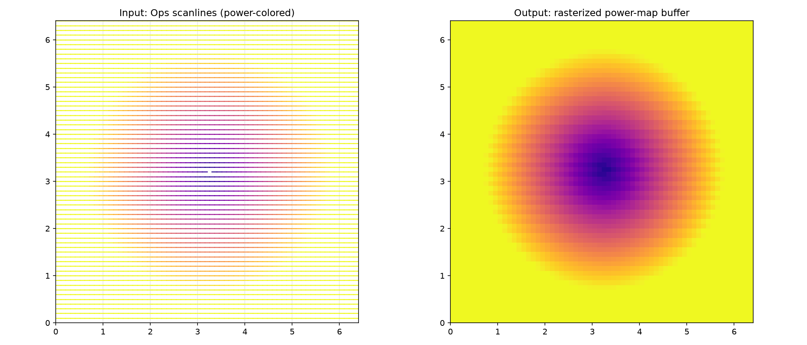

Image processing functions for CNC engraving applications.

Provides sRGB/linear color space conversions, RGBA-to-grayscale/binary conversions with alpha
unpremultiplication, grayscale normalization with auto-levels, dithering algorithms
(Floyd-Steinberg, Bayer, minimum run length) for converting grayscale images to binary output, and
scanline rasterization for converting Ops scanlines into pixel buffers.

## Functions

### `rasterize_scanlines()`

```python
rasterize_scanlines(
    ops: ops.Ops,
    width_px: int,
    height_px: int,
    px_per_mm: tuple[float, float],
    origin_mm: tuple[float, float] = (0, 0),
) -> numpy.NDArray[numpy.uint8]
```

Rasterize ScanLine commands from *ops* into a 2D power-map buffer.

Iterates all scanline commands in *ops*, converts their mm coordinates to pixel space using
*px_per_mm*, and returns a uint8 array where each pixel holds the maximum power value written to it.

| Parameter    | Type                           | Description                                        |
| ------------ | ------------------------------ | -------------------------------------------------- |
| `ops`        | `ops.Ops`                      | Command sequence to rasterize.                     |
| `width_px`   | `int`                          | Width of the output texture in pixels.             |
| `height_px`  | `int`                          | Height of the output texture in pixels.            |
| `px_per_mm`  | `tuple[float, float]`          | (x, y) resolution in pixels per millimeter.        |
| `origin_mm`  | `tuple[float, float] = (0, 0)` | (x, y) origin offset in mm (default `(0.0, 0.0)`). |
| _Returns_    | `numpy.NDArray[numpy.uint8]`   | 2D uint8 array of shape (height_px, width_px).     |
| _Complexity_ |                                | O(scanline_pixels)                                 |



*Scanline ops rasterized into a 2D power-map buffer*
