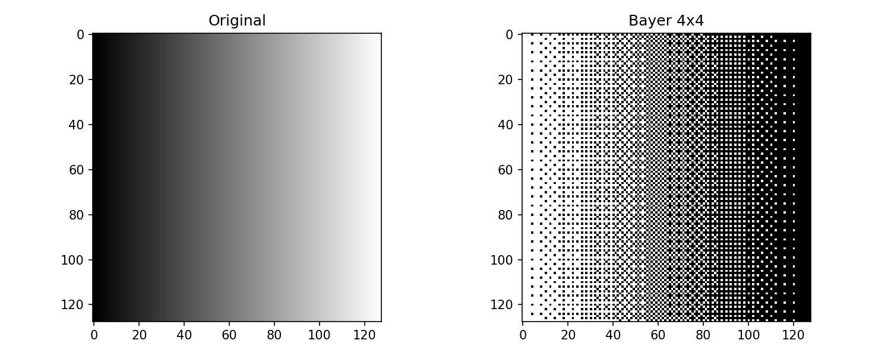
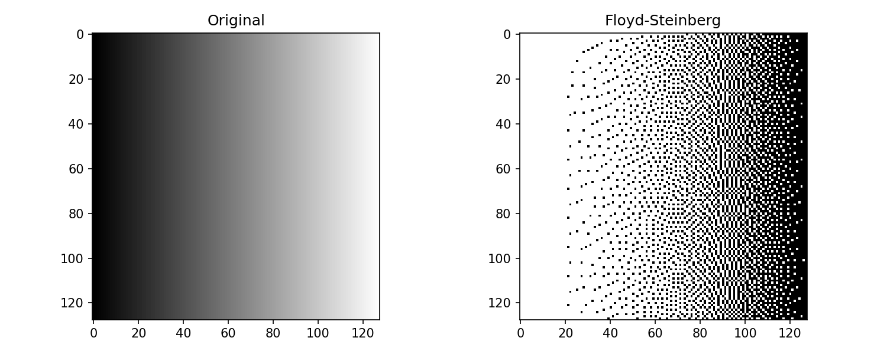
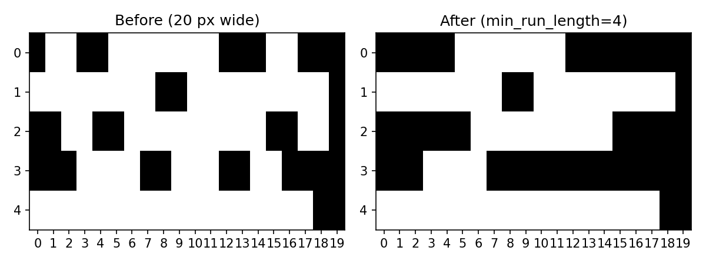
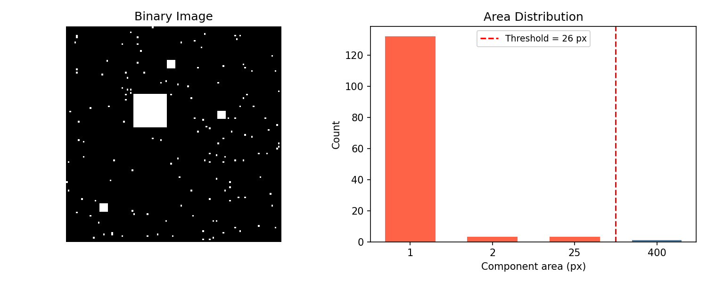
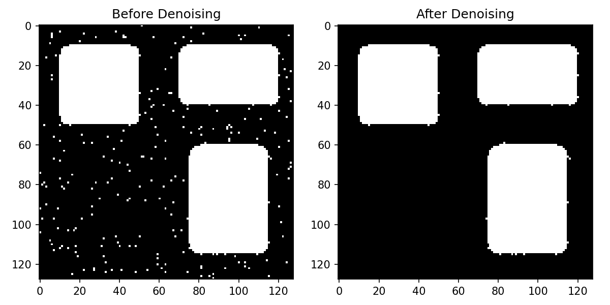
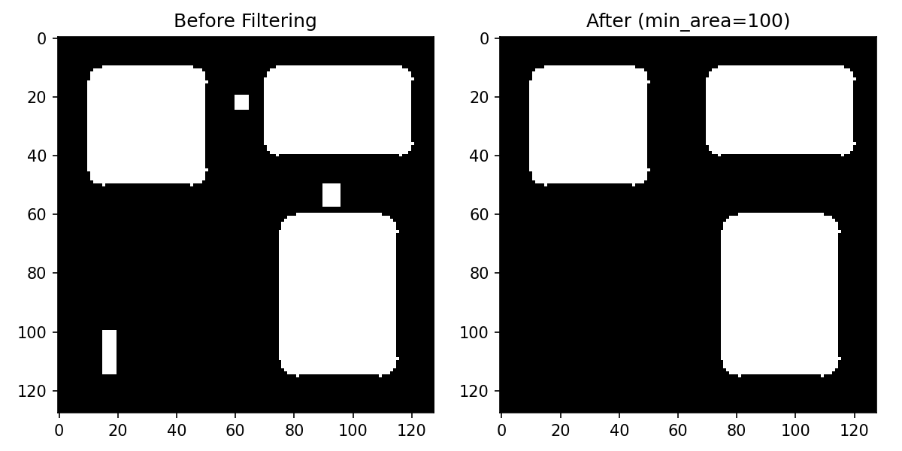
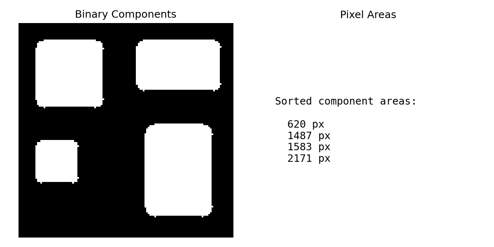
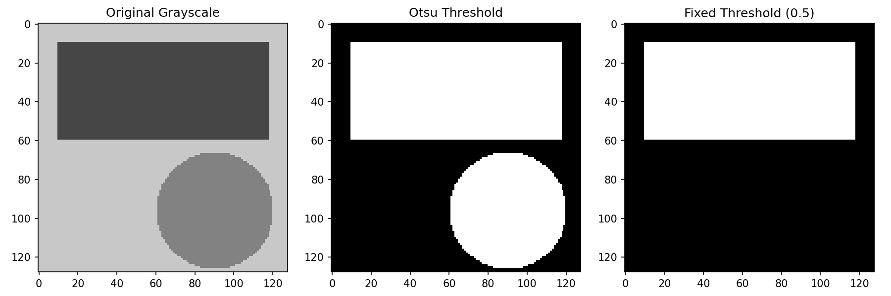
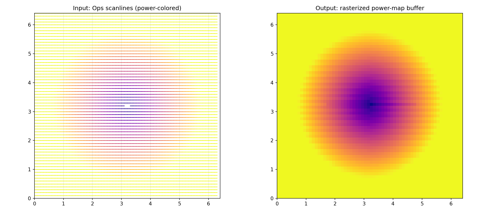
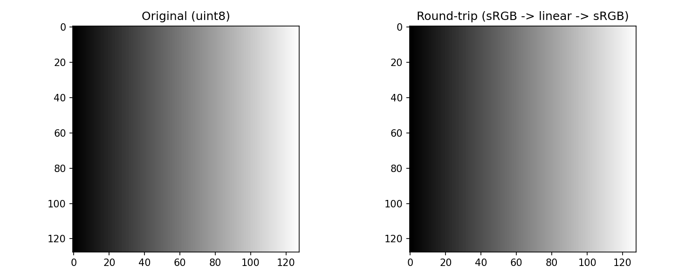

Image processing functions for CNC engraving applications.

Provides sRGB/linear color space conversions, RGBA-to-grayscale/binary conversions with alpha
unpremultiplication, grayscale normalization with auto-levels, dithering algorithms
(Floyd-Steinberg, Bayer, minimum run length) for converting grayscale images to binary output, and
scanline rasterization for converting Ops scanlines into pixel buffers.

## Functions

### `apply_bayer_dither()`

```python
apply_bayer_dither(
    grayscale: numpy.NDArray[numpy.uint8],
    bayer_matrix: numpy.NDArray[numpy.float32],
    invert: bool,
    cell_size: int = 1,
) -> numpy.NDArray[numpy.uint8]
```

Apply ordered (Bayer) dithering using a threshold matrix.

| Parameter      | Type                           | Description                            |
| -------------- | ------------------------------ | -------------------------------------- |
| `grayscale`    | `numpy.NDArray[numpy.uint8]`   | 2D grayscale image as uint8 array.     |
| `bayer_matrix` | `numpy.NDArray[numpy.float32]` | 2D Bayer threshold matrix as float32.  |
| `invert`       | `bool`                         | If True, invert the output.            |
| `cell_size`    | `int = 1`                      | Pixel grouping size for the threshold. |
| _Returns_      | `numpy.NDArray[numpy.uint8]`   | 2D binary uint8 array (values 0 or 1). |
| _Complexity_   |                                | O(w\*h)                                |



_Bayer 4x4 ordered dithering_

### `apply_floyd_steinberg_dither()`

```python
apply_floyd_steinberg_dither(
    grayscale: numpy.NDArray[numpy.uint8],
    invert: bool,
) -> numpy.NDArray[numpy.uint8]
```

Apply Floyd-Steinberg error-diffusion dithering.

| Parameter    | Type                         | Description                                    |
| ------------ | ---------------------------- | ---------------------------------------------- |
| `grayscale`  | `numpy.NDArray[numpy.uint8]` | 2D grayscale image as uint8 array.             |
| `invert`     | `bool`                       | If True, invert the output (swap black/white). |
| _Returns_    | `numpy.NDArray[numpy.uint8]` | 2D binary uint8 array (values 0 or 1).         |
| _Complexity_ |                              | O(w\*h)                                        |



_Floyd-Steinberg dithering_

### `apply_minimum_run_length()`

```python
apply_minimum_run_length(
    binary: numpy.NDArray[numpy.uint8],
    min_run_length: int,
) -> numpy.NDArray[numpy.uint8]
```

Remove binary runs shorter than the given minimum.

| Parameter        | Type                         | Description                                    |
| ---------------- | ---------------------------- | ---------------------------------------------- |
| `binary`         | `numpy.NDArray[numpy.uint8]` | 2D binary uint8 array (values 0 or 1).         |
| `min_run_length` | `int`                        | Minimum run length to keep.                    |
| _Returns_        | `numpy.NDArray[numpy.uint8]` | 2D binary uint8 array with short runs removed. |
| _Complexity_     |                              | O(w\*h)                                        |



_Minimum run length applied to binary image_

### `compute_adaptive_threshold()`

```python
compute_adaptive_threshold(areas: list[int]) -> int
```

Compute an adaptive area threshold to separate noise from content.

Analyses the distribution of connected component areas and finds the largest gap to determine a
threshold that separates noise (small components) from meaningful content.

| Parameter    | Type        | Description                                      |
| ------------ | ----------- | ------------------------------------------------ |
| `areas`      | `list[int]` | Sorted list of component pixel areas.            |
| _Returns_    | `int`       | Adaptive threshold value (minimum area to keep). |
| _Complexity_ |             | O(n) where n = number of unique area values      |



_Adaptive threshold from component area distribution_

### `compute_auto_levels()`

```python
compute_auto_levels(
    gray_image: numpy.NDArray[numpy.uint8],
    clip_percent: float = 1,
) -> tuple[int, int]
```

Compute auto black/white levels from a grayscale image histogram.

| Parameter      | Type                         | Description                                 |
| -------------- | ---------------------------- | ------------------------------------------- |
| `gray_image`   | `numpy.NDArray[numpy.uint8]` | Grayscale image as uint8 array.             |
| `clip_percent` | `float = 1`                  | Percentage of pixels to clip from each end. |
| _Returns_      | `tuple[int, int]`            | Tuple of (black_point, white_point).        |
| _Complexity_   |                              | O(n) where n = number of pixels             |

### `denoise_binary()`

```python
denoise_binary(
    binary: numpy.NDArray[numpy.uint8],
) -> numpy.NDArray[numpy.uint8]
```

Remove small noise components from a binary image using adaptive thresholding.

Computes connected components, finds the largest gap in component area distribution to separate
noise from content, and removes small components. Uses the same algorithm as the legacy Python
`_find_adaptive_area_threshold`.

| Parameter    | Type                         | Description                               |
| ------------ | ---------------------------- | ----------------------------------------- |
| `binary`     | `numpy.NDArray[numpy.uint8]` | 2D binary uint8 array (values 0 or 1).    |
| _Returns_    | `numpy.NDArray[numpy.uint8]` | 2D binary uint8 array with noise removed. |
| _Complexity_ |                              | O(w\*h)                                   |



_Binary image denoised via adaptive thresholding_

### `filter_components()`

```python
filter_components(
    binary: numpy.NDArray[numpy.uint8],
    min_area: int,
) -> numpy.NDArray[numpy.uint8]
```

Remove connected components smaller than min_area.

Uses 8-connectivity for component detection.

| Parameter    | Type                         | Description                              |
| ------------ | ---------------------------- | ---------------------------------------- |
| `binary`     | `numpy.NDArray[numpy.uint8]` | 2D binary uint8 array (values 0 or 1).   |
| `min_area`   | `int`                        | Minimum pixel count to keep a component. |
| _Returns_    | `numpy.NDArray[numpy.uint8]` | 2D binary uint8 array (values 0 or 1).   |
| _Complexity_ |                              | O(w\*h)                                  |



_Component filtering by minimum area_

### `get_component_areas()`

```python
get_component_areas(binary: numpy.NDArray[numpy.uint8]) -> list[int]
```

Compute the pixel area of each connected component.

Uses 8-connectivity. Areas are returned sorted ascending. Background (0-valued pixels) is excluded.

| Parameter    | Type                         | Description                            |
| ------------ | ---------------------------- | -------------------------------------- |
| `binary`     | `numpy.NDArray[numpy.uint8]` | 2D binary uint8 array (values 0 or 1). |
| _Returns_    | `list[int]`                  | Sorted list of component pixel areas.  |
| _Complexity_ |                              | O(w\*h)                                |



_Connected component areas sorted ascending_

### `grayscale_to_binary()`

```python
grayscale_to_binary(
    gray: numpy.NDArray[numpy.uint8],
    threshold: float = 0.5,
    invert: bool = False,
    auto_threshold: bool = True,
) -> numpy.NDArray[numpy.uint8]
```

Convert grayscale image to binary using Otsu or fixed threshold.

Pixels at or below the threshold become foreground (1). Uses Otsu's method when auto_threshold is
True.

| Parameter        | Type                         | Description                                                      |
| ---------------- | ---------------------------- | ---------------------------------------------------------------- |
| `gray`           | `numpy.NDArray[numpy.uint8]` | 2D grayscale uint8 image.                                        |
| `threshold`      | `float = 0.5`                | Fixed threshold (0.0-1.0), used only if auto_threshold is False. |
| `invert`         | `bool = False`               | If True, pixels above threshold become foreground.               |
| `auto_threshold` | `bool = True`                | If True, compute threshold via Otsu's method.                    |
| _Returns_        | `numpy.NDArray[numpy.uint8]` | 2D binary uint8 array (values 0 or 1).                           |
| _Complexity_     |                              | O(w\*h)                                                          |



_Grayscale to binary via Otsu and fixed threshold_

### `linear_to_srgb()`

```python
linear_to_srgb(
    array: numpy.NDArray[numpy.float32],
    dither: bool = False,
) -> numpy.NDArray[numpy.uint8]
```

Convert linear light values to sRGB pixel values.

| Parameter    | Type                           | Description                                     |
| ------------ | ------------------------------ | ----------------------------------------------- |
| `array`      | `numpy.NDArray[numpy.float32]` | Input array of linear float32 values in [0, 1]. |
| `dither`     | `bool = False`                 | Apply dithering to reduce banding artifacts.    |
| _Returns_    | `numpy.NDArray[numpy.uint8]`   | Array of sRGB uint8 values with the same shape. |
| _Complexity_ |                                | O(n) where n = number of pixels                 |

### `normalize_grayscale()`

```python
normalize_grayscale(
    gray_image: numpy.NDArray[numpy.uint8],
    black_point: int = 0,
    white_point: int = 255,
) -> numpy.NDArray[numpy.uint8]
```

Normalize a grayscale image by stretching the dynamic range.

**Raises:** `ValueError` — If black_point >= white_point.

| Parameter     | Type                         | Description                                     |
| ------------- | ---------------------------- | ----------------------------------------------- |
| `gray_image`  | `numpy.NDArray[numpy.uint8]` | Input grayscale image as uint8 array.           |
| `black_point` | `int = 0`                    | Black point for normalization.                  |
| `white_point` | `int = 255`                  | White point for normalization.                  |
| _Returns_     | `numpy.NDArray[numpy.uint8]` | Normalized grayscale image with the same shape. |
| _Complexity_  |                              | O(n) where n = number of pixels                 |

### `rasterize_scanlines()`

```python
rasterize_scanlines(
    ops: ops.Ops,
    width_px: int,
    height_px: int,
    px_per_mm: tuple[float, float],
    origin_mm: tuple[float, float] = (0, 0),
) -> numpy.NDArray[numpy.uint8]
```

Rasterize ScanLine commands from _ops_ into a 2D power-map buffer.

Iterates all scanline commands in _ops_, converts their mm coordinates to pixel space using
_px_per_mm_, and returns a uint8 array where each pixel holds the maximum power value written to it.

| Parameter    | Type                           | Description                                        |
| ------------ | ------------------------------ | -------------------------------------------------- |
| `ops`        | `ops.Ops`                      | Command sequence to rasterize.                     |
| `width_px`   | `int`                          | Width of the output texture in pixels.             |
| `height_px`  | `int`                          | Height of the output texture in pixels.            |
| `px_per_mm`  | `tuple[float, float]`          | (x, y) resolution in pixels per millimeter.        |
| `origin_mm`  | `tuple[float, float] = (0, 0)` | (x, y) origin offset in mm (default `(0.0, 0.0)`). |
| _Returns_    | `numpy.NDArray[numpy.uint8]`   | 2D uint8 array of shape (height_px, width_px).     |
| _Complexity_ |                                | O(scanline_pixels)                                 |



_Scanline ops rasterized into a 2D power-map buffer_

### `rgba_to_binary()`

```python
rgba_to_binary(
    rgba: numpy.NDArray[numpy.uint8],
    width: int,
    height: int,
    stride: int,
    threshold: int = 128,
    invert: bool = False,
) -> numpy.NDArray[numpy.uint8]
```

Convert raw BGRA pixel buffer to binary image using thresholding.

Transparent pixels (alpha == 0) are always treated as white (0).

| Parameter    | Type                         | Description                                                       |
| ------------ | ---------------------------- | ----------------------------------------------------------------- |
| `rgba`       | `numpy.NDArray[numpy.uint8]` | Flattened uint8 buffer of shape (stride _ height _ 4,).           |
| `width`      | `int`                        | Image width in pixels.                                            |
| `height`     | `int`                        | Image height in pixels.                                           |
| `stride`     | `int`                        | Row stride in pixels.                                             |
| `threshold`  | `int = 128`                  | Brightness value (0-255) for binarization.                        |
| `invert`     | `bool = False`               | If True, pixels above threshold become black (1).                 |
| _Returns_    | `numpy.NDArray[numpy.uint8]` | 2D binary uint8 array (values 0 or 1) with shape (height, width). |
| _Complexity_ |                              | O(w\*h)                                                           |

### `rgba_to_grayscale()`

```python
rgba_to_grayscale(
    rgba: numpy.NDArray[numpy.uint8],
    width: int,
    height: int,
    stride: int,
) -> tuple[numpy.NDArray[numpy.uint8], numpy.NDArray[numpy.float32]]
```

Convert raw BGRA pixel buffer to grayscale with alpha unpremultiplication.

Performs proper unpremultiplication of alpha and blends to white background for grayscale
calculation using BT.601 luminance weights.

| Parameter    | Type                                                              | Description                                                             |
| ------------ | ----------------------------------------------------------------- | ----------------------------------------------------------------------- |
| `rgba`       | `numpy.NDArray[numpy.uint8]`                                      | Flattened uint8 buffer of shape (stride _ height _ 4,).                 |
| `width`      | `int`                                                             | Image width in pixels.                                                  |
| `height`     | `int`                                                             | Image height in pixels.                                                 |
| `stride`     | `int`                                                             | Row stride in pixels (may be larger than width).                        |
| _Returns_    | `tuple[numpy.NDArray[numpy.uint8], numpy.NDArray[numpy.float32]]` | Tuple of (grayscale_uint8, alpha_float32) arrays, each (height, width). |
| _Complexity_ |                                                                   | O(w\*h)                                                                 |

### `rgba_to_grayscale_inplace()`

```python
rgba_to_grayscale_inplace(
    rgba: numpy.NDArray[numpy.uint8],
    width: int,
    height: int,
    stride: int,
) -> None
```

Convert raw BGRA pixel buffer to grayscale in place.

Modifies the buffer directly, converting BGR channels to grayscale while preserving the alpha
channel.

| Parameter    | Type                         | Description                                             |
| ------------ | ---------------------------- | ------------------------------------------------------- |
| `rgba`       | `numpy.NDArray[numpy.uint8]` | Flattened uint8 buffer of shape (stride _ height _ 4,). |
| `width`      | `int`                        | Image width in pixels.                                  |
| `height`     | `int`                        | Image height in pixels.                                 |
| `stride`     | `int`                        | Row stride in pixels.                                   |
| _Returns_    | `None`                       |                                                         |
| _Complexity_ |                              | O(w\*h)                                                 |

### `srgb_to_linear()`

```python
srgb_to_linear(
    array: numpy.NDArray[numpy.uint8],
) -> numpy.NDArray[numpy.float32]
```

Convert sRGB pixel values to linear light values.

| Parameter    | Type                           | Description                                         |
| ------------ | ------------------------------ | --------------------------------------------------- |
| `array`      | `numpy.NDArray[numpy.uint8]`   | Input array of sRGB uint8 values.                   |
| _Returns_    | `numpy.NDArray[numpy.float32]` | Array of linear float32 values with the same shape. |
| _Complexity_ |                                | O(n) where n = number of pixels                     |



_sRGB to linear round-trip_
