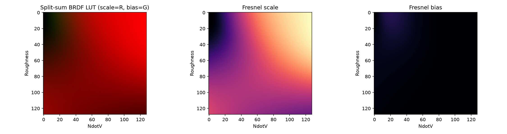

## Functions

### `generate_brdf_lut()`

```python
generate_brdf_lut(
    size: int = 32,
    sample_count: int = 1024,
) -> numpy.NDArray[numpy.float32]
```

Integrate the Cook-Torrance BRDF into a split-sum LUT.

For each `(NdotV, roughness)` texel the GGX distribution is importance-sampled (Hammersley sequence)
and the Smith geometry term integrated, giving the Fresnel scale/bias pair such that the specular
IBL response is `F0 * scale + bias`.

Deterministic: repeated calls return identical data.

| Parameter      | Type                           | Description                                                                                |
| -------------- | ------------------------------ | ------------------------------------------------------------------------------------------ |
| `size`         | `int = 32`                     | LUT resolution in both axes.                                                               |
| `sample_count` | `int = 1024`                   | Importance samples per texel.                                                              |
| _Returns_      | `numpy.NDArray[numpy.float32]` | Float32 array of shape (size, size, 2) indexed as `lut[roughness, NdotV] = (scale, bias)`. |
| _Complexity_   |                                | O(size^2 * sample_count)                                                                   |



*Split-sum BRDF integration LUT for IBL specular*
