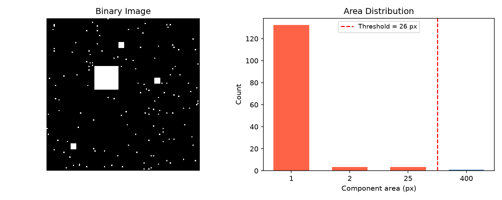
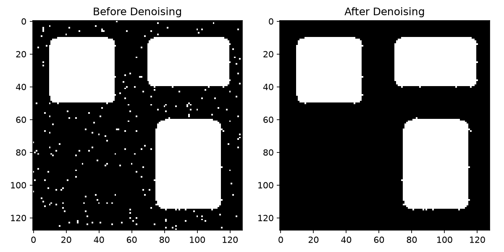
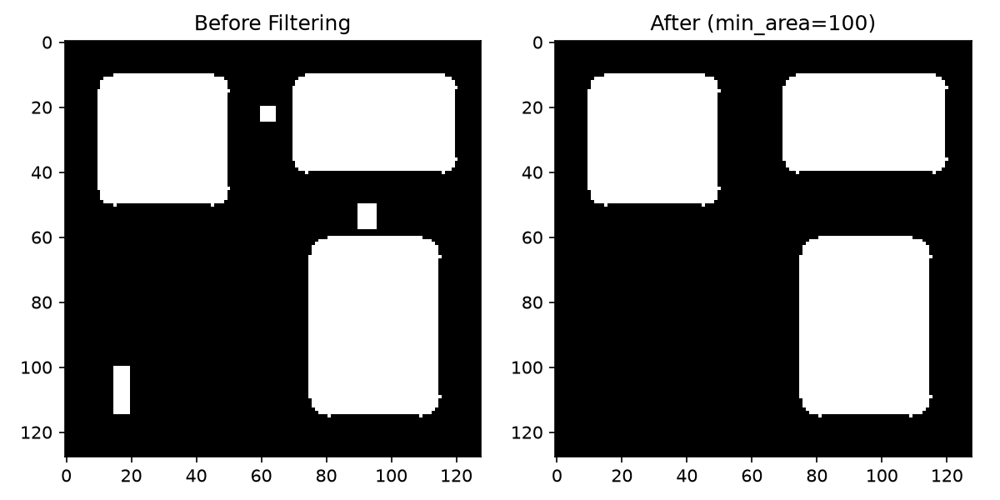
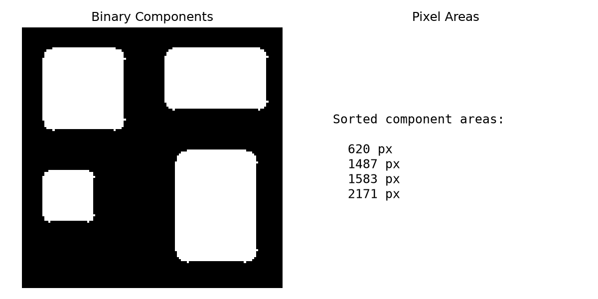
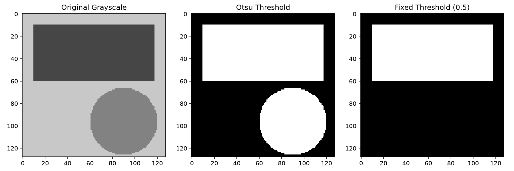

## Functions

### `compute_adaptive_threshold()`

```python
compute_adaptive_threshold(areas: list[int]) -> int
```

Compute an adaptive area threshold to separate noise from content.

Analyses the distribution of connected component areas and finds the largest gap to determine a
threshold that separates noise (small components) from meaningful content.

| Parameter    | Type        | Description                                      |
| ------------ | ----------- | ------------------------------------------------ |
| `areas`      | `list[int]` | Sorted list of component pixel areas.            |
| _Returns_    | `int`       | Adaptive threshold value (minimum area to keep). |
| _Complexity_ |             | O(n) where n = number of unique area values      |



*Adaptive threshold from component area distribution*

### `denoise_binary()`

```python
denoise_binary(
    binary: numpy.NDArray[numpy.uint8],
) -> numpy.NDArray[numpy.uint8]
```

Remove small noise components from a binary image using adaptive thresholding.

Computes connected components, finds the largest gap in component area distribution to separate
noise from content, and removes small components.

| Parameter    | Type                         | Description                               |
| ------------ | ---------------------------- | ----------------------------------------- |
| `binary`     | `numpy.NDArray[numpy.uint8]` | 2D binary uint8 array (values 0 or 1).    |
| _Returns_    | `numpy.NDArray[numpy.uint8]` | 2D binary uint8 array with noise removed. |
| _Complexity_ |                              | O(w\*h)                                   |



*Binary image denoised via adaptive thresholding*

### `filter_components()`

```python
filter_components(
    binary: numpy.NDArray[numpy.uint8],
    min_area: int,
) -> numpy.NDArray[numpy.uint8]
```

Remove connected components smaller than min_area.

Uses 8-connectivity for component detection.

| Parameter    | Type                         | Description                              |
| ------------ | ---------------------------- | ---------------------------------------- |
| `binary`     | `numpy.NDArray[numpy.uint8]` | 2D binary uint8 array (values 0 or 1).   |
| `min_area`   | `int`                        | Minimum pixel count to keep a component. |
| _Returns_    | `numpy.NDArray[numpy.uint8]` | 2D binary uint8 array (values 0 or 1).   |
| _Complexity_ |                              | O(w\*h)                                  |



*Component filtering by minimum area*

### `get_component_areas()`

```python
get_component_areas(binary: numpy.NDArray[numpy.uint8]) -> list[int]
```

Compute the pixel area of each connected component.

Uses 8-connectivity. Areas are returned sorted ascending. Background (0-valued pixels) is excluded.

| Parameter    | Type                         | Description                            |
| ------------ | ---------------------------- | -------------------------------------- |
| `binary`     | `numpy.NDArray[numpy.uint8]` | 2D binary uint8 array (values 0 or 1). |
| _Returns_    | `list[int]`                  | Sorted list of component pixel areas.  |
| _Complexity_ |                              | O(w\*h)                                |



*Connected component areas sorted ascending*

### `grayscale_to_binary()`

```python
grayscale_to_binary(
    gray: numpy.NDArray[numpy.uint8],
    threshold: float = 0.5,
    invert: bool = False,
    auto_threshold: bool = True,
) -> numpy.NDArray[numpy.uint8]
```

Convert grayscale image to binary using Otsu or fixed threshold.

Pixels at or below the threshold become foreground (1). Uses Otsu's method when auto_threshold is
True.

| Parameter        | Type                         | Description                                                      |
| ---------------- | ---------------------------- | ---------------------------------------------------------------- |
| `gray`           | `numpy.NDArray[numpy.uint8]` | 2D grayscale uint8 image.                                        |
| `threshold`      | `float = 0.5`                | Fixed threshold (0.0-1.0), used only if auto_threshold is False. |
| `invert`         | `bool = False`               | If True, pixels above threshold become foreground.               |
| `auto_threshold` | `bool = True`                | If True, compute threshold via Otsu's method.                    |
| _Returns_        | `numpy.NDArray[numpy.uint8]` | 2D binary uint8 array (values 0 or 1).                           |
| _Complexity_     |                              | O(w\*h)                                                          |



*Grayscale to binary via Otsu and fixed threshold*
