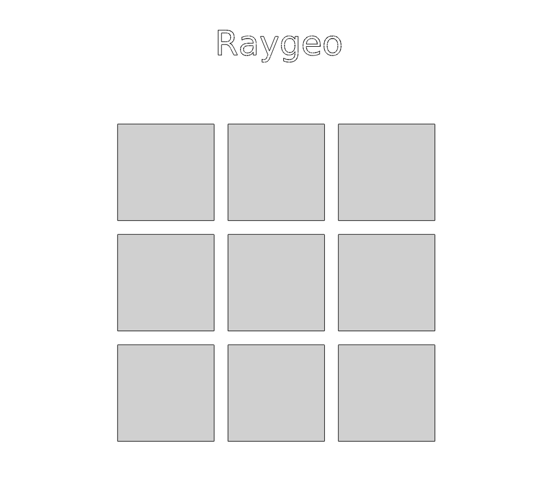

## Functions

### `geometry_to_image()`

```python
geometry_to_image(
    strokes: geo.Geometry,
    fills: geo.Geometry,
    size_mm: tuple[float, float],
    dpi: float = 96,
) -> numpy.ndarray
```

Rasterise vector geometry into an RGBA uint8 image.

Converts mm‑space Y‑up geometry into a pixel buffer (Y‑down, origin top‑left) at the given *dpi*.

Uses basic anti-aliasing for the wire‑frame strokes, and scan‑line filling for the closed polygons.

| Parameter | Type                  | Description                                               |
| --------- | --------------------- | --------------------------------------------------------- |
| `strokes` | `geo.Geometry`        | Wire‑frame paths (stroked in black).                      |
| `fills`   | `geo.Geometry`        | Closed polygons (scan‑line filled in light gray).         |
| `size_mm` | `tuple[float, float]` | Physical size `(width, height)` in mm.                    |
| `dpi`     | `float = 96`          | Output resolution in dots per inch (default 96).          |
| _Returns_ | `numpy.ndarray`       | `numpy.ndarray` with shape `(H, W, 4)` and dtype `uint8`. |



*Vector geometry rasterised into an RGBA pixel buffer*
