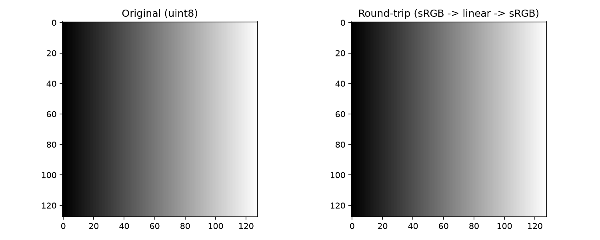

## Functions

### `linear_to_srgb()`

```python
linear_to_srgb(
    array: numpy.NDArray[numpy.float32],
    dither: bool = False,
) -> numpy.NDArray[numpy.uint8]
```

Convert linear light values to sRGB pixel values.

| Parameter    | Type                           | Description                                     |
| ------------ | ------------------------------ | ----------------------------------------------- |
| `array`      | `numpy.NDArray[numpy.float32]` | Input array of linear float32 values in [0, 1]. |
| `dither`     | `bool = False`                 | Apply dithering to reduce banding artifacts.    |
| _Returns_    | `numpy.NDArray[numpy.uint8]`   | Array of sRGB uint8 values with the same shape. |
| _Complexity_ |                                | O(n) where n = number of pixels                 |

### `srgb_to_linear()`

```python
srgb_to_linear(
    array: numpy.NDArray[numpy.uint8],
) -> numpy.NDArray[numpy.float32]
```

Convert sRGB pixel values to linear light values.

| Parameter    | Type                           | Description                                         |
| ------------ | ------------------------------ | --------------------------------------------------- |
| `array`      | `numpy.NDArray[numpy.uint8]`   | Input array of sRGB uint8 values.                   |
| _Returns_    | `numpy.NDArray[numpy.float32]` | Array of linear float32 values with the same shape. |
| _Complexity_ |                                | O(n) where n = number of pixels                     |



*sRGB to linear round-trip*
