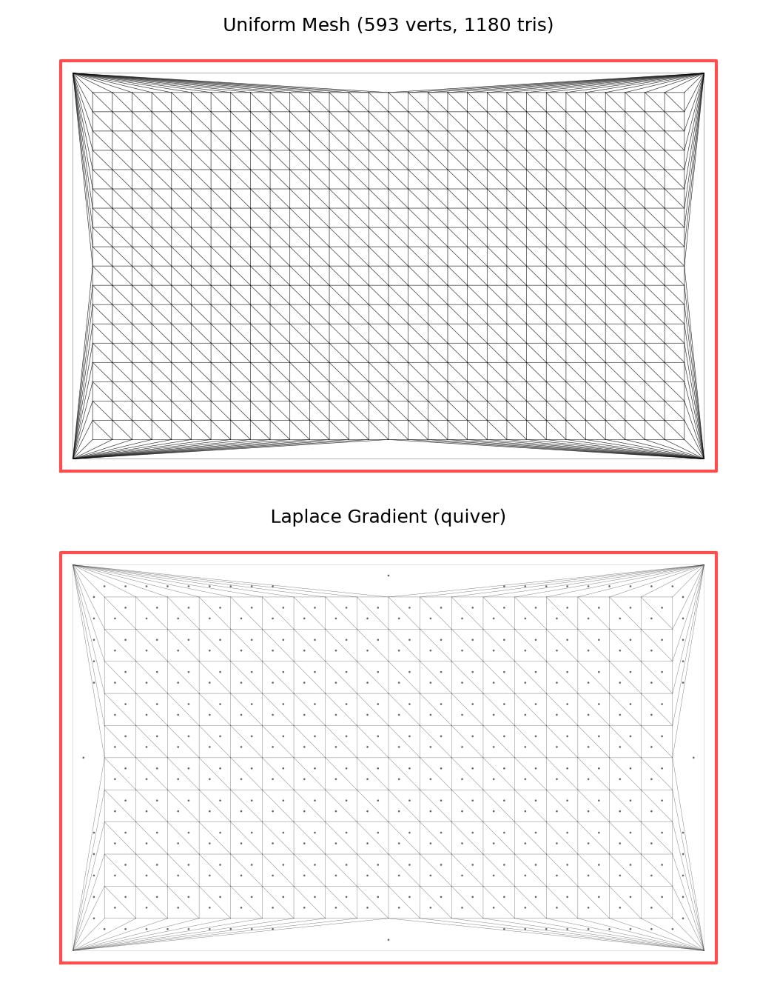
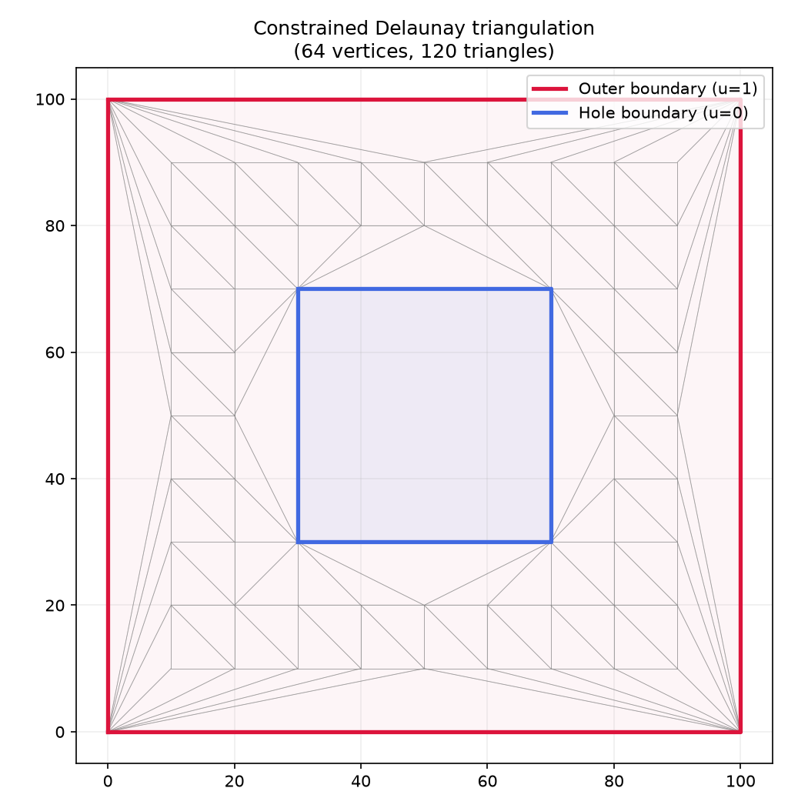
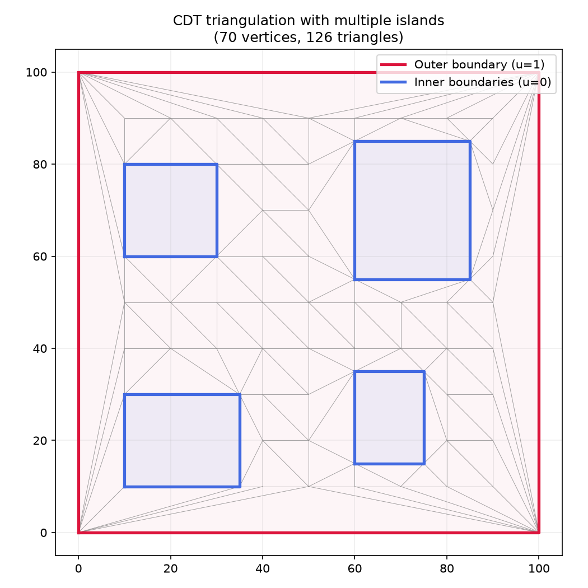

_Uniform mesh (top) and Laplace gradient field (bottom) from build_uniform_mesh._

## Functions

### `build_triangle_mesh()`

```python
build_triangle_mesh(
    outer: Sequence[tuple[float, float]],
    holes: Sequence[Sequence[tuple[float, float]]] = (),
    tool_radius: float = 0,
    min_angle: float = 20,
) -> types.TriangleMesh
```

Build a constrained Delaunay triangle mesh from polygon boundaries.

| Parameter     | Type                                           | Description                                            |
| ------------- | ---------------------------------------------- | ------------------------------------------------------ |
| `outer`       | `Sequence[tuple[float, float]]`                | Outer boundary polygon vertices as (x, y) tuples.      |
| `holes`       | `Sequence[Sequence[tuple[float, float]]] = ()` | Sequence of hole/island polygons.                      |
| `tool_radius` | `float = 0`                                    | Tool radius for offsetting the outer boundary inwards. |
| `min_angle`   | `float = 20`                                   | Minimum triangle angle for Steiner point refinement.   |
| _Returns_     | `types.TriangleMesh`                           | TriangleMesh with boundary tags.                       |



_CDT triangulation of a square pocket with centred hole_


_CDT triangulation of an L-shaped pocket_



_CDT triangulation of a square pocket with multiple islands_

### `build_uniform_mesh()`

```python
build_uniform_mesh(
    outer: Sequence[tuple[float, float]],
    holes: Sequence[Sequence[tuple[float, float]]] = (),
    tool_radius: float = 0,
    target_edge_len: float = 1,
) -> types.TriangleMesh
```

Build a triangle mesh with approximately uniform edge length.

Computes the Steiner point density needed to achieve _target_edge_len_ and delegates to
`build_triangle_mesh`.

| Parameter         | Type                                           | Description                               |
| ----------------- | ---------------------------------------------- | ----------------------------------------- |
| `outer`           | `Sequence[tuple[float, float]]`                | Outer boundary polygon.                   |
| `holes`           | `Sequence[Sequence[tuple[float, float]]] = ()` | List of hole/island polygons.             |
| `tool_radius`     | `float = 0`                                    | Offsets outer boundary inward.            |
| `target_edge_len` | `float = 1`                                    | Desired edge length.                      |
| _Returns_         | `types.TriangleMesh`                           | TriangleMesh with uniform-sized elements. |
