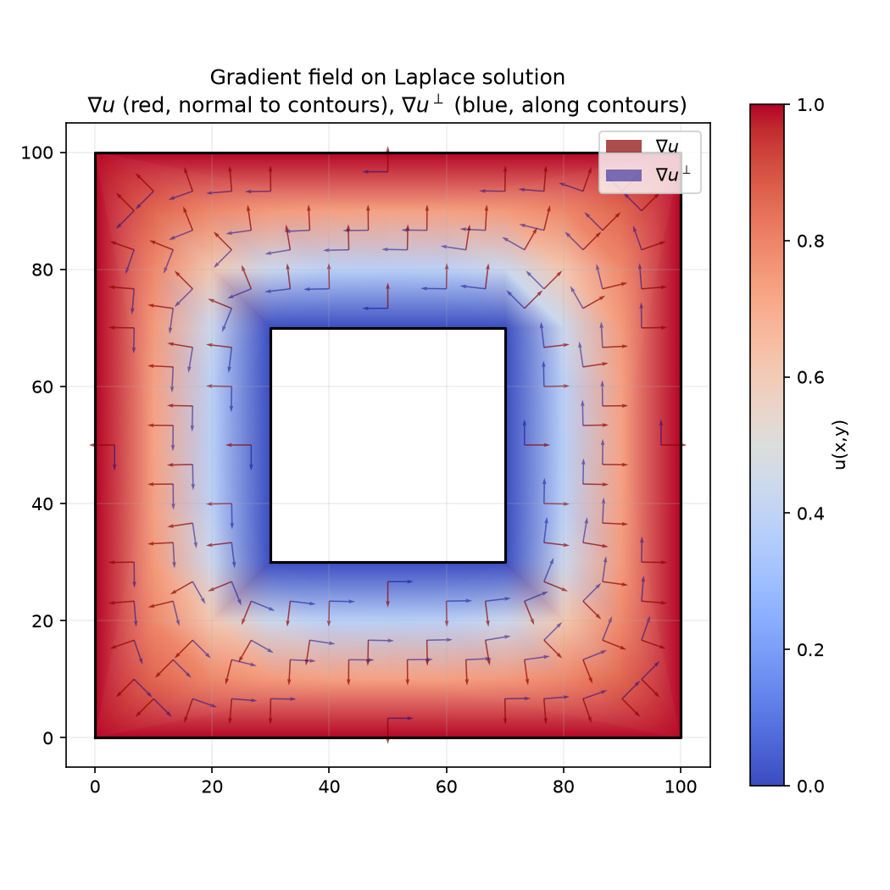
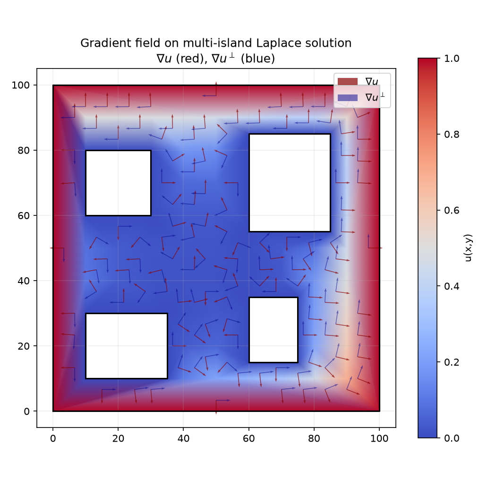

## Functions

### `compute_gradient_field()`

```python
compute_gradient_field(
    mesh: types.TriangleMesh,
    u_field: Sequence[float],
) -> Sequence[tuple[float, float]]
```

Compute the gradient of the scalar field on each triangle.

Given the solution u to the Laplace equation, computes ∇u = (∂u/∂x, ∂u/∂y) in the interior of each
triangle of the mesh (piecewise constant).

| Parameter    | Type                            | Description                                             |
| ------------ | ------------------------------- | ------------------------------------------------------- |
| `mesh`       | `types.TriangleMesh`            | TriangleMesh with the same vertex count as u_field.     |
| `u_field`    | `Sequence[float]`               | Scalar field values, one per vertex.                    |
| _Returns_    | `Sequence[tuple[float, float]]` | List of (gx, gy) pairs, one per triangle in mesh order. |
| _Complexity_ |                                 | O(n) where n = number of triangles                      |



_Gradient field ∇u (red) and perpendicular flow ∇u⊥ (blue) on the Laplace solution_



_Gradient field ∇u (red) and perpendicular flow ∇u⊥ (blue) on a multi-island domain_
