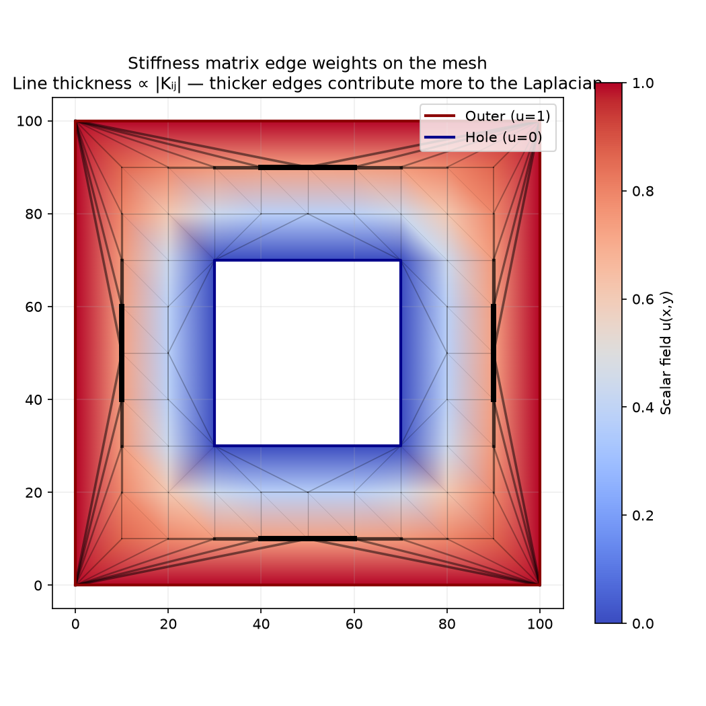
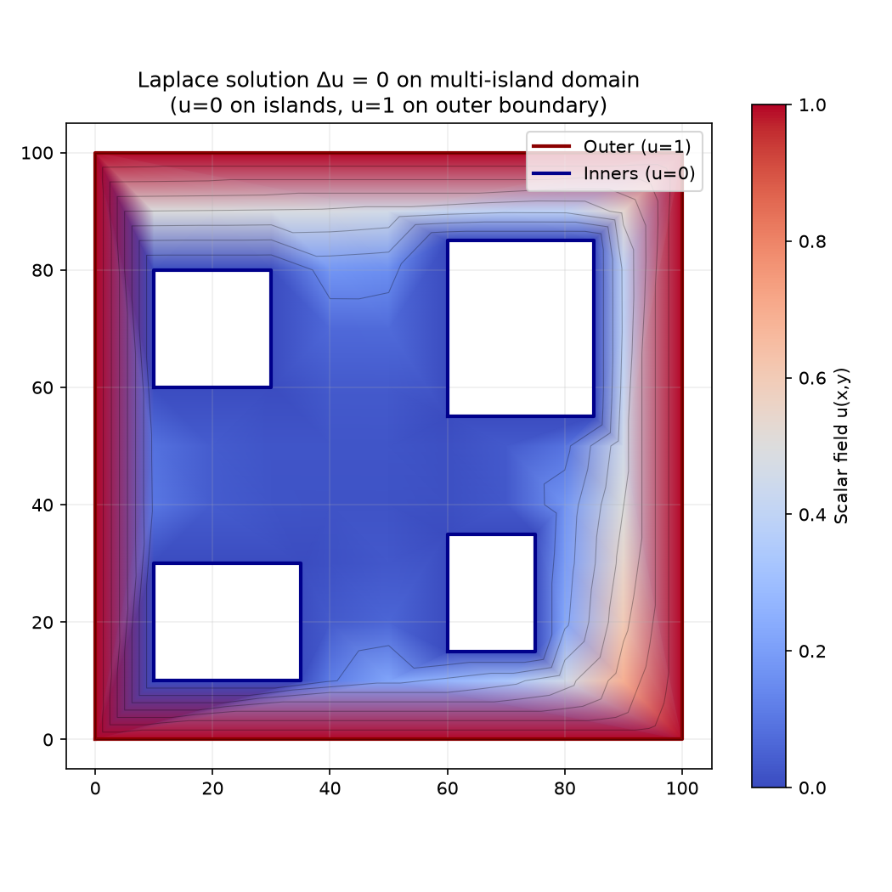
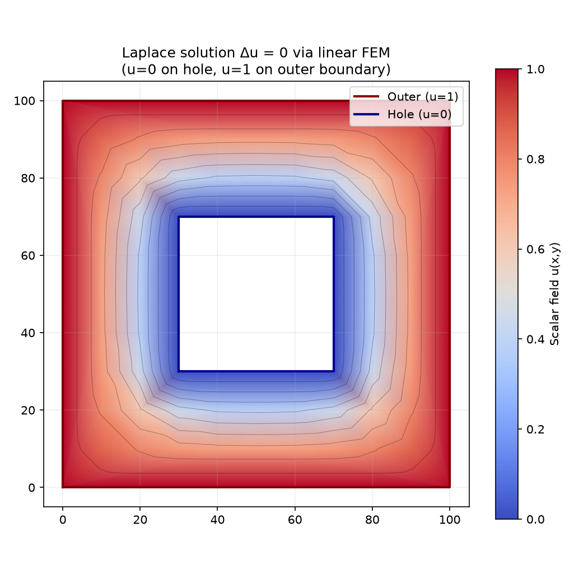
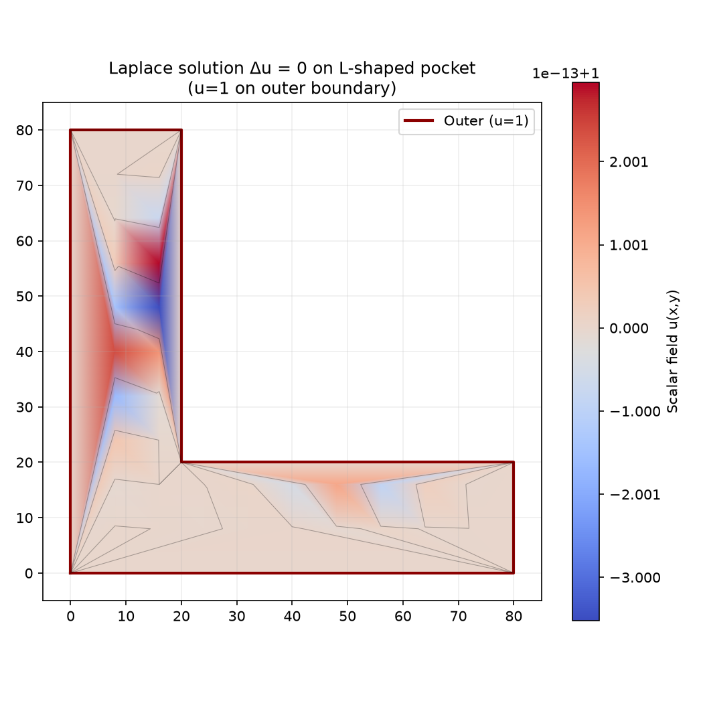
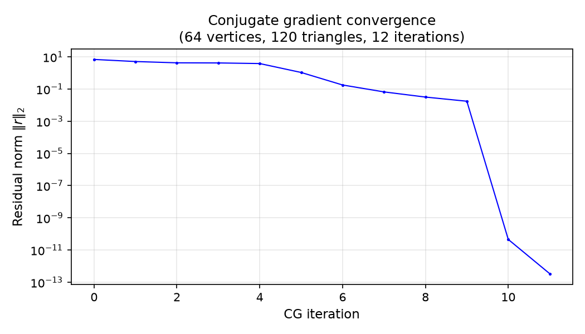

## Functions

### `solve_laplace()`

```python
solve_laplace(
    mesh: types.TriangleMesh,
    max_iter: int = 1000,
    tolerance: float = 1e-08,
) -> Sequence[float]
```

Solve the Laplace equation Δu=0 on a triangle mesh.

Returns a scalar field with one value per vertex. Outer boundary vertices are fixed to u=1.0 and
inner boundary vertices to u=0.0.

| Parameter   | Type                 | Description                              |
| ----------- | -------------------- | ---------------------------------------- |
| `mesh`      | `types.TriangleMesh` | TriangleMesh with boundary tags.         |
| `max_iter`  | `int = 1000`         | Maximum conjugate gradient iterations.   |
| `tolerance` | `float = 1e-08`      | Convergence tolerance for CG residual.   |
| _Returns_   | `Sequence[float]`    | List of scalar u values, one per vertex. |



_Stiffness matrix edge weights on the mesh — line thickness ∝ |Kᵢⱼ|_



_Laplace solution on a multi-island domain — contour lines morph smoothly between four inner islands
and the outer boundary_



_Laplace solution — contours morph smoothly from hole to boundary_



_Laplace solution on an L-shaped domain_

### `solve_laplace_with_history()`

```python
solve_laplace_with_history(
    mesh: types.TriangleMesh,
    max_iter: int = 1000,
    tolerance: float = 1e-08,
) -> tuple[Sequence[float], Sequence[float]]
```

Solve the Laplace equation and return convergence history.

Identical to solve_laplace() but also returns the residual norm after each conjugate gradient
iteration for convergence analysis.

| Parameter   | Type                                      | Description                            |
| ----------- | ----------------------------------------- | -------------------------------------- |
| `mesh`      | `types.TriangleMesh`                      | TriangleMesh with boundary tags.       |
| `max_iter`  | `int = 1000`                              | Maximum conjugate gradient iterations. |
| `tolerance` | `float = 1e-08`                           | Convergence tolerance for CG residual. |
| _Returns_   | `tuple[Sequence[float], Sequence[float]]` | Tuple of (solution, residuals).        |



_Conjugate gradient convergence — residual norm per iteration_
