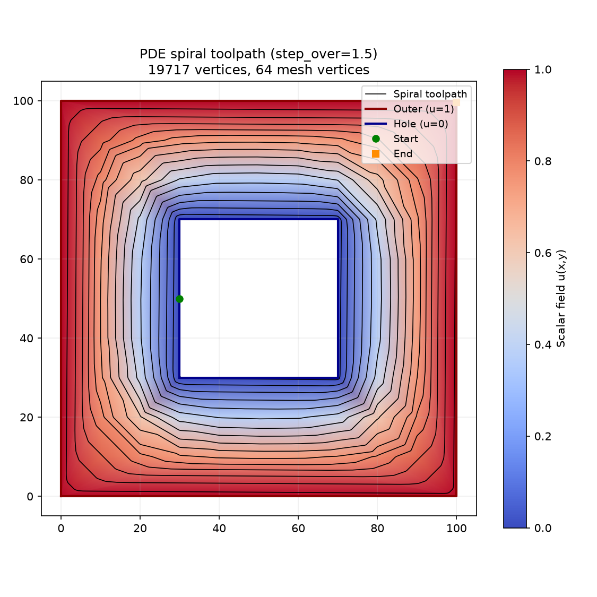
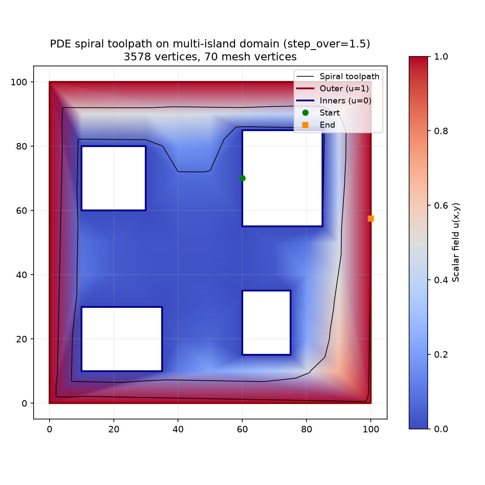

## Functions

### `trace_spiral()`

```python
trace_spiral(
    mesh: types.TriangleMesh,
    u_field: Sequence[float],
    step_over: float,
    start_point: tuple[float, float] | None = None,
) -> Sequence[tuple[float, float, float]]
```

Trace a spiral toolpath from inner to outer boundary.

Uses the piecewise-constant gradient of the scalar field u to trace a smooth spiral that morphs from
the inner boundary (u=0) to the outer boundary (u=1) without self-intersections.

| Parameter     | Type                                     | Description                                               |
| ------------- | ---------------------------------------- | --------------------------------------------------------- |
| `mesh`        | `types.TriangleMesh`                     | TriangleMesh with boundary tags from build_triangle_mesh. |
| `u_field`     | `Sequence[float]`                        | Scalar field from solve_laplace, one value per vertex.    |
| `step_over`   | `float`                                  | Desired radial step-over distance between spiral turns.   |
| `start_point` | `tuple[float, float] &#124; None = None` | Optional explicit start point (x,y).                      |
| _Returns_     | `Sequence[tuple[float, float, float]]`   | List of (x, y, z) points forming the spiral polyline.     |
| _Complexity_  |                                          | O(n \* s) where n = triangles, s = spiral steps           |



_Spiral toolpath traced on the Laplace solution — path morphs smoothly from the inner hole outward_



_Spiral toolpath traced on a multi-island Laplace solution — path navigates around four inner
islands_
