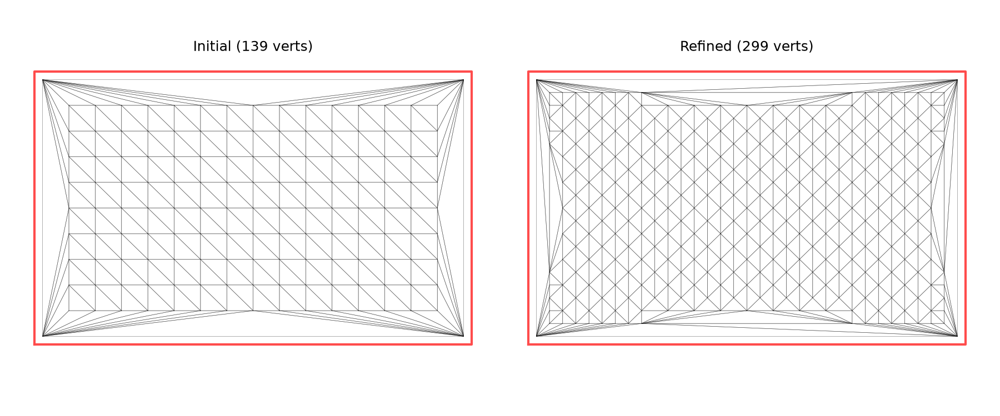

_Initial mesh (left) vs refined mesh (right) after remesh._

## Functions

### `remesh()`

```python
remesh(
    mesh: types.TriangleMesh,
    outer: Sequence[tuple[float, float]],
    max_edge_len: float = 1,
) -> types.TriangleMesh
```

Refine a triangle mesh so no interior edge exceeds _max_edge_len_.

Boundary edges are preserved; only edges with at least one free (non-boundary) vertex are
subdivided.

**Raises:** `RuntimeError` — If retriangulation fails.

| Parameter      | Type                            | Description                                   |
| -------------- | ------------------------------- | --------------------------------------------- |
| `mesh`         | `types.TriangleMesh`            | Input TriangleMesh to refine.                 |
| `outer`        | `Sequence[tuple[float, float]]` | Outer boundary polygon (for retriangulation). |
| `max_edge_len` | `float = 1`                     | Maximum allowed edge length (default 1.0).    |
| _Returns_      | `types.TriangleMesh`            | A refined TriangleMesh.                       |
| _Complexity_   |                                 | O(n log n) where n = number of edges          |
