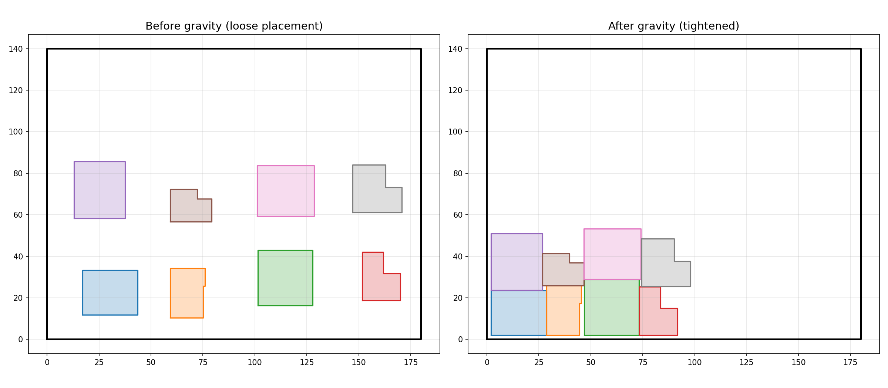

Gravity optimization for nesting layouts.

Provides binary-search gravity sliding to tighten packing by sliding parts down and left as far as
possible without overlapping.

## Functions

### `apply_gravity()`

`apply_gravity(placement_groups: collections.abc.Sequence[collections.abc.Sequence[types.Polygon]], sheet_poly: types.Polygon, spacing: float) -> list[tuple[float, float]]`

Apply gravity sliding to tighten a nesting layout.

Iterates Y and X passes until no movement occurs (max 10 passes). Returns a `(dx, dy)` adjustment
for each input group in order.

**Returns:** List of `(dx, dy)` adjustments, one per group.

| Parameter          | Type                                                                | Description                                     |
| ------------------ | ------------------------------------------------------------------- | ----------------------------------------------- |
| `placement_groups` | `collections.abc.Sequence[collections.abc.Sequence[types.Polygon]]` | List of placed parts (each a list of polygons). |
| `sheet_poly`       | `types.Polygon`                                                     | Sheet polygon.                                  |
| `spacing`          | `float`                                                             | Minimum spacing between parts.                  |
| _Returns_          | `list[tuple[float, float]]`                                         |                                                 |
| _Complexity_       |                                                                     | O(passes _ n _ m) where passes ≤ 10.            |

_Gravity tightening: before vs after_

### `find_max_slide()`

`find_max_slide(polys: collections.abc.Sequence[types.Polygon], other_polys_list: collections.abc.Sequence[collections.abc.Sequence[types.Polygon]], sheet_bounds: tuple[float, float, float, float], sheet_poly: types.Polygon, axis: str, spacing: float) -> float`

Find the maximum distance a part can slide in the negative axis direction.

Uses binary search with polygon overlap and containment checks.

**Returns:** Maximum slide distance.

| Parameter          | Type                                                                | Description                                                 |
| ------------------ | ------------------------------------------------------------------- | ----------------------------------------------------------- |
| `polys`            | `collections.abc.Sequence[types.Polygon]`                           | Polygons of the part to slide.                              |
| `other_polys_list` | `collections.abc.Sequence[collections.abc.Sequence[types.Polygon]]` | Polygons of all other placed parts (grouped).               |
| `sheet_bounds`     | `tuple[float, float, float, float]`                                 | Sheet bounding box (min_x, min_y, max_x, max_y).            |
| `sheet_poly`       | `types.Polygon`                                                     | Sheet polygon.                                              |
| `axis`             | `str`                                                               | `"x"` or `"y"` — axis to slide along.                       |
| `spacing`          | `float`                                                             | Minimum spacing between parts.                              |
| _Returns_          | `float`                                                             |                                                             |
| _Complexity_       |                                                                     | O(log range _ n _ m) for binary search with overlap checks. |
