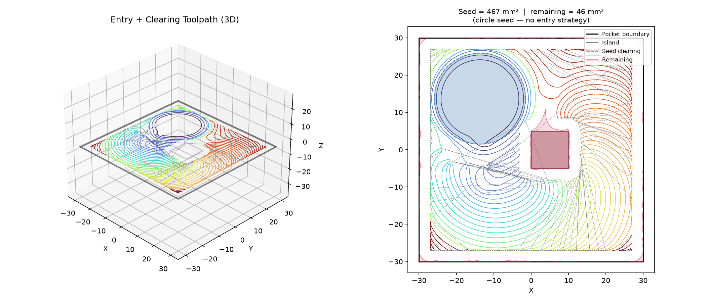
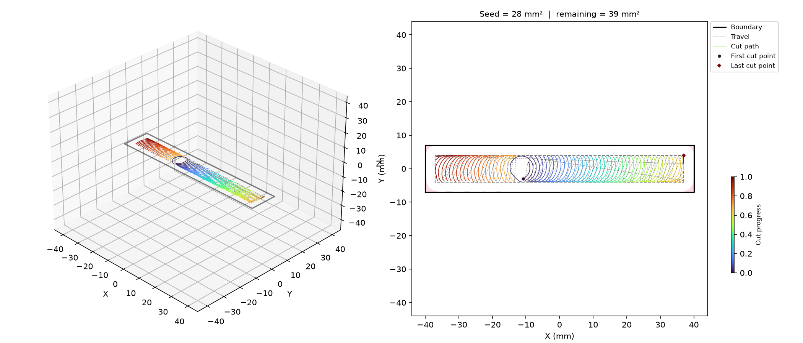
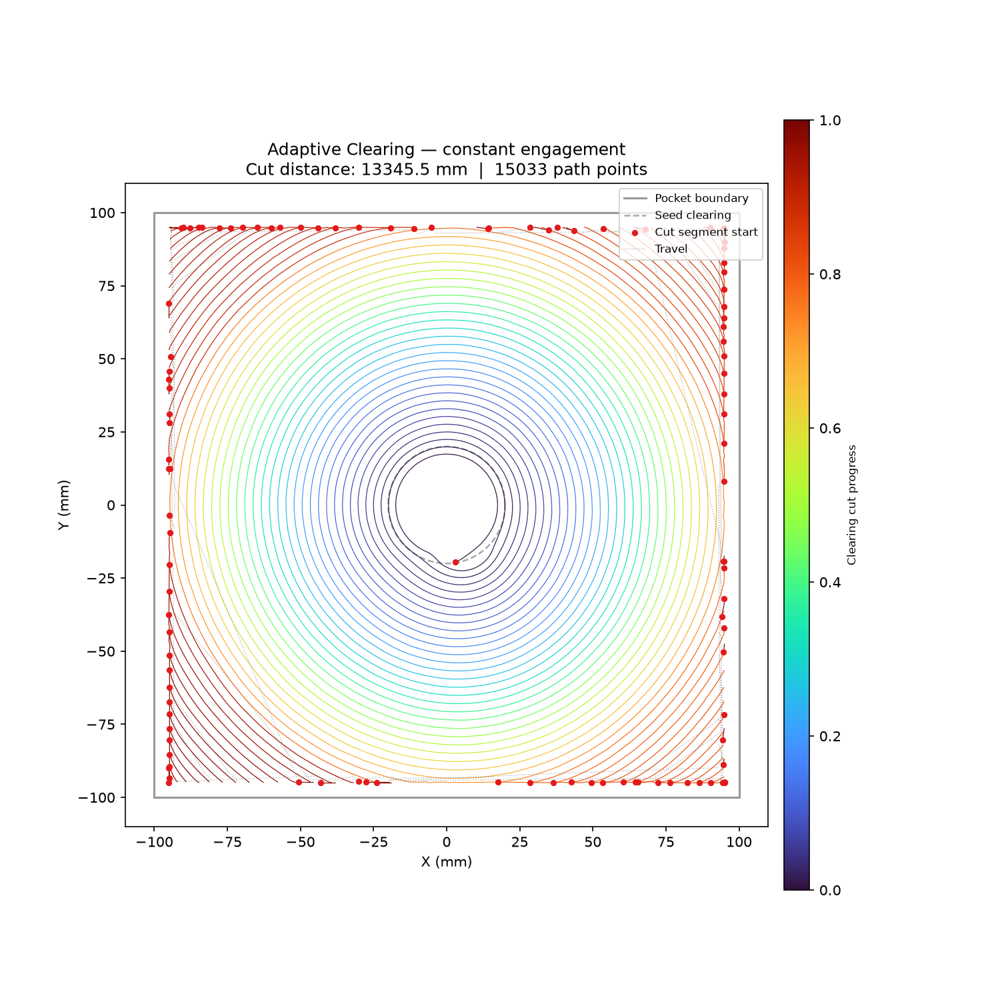
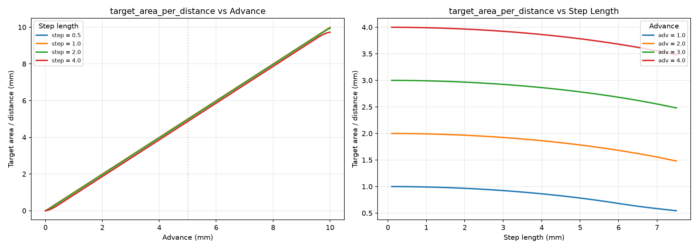
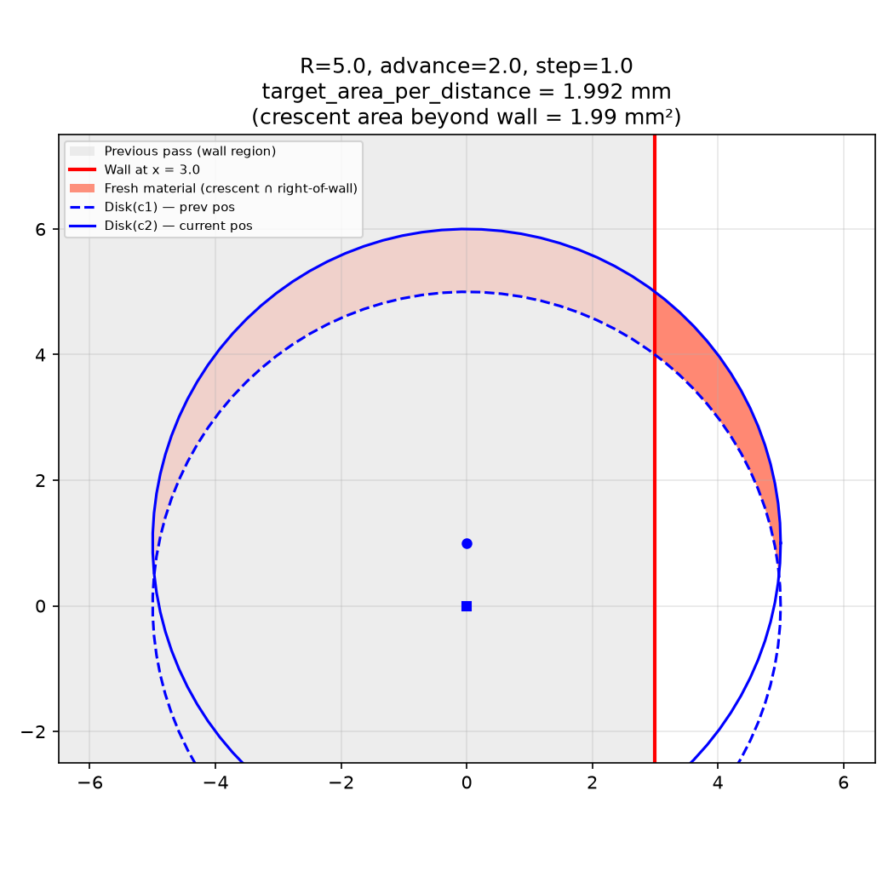

## ResumePointNotFoundError

Raised when all resume strategies fail to find an engagement point.

## RoutingError

Raised when all route strategies fail to find a path.

## Functions

### `adaptive_clearing()`

```python
adaptive_clearing(
    cleared: ops.cut.cleared_area.ClearedArea,
    pocket_boundary: Sequence[tuple[float, float]],
    islands: Sequence[Sequence[tuple[float, float]]] = [],
    tool_radius: float = 3,
    step_over: float = 1.5,
    step_length: float = 0.6,
    target_z: float = -5,
    safe_z: float = 2,
    max_deflection_deg: float = 30,
    wall_margin: float = 0,
    area_tolerance: float = 1,
    cut_feed_rate: int = 1200,
    cut_power: float = 1,
    start_pos: tuple[float, float] | None = None,
    start_heading: float | None = None,
    expansion_batch_size: int = 20,
    profile: bool = False,
    cut_direction: str = 'ccw',
    trace_path: str | None = None,
) -> ops.assembly.result.AssemblyResult
```

Run forward-stepping adaptive clearing.

Starting from the pre-populated *cleared* area, uses a constant-engagement stepping solver to
generate a continuous spiral toolpath from the seed clearing to the pocket wall.

The caller is responsible for populating *cleared* with the entry polygons (e.g. via a workplan
built by **raygeo.cnc.machining.wavefront.build_wavefront_workplan** and executed by
**raygeo.cnc.machining.plan.Workplan**) and prepending the entry Ops to the result.

| Parameter              | Type                                           | Description                                                                                                                       |
| ---------------------- | ---------------------------------------------- | --------------------------------------------------------------------------------------------------------------------------------- |
| `cleared`              | `ops.cut.cleared_area.ClearedArea`             | `ClearedArea` instance (mutated in place).                                                                                        |
| `pocket_boundary`      | `Sequence[tuple[float, float]]`                | Outer boundary of the pocket.                                                                                                     |
| `islands`              | `Sequence[Sequence[tuple[float, float]]] = []` | List of island (hole) polygons (default []).                                                                                      |
| `tool_radius`          | `float = 3`                                    | Tool radius in mm (default 3.0).                                                                                                  |
| `step_over`            | `float = 1.5`                                  | Step-over distance (default 1.5).                                                                                                 |
| `step_length`          | `float = 0.6`                                  | Forward step length in mm (default 0.6).                                                                                          |
| `target_z`             | `float = -5`                                   | Cutting Z height (default -5.0).                                                                                                  |
| `safe_z`               | `float = 2`                                    | Retract Z height for travel (default 2.0).                                                                                        |
| `max_deflection_deg`   | `float = 30`                                   | Maximum steering deflection per step in degrees (default 30).                                                                     |
| `wall_margin`          | `float = 0`                                    | Extra clearance between tool and boundary (default 0.0).                                                                          |
| `area_tolerance`       | `float = 1`                                    | Stop when remaining uncut area drops below this threshold (default 1.0).                                                          |
| `cut_feed_rate`        | `int = 1200`                                   | Feed rate for cutting moves (default 1200).                                                                                       |
| `cut_power`            | `float = 1`                                    | Laser power for cutting moves (0.0-1.0, default 1.0).                                                                             |
| `start_pos`            | `tuple[float, float] &#124; None = None`       | Initial tool position (x, y). When None, auto-detected from the cleared-area frontier.                                            |
| `start_heading`        | `float &#124; None = None`                     | Initial tool heading in radians. When None, auto-detected as the CCW tangent at start_pos.                                        |
| `expansion_batch_size` | `int = 20`                                     | Batch cleared-area expansions every N steps (default 20). Larger values improve performance but may slightly reduce path quality. |
| `profile`              | `bool = False`                                 | Print a profiling report to stdout (default False).                                                                               |
| `cut_direction`        | `str = 'ccw'`                                  | Rotational direction of all cutting moves. `"cw"` or `"ccw"` (default `"ccw"`).                                                   |
| `trace_path`           | `str &#124; None = None`                       | When set, write a per-step binary trace file for the Python inspector (debug builds only).                                        |
| _Returns_              | `ops.assembly.result.AssemblyResult`           | Ops with cutting commands (entry not included).                                                                                   |



*Circle-seed clearing in a square pocket with central island: seed, toolpath, and remaining.*



*Narrow pocket — 3D toolpath view (left) and 2D top-down with seed/remaining overlay (right).*



*Constant-engagement clearing cuts, MAT-routed travel links, coloured by progress.*

### `target_area_per_distance()`

```python
target_area_per_distance(
    radius: float,
    advance: float,
    step_length: float,
) -> float
```

Target cut-area per unit distance for the engagement solver.

| Parameter     | Type    | Description                    |
| ------------- | ------- | ------------------------------ |
| `radius`      | `float` | Tool radius in mm.             |
| `advance`     | `float` | Step-over distance in mm.      |
| `step_length` | `float` | Forward step length in mm.     |
| _Returns_     | `float` | Target area per distance (mm). |



*Left: area/distance vs advance for several step lengths. Right: vs step length for several
advances.*



*Two offset disks and a wall at x=R−advance: crescent beyond wall is fresh material.*
