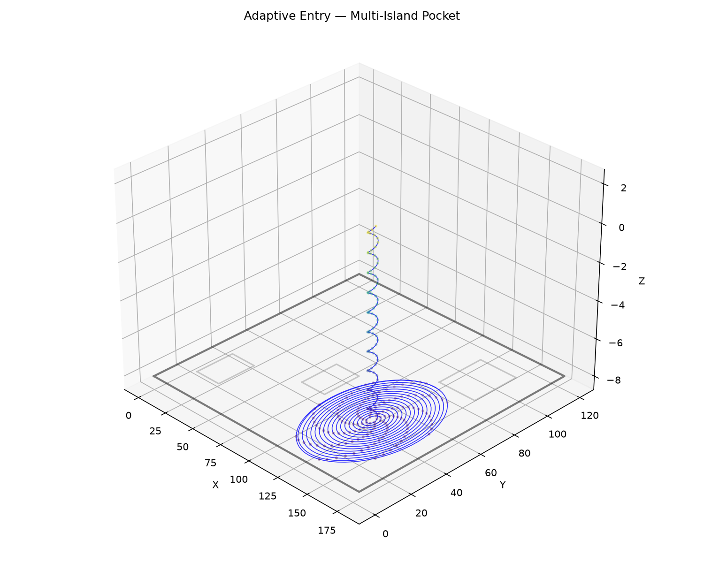

## Functions

### `adaptive_entry()`

```python
adaptive_entry(
    pocket_boundary: Sequence[tuple[float, float]],
    islands: Sequence[Sequence[tuple[float, float]]] = [],
    tool_radius: float = 3,
    step_over: float = 2,
    safe_z: float = 2,
    target_z: float = -5,
    plunge_pitch: float = 1,
    safe_margin: float = 1,
    angular_step: float = 0.1,
    cut_feed_rate: int = 1200,
    cut_power: float = 1,
) -> tuple[ops.Ops, list[list[tuple[float, float]]]]
```

Fast central clearing entry.

Finds the optimal entry pole using `find_largest_circle`, then generates either a helix->spiral
(wide area) or zigzag ramp (tight slot).

The returned *cleared_polygons* should be inserted into a `ClearedArea` via `cut`.

| Parameter         | Type                                              | Description                                                                                                                                         |
| ----------------- | ------------------------------------------------- | --------------------------------------------------------------------------------------------------------------------------------------------------- |
| `pocket_boundary` | `Sequence[tuple[float, float]]`                   | Outer boundary of the pocket.                                                                                                                       |
| `islands`         | `Sequence[Sequence[tuple[float, float]]] = []`    | List of island (hole) polygons (default []).                                                                                                        |
| `tool_radius`     | `float = 3`                                       | Tool radius in mm (default 3.0).                                                                                                                    |
| `step_over`       | `float = 2`                                       | Radial step-over per spiral revolution (default 2.0).                                                                                               |
| `safe_z`          | `float = 2`                                       | Safe (retract) Z height (default 2.0).                                                                                                              |
| `target_z`        | `float = -5`                                      | Target cutting depth (default -5.0).                                                                                                                |
| `plunge_pitch`    | `float = 1`                                       | Vertical descent per helix revolution (default 1.0).                                                                                                |
| `safe_margin`     | `float = 1`                                       | Extra margin from tool edge to boundary (default 1.0).                                                                                              |
| `angular_step`    | `float = 0.1`                                     | Angular step in radians for path vertices (default 0.1).                                                                                            |
| `cut_feed_rate`   | `int = 1200`                                      | Feed rate for the entry path (default 1200).                                                                                                        |
| `cut_power`       | `float = 1`                                       | Laser power for the entry path (0.0-1.0, default 1.0).                                                                                              |
| _Returns_         | `tuple[ops.Ops, list[list[tuple[float, float]]]]` | `(ops, cleared_polygons)` where *ops* is an `Ops` with the entry toolpath and *cleared_polygons* is a list of polygons to add to the `ClearedArea`. |



*Adaptive clearing — Helix → Spiral in a pocket with three islands*


*Adaptive clearing — Helix → Spiral in an L-shaped pocket*


*Adaptive clearing — ZigZag Ramp in a tight slot*
