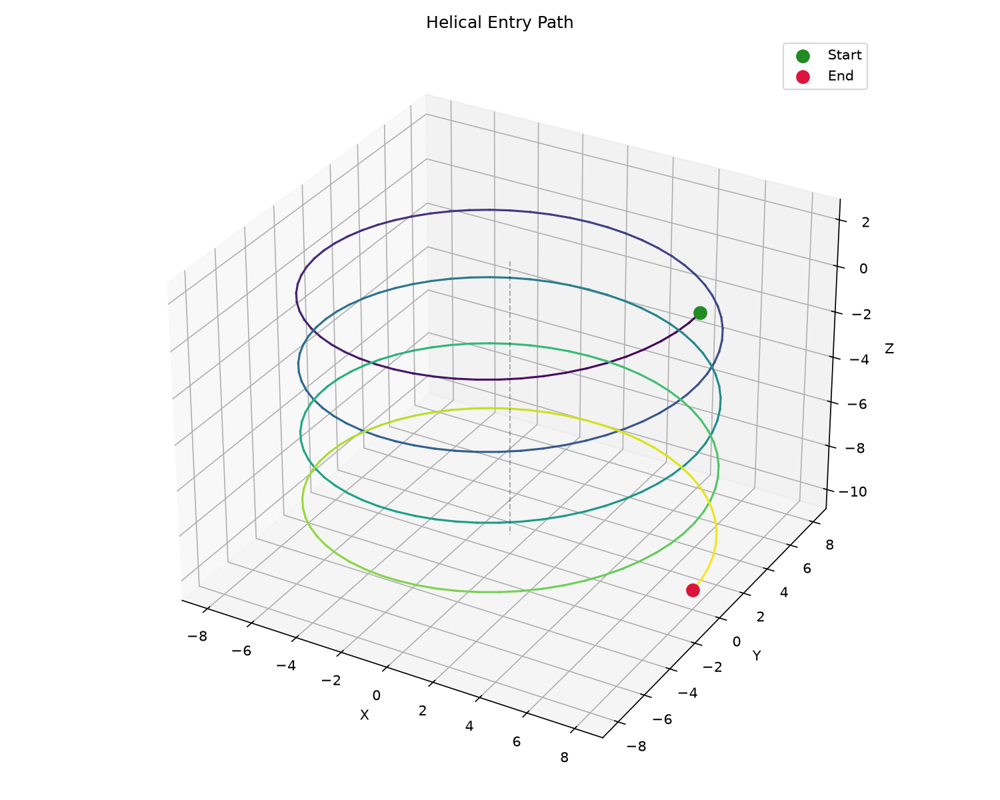

## Functions

### `generate_helix()`

```python
generate_helix(
    part: Part,
    center: tuple[float, float],
    start_radius: float,
    z_start: float,
    z_end: float,
    pitch: float,
    direction: str = 'CW',
    angular_step: float = 0.1,
    state: ops.state.State | None = None,
) -> ops.assembly.result.AssemblyResult
```

Generate a helical entry path.

Produces a helical toolpath from *z_start* to *z_end* at the given *center* and *start_radius*.

| Parameter      | Type                                 | Description                                      |
| -------------- | ------------------------------------ | ------------------------------------------------ |
| `part`         | `Part`                               |                                                  |
| `center`       | `tuple[float, float]`                | `(x, y)` center of the helix.                    |
| `start_radius` | `float`                              | Radius of the helix in mm.                       |
| `z_start`      | `float`                              | Starting Z height.                               |
| `z_end`        | `float`                              | Ending (target) Z depth.                         |
| `pitch`        | `float`                              | Vertical descent per full revolution.            |
| `direction`    | `str = 'CW'`                         | `"CW"` or `"CCW"` (default `"CW"`).              |
| `angular_step` | `float = 0.1`                        | Angular step in radians (default 0.1).           |
| `state`        | `ops.state.State &#124; None = None` | Optional machine state to apply before the path. |
| _Returns_      | `ops.assembly.result.AssemblyResult` | An **AssemblyResult** with the helical path.     |



*Helical entry path from safe Z to target depth*
