## PyWavefrontGraph

Parent tree returned by \[`split_ordered_wavefronts`\].

Nodes are individual bite polygons, identified by a *global index* computed from `bite_offsets`:

```text
global = bite_offsets[pass] + local_index_within_pass
```

Each bite has exactly one parent (the nearest previous-pass bite sharing boundary), forming a tree.
`visit_order` lists global bite indices in DFS traversal order.

### `arc_passes`

```python
arc_passes: list[int]
```

Pass index for each arc in `arcs` (same length, same order).

### `arc_segments`

```python
arc_segments: list[list[int]]
```

For each arc in `arcs`, indices into `segments`.

### `arcs`

```python
arcs: list[list[tuple[float, float]]]
```

Cutting arcs in DFS visit order.

### `bite_arcs`

```python
bite_arcs: list[list[int]]
```

Per-bite arc indices into `arcs` (DFS order): `bite_arcs[global_bite] = [arc_idx, ...]`.

### `bite_offsets`

```python
bite_offsets: list[int]
```

Pass start offsets for global↔local conversion.

### `bite_polys`

```python
bite_polys: list[list[list[tuple[float, float]]]]
```

Per-pass bite polygons: `bite_polys[pass][local]`.

### `parent`

```python
parent: list[Optional[int]]
```

`parent[global]` = parent bite index, or `None` for roots.

### `segment_directions`

```python
segment_directions: list[tuple[float, float]]
```

Outward normal (unit vector) for each segment in `segments`.

### `segments`

```python
segments: list[list[tuple[float, float]]]
```

V-junction-split sub-segments from each arc, flattened in arc order.

### `visit_order`

```python
visit_order: list[int]
```

Global bite indices in the order visited by DFS.

## Functions

### `adaptive_entry()`

```python
adaptive_entry(
    pocket_boundary: Sequence[tuple[float, float]],
    islands: Sequence[Sequence[tuple[float, float]]] = [],
    tool_radius: float = 3,
    step_over: float = 2,
    safe_z: float = 2,
    target_z: float = -5,
    plunge_pitch: float = 1,
    safe_margin: float = 1,
    angular_step: float = 0.1,
    cut_feed_rate: int = 1200,
    cut_power: float = 1,
) -> tuple[ops.Ops, list[list[tuple[float, float]]]]
```

Fast central clearing entry.

Finds the optimal entry pole using `find_largest_circle`, then generates either a helix->spiral
(wide area) or zigzag ramp (tight slot).

The returned *cleared_polygons* should be inserted into a `ClearedArea` via `add_cleared_polygons`.

| Parameter         | Type                                              | Description                                                                                                                                         |
| ----------------- | ------------------------------------------------- | --------------------------------------------------------------------------------------------------------------------------------------------------- |
| `pocket_boundary` | `Sequence[tuple[float, float]]`                   | Outer boundary of the pocket.                                                                                                                       |
| `islands`         | `Sequence[Sequence[tuple[float, float]]] = []`    | List of island (hole) polygons (default []).                                                                                                        |
| `tool_radius`     | `float = 3`                                       | Tool radius in mm (default 3.0).                                                                                                                    |
| `step_over`       | `float = 2`                                       | Radial step-over per spiral revolution (default 2.0).                                                                                               |
| `safe_z`          | `float = 2`                                       | Safe (retract) Z height (default 2.0).                                                                                                              |
| `target_z`        | `float = -5`                                      | Target cutting depth (default -5.0).                                                                                                                |
| `plunge_pitch`    | `float = 1`                                       | Vertical descent per helix revolution (default 1.0).                                                                                                |
| `safe_margin`     | `float = 1`                                       | Extra margin from tool edge to boundary (default 1.0).                                                                                              |
| `angular_step`    | `float = 0.1`                                     | Angular step in radians for path vertices (default 0.1).                                                                                            |
| `cut_feed_rate`   | `int = 1200`                                      | Feed rate for the entry path (default 1200).                                                                                                        |
| `cut_power`       | `float = 1`                                       | Laser power for the entry path (0.0-1.0, default 1.0).                                                                                              |
| _Returns_         | `tuple[ops.Ops, list[list[tuple[float, float]]]]` | `(ops, cleared_polygons)` where *ops* is an `Ops` with the entry toolpath and *cleared_polygons* is a list of polygons to add to the `ClearedArea`. |

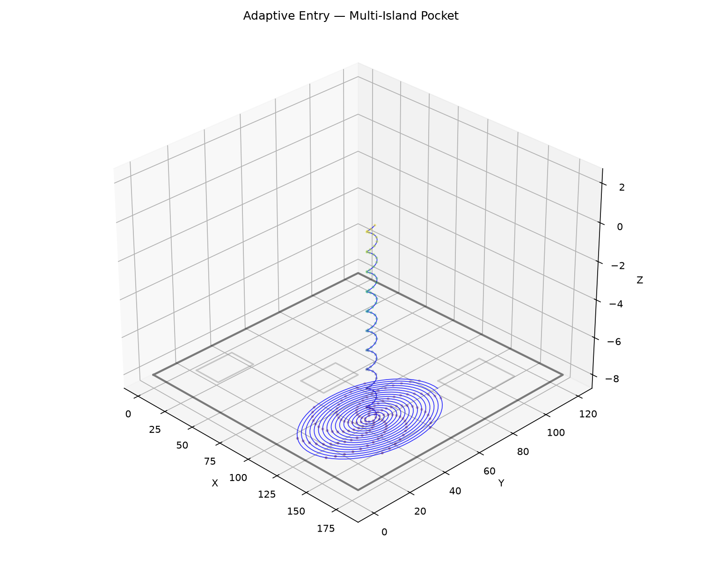

*Adaptive clearing — Helix → Spiral in a pocket with three islands*


*Adaptive clearing — Helix → Spiral in an L-shaped pocket*

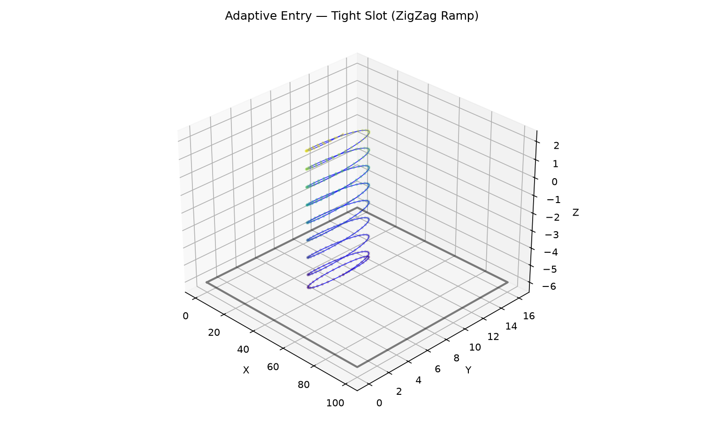

*Adaptive clearing — ZigZag Ramp in a tight slot*

### `adaptive_peeling()`

```python
adaptive_peeling(
    cleared: ops.cleared_area.ClearedArea,
    pocket_boundary: Sequence[tuple[float, float]],
    islands: Sequence[Sequence[tuple[float, float]]] = [],
    tool_radius: float = 3,
    step_over: float = 2,
    cut_z: float = -5,
    safe_z: float = 2,
    wall_margin: float = 0,
    travel_smoothing: int = 50,
    cut_feed_rate: int = 1200,
    travel_rapid_rate: int = 8000,
    cut_power: float = 1,
) -> ops.Ops
```

Run the peeling clearing strategy and return an Ops.

Generates, splits, and orders cutting arcs via a directed bite graph, then fillets and links them
into Ops with MAT-routed travel segments.

| Parameter           | Type                                           | Description                                                 |
| ------------------- | ---------------------------------------------- | ----------------------------------------------------------- |
| `cleared`           | `ops.cleared_area.ClearedArea`                 | `ClearedArea` instance (mutated in place).                  |
| `pocket_boundary`   | `Sequence[tuple[float, float]]`                | Outer boundary of the pocket.                               |
| `islands`           | `Sequence[Sequence[tuple[float, float]]] = []` | List of island (hole) polygons (default []).                |
| `tool_radius`       | `float = 3`                                    | Tool radius in mm (default 3.0).                            |
| `step_over`         | `float = 2`                                    | Radial expansion per iteration (default 2.0).               |
| `cut_z`             | `float = -5`                                   | Cutting Z height (default -5.0).                            |
| `safe_z`            | `float = 2`                                    | Retract Z height for travel segments (default 2.0).         |
| `wall_margin`       | `float = 0`                                    | Extra clearance between tool sweep and walls (default 0.0). |
| `travel_smoothing`  | `int = 50`                                     | Gaussian smoothing for MAT-routed travel (default 50).      |
| `cut_feed_rate`     | `int = 1200`                                   | Feed rate for cutting moves (default 1200).                 |
| `travel_rapid_rate` | `int = 8000`                                   | Rapid rate for travel moves (default 8000).                 |
| `cut_power`         | `float = 1`                                    | Laser power for cutting moves (0.0-1.0, default 1.0).       |
| _Returns_           | `ops.Ops`                                      | Ops with cutting and travel commands.                       |

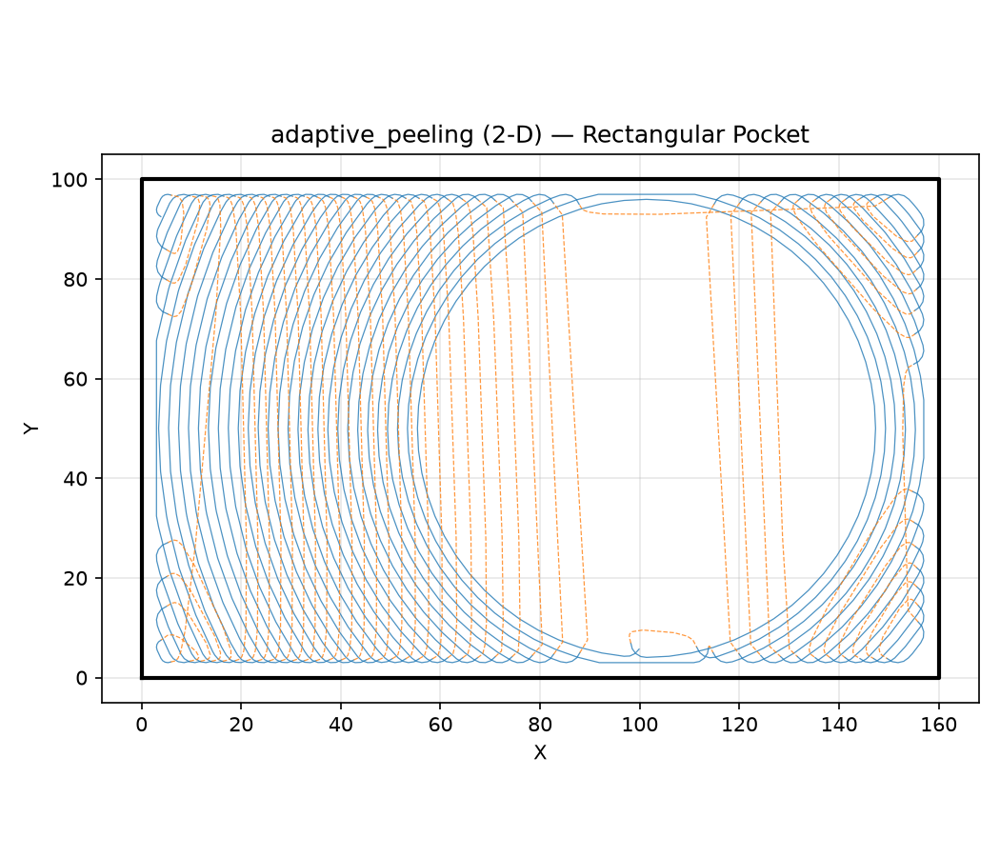

*adaptive_peeling on a rectangular pocket — cutting arcs (blue, solid) at cut depth and travel links
(orange, dashed) at safe Z*

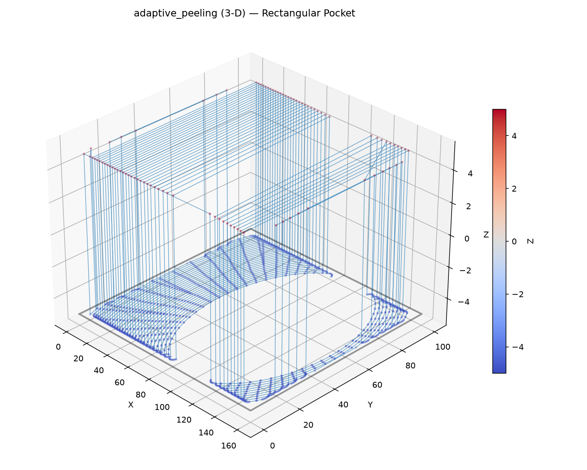

*adaptive_peeling (3-D) — Z colouring shows cutting depth (blue) vs travel height (red)*

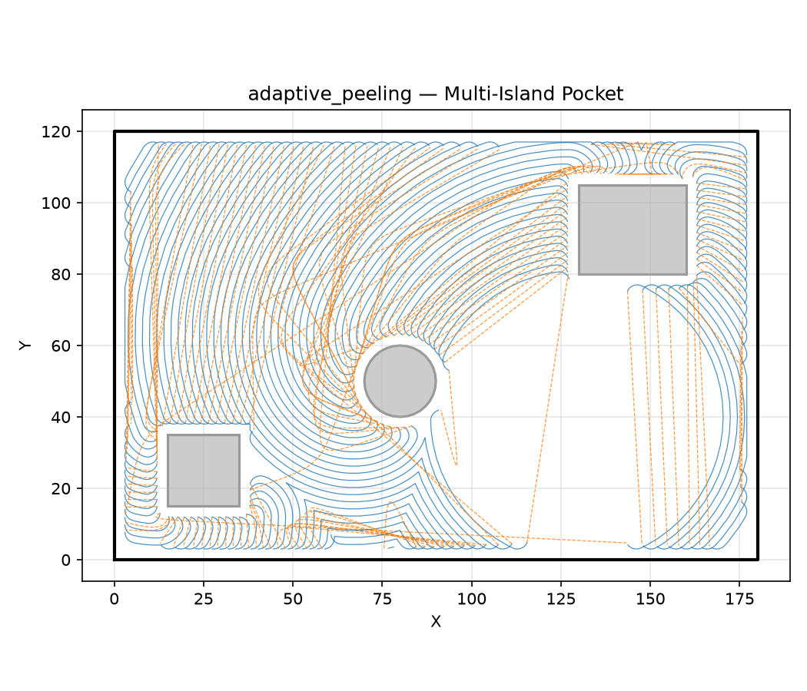

*adaptive_peeling on a three-island pocket — left: directed bite graph (green parent→child edges,
node markers at bite centroids coloured by pass, arcs in turbo); right: resulting Ops toolpath (cut
blue, travel orange dashed)*

### `adaptive_wavefronts()`

```python
adaptive_wavefronts(
    cleared: ops.cleared_area.ClearedArea,
    pocket_boundary: Sequence[tuple[float, float]],
    islands: Sequence[Sequence[tuple[float, float]]] = [],
    tool_radius: float = 3,
    step_over: float = 2,
    z: float = 0,
    area_tolerance: float = 1,
    cut_feed_rate: int = 1200,
    cut_power: float = 1,
) -> ops.Ops
```

Inside-out adaptive wavefronts.

Starting from the *cleared* state, each iteration expands the cleared boundary outward by
*step_over*, clips to the valid tool area (pocket boundary offset inward by *tool_radius*, with
islands excluded), and adds the result back to *cleared*. The loop terminates when the newly added
area drops below *area_tolerance*.

Each ring fragment is emitted as `MoveTo` + `LineTo` at height *z* with *cut_feed_rate* applied.

| Parameter         | Type                                           | Description                                           |
| ----------------- | ---------------------------------------------- | ----------------------------------------------------- |
| `cleared`         | `ops.cleared_area.ClearedArea`                 | `ClearedArea` instance (mutated in place).            |
| `pocket_boundary` | `Sequence[tuple[float, float]]`                | Outer boundary of the pocket.                         |
| `islands`         | `Sequence[Sequence[tuple[float, float]]] = []` | List of island (hole) polygons (default []).          |
| `tool_radius`     | `float = 3`                                    | Tool radius in mm (default 3.0).                      |
| `step_over`       | `float = 2`                                    | Radial expansion per iteration (default 2.0).         |
| `z`               | `float = 0`                                    | Z height for generated commands (default 0.0).        |
| `area_tolerance`  | `float = 1`                                    | Minimum area increase to continue (default 1.0).      |
| `cut_feed_rate`   | `int = 1200`                                   | Feed rate for cutting moves (default 1200).           |
| `cut_power`       | `float = 1`                                    | Laser power for cutting moves (0.0-1.0, default 1.0). |
| _Returns_         | `ops.Ops`                                      | Ops with wavefront cutting commands.                  |

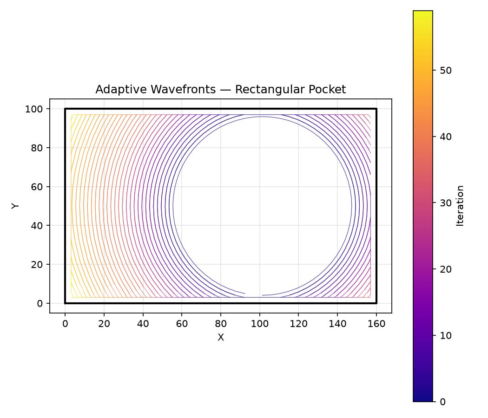

*Adaptive wavefronts expanding outward from the initial cleared disk (blue) to fill the pocket
boundary (black)*

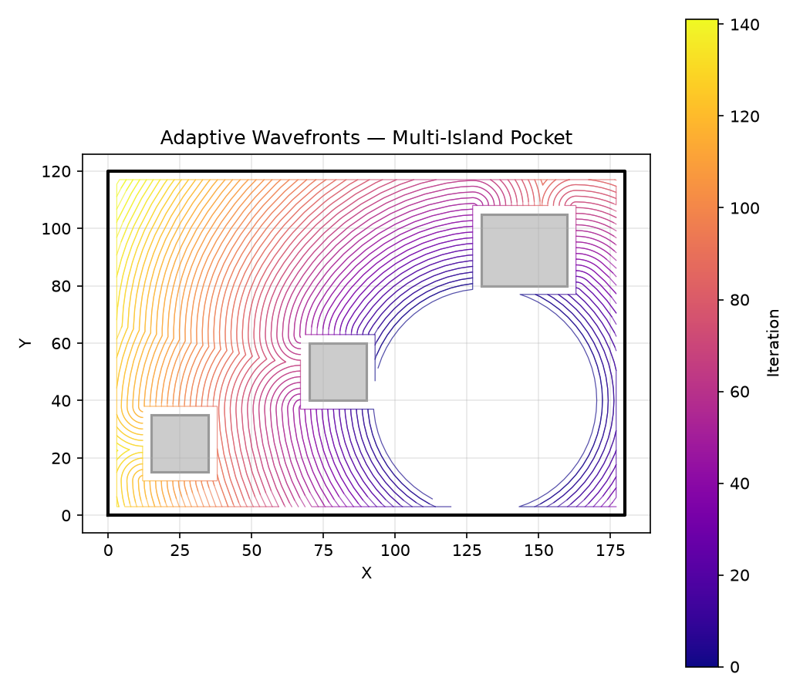

*Adaptive wavefronts in a pocket with three islands — contours wrap around each island as they
expand*

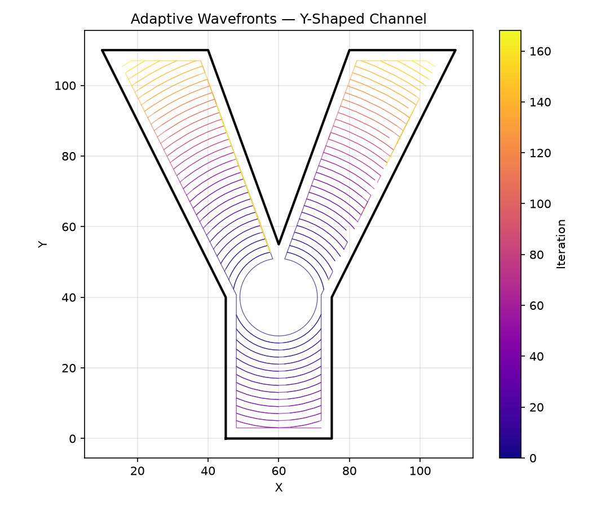

*Adaptive wavefronts in a Y-shaped channel — contours split and propagate along each branch*

### `find_cutting_arc()`

```python
find_cutting_arc(
    bite: Sequence[tuple[float, float]],
    cleared_fragments: Sequence[Sequence[tuple[float, float]]],
) -> list[tuple[float, float]] | None
```

Extract the cutting arc (outer) vertices from a bite polygon.

The cutting arc is the longest contiguous run of bite vertices that lie *outside* all cleared
fragments.

| Parameter           | Type                                      | Description                                      |
| ------------------- | ----------------------------------------- | ------------------------------------------------ |
| `bite`              | `Sequence[tuple[float, float]]`           | Bite polygon vertices.                           |
| `cleared_fragments` | `Sequence[Sequence[tuple[float, float]]]` | List of cleared-area polygons.                   |
| _Returns_           | `list[tuple[float, float]] &#124; None`   | The cutting arc polyline, or None if degenerate. |

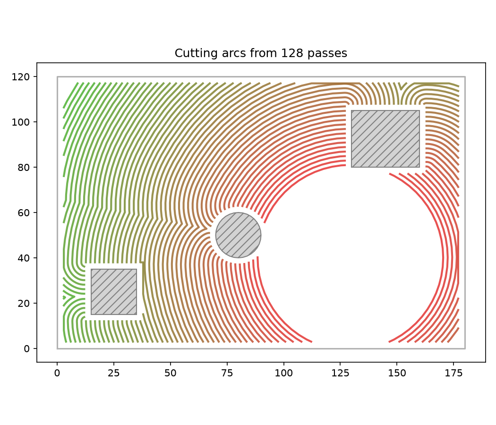

*Cutting arcs from peeling passes in a pocket with three islands — each arc is the outer edge of a
bite polygon*

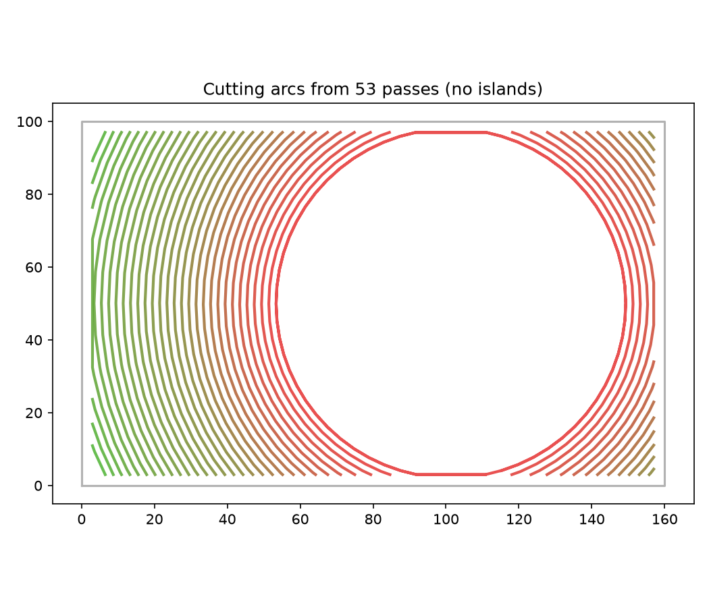

*Cutting arcs from passes without islands*

### `link_arcs_to_ops()`

```python
link_arcs_to_ops(
    arcs: Sequence[Sequence[tuple[float, float]]],
    uncleared: Sequence[Sequence[tuple[float, float]]] = [],
    cut_z: float = -1,
    safe_z: float = 5,
    mat: tuple[list[tuple[float, float]], list[tuple[int, int]]] | None = None,
    safe_margin: float = 0,
    smoothing_amount: int = 50,
    preserve_order: bool = False,
    cut_feed_rate: int = 1200,
    travel_rapid_rate: int = 8000,
    cut_power: float = 1,
    cleared: Sequence[Sequence[tuple[float, float]]] | None = None,
) -> ops.Ops
```

Link filleted arcs into an Ops with MAT-routed travel.

Consecutive arcs are joined by travel segments (MoveTo) at *safe_z*. When the direct line would
cross (or pass within *safe_margin* of) any polygon in *uncleared*, the connection uses the Medial
Axis to route around obstacles, then smoothed.

Cutting arcs are emitted as LineTo at *cut_z* with *cut_feed_rate*; travel links as MoveTo at
*safe_z* with *travel_rapid_rate*.

| Parameter           | Type                                                                         | Description                                                                                                                                                                          |
| ------------------- | ---------------------------------------------------------------------------- | ------------------------------------------------------------------------------------------------------------------------------------------------------------------------------------ |
| `arcs`              | `Sequence[Sequence[tuple[float, float]]]`                                    | Sequence of arcs (each a list of (x, y) points).                                                                                                                                     |
| `uncleared`         | `Sequence[Sequence[tuple[float, float]]] = []`                               | Areas to avoid during travel (default []).                                                                                                                                           |
| `cut_z`             | `float = -1`                                                                 | Cutting Z height (default -1.0).                                                                                                                                                     |
| `safe_z`            | `float = 5`                                                                  | Safe (rapid) Z height (default 5.0).                                                                                                                                                 |
| `mat`               | `tuple[list[tuple[float, float]], list[tuple[int, int]]] &#124; None = None` | Optional `(nodes, edges)` tuple from `compute_medial_axis` for obstacle-aware routing.                                                                                               |
| `safe_margin`       | `float = 0`                                                                  | Minimum distance from uncleared polygons for a direct travel line to be considered safe (default 0 = no margin check).                                                               |
| `smoothing_amount`  | `int = 50`                                                                   | Gaussian smoothing amount (0-200) applied to MAT-routed travel (default 50).                                                                                                         |
| `preserve_order`    | `bool = False`                                                               | Keep arc order as given instead of nearest-neighbour reordering (default False).                                                                                                     |
| `cut_feed_rate`     | `int = 1200`                                                                 | Feed rate for cutting moves (default 1200).                                                                                                                                          |
| `travel_rapid_rate` | `int = 8000`                                                                 | Rapid rate for travel moves (default 8000).                                                                                                                                          |
| `cut_power`         | `float = 1`                                                                  | Laser power for cutting moves (0.0-1.0, default 1.0).                                                                                                                                |
| `cleared`           | `Sequence[Sequence[tuple[float, float]]] &#124; None = None`                 | Cleared-area polygons. When provided the MAT is trimmed to these polygons before routing, ensuring travel only goes through already-machined territory (default None = no trimming). |
| _Returns_           | `ops.Ops`                                                                    | Ops with cutting LineTo and travel MoveTo commands.                                                                                                                                  |

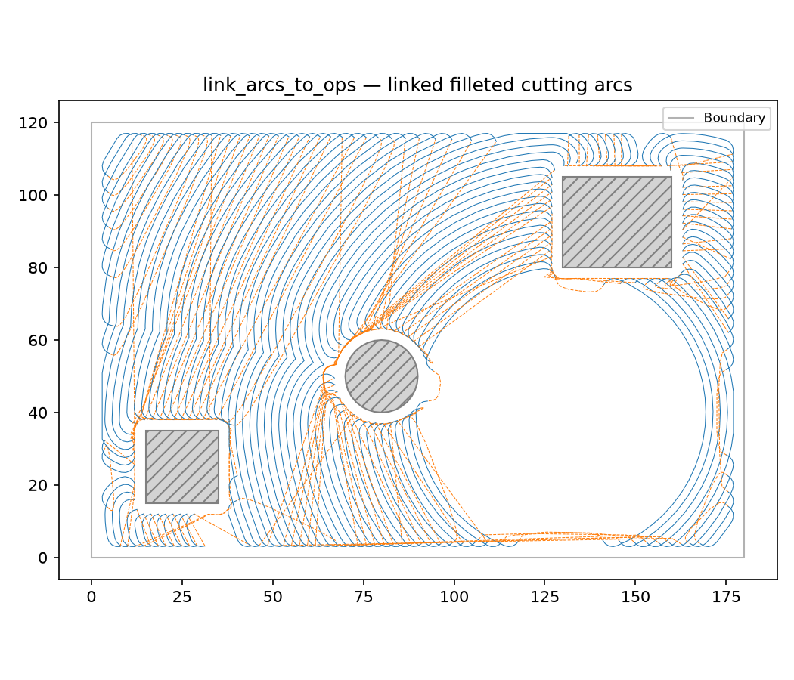

*Pre-computed filleted arcs linked into an Ops with MAT-routed travel segments*

### `split_ordered_wavefronts()`

```python
split_ordered_wavefronts(
    cleared: ops.cleared_area.ClearedArea,
    step_over: float,
    valid_area: Sequence[Sequence[tuple[float, float]]],
    simplify_tol: float,
    entry: tuple[float, float],
) -> ops.assembly.hsm.PyWavefrontGraph
```

Generate, split, and order cutting arcs in one pass.

Builds a directed bite graph during the clearing loop: each bite from pass N+1 that shares boundary
with a pass-N bite becomes its child. DFS with merge constraints produces the processing order.

| Parameter      | Type                                      | Description                                                                          |
| -------------- | ----------------------------------------- | ------------------------------------------------------------------------------------ |
| `cleared`      | `ops.cleared_area.ClearedArea`            | `ClearedArea` instance (mutated in place).                                           |
| `step_over`    | `float`                                   | Lateral step-over in mm.                                                             |
| `valid_area`   | `Sequence[Sequence[tuple[float, float]]]` | Valid tool-centre region polygons.                                                   |
| `simplify_tol` | `float`                                   | Tolerance for frontier simplification.                                               |
| `entry`        | `tuple[float, float]`                     | Entry point (cleared centroid).                                                      |
| _Returns_      | `ops.assembly.hsm.PyWavefrontGraph`       | `PyWavefrontGraph` carrying the ordered arcs and the underlying directed bite graph. |

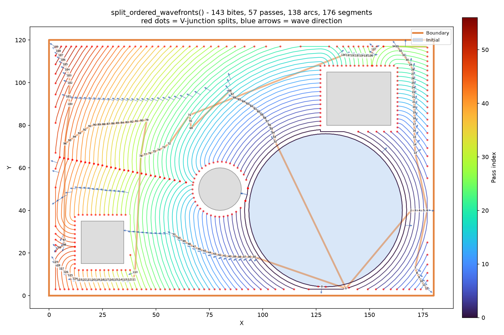

*Cutting arcs from split_ordered_wavefronts() coloured by pass (turbo), with parent→child edges
(grey arrows) and numbered labels at each arc midpoint*
