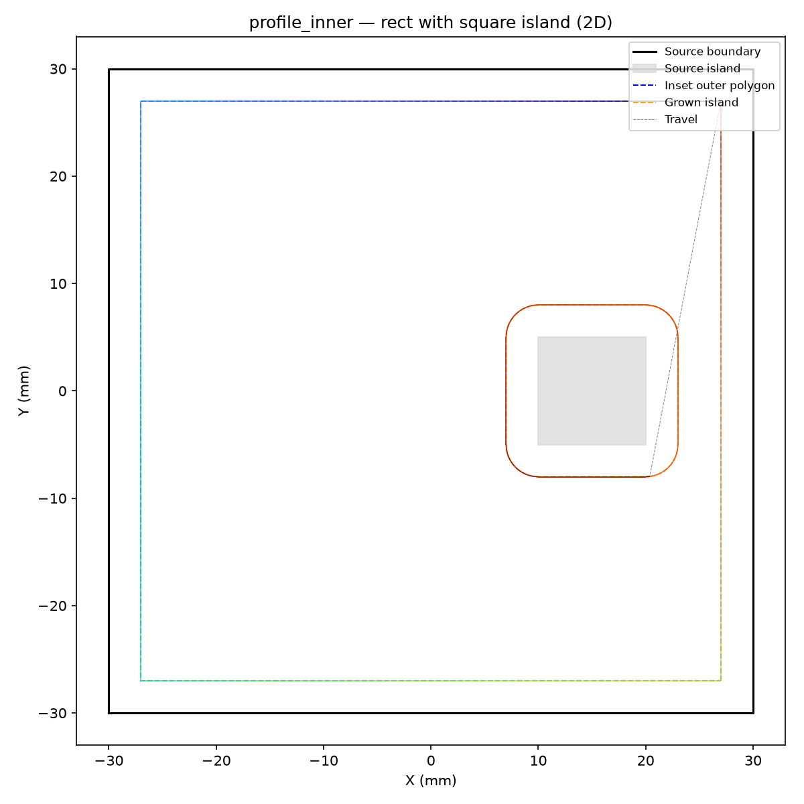
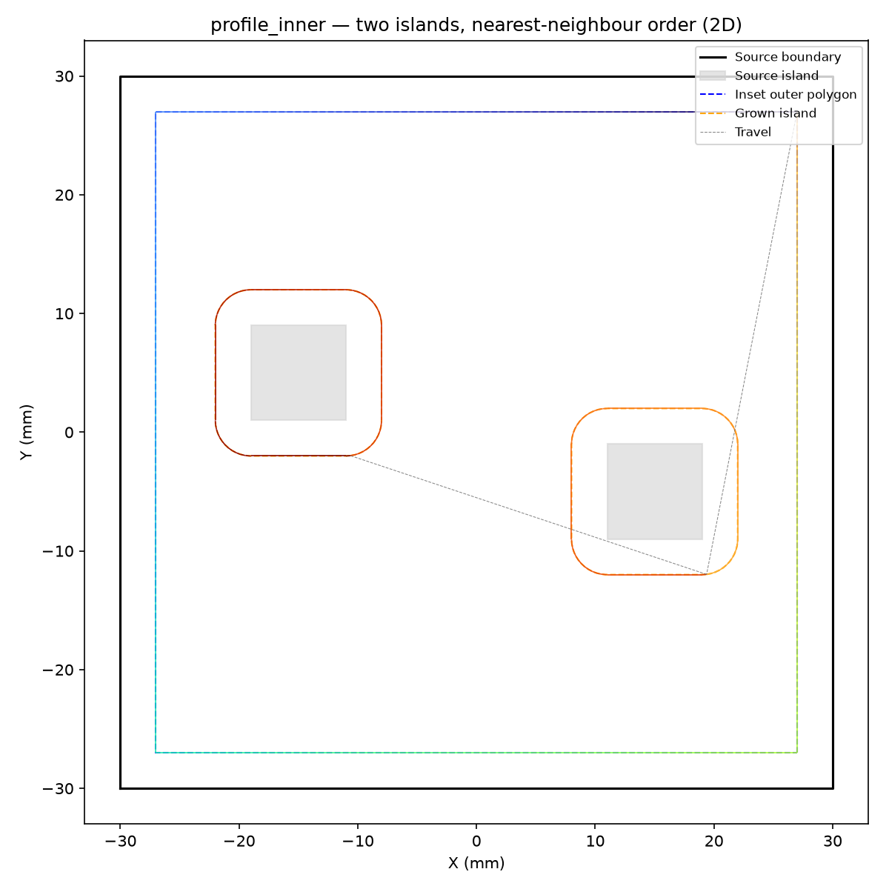
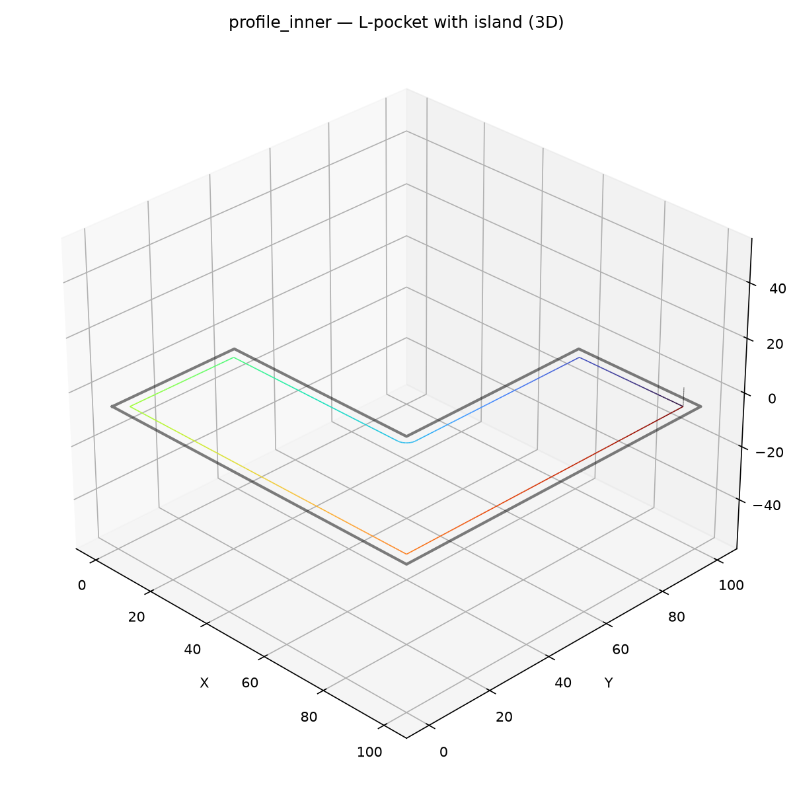
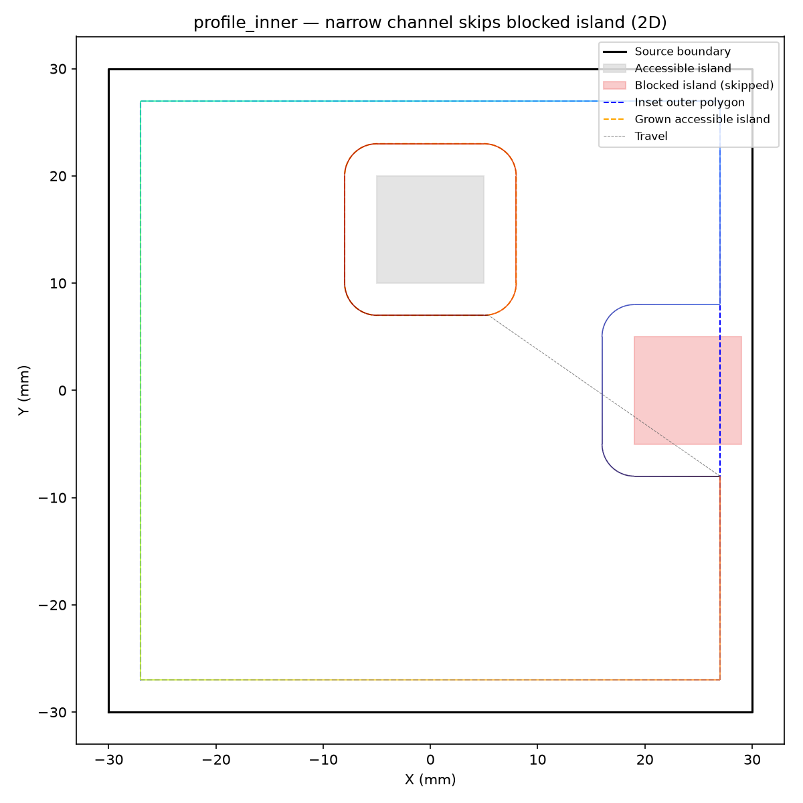
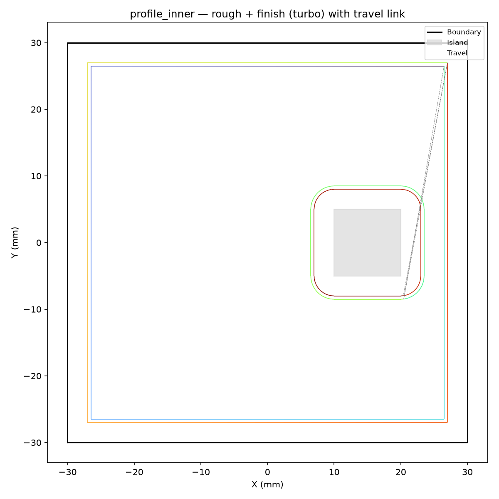
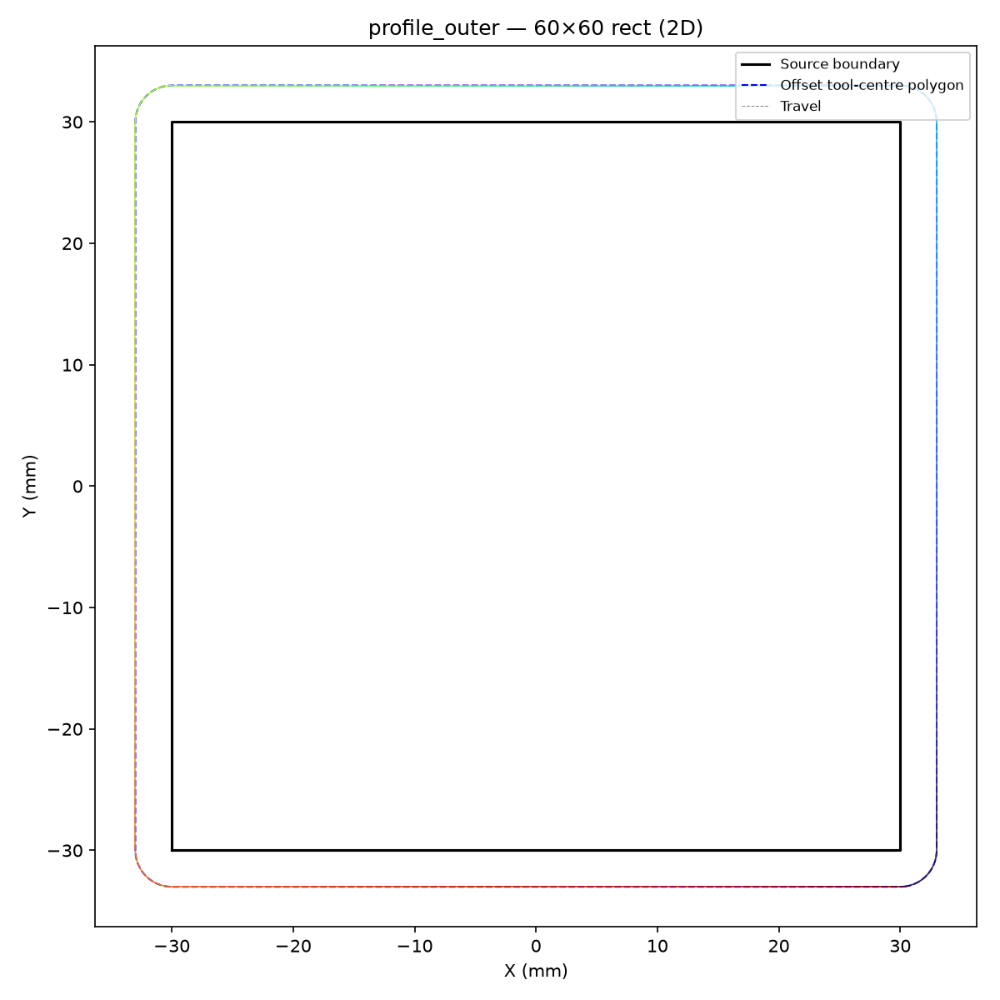
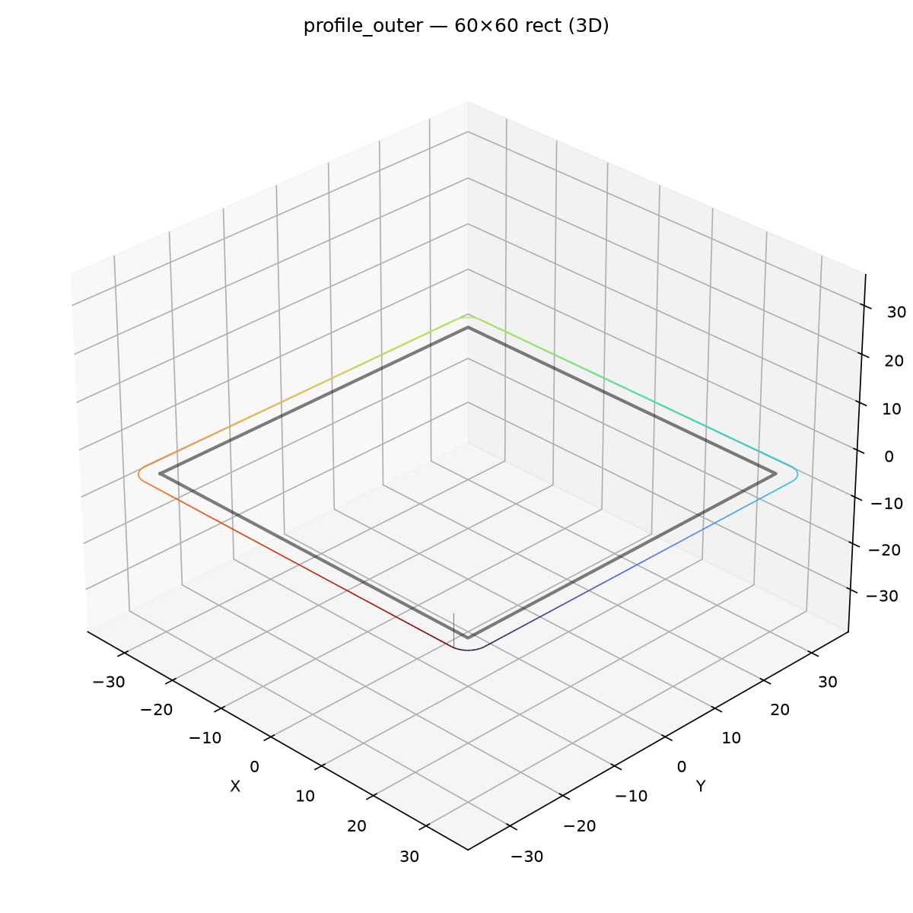
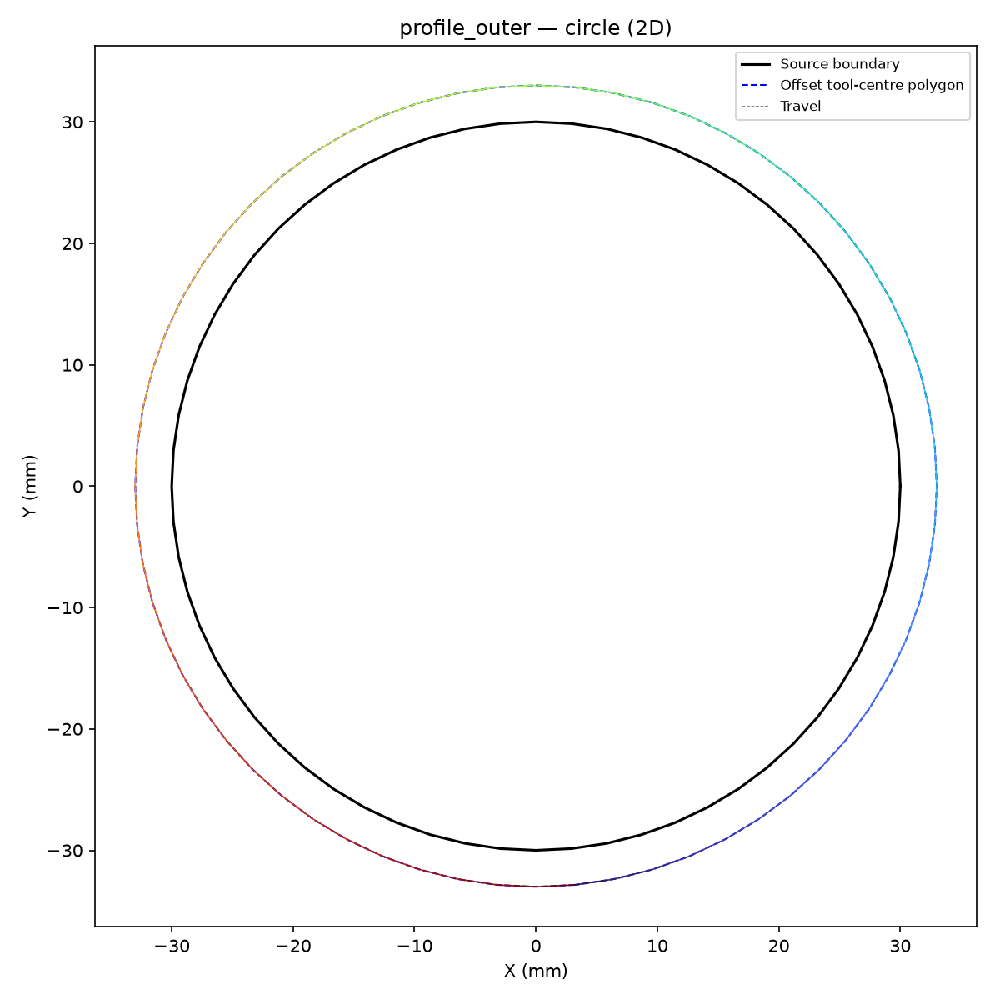
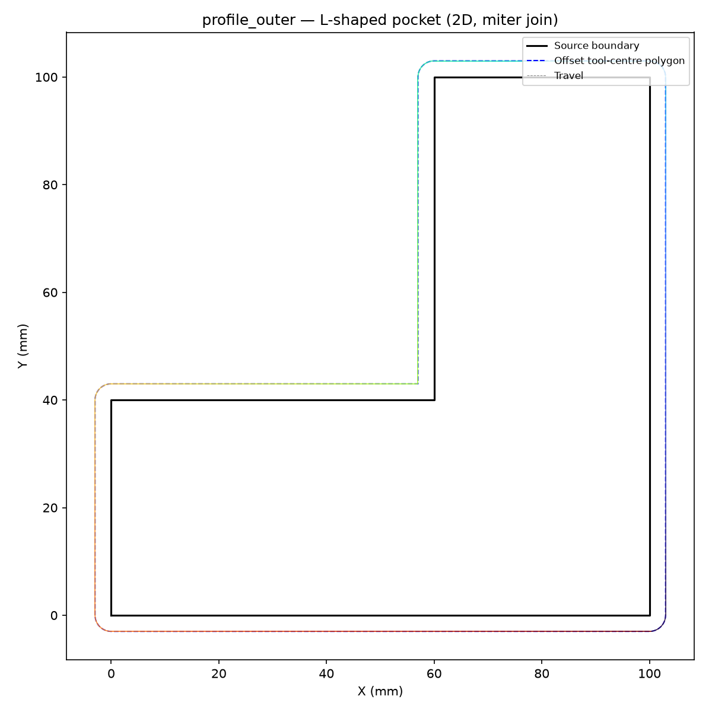
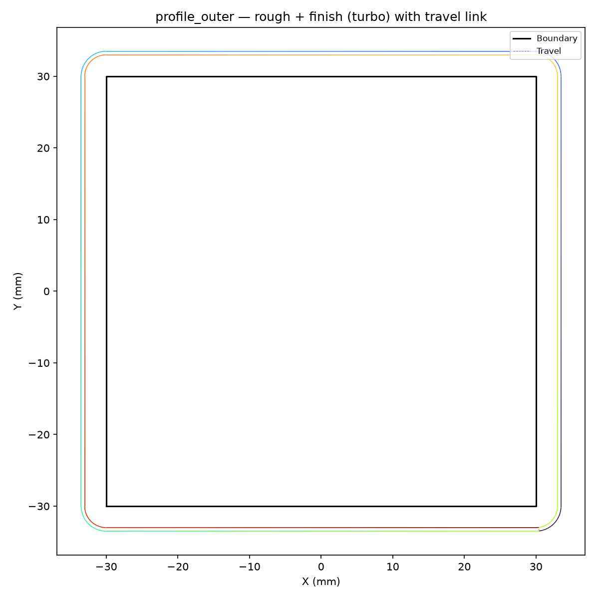

## Functions

### `profile_inner()`

```python
profile_inner(
    cleared: ops.cut.cleared_area.ClearedArea,
    boundary: list[tuple[float, float]],
    islands: list[list[tuple[float, float]]] = [],
    tool_radius: float = 3,
    step_over: float = 1.5,
    step_length: float = 0.6,
    target_z: float = -5,
    safe_z: float = 2,
    wall_margin: float = 0,
    stock_to_leave: float = 0,
    cut_feed_rate: int = 1000,
    cut_power: float = 0,
    start_pos: tuple[float, float] | None = None,
    cut_direction: str = 'ccw',
    engagement_area_threshold: float = 0,
    engagement_angle_threshold: float = 3.141592653589793,
    trace_path: str | None = None,
) -> ops.assembly.result.AssemblyResult
```

Profile the inner boundary of a pocket, around islands.

Walks a tool around the inset boundary (offset inward by tool radius) and around accessible islands,
so that the tool clears the material along the pocket walls and around each island. Returns an
**AssemblyResult** with the profiling move sequence.

| Parameter                    | Type                                     | Description                                                        |
| ---------------------------- | ---------------------------------------- | ------------------------------------------------------------------ |
| `cleared`                    | `ops.cut.cleared_area.ClearedArea`       | Cleared area tracker.                                              |
| `boundary`                   | `list[tuple[float, float]]`              | Outer boundary polygon as `(x, y)` pairs.                          |
| `islands`                    | `list[list[tuple[float, float]]] = []`   | List of island (hole) polygons (default []).                       |
| `tool_radius`                | `float = 3`                              | Tool radius in mm.                                                 |
| `step_over`                  | `float = 1.5`                            | Radial step-over between passes (mm).                              |
| `step_length`                | `float = 0.6`                            | Forward step length in mm.                                         |
| `target_z`                   | `float = -5`                             | Cutting depth (Z).                                                 |
| `safe_z`                     | `float = 2`                              | Safe (rapid) Z height.                                             |
| `wall_margin`                | `float = 0`                              | Extra distance to keep from the wall (mm).                         |
| `stock_to_leave`             | `float = 0`                              | Stock left on wall for rough pass (mm, default 0.0).               |
| `cut_feed_rate`              | `int = 1000`                             | Feed rate in mm/min.                                               |
| `cut_power`                  | `float = 0`                              | Spindle power (0.0–1.0).                                           |
| `start_pos`                  | `tuple[float, float] &#124; None = None` | Optional override start `(x, y)` (default: first boundary vertex). |
| `cut_direction`              | `str = 'ccw'`                            | `"cw"` or `"ccw"` (default `"ccw"`).                               |
| `engagement_area_threshold`  | `float = 0`                              | Overengagement area threshold (mm², 0 = auto).                     |
| `engagement_angle_threshold` | `float = 3.141592653589793`              | Overengagement angle threshold (rad, default π).                   |
| `trace_path`                 | `str &#124; None = None`                 | Optional path to write a binary trace file (default None).         |
| _Returns_                    | `ops.assembly.result.AssemblyResult`     | An **AssemblyResult** with the profiling path.                     |



*profile_inner on 60×60 pocket with square island — 2D: boundary, island, offset walks, cuts
(turbo).*



*profile_inner with two accessible islands — nearest-neighbour order via turbo gradient.*



*profile_inner on an L-shaped pocket with island — 3D: cut path at cut_z, rapids at safe_z.*



*profile_inner skips an island when channel between island and wall is < 2×tool_radius.*



*Two-pass inner profiling: rough (0.5, orange) + finish (0.0, red) on same ClearedArea.*

### `profile_outer()`

```python
profile_outer(
    cleared: ops.cut.cleared_area.ClearedArea,
    boundary: list[tuple[float, float]],
    tool_radius: float,
    step_over: float,
    step_length: float,
    target_z: float,
    safe_z: float,
    wall_margin: float,
    cut_feed_rate: int,
    cut_power: float,
    start_pos: tuple[float, float] | None = None,
    cut_direction: str = 'ccw',
    stock_to_leave: float = 0,
    engagement_area_threshold: float = 0,
    engagement_angle_threshold: float = 3.141592653589793,
    trace_path: str | None = None,
) -> ops.assembly.result.AssemblyResult
```

Profile the outer boundary of a pocket.

Walks a tool around the grown boundary (offset outward by tool radius). The path stays approximately
one tool radius outside the original boundary, removing any excess stock on the outer side. Returns
an **AssemblyResult** with the profiling move sequence.

| Parameter                    | Type                                     | Description                                                        |
| ---------------------------- | ---------------------------------------- | ------------------------------------------------------------------ |
| `cleared`                    | `ops.cut.cleared_area.ClearedArea`       | Cleared area tracker.                                              |
| `boundary`                   | `list[tuple[float, float]]`              | Outer boundary polygon as `(x, y)` pairs.                          |
| `tool_radius`                | `float`                                  | Tool radius in mm.                                                 |
| `step_over`                  | `float`                                  | Radial step-over between passes (mm).                              |
| `step_length`                | `float`                                  | Forward step length in mm.                                         |
| `target_z`                   | `float`                                  | Cutting depth (Z).                                                 |
| `safe_z`                     | `float`                                  | Safe (rapid) Z height.                                             |
| `wall_margin`                | `float`                                  | Extra distance to keep from the wall (mm).                         |
| `cut_feed_rate`              | `int`                                    | Feed rate in mm/min.                                               |
| `cut_power`                  | `float`                                  | Spindle power (0.0–1.0).                                           |
| `start_pos`                  | `tuple[float, float] &#124; None = None` | Optional override start `(x, y)` (default: first boundary vertex). |
| `cut_direction`              | `str = 'ccw'`                            | `"cw"` or `"ccw"` (default `"ccw"`).                               |
| `stock_to_leave`             | `float = 0`                              | Stock left on wall for rough pass (mm, default 0.0).               |
| `engagement_area_threshold`  | `float = 0`                              | Overengagement area threshold (mm², 0 = auto).                     |
| `engagement_angle_threshold` | `float = 3.141592653589793`              | Overengagement angle threshold (rad, default π).                   |
| `trace_path`                 | `str &#124; None = None`                 | Optional path to write a binary trace file (default None).         |
| _Returns_                    | `ops.assembly.result.AssemblyResult`     | An **AssemblyResult** with the profiling path.                     |



*profile_outer on a 60×60 rect pocket — 2D top-down: boundary, offset, cut (turbo), travel (gray).*



*profile_outer on a 60×60 rect pocket — 3D view showing cut path at cut_z and rapids at safe_z.*



*profile_outer on a circular boundary — smooth walk around the offset circle.*



*profile_outer on an L-shaped pocket with miter join at the concave corner.*



*Two-pass profiling: rough (stock_to_leave=0.5, orange) + finish (0.0, red) on the same
ClearedArea.*
