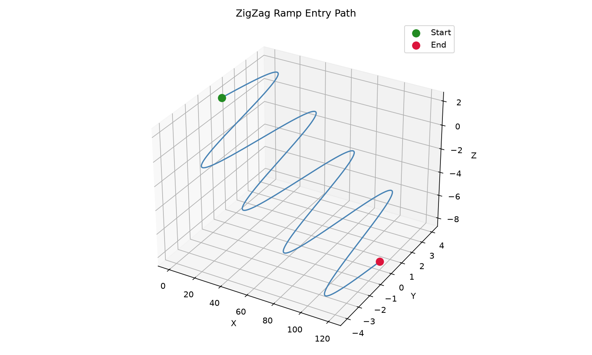

## Functions

### `generate_ramp()`

```python
generate_ramp(
    part: ops.part.Part,
    start: tuple[float, float],
    end: tuple[float, float],
    z_start: float,
    z_end: float,
    max_ramp_angle_deg: float = 45,
    style: str = 'zigzag',
    lateral_amplitude: float = 2,
    state: ops.state.State | None = None,
) -> ops.assembly.AssemblyResult
```

Generate a ramp entry path.

Produces a ramp (linear or zigzag) from *start* to *end* while descending from *z_start* to *z_end*.

| Parameter            | Type                                 | Description                                             |
| -------------------- | ------------------------------------ | ------------------------------------------------------- |
| `part`               | `ops.part.Part`                      |                                                         |
| `start`              | `tuple[float, float]`                | `(x, y)` start point.                                   |
| `end`                | `tuple[float, float]`                | `(x, y)` end point.                                     |
| `z_start`            | `float`                              | Starting Z height.                                      |
| `z_end`              | `float`                              | Ending (target) Z depth.                                |
| `max_ramp_angle_deg` | `float = 45`                         | Maximum ramp angle in degrees (default 45).             |
| `style`              | `str = 'zigzag'`                     | `"linear"` or `"zigzag"` (default `"zigzag"`).          |
| `lateral_amplitude`  | `float = 2`                          | Lateral oscillation amplitude for zigzag (default 2.0). |
| `state`              | `ops.state.State &#124; None = None` | Optional machine state to apply before the path.        |
| _Returns_            | `ops.assembly.AssemblyResult`        | An **AssemblyResult** with the ramp path.               |



*ZigZag ramp entry path from safe Z to target depth*
