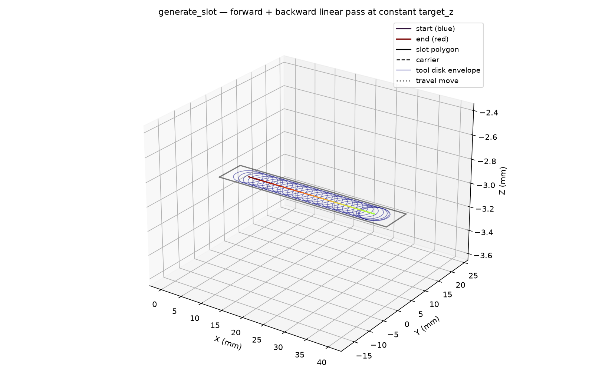

## Functions

### `generate_slot()`

```python
generate_slot(
    part: ops.part.Part,
    carrier: Sequence[tuple[float, float]],
    tool_radius: float,
    target_z: float,
    state: ops.state.State | None = None,
) -> ops.assembly.result.AssemblyResult
```

Generate a back-and-forth slot clearing path along a carrier.

Produces a forward pass then a backward pass along the carrier, both at constant *target_z*. The
cleared polygon is the carrier swept by *tool_radius* (Minkowski sum).

| Parameter     | Type                                 | Description                                      |
| ------------- | ------------------------------------ | ------------------------------------------------ |
| `part`        | `ops.part.Part`                      |                                                  |
| `carrier`     | `Sequence[tuple[float, float]]`      | `(x, y)` waypoints (currently 2-point segment).  |
| `tool_radius` | `float`                              | Tool radius in mm.                               |
| `target_z`    | `float`                              | Cutting Z height.                                |
| `state`       | `ops.state.State &#124; None = None` | Optional machine state to apply before the path. |
| _Returns_     | `ops.assembly.result.AssemblyResult` | An **AssemblyResult** with the slot path.        |



*3D forward+backward slot path through a rectangular slot at constant depth, no trochoid.*
