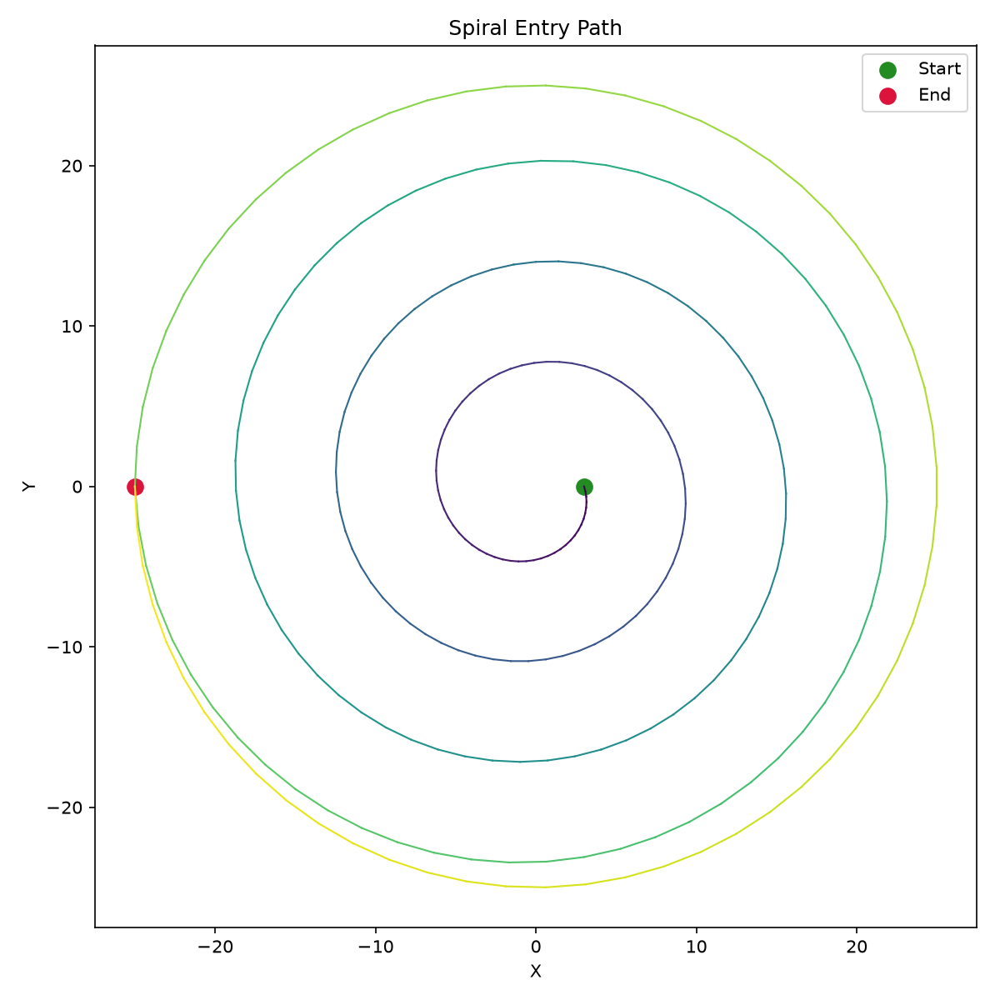

## Functions

### `generate_spiral()`

```python
generate_spiral(
    part: ops.part.Part,
    center: tuple[float, float],
    z: float,
    start_radius: float,
    end_radius: float,
    revolutions: float,
    direction: str = 'CW',
    angular_step: float = 0.1,
    start_angle: float = 0,
    state: ops.state.State | None = None,
) -> ops.assembly.result.AssemblyResult
```

Generate a flat spiral entry path.

Produces an Archimedean spiral from *start_radius* to *end_radius* at constant Z, followed by a
smoothing full-circle pass at *end_radius*.

| Parameter      | Type                                 | Description                                      |
| -------------- | ------------------------------------ | ------------------------------------------------ |
| `part`         | `ops.part.Part`                      |                                                  |
| `center`       | `tuple[float, float]`                | `(x, y)` center of the spiral.                   |
| `z`            | `float`                              | Cutting Z height.                                |
| `start_radius` | `float`                              | Starting radius in mm.                           |
| `end_radius`   | `float`                              | Ending radius in mm.                             |
| `revolutions`  | `float`                              | Number of full turns (may be fractional).        |
| `direction`    | `str = 'CW'`                         | `"CW"` or `"CCW"` (default `"CW"`).              |
| `angular_step` | `float = 0.1`                        | Angular step in radians (default 0.1).           |
| `start_angle`  | `float = 0`                          | Starting angle in radians (default 0.0).         |
| `state`        | `ops.state.State &#124; None = None` | Optional machine state to apply before the path. |
| _Returns_      | `ops.assembly.result.AssemblyResult` | An **AssemblyResult** with the spiral path.      |



*Flat Archimedean spiral with smoothing circular pass*
