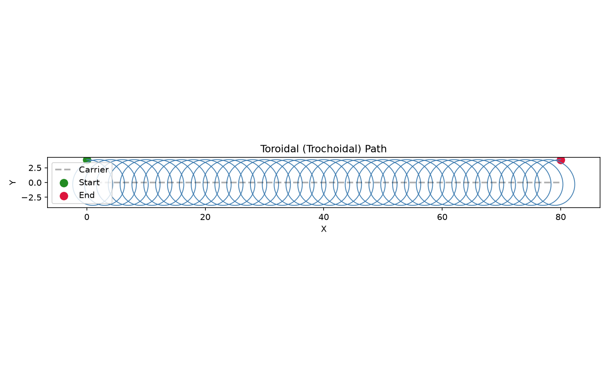

## Functions

### `generate_toroid()`

```python
generate_toroid(
    carrier: Sequence[tuple[float, float]],
    tool_radius: float,
    step_distance: float,
    z: float,
    direction: str = 'CW',
    angular_step: float = 0.1,
    state: ops.state.State | None = None,
) -> ops.assembly.result.AssemblyResult
```

Generate a toroidal (trochoidal) path along a carrier.

Produces a trochoidal looping path that follows the *carrier* polyline, clearing a slot of width
*tool_radius*.

| Parameter       | Type                                 | Description                                        |
| --------------- | ------------------------------------ | -------------------------------------------------- |
| `carrier`       | `Sequence[tuple[float, float]]`      | List of `(x, y)` waypoints defining the slot axis. |
| `tool_radius`   | `float`                              | Tool radius in mm.                                 |
| `step_distance` | `float`                              | Forward advance per trochoid loop.                 |
| `z`             | `float`                              | Cutting Z height.                                  |
| `direction`     | `str = 'CW'`                         | `"CW"` or `"CCW"` (default `"CW"`).                |
| `angular_step`  | `float = 0.1`                        | Angular step in radians (default 0.1).             |
| `state`         | `ops.state.State &#124; None = None` | Optional machine state to apply before the path.   |
| _Returns_       | `ops.assembly.result.AssemblyResult` | An **AssemblyResult** with the toroidal path.      |



*Trochoidal slot path along a carrier polyline*
