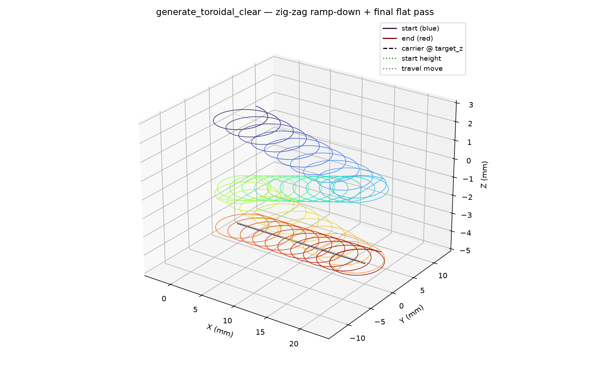

## Functions

### `generate_toroid()`

```python
generate_toroid(
    part: Part,
    carrier: Sequence[tuple[float, float]],
    tool_radius: float,
    step_over: float,
    target_z: float,
    direction: str = 'CW',
    angular_step: float = 0.1,
    state: ops.state.State | None = None,
) -> ops.assembly.result.AssemblyResult
```

Generate a toroidal (trochoidal) path along a carrier.

Produces a trochoidal looping path that follows the *carrier* polyline, clearing a slot of width
*tool_radius*.

| Parameter      | Type                                 | Description                                        |
| -------------- | ------------------------------------ | -------------------------------------------------- |
| `part`         | `Part`                               |                                                    |
| `carrier`      | `Sequence[tuple[float, float]]`      | List of `(x, y)` waypoints defining the slot axis. |
| `tool_radius`  | `float`                              | Tool radius in mm.                                 |
| `step_over`    | `float`                              | Forward advance per trochoid loop.                 |
| `target_z`     | `float`                              | Cutting Z height.                                  |
| `direction`    | `str = 'CW'`                         | `"CW"` or `"CCW"` (default `"CW"`).                |
| `angular_step` | `float = 0.1`                        | Angular step in radians (default 0.1).             |
| `state`        | `ops.state.State &#124; None = None` | Optional machine state to apply before the path.   |
| _Returns_      | `ops.assembly.result.AssemblyResult` | An **AssemblyResult** with the toroidal path.      |


*Trochoidal slot path along a carrier polyline*

### `generate_toroidal_clear()`

```python
generate_toroidal_clear(
    part: Part,
    carrier: Sequence[tuple[float, float]],
    start: tuple[float, float, float],
    target_z: float,
    tool_radius: float,
    step_over: float,
    max_ramp_angle_deg: float = 5,
    direction: str = 'CW',
    angular_step: float = 0.1,
    state: ops.state.State | None = None,
) -> ops.assembly.result.AssemblyResult
```

Generate a ramp-down toroidal clear path along a carrier.

Descends Z linearly along the carrier's arc-length at a slope capped by `max_ramp_angle_deg`,
zig-zagging back-and-forth along the carrier until `target_z` is reached, then emits one final full
forward pass at constant `target_z`.

| Parameter            | Type                                 | Description                                                                         |
| -------------------- | ------------------------------------ | ----------------------------------------------------------------------------------- |
| `part`               | `Part`                               |                                                                                     |
| `carrier`            | `Sequence[tuple[float, float]]`      | 2D polyline `(x, y)` waypoints defining the slot axis.                              |
| `start`              | `tuple[float, float, float]`         | `(x, y, z)` entry point; `x, y` should match `carrier[0]`, `z` is the entry height. |
| `target_z`           | `float`                              | Final cutting Z height.                                                             |
| `tool_radius`        | `float`                              | Tool radius in mm.                                                                  |
| `step_over`          | `float`                              | Forward advance per trochoid loop.                                                  |
| `max_ramp_angle_deg` | `float = 5`                          | Maximum descent angle vs. the XY plane (default 5°).                                |
| `direction`          | `str = 'CW'`                         | `"CW"` or `"CCW"` (default `"CW"`).                                                 |
| `angular_step`       | `float = 0.1`                        | Angular step in radians (default 0.1).                                              |
| `state`              | `ops.state.State &#124; None = None` | Optional machine state.                                                             |
| _Returns_            | `ops.assembly.result.AssemblyResult` | An **AssemblyResult** with the ramp-down + flat-final toroidal path.                |



*3D ramp-down toroidal clear zig-zagging along a short carrier with full ramp descent.*
