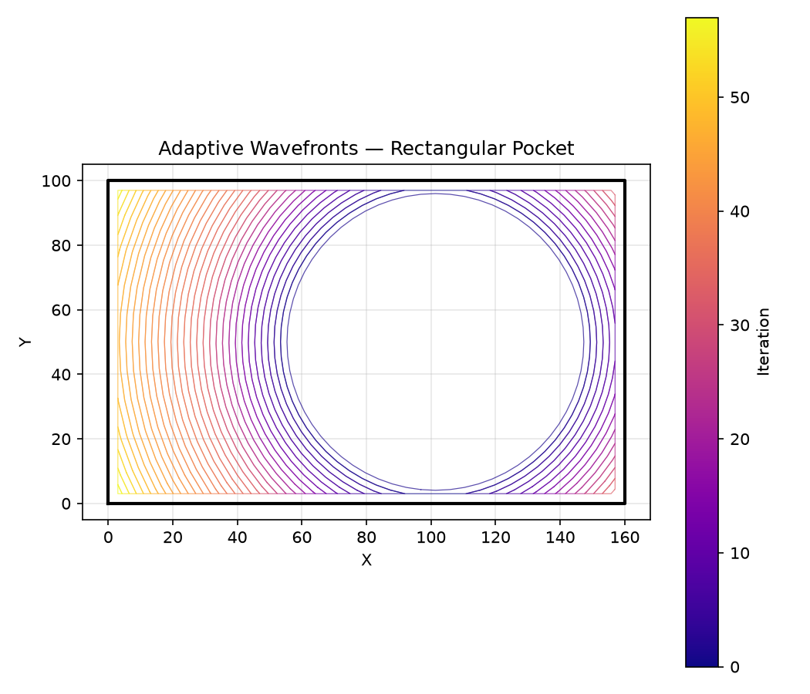
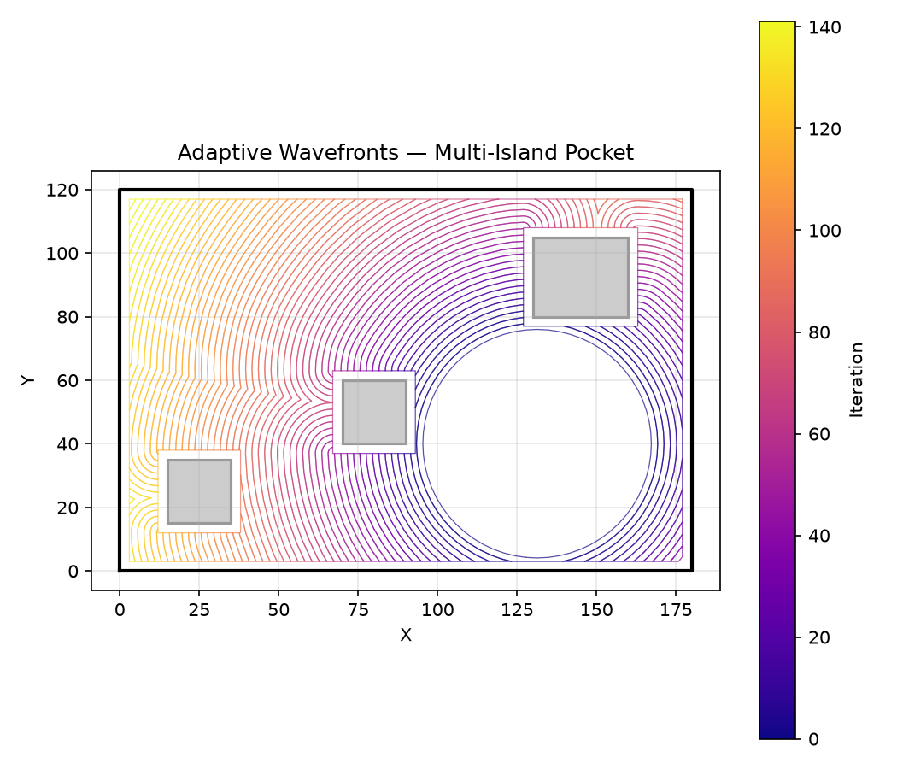
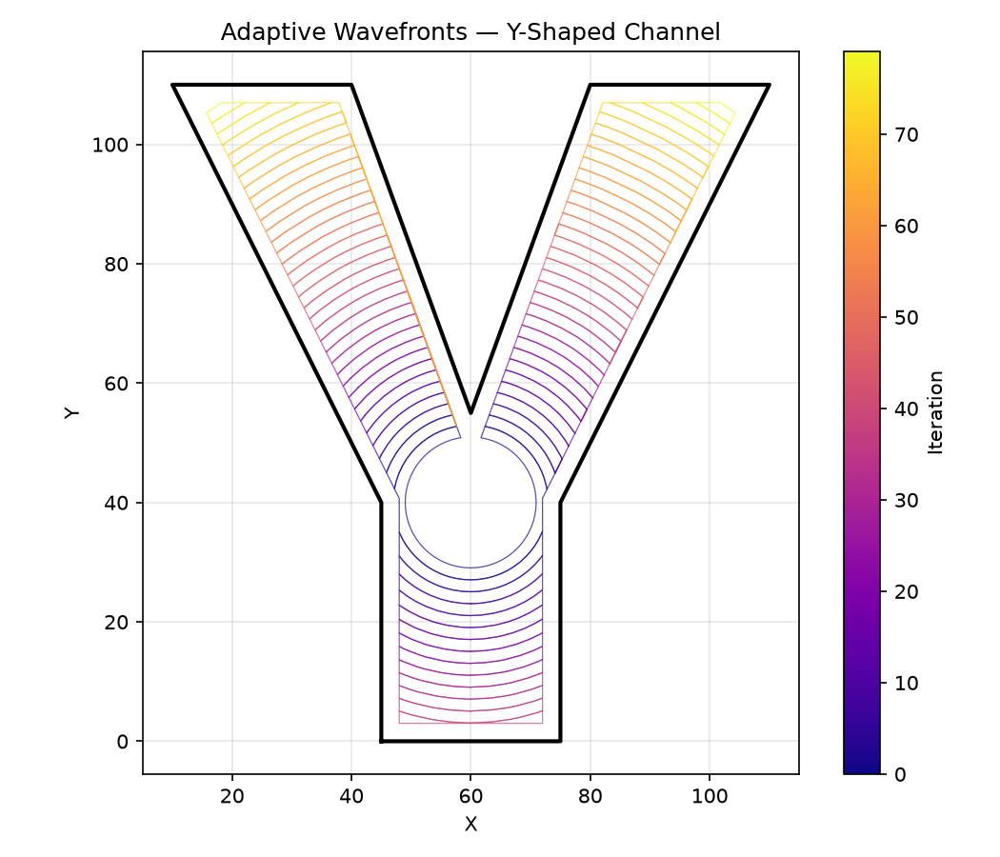
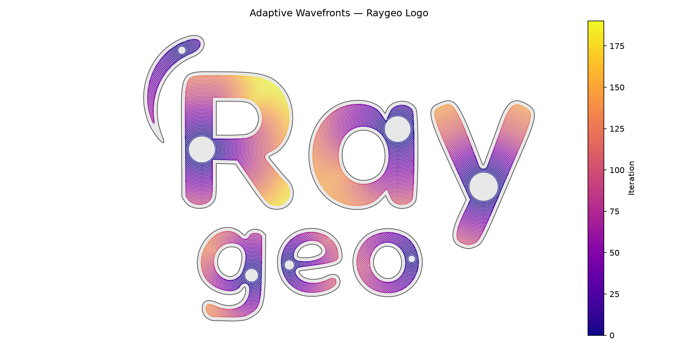

## Functions

### `adaptive_wavefronts()`

```python
adaptive_wavefronts(
    cleared: ops.area.ClearedArea,
    pocket_boundary: Sequence[tuple[float, float]],
    islands: Sequence[Sequence[tuple[float, float]]] = [],
    tool_radius: float = 3,
    step_over: float = 2,
    z: float = 0,
    area_tolerance: float = 1,
    cut_feed_rate: int = 1200,
    cut_power: float = 1,
) -> ops.Ops
```

Inside-out adaptive wavefronts.

Starting from the *cleared* state, each iteration expands the cleared boundary outward by
*step_over*, clips to the valid tool area (pocket boundary offset inward by *tool_radius*, with
islands excluded), and adds the result back to *cleared*. The loop terminates when the newly added
area drops below *area_tolerance*.

Each ring fragment is emitted as `MoveTo` + `LineTo` at height *z* with *cut_feed_rate* applied.

| Parameter         | Type                                           | Description                                           |
| ----------------- | ---------------------------------------------- | ----------------------------------------------------- |
| `cleared`         | `ops.area.ClearedArea`                         | `ClearedArea` instance (mutated in place).            |
| `pocket_boundary` | `Sequence[tuple[float, float]]`                | Outer boundary of the pocket.                         |
| `islands`         | `Sequence[Sequence[tuple[float, float]]] = []` | List of island (hole) polygons (default []).          |
| `tool_radius`     | `float = 3`                                    | Tool radius in mm (default 3.0).                      |
| `step_over`       | `float = 2`                                    | Radial expansion per iteration (default 2.0).         |
| `z`               | `float = 0`                                    | Z height for generated commands (default 0.0).        |
| `area_tolerance`  | `float = 1`                                    | Minimum area increase to continue (default 1.0).      |
| `cut_feed_rate`   | `int = 1200`                                   | Feed rate for cutting moves (default 1200).           |
| `cut_power`       | `float = 1`                                    | Laser power for cutting moves (0.0-1.0, default 1.0). |
| _Returns_         | `ops.Ops`                                      | Ops with wavefront cutting commands.                  |



*Adaptive wavefronts expanding outward from the initial cleared disk (blue) to fill the pocket
boundary (black)*



*Adaptive wavefronts in a pocket with three islands — contours wrap around each island as they
expand*



*Adaptive wavefronts in a Y-shaped channel — contours split and propagate along each branch*



*Adaptive wavefronts expanding within a complex shape loaded from an SVG file — contours adapt to
the irregular boundary and wrap around internal islands*
