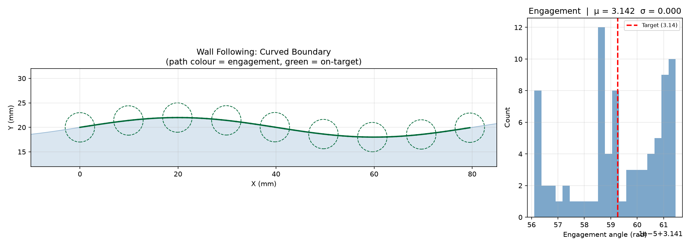

*Tool stepping parallel to a straight wall. Path colour = engagement (green = on target).*


*ClearedArea tracking a simulated raster toolpath — cleared fragments shown in blue, remaining area
in red* Incremental cleared-area tracker.

Maintains a union of swept-disk polygons and provides a spatial-indexed windowed query for efficient
engagement computation.

## ClearedArea

### `add_cleared_polygons()`

```python
add_cleared_polygons(polygons: Sequence[Sequence[tuple[float, float]]]) -> None
```

Add pre‑computed polygons to the cleared set.

| Parameter    | Type                                      | Description                                                 |
| ------------ | ----------------------------------------- | ----------------------------------------------------------- |
| `polygons`   | `Sequence[Sequence[tuple[float, float]]]` | List of polygons (each a list of `(x, y)` vertices) to add. |
| _Returns_    | `None`                                    |                                                             |
| _Complexity_ |                                           | O(n) where n = total vertices across all polygons           |


*ClearedArea with bulk polygon insertion via `add_cleared_polygons` — cleared region in blue,
remaining area in red*

### `all_bites()`

```python
all_bites(
    step_over: float,
    valid_area: Sequence[Sequence[tuple[float, float]]],
    simplify_tol: float,
) -> list[list[list[tuple[float, float]]]]
```

Iteratively call **bites** + **incorporate** until the valid area is fully cleared.

Returns all passes, each pass being a list of bite polygons. The cleared area is fully cleared after
this call.

| Parameter      | Type                                      | Description                                              |
| -------------- | ----------------------------------------- | -------------------------------------------------------- |
| `step_over`    | `float`                                   | Lateral step-over in mm.                                 |
| `valid_area`   | `Sequence[Sequence[tuple[float, float]]]` | List of polygons defining the valid tool-centre region.  |
| `simplify_tol` | `float`                                   | Tolerance in mm for frontier simplification.             |
| _Returns_      | `list[list[list[tuple[float, float]]]]`   | List of passes, each pass being a list of bite polygons. |
| _Complexity_   |                                           | O(k n log n) where k = number of passes                  |

### `begin_step_batch()`

```python
begin_step_batch() -> None
```

Begin buffering single‑segment expansions.

Subsequent calls to `expand_step_batched` are queued without a union. Call `commit_step_batch` to
union all queued sweeps with the stored fragments in a single pass.

Calling this while a batch is already active is a no‑op.

| Parameter | Type   | Description |
| --------- | ------ | ----------- |
| _Returns_ | `None` |             |

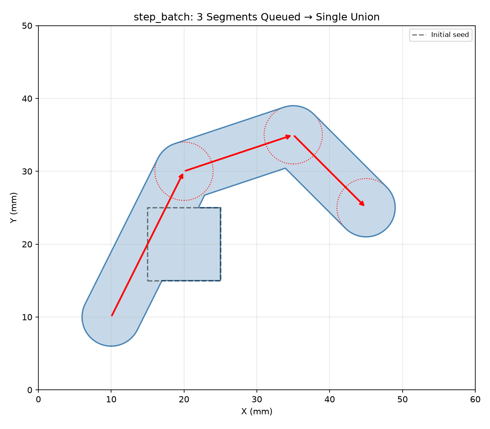

*Three segments queued via `begin_step_batch` / `expand_step_batched` then unioned in a single
`commit_step_batch` pass.*

### `bite_in_direction()`

```python
bite_in_direction(
    step_over: float,
    valid_area: Sequence[Sequence[tuple[float, float]]],
    simplify_tol: float,
    target: tuple[float, float],
    max_angle: float,
) -> list[list[tuple[float, float]]]
```

Like **bites** but filters to only the bites whose centroid lies within *max_angle* radians of the
direction from the current cleared region's centre toward *target*. useful for steering the clearing
direction along a MAT branch.

| Parameter      | Type                                      | Description                                              |
| -------------- | ----------------------------------------- | -------------------------------------------------------- |
| `step_over`    | `float`                                   | Lateral step-over in mm.                                 |
| `valid_area`   | `Sequence[Sequence[tuple[float, float]]]` | List of polygons defining the valid tool-centre region.  |
| `simplify_tol` | `float`                                   | Tolerance in mm for frontier simplification.             |
| `target`       | `tuple[float, float]`                     | `(x, y)` target point to steer toward.                   |
| `max_angle`    | `float`                                   | Maximum deviation from the target direction (radians).   |
| _Returns_      | `list[list[tuple[float, float]]]`         | List of polygons representing the filtered bite regions. |
| _Complexity_   |                                           | O(n log n)                                               |

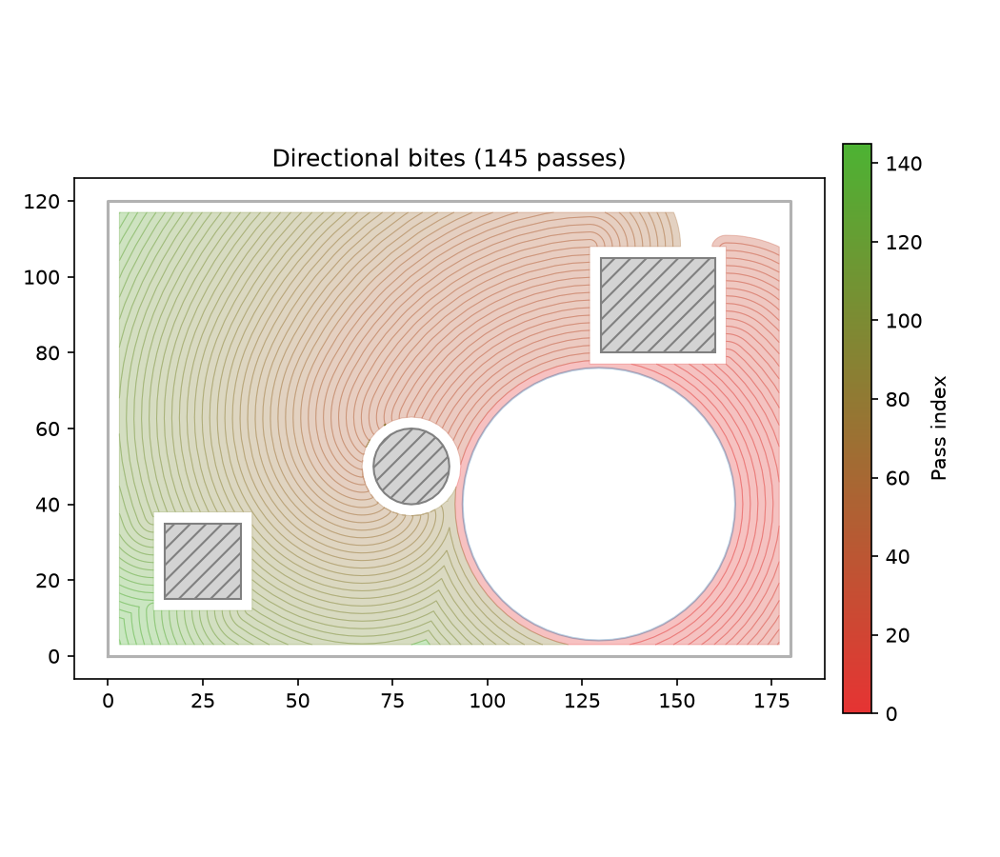

*Directional bites coloured by pass order (first = dark, later = pale)*

### `bites()`

```python
bites(
    step_over: float,
    valid_area: Sequence[Sequence[tuple[float, float]]],
    simplify_tol: float,
) -> list[list[tuple[float, float]]]
```

Compute the "bites" — new material reachable by expanding the current frontier outward by step_over,
clipping to valid_area, and subtracting already-cleared portions.

| Parameter      | Type                                      | Description                                             |
| -------------- | ----------------------------------------- | ------------------------------------------------------- |
| `step_over`    | `float`                                   | Lateral step-over in mm.                                |
| `valid_area`   | `Sequence[Sequence[tuple[float, float]]]` | List of polygons defining the valid tool-centre region. |
| `simplify_tol` | `float`                                   | Tolerance in mm for frontier simplification.            |
| _Returns_      | `list[list[tuple[float, float]]]`         | List of polygons representing the bite regions.         |
| _Complexity_   |                                           | O(n log n)                                              |

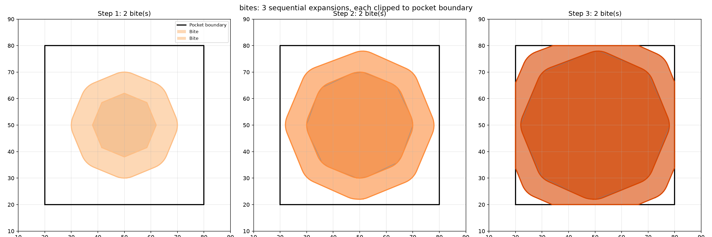

*`bites` computes the expansible material — the crescent-shaped regions of uncut material reachable
by expanding the frontier by `step_over`.*

### `commit_step_batch()`

```python
commit_step_batch() -> None
```

Union all buffered sweeps with stored fragments in a single pass, then rebuild the spatial grid.

After this call the batch is closed (the caller may start a new one).

| Parameter | Type   | Description |
| --------- | ------ | ----------- |
| _Returns_ | `None` |             |

### `compact_if_needed()`

```python
compact_if_needed(tol: float) -> None
```

Compact fragments if total vertex count exceeds the default threshold.

| Parameter | Type    | Description                            |
| --------- | ------- | -------------------------------------- |
| `tol`     | `float` | Vertex simplification tolerance in mm. |
| _Returns_ | `None`  |                                        |

### `compact_if_needed_threshold()`

```python
compact_if_needed_threshold(tol: float, threshold: int) -> None
```

Compact with an explicit vertex-count threshold.

| Parameter   | Type    | Description                                                 |
| ----------- | ------- | ----------------------------------------------------------- |
| `tol`       | `float` | Vertex simplification tolerance in mm.                      |
| `threshold` | `int`   | Vertex count threshold above which compaction is triggered. |
| _Returns_   | `None`  |                                                             |

### `expand()`

```python
expand(path: Sequence[tuple[float, float]], radius: float) -> None
```

Sweep a disk along a polyline, adding the swept area to the cleared set.

| Parameter    | Type                            | Description                                   |
| ------------ | ------------------------------- | --------------------------------------------- |
| `path`       | `Sequence[tuple[float, float]]` | List of `(x, y)` points forming the polyline. |
| `radius`     | `float`                         | Disk radius (mm).                             |
| _Returns_    | `None`                          |                                               |
| _Complexity_ |                                 | O(n) where n = number of path points          |

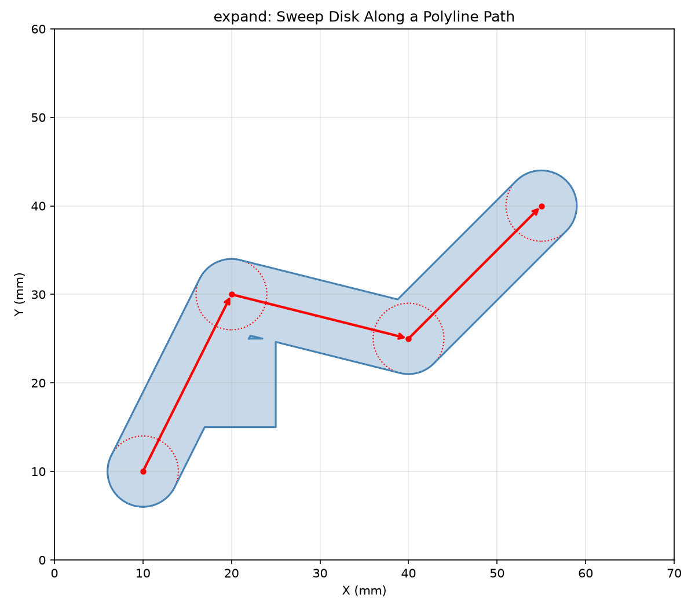

*`expand`: sweeping a disk along a multi-segment path enlarges the cleared area.*

### `expand_step()`

```python
expand_step(
    prev: tuple[float, float],
    next: tuple[float, float],
    radius: float,
) -> None
```

Expand the cleared area by sweeping a disk of *radius* along a single segment from *prev* to *next*.

| Parameter | Type                  | Description                          |
| --------- | --------------------- | ------------------------------------ |
| `prev`    | `tuple[float, float]` | Start point `(x, y)` of the segment. |
| `next`    | `tuple[float, float]` | End point `(x, y)` of the segment.   |
| `radius`  | `float`               | Disk radius (mm).                    |
| _Returns_ | `None`                |                                      |


*`expand_step`: sweeping a disk (dashed circle) of radius *radius* from *prev* to *next* (red arrow)
enlarges the cleared area (right) vs the initial state (left).*

### `expand_step_batched()`

```python
expand_step_batched(
    prev: tuple[float, float],
    next: tuple[float, float],
    radius: float,
) -> None
```

Queue a single‑segment expansion into the current batch.

The segment swept polygon is stored in the internal buffer. Does **not** perform a union until
`commit_step_batch` is called.

.. warning::

```
Panics if `begin_step_batch` was not called first.
```

| Parameter | Type                  | Description                          |
| --------- | --------------------- | ------------------------------------ |
| `prev`    | `tuple[float, float]` | Start point `(x, y)` of the segment. |
| `next`    | `tuple[float, float]` | End point `(x, y)` of the segment.   |
| `radius`  | `float`               | Disk radius (mm).                    |
| _Returns_ | `None`                |                                      |

### `expand_step_local()`

```python
expand_step_local(
    prev: tuple[float, float],
    next: tuple[float, float],
    radius: float,
) -> None
```

Single-step local expansion (only updates fragments whose bbox overlaps the segment).

| Parameter | Type                  | Description                          |
| --------- | --------------------- | ------------------------------------ |
| `prev`    | `tuple[float, float]` | Start point `(x, y)` of the segment. |
| `next`    | `tuple[float, float]` | End point `(x, y)` of the segment.   |
| `radius`  | `float`               | Disk radius (mm).                    |
| _Returns_ | `None`                |                                      |

### `find_next_resume()`

```python
find_next_resume(
    mat: medial_axis.MedialAxis,
    end_pos: tuple[float, float],
    radius: float,
    min_engagement: float,
) -> Optional[ResumePoint]
```

Walk the cleared-area frontier forward from a point near `end_pos` and return the first position
where engagement ≥ `min_engagement`.

| Parameter        | Type                     | Description                                          |
| ---------------- | ------------------------ | ---------------------------------------------------- |
| `mat`            | `medial_axis.MedialAxis` | Medial Axis of the domain (computed once per level). |
| `end_pos`        | `tuple[float, float]`    | Current position where the path ended.               |
| `radius`         | `float`                  | Disk radius (mm).                                    |
| `min_engagement` | `float`                  | Minimum engagement angle (radians) required.         |
| _Returns_        | `Optional[ResumePoint]`  | `ResumePoint` or `None`.                             |

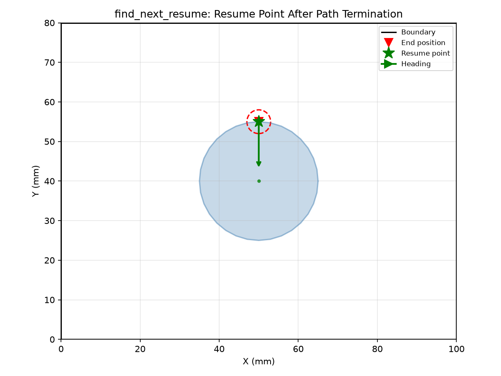

*`find_next_resume` walks the cleared-area frontier from the end position (red triangle) and returns
the first position with sufficient engagement (green star).*

### `fragments()`

```python
fragments() -> list[list[tuple[float, float]]]
```

Return the union of all polygons currently tracked as cleared.

Each fragment is a closed polygon (list of `(x, y)` vertices) representing an area that has already
been cut. The fragment set grows as `incorporate` or `add_cleared_polygons` are called.

This is useful for inspecting which areas have been cleared.

| Parameter    | Type                              | Description                                          |
| ------------ | --------------------------------- | ---------------------------------------------------- |
| _Returns_    | `list[list[tuple[float, float]]]` | List of polygons representing the cleared fragments. |
| _Complexity_ |                                   | O(m) where m = number of fragments                   |

### `frontier()`

```python
frontier(simplify_tol: float) -> list[list[tuple[float, float]]]
```

Return a unioned, simplified snapshot of the current outer boundary.

| Parameter      | Type                              | Description                                       |
| -------------- | --------------------------------- | ------------------------------------------------- |
| `simplify_tol` | `float`                           | Tolerance in mm for polyline simplification.      |
| _Returns_      | `list[list[tuple[float, float]]]` | List of polygons representing the outer boundary. |
| _Complexity_   |                                   | O(n log n)                                        |

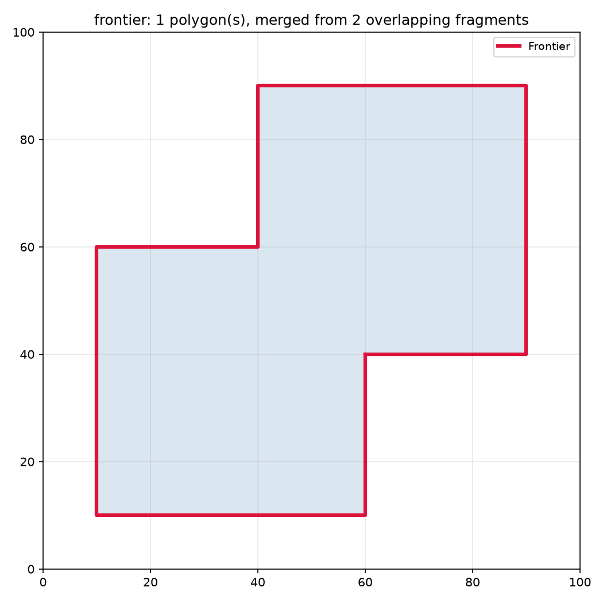

*`frontier` returns the outer boundary of the cleared area after merging overlapping fragments —
shown in crimson.*

### `incorporate()`

```python
incorporate(
    polygons: Sequence[Sequence[tuple[float, float]]],
) -> list[list[tuple[float, float]]]
```

Add polygons, returning only the newly-added portion. Faster than `add_cleared_polygons` when inputs
don't overlap existing fragments (skips the full union).

```
         O(n) when inputs are disjoint from existing fragments
```

| Parameter    | Type                                      | Description                                            |
| ------------ | ----------------------------------------- | ------------------------------------------------------ |
| `polygons`   | `Sequence[Sequence[tuple[float, float]]]` | List of polygons to add.                               |
| _Returns_    | `list[list[tuple[float, float]]]`         | List of polygons representing the newly-added portion. |
| _Complexity_ |                                           | O(n log n) worst case when union required,             |


*`incorporate` adds polygons to the cleared state while returning only the newly-covered region
(shown in green).*

### `incorporate_local()`

```python
incorporate_local(
    polys: Sequence[Sequence[tuple[float, float]]],
) -> list[list[tuple[float, float]]]
```

Local version of incorporate.

| Parameter | Type                                      | Description                                            |
| --------- | ----------------------------------------- | ------------------------------------------------------ |
| `polys`   | `Sequence[Sequence[tuple[float, float]]]` | List of polygons to add.                               |
| _Returns_ | `list[list[tuple[float, float]]]`         | List of polygons representing the newly-added portion. |

### `is_empty()`

```python
is_empty() -> bool
```

True when no fragments have been recorded.

| Parameter | Type   | Description                                |
| --------- | ------ | ------------------------------------------ |
| _Returns_ | `bool` | `True` if no fragments have been recorded. |

### `path_engagement()`

```python
path_engagement(
    path: Sequence[tuple[float, float]],
    radius: float,
) -> list[tuple[float, float, float]]
```

Evaluate engagement along a polyline.

| Parameter | Type                               | Description                                  |
| --------- | ---------------------------------- | -------------------------------------------- |
| `path`    | `Sequence[tuple[float, float]]`    | List of `(x, y)` points.                     |
| `radius`  | `float`                            | Disk radius (mm).                            |
| _Returns_ | `list[tuple[float, float, float]]` | List of `(angle, area, chord_depth)` tuples. |

### `point_engagement()`

```python
point_engagement(
    center: tuple[float, float],
    radius: float,
) -> tuple[float, float, float]
```

Evaluate engagement at a point using the signed distance to this cleared area's boundary.

| Parameter | Type                         | Description                       |
| --------- | ---------------------------- | --------------------------------- |
| `center`  | `tuple[float, float]`        | Query point `(x, y)`.             |
| `radius`  | `float`                      | Disk radius (mm).                 |
| _Returns_ | `tuple[float, float, float]` | `(angle_rad, area, chord_depth)`. |

### `query_window()`

```python
query_window(
    bbox: tuple[float, float, float, float],
) -> list[list[tuple[float, float]]]
```

Return fragments whose bounding box overlaps the query window.

| Parameter    | Type                                | Description                                                 |
| ------------ | ----------------------------------- | ----------------------------------------------------------- |
| `bbox`       | `tuple[float, float, float, float]` | Bounding box `(x_min, y_min, x_max, y_max)`.                |
| _Returns_    | `list[list[tuple[float, float]]]`   | Fragments intersecting the bounding box.                    |
| _Complexity_ |                                     | O(m + k) where m = number of fragments, k = output vertices |

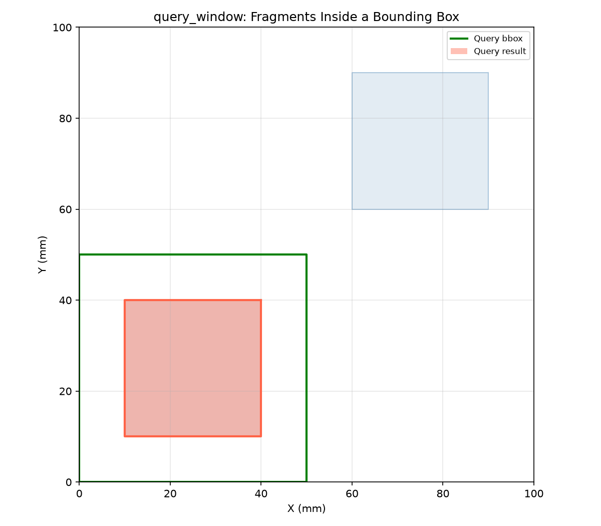

*`query_window` returns only the cleared fragments whose bounding box overlaps the query (green
box).*

### `remaining()`

```python
remaining(
    bounds: Sequence[Sequence[tuple[float, float]]],
) -> list[list[tuple[float, float]]]
```

Subtract cleared fragments from the boundary polygons, returning the uncut region.

| Parameter    | Type                                      | Description                                        |
| ------------ | ----------------------------------------- | -------------------------------------------------- |
| `bounds`     | `Sequence[Sequence[tuple[float, float]]]` | Boundary polygons defining the region of interest. |
| _Returns_    | `list[list[tuple[float, float]]]`         | List of polygons representing the uncut portion.   |
| _Complexity_ |                                           | O(n * m) where n = bounds vertices, m = fragments  |

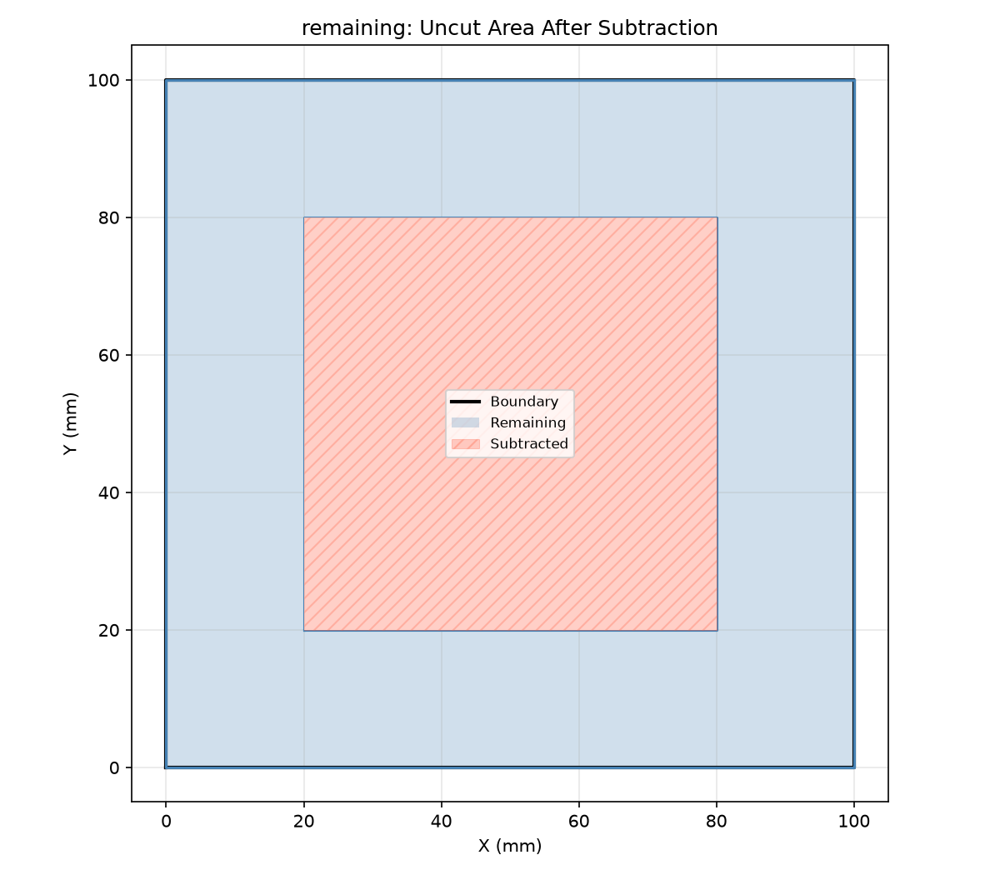

*`remaining` subtracts cleared fragments from the boundary polygon, returning the uncut region
(red).*

### `remaining_in_inset()`

```python
remaining_in_inset(
    boundary: Sequence[tuple[float, float]],
    obstacles: Optional[Sequence[Sequence[tuple[float, float]]]] = None,
    radius: float = 3.0,
) -> list[list[tuple[float, float]]]
```

Compute the inset region of *boundary* by *radius* (excluding *obstacles*), then return the portions
of that region not covered by stored fragments, together with the original obstacle polygons.

| Parameter    | Type                                                       | Description                                                                      |
| ------------ | ---------------------------------------------------------- | -------------------------------------------------------------------------------- |
| `boundary`   | `Sequence[tuple[float, float]]`                            | Outer boundary polygon.                                                          |
| `obstacles`  | `Optional[Sequence[Sequence[tuple[float, float]]]] = None` | Obstacle (hole) polygons to exclude.                                             |
| `radius`     | `float = 3.0`                                              | Inset distance applied to *boundary* and *obstacles*.                            |
| _Returns_    | `list[list[tuple[float, float]]]`                          | List of polygons — the obstacles plus the uncovered portion of the inset region. |
| _Complexity_ |                                                            | O(n log n) for the inset and difference operations.                              |

### `run_segment()`

```python
run_segment(
    start: tuple[float, float],
    initial_heading: float,
    opts: StepperOptions,
    max_steps: int,
) -> tuple[list[tuple[float, float]], str]
```

Drive the disk forward until a non-Ok status or *max_steps*.

Does **not** modify the ClearedArea — the caller is responsible for committing swept polygons.

| Parameter         | Type                                    | Description                              |
| ----------------- | --------------------------------------- | ---------------------------------------- |
| `start`           | `tuple[float, float]`                   | Starting position `(x, y)`.              |
| `initial_heading` | `float`                                 | Initial heading angle (radians).         |
| `opts`            | `StepperOptions`                        | `StepperOptions` controlling the solver. |
| `max_steps`       | `int`                                   | Maximum number of steps.                 |
| _Returns_         | `tuple[list[tuple[float, float]], str]` | `(path, status_string)`.                 |

### `set_update_strategy()`

```python
set_update_strategy(strategy: str) -> None
```

Switch between global and local fragment-merging strategies.

| Parameter  | Type   | Description                     |
| ---------- | ------ | ------------------------------- |
| `strategy` | `str`  | Either `"global"` or `"local"`. |
| _Returns_  | `None` |                                 |

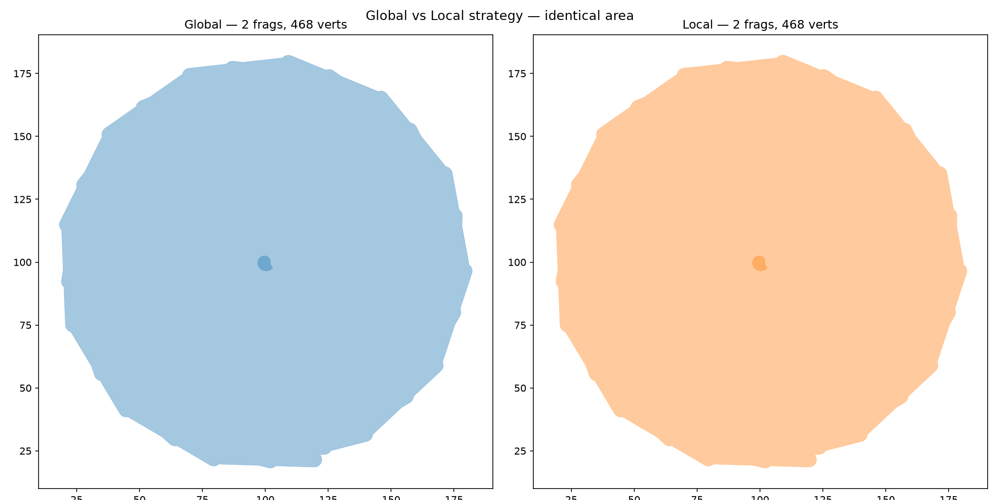

*Global vs Local update strategy — identical cleared area, but Local updates only the fragments
whose bbox overlaps each new swept polygon.*

### `signed_boundary_distance()`

```python
signed_boundary_distance(x: float, y: float) -> float
```

Signed perpendicular distance to the nearest cleared boundary.

Returns positive when the point is outside the cleared area (in uncut material), negative when
inside.

| Parameter | Type    | Description                                                 |
| --------- | ------- | ----------------------------------------------------------- |
| `x`       | `float` | X coordinate of the query point.                            |
| `y`       | `float` | Y coordinate of the query point.                            |
| _Returns_ | `float` | Signed distance in mm. `0.0` means exactly on the boundary. |

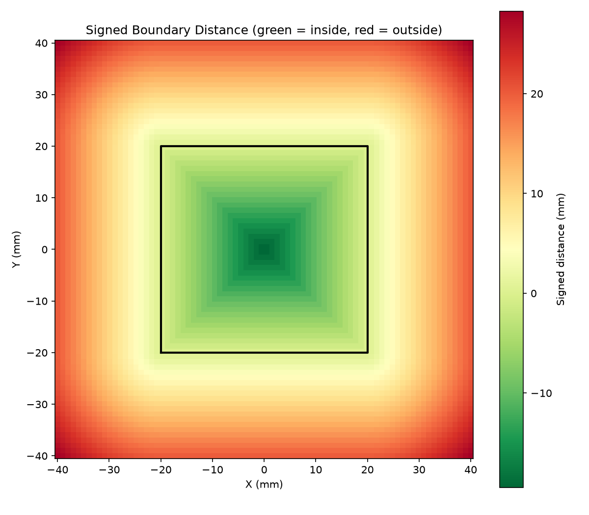

*Signed boundary distance around a cleared square: green = inside cleared, red = outside.*

### `step()`

```python
step(
    pos: tuple[float, float],
    heading: float,
    opts: StepperOptions,
) -> StepResult
```

Perform one forward step.

Starting from *pos* with the given *heading* (radians), proposes candidate positions and solves for
the heading that maintains the target engagement.

| Parameter | Type                  | Description                                              |
| --------- | --------------------- | -------------------------------------------------------- |
| `pos`     | `tuple[float, float]` | Current centre position `(x, y)`.                        |
| `heading` | `float`               | Current heading angle in radians.                        |
| `opts`    | `StepperOptions`      | `StepperOptions` controlling the solver.                 |
| _Returns_ | `StepResult`          | `StepResult` with the next position and updated heading. |

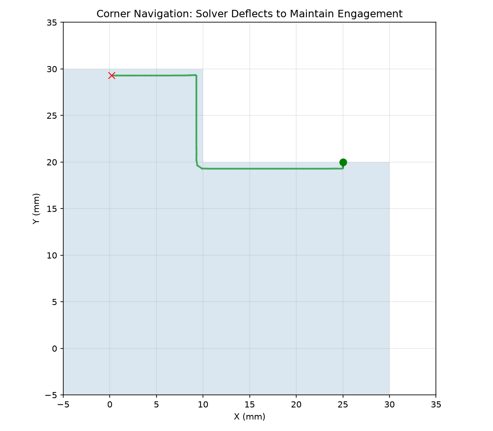

*90° corner: the solver deflects the heading to keep engagement constant around the turn.*

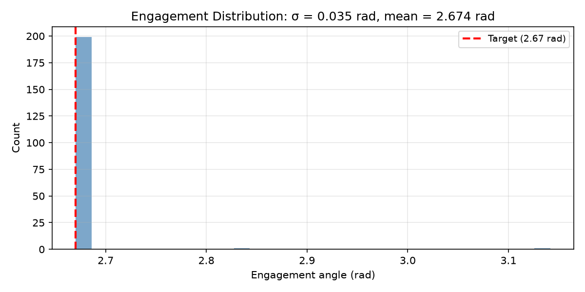

*Engagement histogram for 200 steps along a straight wall. Tight peak near target indicates stable
behaviour.*

### `total_area()`

```python
total_area() -> float
```

Total cleared area.

| Parameter    | Type    | Description                |
| ------------ | ------- | -------------------------- |
| _Returns_    | `float` | Total cleared area in mm². |
| _Complexity_ |         | O(1)                       |

## ResumePoint

A resume point found on the cleared-area frontier.

### `heading`

```python
heading: float
```

Outward-normal heading (radians).

### `link_path`

```python
link_path: list[tuple[float, float]]
```

Travel polyline through cleared territory.

### `pos`

```python
pos: tuple[float, float]
```

Position on the frontier `(x, y)`.

## StepResult

Result of a single forward step.

Contains the next centre position, updated heading, solver iteration count, and the final status.

### `heading`

```python
heading: float
```

Updated heading angle in radians.

### `iters`

```python
iters: int
```

Number of solver iterations used.

### `next`

```python
next: tuple[float, float]
```

Next centre position `(x, y)`.

### `status`

```python
status: StepStatus
```

Step completion status.

## StepStatus

Status of a single step or cut segment.

One of `Ok` (normal), `BoundaryHit` (hit pocket boundary), `LostEngagement` (no uncut material), or
`NoConvergence` (solver failed to converge).

### `boundary_hit()`

```python
@classmethod boundary_hit() -> StepStatus
```

Hit pocket boundary.

| Parameter | Type         | Description               |
| --------- | ------------ | ------------------------- |
| _Returns_ | `StepStatus` | `StepStatus.boundary_hit` |

### `lost_engagement()`

```python
@classmethod lost_engagement() -> StepStatus
```

No uncut material found.

| Parameter | Type         | Description                  |
| --------- | ------------ | ---------------------------- |
| _Returns_ | `StepStatus` | `StepStatus.lost_engagement` |

### `no_convergence()`

```python
@classmethod no_convergence() -> StepStatus
```

Solver failed to converge.

| Parameter | Type         | Description                 |
| --------- | ------------ | --------------------------- |
| _Returns_ | `StepStatus` | `StepStatus.no_convergence` |

### `ok()`

```python
@classmethod ok() -> StepStatus
```

Normal step completion.

| Parameter | Type         | Description     |
| --------- | ------------ | --------------- |
| _Returns_ | `StepStatus` | `StepStatus.ok` |

## StepperOptions

Options for the stepping solver.

Controls disk radius, step length, target engagement angle, solver tolerance, max steering
deflection, and iteration budget.

### `engagement_tol`

```python
engagement_tol: float
```

Engagement tolerance in radians.

### `max_deflection`

```python
max_deflection: float
```

Maximum steering deflection per step in radians.

### `max_solver_iters`

```python
max_solver_iters: int
```

Maximum solver iterations per step.

### `radius`

```python
radius: float
```

Disk radius in mm.

### `step_length`

```python
step_length: float
```

Forward step length in mm.

### `target_engagement`

```python
target_engagement: float
```

Target engagement angle in radians.

## Functions

### `target_engagement_from_advance()`

```python
target_engagement_from_advance(advance: float, radius: float) -> float
```

Derive the target engagement angle from the advance ratio.

| Parameter | Type    | Description                     |
| --------- | ------- | ------------------------------- |
| `advance` | `float` | Per-step forward distance (mm). |
| `radius`  | `float` | Disk radius (mm).               |
| _Returns_ | `float` | Engagement angle in radians.    |
