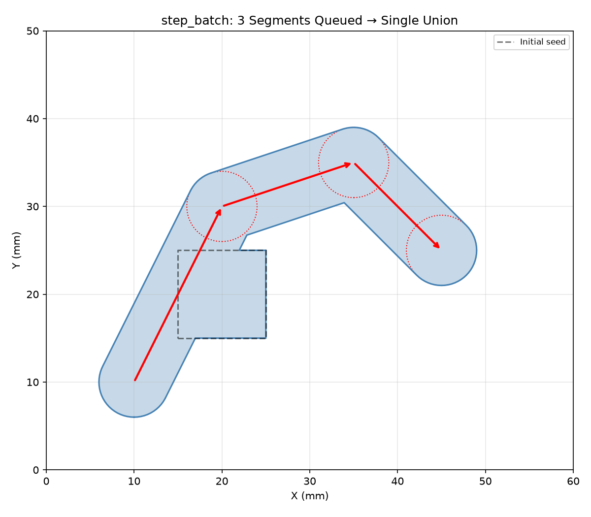
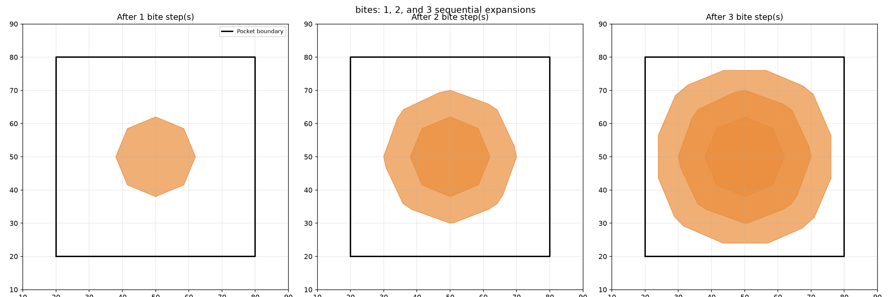
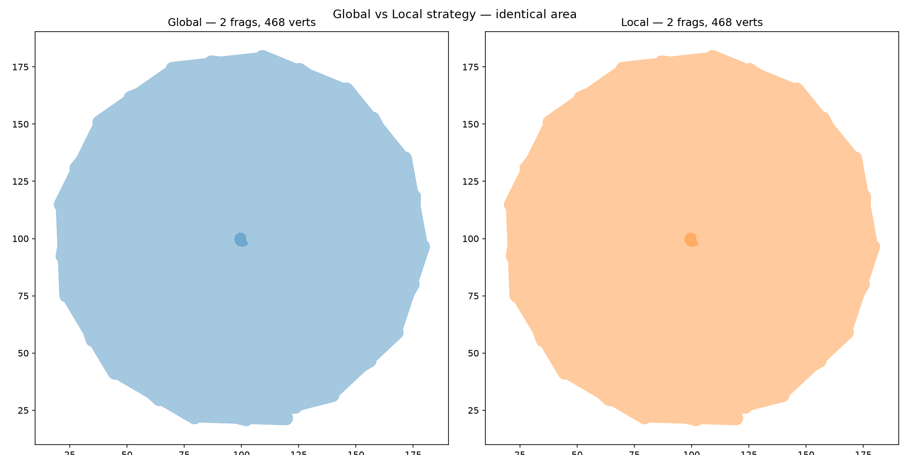
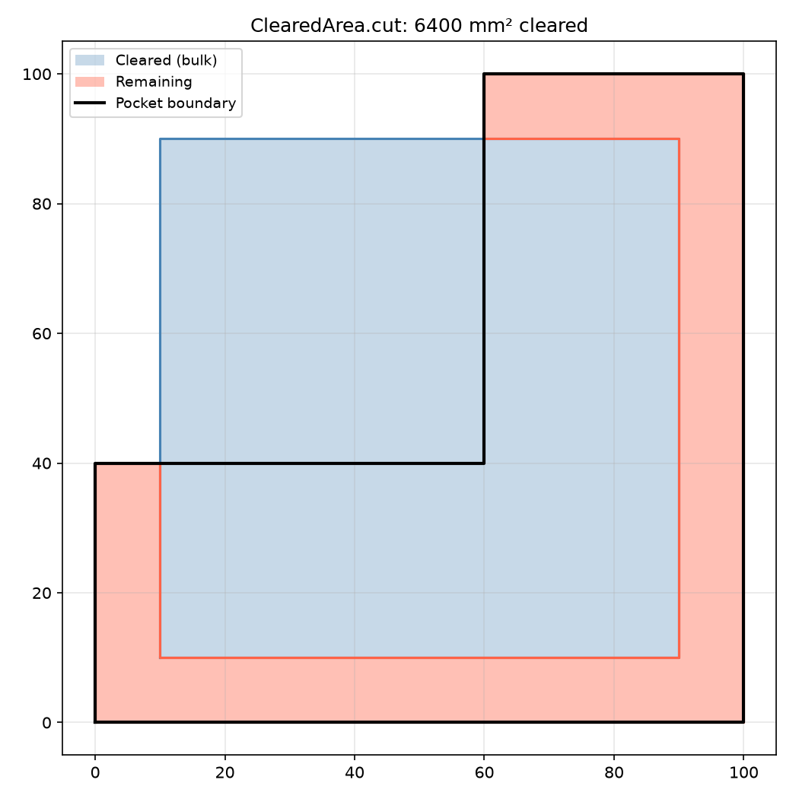
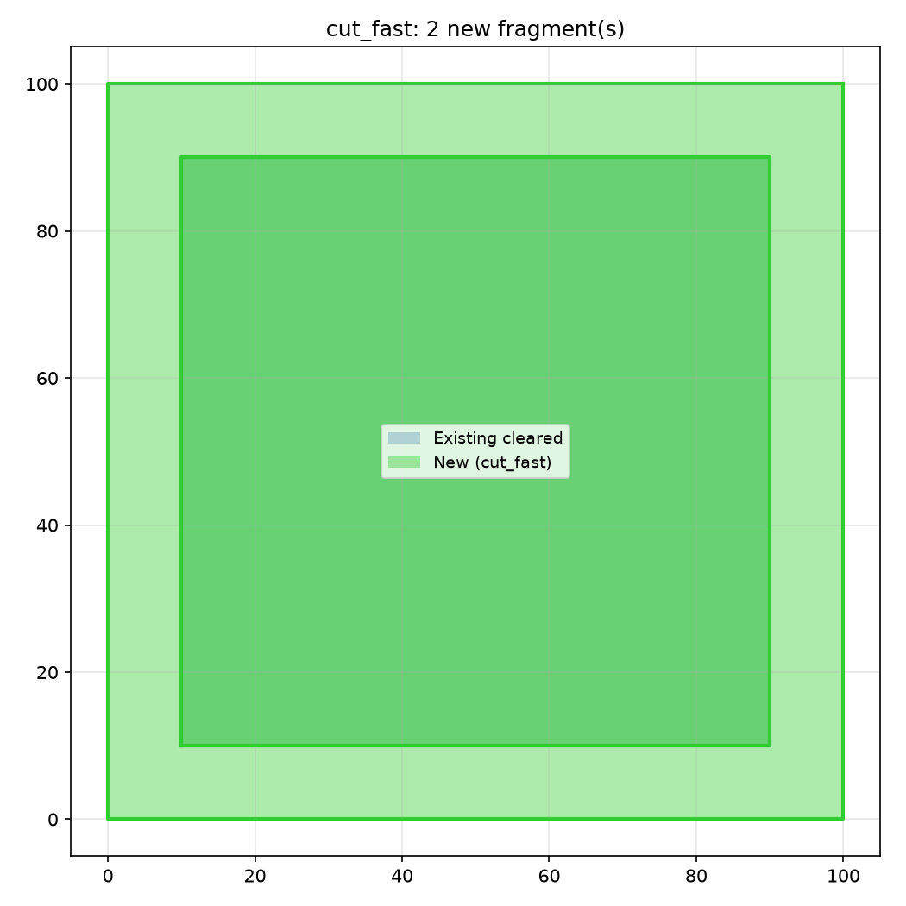
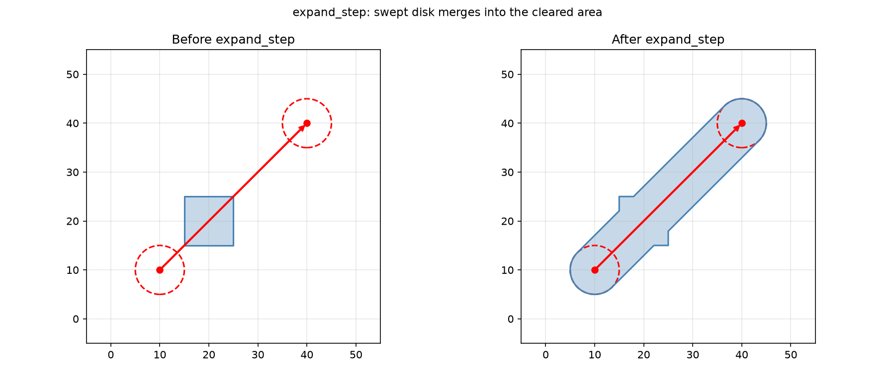

*ClearedArea tracking a simulated raster toolpath — cleared fragments shown in blue, remaining area
in red*

## ClearedArea

### `angular_engagement()`

```python
angular_engagement(center: tuple[float, float], radius: float) -> float
```

Compute angular engagement by exact circle–polygon intersection.

Creates a disk polygon at *center* with *radius*, intersects it with all nearby cleared fragments,
and returns the uncleared angular extent in `[0, 2π]`.

| Parameter | Type                  | Description                         |
| --------- | --------------------- | ----------------------------------- |
| `center`  | `tuple[float, float]` | Query point `(x, y)`.               |
| `radius`  | `float`               | Disk radius (mm).                   |
| _Returns_ | `float`               | Uncleared angular extent (radians). |

### `begin_batch()`

```python
begin_batch() -> None
```

Begin buffering single‑segment expansions.

Subsequent calls to `expand_batched` are queued without a union. Call `commit_batch` to union all
queued sweeps with the stored fragments in a single pass.

Calling this while a batch is already active is a no‑op.

| Parameter | Type   | Description |
| --------- | ------ | ----------- |
| _Returns_ | `None` |             |



*Three segments queued via `begin_batch` / `expand_batched` then unioned in a single `commit_batch`
pass.*

### `bites()`

```python
bites(
    step_over: float,
    tool_radius: float,
    simplify_tol: float,
) -> list[list[tuple[float, float]]]
```

Compute the "bites" — new material reachable by expanding the current frontier outward by
*step_over*, clipping to the tool-centre envelope, and subtracting already-cleared portions.

| Parameter      | Type                              | Description                                     |
| -------------- | --------------------------------- | ----------------------------------------------- |
| `step_over`    | `float`                           | Lateral step-over in mm.                        |
| `tool_radius`  | `float`                           | Tool radius (mm) for computing the envelope.    |
| `simplify_tol` | `float`                           | Tolerance in mm for frontier simplification.    |
| _Returns_      | `list[list[tuple[float, float]]]` | List of polygons representing the bite regions. |
| _Complexity_   |                                   | O(n log n)                                      |



*`bites` computes the expansible material — the crescent-shaped regions of uncut material reachable
by expanding the frontier by `step_over`.*

### `commit_batch()`

```python
commit_batch() -> None
```

Union all buffered sweeps with stored fragments in a single pass, then rebuild the spatial grid.

After this call the batch is closed (the caller may start a new one).

| Parameter | Type   | Description |
| --------- | ------ | ----------- |
| _Returns_ | `None` |             |

### `commit_batch_local()`

```python
commit_batch_local() -> None
```

Union only the buffered sweeps with nearby overlapping fragments, using the spatial grid to avoid
touching distant fragments.

After this call the batch is closed (the caller may start a new one).

| Parameter | Type   | Description |
| --------- | ------ | ----------- |
| _Returns_ | `None` |             |



*`commit_batch` (global union) vs `commit_batch_local` (grid-local merge) — identical cleared area,
but Local updates only the fragments whose bbox overlaps each new swept polygon.*

### `compact_if_needed()`

```python
compact_if_needed(tol: float) -> None
```

Compact fragments if total vertex count exceeds the default threshold.

| Parameter | Type    | Description                            |
| --------- | ------- | -------------------------------------- |
| `tol`     | `float` | Vertex simplification tolerance in mm. |
| _Returns_ | `None`  |                                        |

### `compact_if_needed_threshold()`

```python
compact_if_needed_threshold(tol: float, threshold: int) -> None
```

Compact with an explicit vertex-count threshold.

| Parameter   | Type    | Description                                                 |
| ----------- | ------- | ----------------------------------------------------------- |
| `tol`       | `float` | Vertex simplification tolerance in mm.                      |
| `threshold` | `int`   | Vertex count threshold above which compaction is triggered. |
| _Returns_   | `None`  |                                                             |

### `cut()`

```python
cut(polygons: Sequence[Sequence[tuple[float, float]]]) -> None
```

Add pre‑computed polygons to the cleared set.

| Parameter    | Type                                      | Description                                                 |
| ------------ | ----------------------------------------- | ----------------------------------------------------------- |
| `polygons`   | `Sequence[Sequence[tuple[float, float]]]` | List of polygons (each a list of `(x, y)` vertices) to add. |
| _Returns_    | `None`                                    |                                                             |
| _Complexity_ |                                           | O(n) where n = total vertices across all polygons           |



*ClearedArea with bulk polygon insertion via `cut` — cleared region in blue, remaining area in red*

### `cut_area()`

```python
cut_area(
    c1: tuple[float, float],
    c2: tuple[float, float],
    radius: float,
) -> float
```

Incremental cut area when the tool moves from *c1* to *c2*.

Computes the fresh material area inside the disk at *c2* that is not already cleared (crescent
area).

| Parameter | Type                  | Description               |
| --------- | --------------------- | ------------------------- |
| `c1`      | `tuple[float, float]` | Previous centre `(x, y)`. |
| `c2`      | `tuple[float, float]` | Next centre `(x, y)`.     |
| `radius`  | `float`               | Disk radius (mm).         |
| _Returns_ | `float`               | Fresh cut area (mm²).     |

### `cut_fast()`

```python
cut_fast(
    polygons: Sequence[Sequence[tuple[float, float]]],
) -> list[list[tuple[float, float]]]
```

Add polygons, returning only the newly-added portion. Faster than `cut` when inputs don't overlap
existing fragments (skips the full union).

```
         O(n) when inputs are disjoint from existing fragments
```

| Parameter    | Type                                      | Description                                            |
| ------------ | ----------------------------------------- | ------------------------------------------------------ |
| `polygons`   | `Sequence[Sequence[tuple[float, float]]]` | List of polygons to add.                               |
| _Returns_    | `list[list[tuple[float, float]]]`         | List of polygons representing the newly-added portion. |
| _Complexity_ |                                           | O(n log n) worst case when union required,             |



*`cut_fast` adds polygons to the cleared state while returning only the newly-covered region (shown
in green).*

### `envelope()`

```python
envelope(tool_radius: float) -> list[list[tuple[float, float]]]
```

The tool-centre envelope (inset of boundary by `tool_radius`, minus islands).

| Parameter     | Type                              | Description                                             |
| ------------- | --------------------------------- | ------------------------------------------------------- |
| `tool_radius` | `float`                           | Tool radius (mm).                                       |
| _Returns_     | `list[list[tuple[float, float]]]` | List of polygons representing the tool-centre envelope. |

### `expand()`

```python
expand(path: Sequence[tuple[float, float]], radius: float) -> None
```

Sweep a disk along a polyline, adding the swept area to the cleared set.

| Parameter    | Type                            | Description                                   |
| ------------ | ------------------------------- | --------------------------------------------- |
| `path`       | `Sequence[tuple[float, float]]` | List of `(x, y)` points forming the polyline. |
| `radius`     | `float`                         | Disk radius (mm).                             |
| _Returns_    | `None`                          |                                               |
| _Complexity_ |                                 | O(n) where n = number of path points          |


*`expand`: sweeping a disk along a multi-segment path enlarges the cleared area.*

### `expand_batched()`

```python
expand_batched(
    prev: tuple[float, float],
    next: tuple[float, float],
    radius: float,
) -> None
```

Queue a single‑segment expansion into the current batch.

The segment swept polygon is stored in the internal buffer. Does **not** perform a union until
`commit_batch` is called.

.. warning::

```
Panics if `begin_batch` was not called first.
```

| Parameter | Type                  | Description                          |
| --------- | --------------------- | ------------------------------------ |
| `prev`    | `tuple[float, float]` | Start point `(x, y)` of the segment. |
| `next`    | `tuple[float, float]` | End point `(x, y)` of the segment.   |
| `radius`  | `float`               | Disk radius (mm).                    |
| _Returns_ | `None`                |                                      |

### `expand_step()`

```python
expand_step(
    prev: tuple[float, float],
    next: tuple[float, float],
    radius: float,
) -> None
```

Expand the cleared area by sweeping a disk of *radius* along a single segment from *prev* to *next*.

| Parameter | Type                  | Description                          |
| --------- | --------------------- | ------------------------------------ |
| `prev`    | `tuple[float, float]` | Start point `(x, y)` of the segment. |
| `next`    | `tuple[float, float]` | End point `(x, y)` of the segment.   |
| `radius`  | `float`               | Disk radius (mm).                    |
| _Returns_ | `None`                |                                      |



*`expand_step`: sweeping a disk (dashed circle) of radius *radius* from *prev* to *next* (red arrow)
enlarges the cleared area (right) vs the initial state (left).*

### `fragments()`

```python
fragments() -> list[list[tuple[float, float]]]
```

Return the union of all polygons currently tracked as cleared.

Each fragment is a closed polygon (list of `(x, y)` vertices) representing an area that has already
been cut. The fragment set grows as `cut_fast` or `cut` are called.

This is useful for inspecting which areas have been cleared.

| Parameter    | Type                              | Description                                          |
| ------------ | --------------------------------- | ---------------------------------------------------- |
| _Returns_    | `list[list[tuple[float, float]]]` | List of polygons representing the cleared fragments. |
| _Complexity_ |                                   | O(m) where m = number of fragments                   |

### `frontier()`

```python
frontier(simplify_tol: float) -> list[list[tuple[float, float]]]
```

Return a unioned, simplified snapshot of the current outer boundary, clipped to the stock.

| Parameter      | Type                              | Description                                       |
| -------------- | --------------------------------- | ------------------------------------------------- |
| `simplify_tol` | `float`                           | Tolerance in mm for polyline simplification.      |
| _Returns_      | `list[list[tuple[float, float]]]` | List of polygons representing the outer boundary. |
| _Complexity_   |                                   | O(n log n)                                        |


*`frontier` returns the outer boundary of the cleared area after merging overlapping fragments —
shown in crimson.*

### `is_empty()`

```python
is_empty() -> bool
```

True when no fragments have been recorded.

| Parameter | Type   | Description                                |
| --------- | ------ | ------------------------------------------ |
| _Returns_ | `bool` | `True` if no fragments have been recorded. |

### `path_engagement()`

```python
path_engagement(
    path: Sequence[tuple[float, float]],
    radius: float,
) -> list[tuple[float, float, float]]
```

Evaluate engagement along a polyline.

| Parameter | Type                               | Description                                  |
| --------- | ---------------------------------- | -------------------------------------------- |
| `path`    | `Sequence[tuple[float, float]]`    | List of `(x, y)` points.                     |
| `radius`  | `float`                            | Disk radius (mm).                            |
| _Returns_ | `list[tuple[float, float, float]]` | List of `(angle, area, chord_depth)` tuples. |

### `point_engagement()`

```python
point_engagement(
    center: tuple[float, float],
    radius: float,
) -> tuple[float, float, float]
```

Evaluate engagement at a point using the signed distance to this cleared area's boundary.

| Parameter | Type                         | Description                       |
| --------- | ---------------------------- | --------------------------------- |
| `center`  | `tuple[float, float]`        | Query point `(x, y)`.             |
| `radius`  | `float`                      | Disk radius (mm).                 |
| _Returns_ | `tuple[float, float, float]` | `(angle_rad, area, chord_depth)`. |

### `query_window()`

```python
query_window(
    bbox: tuple[float, float, float, float],
) -> list[list[tuple[float, float]]]
```

Return fragments whose bounding box overlaps the query window.

```
         k = output vertices
```

| Parameter    | Type                                | Description                                  |
| ------------ | ----------------------------------- | -------------------------------------------- |
| `bbox`       | `tuple[float, float, float, float]` | Bounding box `(x_min, y_min, x_max, y_max)`. |
| _Returns_    | `list[list[tuple[float, float]]]`   | Fragments intersecting the bounding box.     |
| _Complexity_ |                                     | O(m + k) where m = number of fragments,      |


*`query_window` returns only the cleared fragments whose bounding box overlaps the query (green
box).*

### `remaining()`

```python
remaining() -> list[list[tuple[float, float]]]
```

Subtract cleared fragments from the stock, returning the uncut portion.

| Parameter    | Type                              | Description                                      |
| ------------ | --------------------------------- | ------------------------------------------------ |
| _Returns_    | `list[list[tuple[float, float]]]` | List of polygons representing the uncut portion. |
| _Complexity_ |                                   | O(n * m) where n = stock vertices, m = fragments |


*`remaining` subtracts cleared fragments from the boundary polygon, returning the uncut region
(red).*

### `signed_boundary_distance()`

```python
signed_boundary_distance(x: float, y: float) -> float
```

Signed perpendicular distance to the nearest cleared boundary.

Returns positive when the point is outside the cleared area (in uncut material), negative when
inside.

| Parameter | Type    | Description                                                 |
| --------- | ------- | ----------------------------------------------------------- |
| `x`       | `float` | X coordinate of the query point.                            |
| `y`       | `float` | Y coordinate of the query point.                            |
| _Returns_ | `float` | Signed distance in mm. `0.0` means exactly on the boundary. |


*Signed boundary distance around a cleared square: green = inside cleared, red = outside.*

### `total_area()`

```python
total_area() -> float
```

Total cleared area.

| Parameter    | Type    | Description                |
| ------------ | ------- | -------------------------- |
| _Returns_    | `float` | Total cleared area in mm². |
| _Complexity_ |         | O(1)                       |
