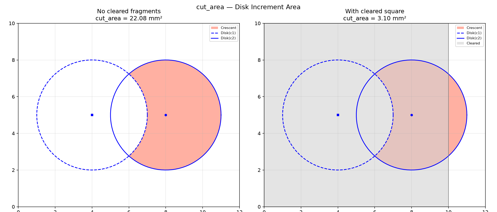

## Functions

### `cut_area()`

```python
cut_area(
    c1: tuple[float, float],
    c2: tuple[float, float],
    radius: float,
    fragments: Sequence[Sequence[tuple[float, float]]],
    valid_area: Sequence[Sequence[tuple[float, float]]],
) -> tuple[float, float]
```

Area of `disk(c2) − disk(c1) − fragments`, intersected with *valid_area*.

Returns `(total, left)` where *left* is the portion on the left side of the step vector `c1 → c2`.

| Parameter    | Type                                      | Description                           |
| ------------ | ----------------------------------------- | ------------------------------------- |
| `c1`         | `tuple[float, float]`                     | Previous centre `(x, y)`.             |
| `c2`         | `tuple[float, float]`                     | Next centre `(x, y)`.                 |
| `radius`     | `float`                                   | Disk radius (mm).                     |
| `fragments`  | `Sequence[Sequence[tuple[float, float]]]` | List of polygons (cleared fragments). |
| `valid_area` | `Sequence[Sequence[tuple[float, float]]]` | Valid region polygons (intersection). |
| _Returns_    | `tuple[float, float]`                     | `(total_area, left_area)` (mm²).      |



*Disk increment (in red) produced by stepping a disk from C1 to C2. Left panel shows the full
increment; right panel shows the reduction when a cleared fragment (gray) occupies part of the
increment.*
