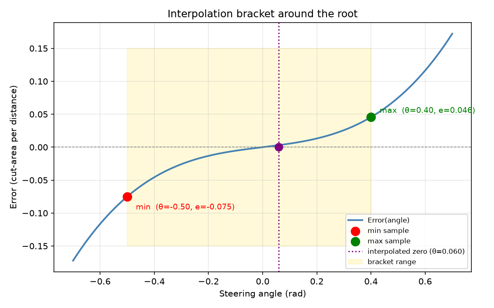
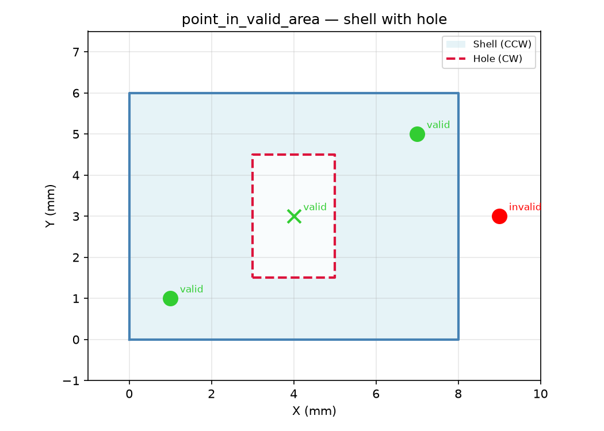
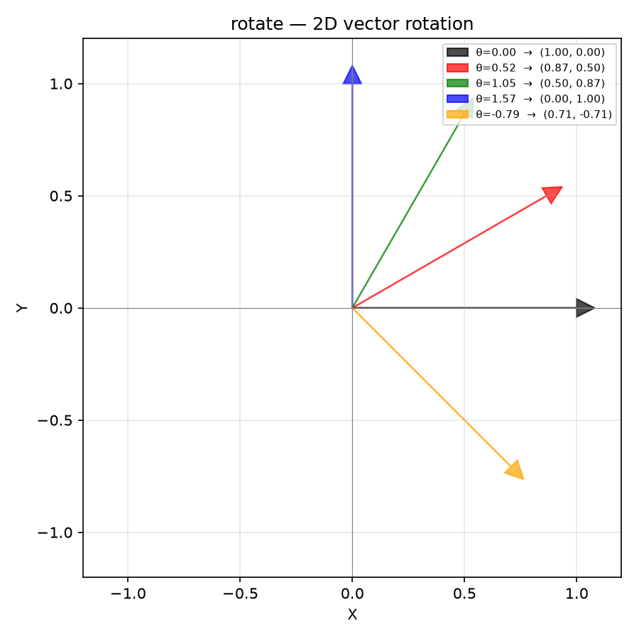

## Interpolation

Bracket of error values for adaptive-stepping interpolation.

Maintains a min/max bracket around the target cut-area per distance and linearly interpolates to
find the steering angle that achieves it.

### `add()`

```python
add(error: float, angle: float, pos: tuple[float, float]) -> None
```

Add a new sample to the bracket.

Maintains the invariant `min.error <= max.error` and keeps samples closest to zero on each side of
the root.

| Parameter | Type                  | Description |
| --------- | --------------------- | ----------- |
| `error`   | `float`               |             |
| `angle`   | `float`               |             |
| `pos`     | `tuple[float, float]` |             |
| _Returns_ | `None`                |             |

### `clamp_angle()`

```python
clamp_angle(angle: float, max_deflection: float) -> float
```

Clamp *angle* to ±max_deflection.

| Parameter        | Type    | Description |
| ---------------- | ------- | ----------- |
| `angle`          | `float` |             |
| `max_deflection` | `float` |             |
| _Returns_        | `float` |             |

### `has_pos()`

```python
has_pos(pos: tuple[float, float]) -> bool
```

Whether either endpoint was sampled at *pos*.

| Parameter | Type                  | Description |
| --------- | --------------------- | ----------- |
| `pos`     | `tuple[float, float]` |             |
| _Returns_ | `bool`                |             |

### `interpolate()`

```python
interpolate() -> float
```

Linearly interpolate between min and max to find the angle where error = 0, clamped to [0.2, 0.8] in
parameter space.

| Parameter | Type    | Description |
| --------- | ------- | ----------- |
| _Returns_ | `float` |             |



*Interpolation bracket: error vs steering with min/max samples (red/green) and zero-crossing
(purple)*

### `joint_is_valid()`

```python
joint_is_valid() -> bool
```

Whether a valid bracket around the root exists (min.error < 0 \<= max.error).

| Parameter | Type   | Description |
| --------- | ------ | ----------- |
| _Returns_ | `bool` |             |

### `max_angle()`

```python
max_angle() -> float
```

Maximum steering angle: +π/4.

| Parameter | Type    | Description |
| --------- | ------- | ----------- |
| _Returns_ | `float` |             |

### `min_angle()`

```python
min_angle() -> float
```

Minimum steering angle: -π/4.

| Parameter | Type    | Description |
| --------- | ------- | ----------- |
| _Returns_ | `float` |             |

## Functions

### `point_in_valid_area()`

```python
point_in_valid_area(
    pt: tuple[float, float],
    area: Sequence[Sequence[tuple[float, float]]],
) -> bool
```

Check whether *pt* lies in a valid tool area defined by polygon shells and holes.

CCW-wound polygons are outer shells; CW-wound polygons are holes. A point is valid iff it is inside
at least one CCW polygon AND outside all CW polygons.

| Parameter | Type                                      | Description                                             |
| --------- | ----------------------------------------- | ------------------------------------------------------- |
| `pt`      | `tuple[float, float]`                     | Query point `(x, y)`.                                   |
| `area`    | `Sequence[Sequence[tuple[float, float]]]` | List of polygon rings (each a list of `(x, y)` tuples). |
| _Returns_ | `bool`                                    | `True` if the point is in a valid region.               |



*Valid-area polygon: CCW shell (blue), CW hole (red dashed); points valid (green) or invalid (red)*

### `rotate()`

```python
rotate(v: tuple[float, float], angle: float) -> tuple[float, float]
```

Rotate a 2D vector by *angle* radians.

| Parameter | Type                  | Description                |
| --------- | --------------------- | -------------------------- |
| `v`       | `tuple[float, float]` | Vector `(x, y)`.           |
| `angle`   | `float`               | Rotation angle in radians. |
| _Returns_ | `tuple[float, float]` | Rotated vector `(x', y')`. |



*Rotation of a unit vector by various angles using :func:`~raygeo.ops.cut.interp.rotate`.*
