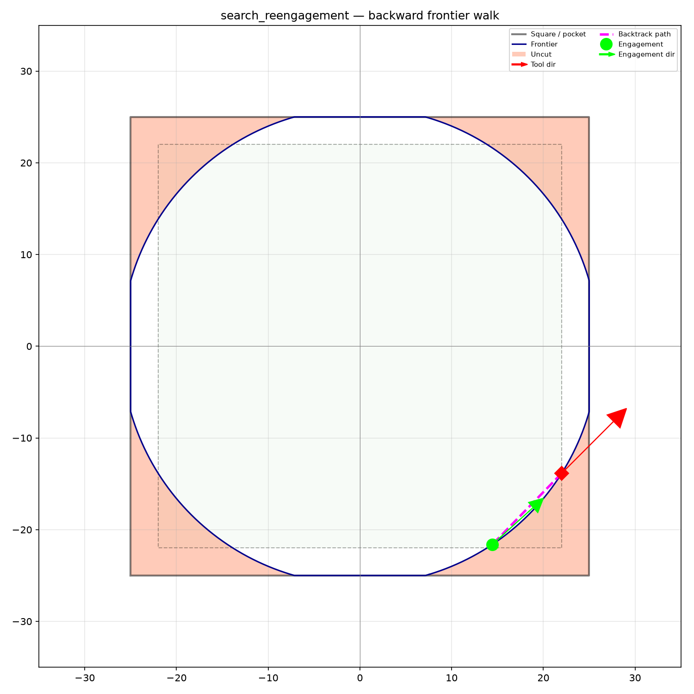

## ToolPose

### `heading`

```python
heading: float
```

### `pos`

```python
pos: tuple[float, float]
```

## Functions

### `search_frontier_engagement()`

```python
search_frontier_engagement(
    cleared: cleared_area.ClearedArea,
    start: ToolPose,
    radius: float,
    step_length: float,
    min_cut_area: float,
    max_cut_area: float,
) -> Optional[ToolPose]
```

Walk the frontier forward from `start_pos`, skipping the closest vertex. Returns the first vertex
whose outward cut-area probe falls in `[min, max]`.

| Parameter      | Type                       | Description                                  |
| -------------- | -------------------------- | -------------------------------------------- |
| `cleared`      | `cleared_area.ClearedArea` | `ClearedArea` instance.                      |
| `start`        | `ToolPose`                 |                                              |
| `radius`       | `float`                    | Disk radius (mm).                            |
| `step_length`  | `float`                    | Forward step distance (mm) for the probe.    |
| `min_cut_area` | `float`                    | Minimum cut area (mm²).                      |
| `max_cut_area` | `float`                    | Maximum cut area (mm²), e.g. `float("inf")`. |
| _Returns_      | `Optional[ToolPose]`       | `ToolPose` or `None`.                        |


*Walk forward from the engagement point to find the next frontier match.*


*Multi-island pocket — end positions (triangles) yield resume positions (stars) with outward
headings.*

### `search_reengagement()`

```python
search_reengagement(
    cleared: cleared_area.ClearedArea,
    start: ToolPose,
    radius: float,
    step_length: float,
    min_cut_area: float,
) -> Optional[ToolPose]
```

Walk the frontier backward from `start_pos`, skipping the closest vertex. Returns the first vertex
(going backward) whose outward cut-area probe is at least `min_cut_area`.

| Parameter      | Type                       | Description                 |
| -------------- | -------------------------- | --------------------------- |
| `cleared`      | `cleared_area.ClearedArea` | `ClearedArea` instance.     |
| `start`        | `ToolPose`                 |                             |
| `radius`       | `float`                    | Disk radius (mm).           |
| `step_length`  | `float`                    | Forward step distance (mm). |
| `min_cut_area` | `float`                    | Minimum cut area (mm²).     |
| _Returns_      | `Optional[ToolPose]`       | `ToolPose` or `None`.       |



*Full backward wall-hugging search (both phases).*
