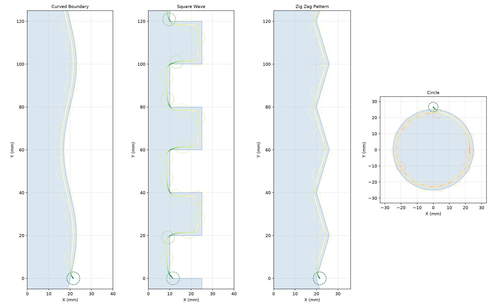
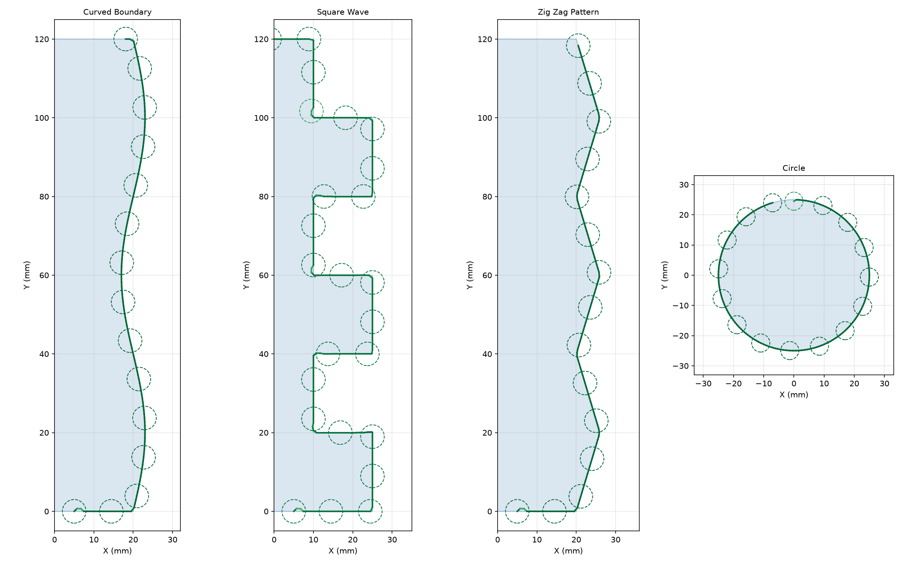
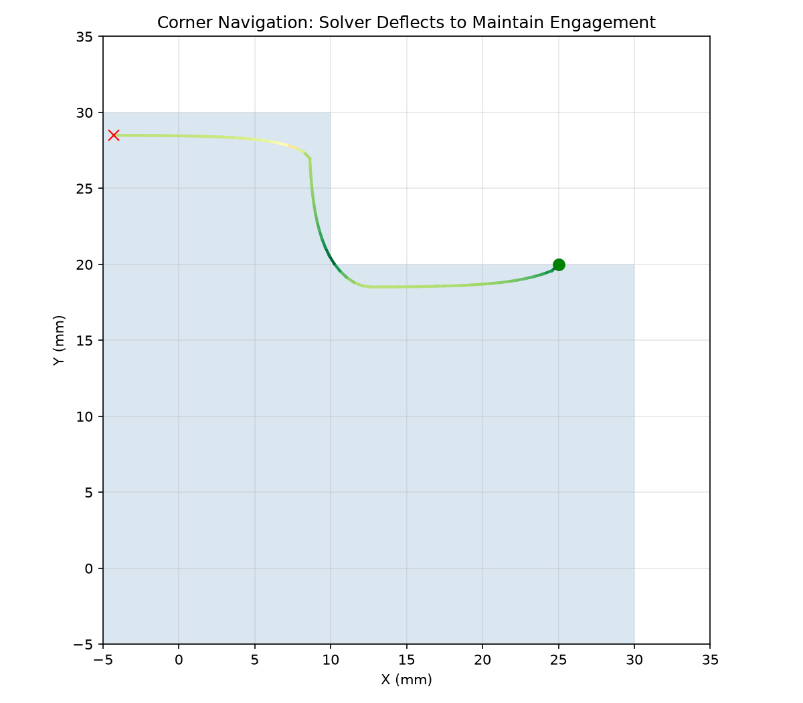
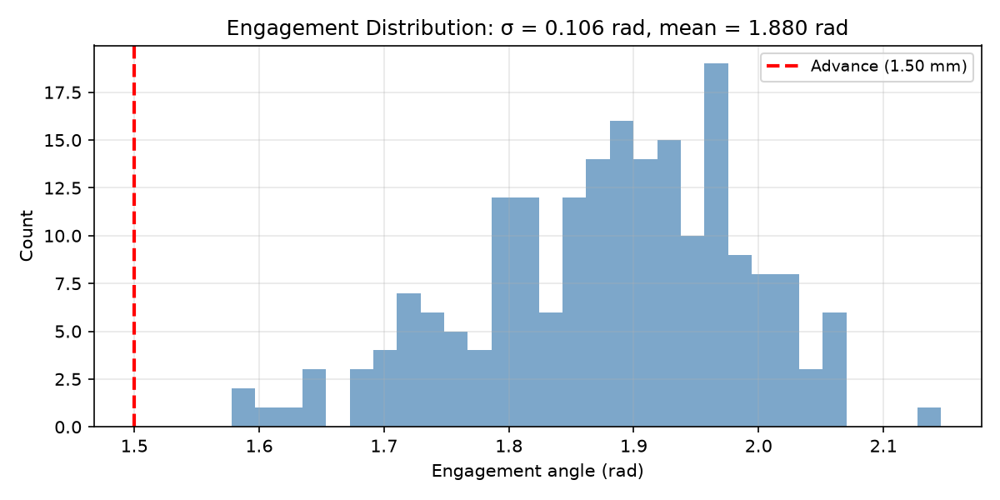

## StepResult

Result of a single forward step.

Contains the next centre position, updated heading, solver iteration count, and the final status.

### `heading`

```python
heading: float
```

Updated heading angle in radians.

### `iteration_angle`

```python
iteration_angle: float
```

Solver steering angle (radians). Non-zero for `step_adaptive`; always 0 for `step`.

### `iters`

```python
iters: int
```

Number of solver iterations used.

### `next`

```python
next: tuple[float, float]
```

Next centre position `(x, y)`.

### `status`

```python
status: StepStatus
```

Step completion status.

## StepStatus

Status of a single step or cut segment.

One of `Ok` (normal), `BoundaryHit` (hit pocket boundary), `LostEngagement` (no uncut material), or
`NoConvergence` (solver failed to converge).

### `boundary_hit()`

```python
@classmethod boundary_hit() -> StepStatus
```

Hit pocket boundary.

| Parameter | Type         | Description               |
| --------- | ------------ | ------------------------- |
| _Returns_ | `StepStatus` | `StepStatus.boundary_hit` |

### `lost_engagement()`

```python
@classmethod lost_engagement() -> StepStatus
```

No uncut material found.

| Parameter | Type         | Description                  |
| --------- | ------------ | ---------------------------- |
| _Returns_ | `StepStatus` | `StepStatus.lost_engagement` |

### `no_convergence()`

```python
@classmethod no_convergence() -> StepStatus
```

Solver failed to converge.

| Parameter | Type         | Description                 |
| --------- | ------------ | --------------------------- |
| _Returns_ | `StepStatus` | `StepStatus.no_convergence` |

### `ok()`

```python
@classmethod ok() -> StepStatus
```

Normal step completion.

| Parameter | Type         | Description     |
| --------- | ------------ | --------------- |
| _Returns_ | `StepStatus` | `StepStatus.ok` |

## StepperOptions

Options for the stepping solver.

Controls disk radius, step length, target engagement angle, solver tolerance, max steering
deflection, and iteration budget.

### `engagement_tol`

```python
engagement_tol: float
```

Engagement tolerance in radians.

### `max_deflection`

```python
max_deflection: float
```

Maximum steering deflection per step in radians.

### `max_solver_iters`

```python
max_solver_iters: int
```

Maximum solver iterations per step.

### `metric`

```python
metric: str
```

Engagement metric: `"angle"` (default) or `"area"`.

### `radius`

```python
radius: float
```

Disk radius in mm.

### `step_length`

```python
step_length: float
```

Forward step length in mm.

### `target_engagement`

```python
target_engagement: float
```

Target engagement angle in radians.

## Functions

### `run_segment()`

```python
run_segment(
    cleared: cleared_area.ClearedArea,
    start: tuple[float, float],
    initial_heading: float,
    opts: StepperOptions,
    max_steps: int,
) -> tuple[list[tuple[float, float]], str]
```

Drive the disk forward until a non-Ok status or *max_steps*.

Does **not** modify the ClearedArea — the caller is responsible for committing swept polygons.

| Parameter         | Type                                    | Description                              |
| ----------------- | --------------------------------------- | ---------------------------------------- |
| `cleared`         | `cleared_area.ClearedArea`              | `ClearedArea` instance.                  |
| `start`           | `tuple[float, float]`                   | Starting position `(x, y)`.              |
| `initial_heading` | `float`                                 | Initial heading angle (radians).         |
| `opts`            | `StepperOptions`                        | `StepperOptions` controlling the solver. |
| `max_steps`       | `int`                                   | Maximum number of steps.                 |
| _Returns_         | `tuple[list[tuple[float, float]], str]` | `(path, status_string)`.                 |



*Wall following along four boundary shapes: curved, square wave, zig zag, and circle.*



*Wall following using area engagement (same shapes as angular version).*

### `step()`

```python
step(
    cleared: cleared_area.ClearedArea,
    pos: tuple[float, float],
    heading: float,
    opts: StepperOptions,
) -> StepResult
```

Perform one forward step.

Starting from *pos* with the given *heading* (radians), proposes candidate positions and solves for
the heading that maintains the target engagement.

| Parameter | Type                       | Description                                              |
| --------- | -------------------------- | -------------------------------------------------------- |
| `cleared` | `cleared_area.ClearedArea` | `ClearedArea` instance.                                  |
| `pos`     | `tuple[float, float]`      | Current centre position `(x, y)`.                        |
| `heading` | `float`                    | Current heading angle in radians.                        |
| `opts`    | `StepperOptions`           | `StepperOptions` controlling the solver.                 |
| _Returns_ | `StepResult`               | `StepResult` with the next position and updated heading. |



*90° corner: the solver deflects the heading to keep engagement constant around the turn.*



*Engagement histogram for 200 steps along a straight wall. Tight peak near target indicates stable
behaviour.*

### `step_adaptive()`

```python
step_adaptive(
    cleared: cleared_area.ClearedArea,
    pos: tuple[float, float],
    heading: float,
    predicted_angle: float,
    target_area_pd: float,
    step_length: float,
    radius: float,
    max_deflection: float,
    valid_area: Sequence[Sequence[tuple[float, float]]],
    angle_min: float = -0.7853981633974483,
    angle_max: float = 0.7853981633974483,
) -> StepResult
```

Perform one forward step using the area-based adaptive solver.

Like **step**, but targets **cut-area per unit distance** rather than an engagement angle. Used
internally by `adaptive_clearing`.

| Parameter         | Type                                      | Description                                               |
| ----------------- | ----------------------------------------- | --------------------------------------------------------- |
| `cleared`         | `cleared_area.ClearedArea`                | `ClearedArea` instance.                                   |
| `pos`             | `tuple[float, float]`                     | Current centre position `(x, y)`.                         |
| `heading`         | `float`                                   | Smoothed heading angle (radians).                         |
| `predicted_angle` | `float`                                   | Predicted steering angle from history.                    |
| `target_area_pd`  | `float`                                   | Target cut-area per unit distance.                        |
| `step_length`     | `float`                                   | Forward step length in mm.                                |
| `radius`          | `float`                                   | Disk radius in mm.                                        |
| `max_deflection`  | `float`                                   | Max steering deflection in radians.                       |
| `valid_area`      | `Sequence[Sequence[tuple[float, float]]]` | Valid tool-centre region polygons.                        |
| `angle_min`       | `float = -0.7853981633974483`             | Minimum trial deflection angle in radians (default -π/4). |
| `angle_max`       | `float = 0.7853981633974483`              | Maximum trial deflection angle in radians (default +π/4). |
| _Returns_         | `StepResult`                              | `StepResult` with the next position and updated heading.  |

### `target_engagement_from_advance()`

```python
target_engagement_from_advance(advance: float, radius: float) -> float
```

Derive the target engagement angle from the advance ratio.

| Parameter | Type    | Description                     |
| --------- | ------- | ------------------------------- |
| `advance` | `float` | Per-step forward distance (mm). |
| `radius`  | `float` | Disk radius (mm).               |
| _Returns_ | `float` | Engagement angle in radians.    |
