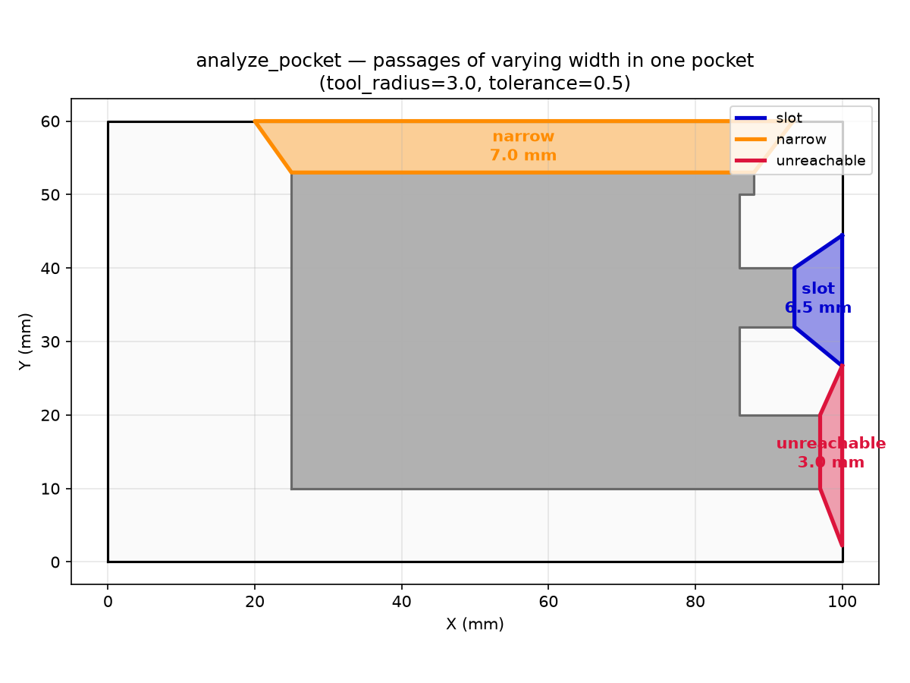

## Functions

### `analyze_pocket()`

```python
analyze_pocket(
    polygon: Sequence[tuple[float, float]],
    holes: Sequence[Sequence[tuple[float, float]]] | None = None,
    tool_radius: float = 3,
    tolerance: float = 0.5,
    min_slot_width: float | None = None,
) -> list[tuple[list[tuple[float, float]], str, float, list[int]]]
```

Analyze a pocket and return classified narrow regions.

Calls `find_narrow_passages` with `max_width = 1.5 × 2 × tool_radius`, then classifies each passage
as Narrow (toroidal), Slot, or Unreachable based on the minimum passage width. Each entry in the
returned list is a tuple of `(polygon, class, min_width, entry_edge_indices)`.

- `polygon` — list of `(x, y)` vertices of the narrow passage.
- `class` — `"narrow"`, `"slot"`, or `"unreachable"`.
- `min_width` — estimated minimum passage width in mm.
- `entry_edge_indices` — list of vertex indices of entry-side edges.

**Raises:** `RuntimeError` — If the polygon cannot be analyzed.

| Parameter        | Type                                                            | Description                                                                      |
| ---------------- | --------------------------------------------------------------- | -------------------------------------------------------------------------------- |
| `polygon`        | `Sequence[tuple[float, float]]`                                 | Outer boundary polygon.                                                          |
| `holes`          | `Sequence[Sequence[tuple[float, float]]] &#124; None = None`    | List of hole (island) polygons.                                                  |
| `tool_radius`    | `float = 3`                                                     | Tool radius in mm.                                                               |
| `tolerance`      | `float = 0.5`                                                   | Additional clearance tolerance in mm.                                            |
| `min_slot_width` | `float &#124; None = None`                                      | Minimum passage width for slotting in mm. Defaults to `tool_radius` when `None`. |
| _Returns_        | `list[tuple[list[tuple[float, float]], str, float, list[int]]]` | List of `(polygon, class, min_width, entry_edge_indices)` tuples.                |



*A single pocket with a staircase island produces narrow passages of three different widths,
demonstrating all three classification levels.*
