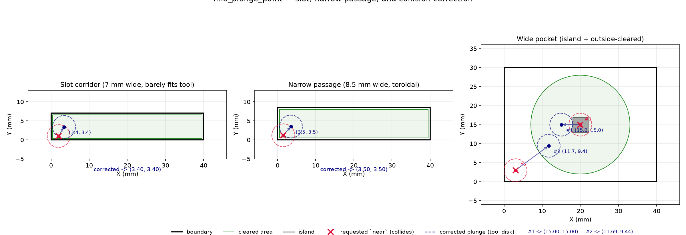

## Functions

### `find_plunge_point()`

```python
find_plunge_point(
    near: tuple[float, float],
    cleared_polygons: Sequence[Sequence[tuple[float, float]]],
    boundary: Sequence[tuple[float, float]],
    islands: Sequence[Sequence[tuple[float, float]]] | None = None,
    tool_radius: float = 3,
    search_radius: float = 10,
) -> tuple[float, float] | None
```

Find a plunge point near the given position within the cleared area.

Searches for a valid tool placement point inside the union of `cleared_polygons` that is within
`search_radius` of `near`, fully inside `boundary`, and does not overlap any `island`.

The algorithm first checks `near` itself, then searches outward on concentric rings with a step of
`tool_radius / 2`.

| Parameter          | Type                                                         | Description                                              |
| ------------------ | ------------------------------------------------------------ | -------------------------------------------------------- |
| `near`             | `tuple[float, float]`                                        | Target point `(x, y)` to search near.                    |
| `cleared_polygons` | `Sequence[Sequence[tuple[float, float]]]`                    | List of cleared-area polygons.                           |
| `boundary`         | `Sequence[tuple[float, float]]`                              | Outer boundary polygon.                                  |
| `islands`          | `Sequence[Sequence[tuple[float, float]]] &#124; None = None` | List of island polygons (optional).                      |
| `tool_radius`      | `float = 3`                                                  | Tool radius in mm.                                       |
| `search_radius`    | `float = 10`                                                 | Maximum search distance from `near` in mm.               |
| _Returns_          | `tuple[float, float] &#124; None`                            | `(x, y)` plunge point or `None` if no valid point found. |



*Three scenarios of find_plunge_point correcting near points: slot, passage, and pocket with
island.*
