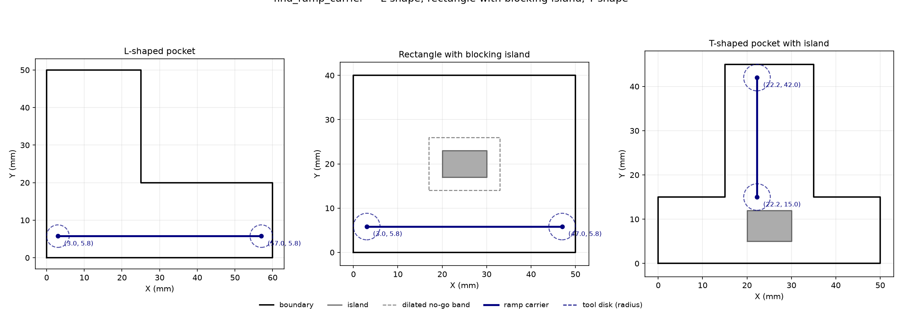

## Functions

### `find_ramp_carrier()`

```python
find_ramp_carrier(
    boundary: Sequence[tuple[float, float]],
    islands: Sequence[Sequence[tuple[float, float]]] | None = None,
    tool_radius: float = 3,
    max_ramp_angle_deg: float = 45,
) -> tuple[tuple[float, float], tuple[float, float]] | None
```

Find the longest straight carrier segment suitable for ramp entry.

Returns a `((x1, y1), (x2, y2))` tuple representing the longest straight-line segment within the
valid tool-centre region (boundary eroded by `tool_radius` minus dilated islands) that is long
enough for a ramp descent of one pass at the given maximum ramp angle.

The returned segment is oriented so the start point has the smaller coordinate on the dominant axis.

| Parameter            | Type                                                          | Description                                           |
| -------------------- | ------------------------------------------------------------- | ----------------------------------------------------- |
| `boundary`           | `Sequence[tuple[float, float]]`                               | Outer boundary polygon as `[(x, y), ...]`.            |
| `islands`            | `Sequence[Sequence[tuple[float, float]]] &#124; None = None`  | List of island polygons (optional).                   |
| `tool_radius`        | `float = 3`                                                   | Tool radius in mm.                                    |
| `max_ramp_angle_deg` | `float = 45`                                                  | Maximum ramp angle in degrees.                        |
| _Returns_            | `tuple[tuple[float, float], tuple[float, float]] &#124; None` | `((x1, y1), (x2, y2))` or `None` if no carrier found. |



*find_ramp_carrier on L-shaped, rectangle with blocking island, and T-shaped pocket.*
