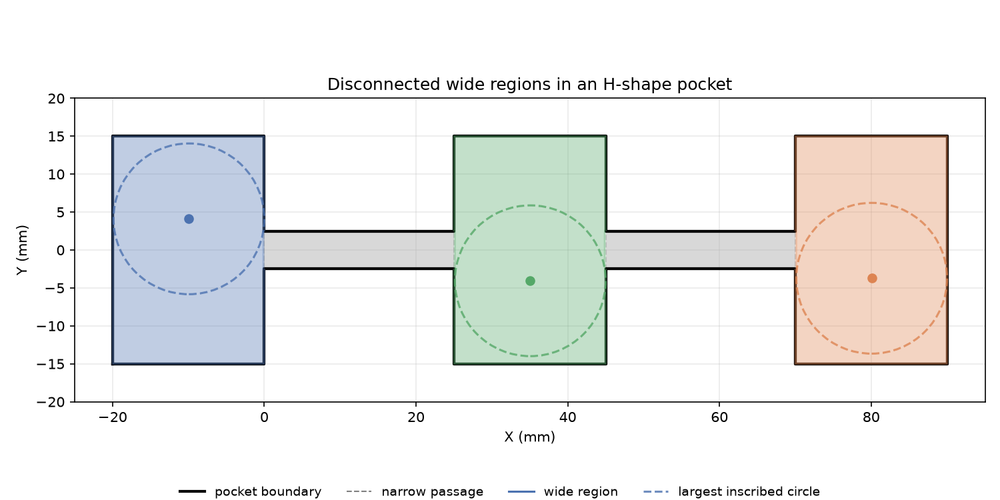

## Functions

### `find_regions()`

```python
find_regions(
    boundary: Sequence[tuple[float, float]],
    islands: Sequence[Sequence[tuple[float, float]]] | None = None,
    tool_radius: float = 3,
    tolerance: float = 0.5,
) -> list[tuple[list[tuple[float, float]], float, tuple[float, float], float]]
```

Detect disconnected wide sub-regions of a pocket.

Analyses the pocket boundary (with optional islands) for narrow passages that separate the pocket
into disconnected wide sub-regions. Each sub-region is returned as a tuple of
`(polygon, area, entry_pt, r_max)`.

- `polygon` — list of `(x, y)` vertices of the wide region.
- `area` — area of the sub-region in mm².
- `entry_pt` — `(x, y)` centre of the largest inscribed circle.
- `r_max` — radius of the largest inscribed circle in mm.

Results are sorted by area descending (largest region first). Returns an empty list when the pocket
is entirely narrow/slot.

| Parameter     | Type                                                                        | Description                                        |
| ------------- | --------------------------------------------------------------------------- | -------------------------------------------------- |
| `boundary`    | `Sequence[tuple[float, float]]`                                             | Outer pocket boundary as `[(x, y), ...]`.          |
| `islands`     | `Sequence[Sequence[tuple[float, float]]] &#124; None = None`                | List of island polygons, each as `[(x, y), ...]`.  |
| `tool_radius` | `float = 3`                                                                 | Tool radius in mm.                                 |
| `tolerance`   | `float = 0.5`                                                               | Additional clearance tolerance in mm.              |
| _Returns_     | `list[tuple[list[tuple[float, float]], float, tuple[float, float], float]]` | List of `(polygon, area, entry_pt, r_max)` tuples. |



*H-shape pocket: wide regions colored, entry points marked, narrow corridors shaded gray*
