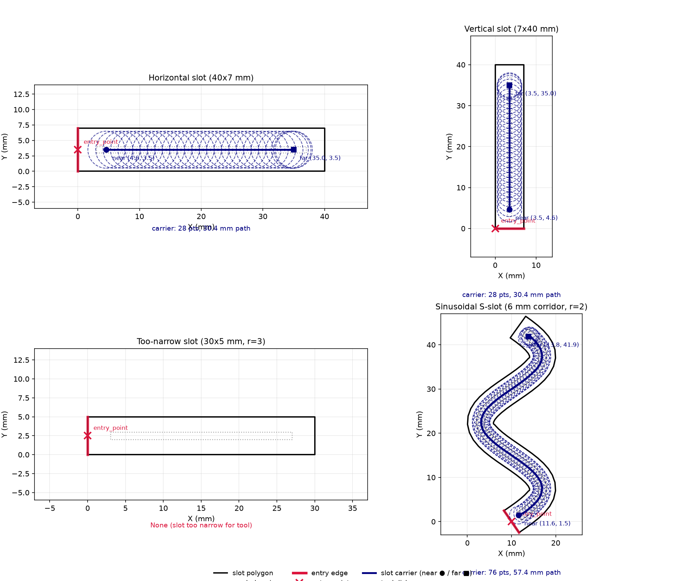

## Functions

### `find_slot_path()`

```python
find_slot_path(
    slot_polygon: Sequence[tuple[float, float]],
    entry_edges: Sequence[int],
    entry_point: tuple[float, float],
    tool_radius: float = 3,
) -> list[tuple[float, float]] | None
```

Find the 2D carrier axis for a slot clearing operation.

Returns a `[(x1, y1), (x2, y2)]` list representing the longitudinal axis of the slot, with the first
point on the entry side. Both points are valid tool centres that fit within the eroded slot.

| Parameter      | Type                                    | Description                                                 |
| -------------- | --------------------------------------- | ----------------------------------------------------------- |
| `slot_polygon` | `Sequence[tuple[float, float]]`         | Slot polygon as `[(x, y), ...]`.                            |
| `entry_edges`  | `Sequence[int]`                         | Indices of entry edges into the slot polygon.               |
| `entry_point`  | `tuple[float, float]`                   | Entry point `(x, y)` (used only for side determination).    |
| `tool_radius`  | `float = 3`                             | Tool radius in mm (default 3.0).                            |
| _Returns_      | `list[tuple[float, float]] &#124; None` | `[(x1, y1), (x2, y2)]` or `None` if the slot is too narrow. |



*find_slot_path on multiple slots: horizontal, vertical, too-narrow (None), and sinusoidal S-slot.*
