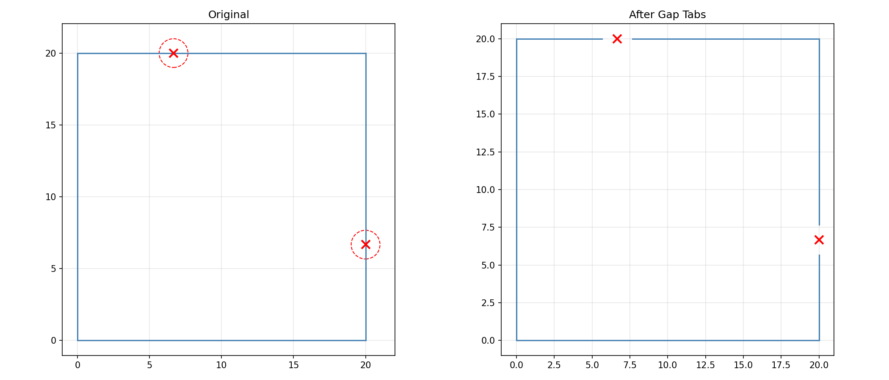
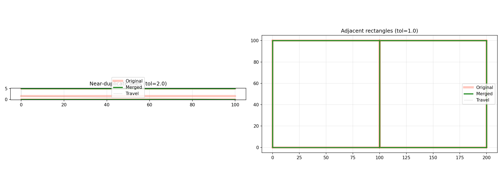
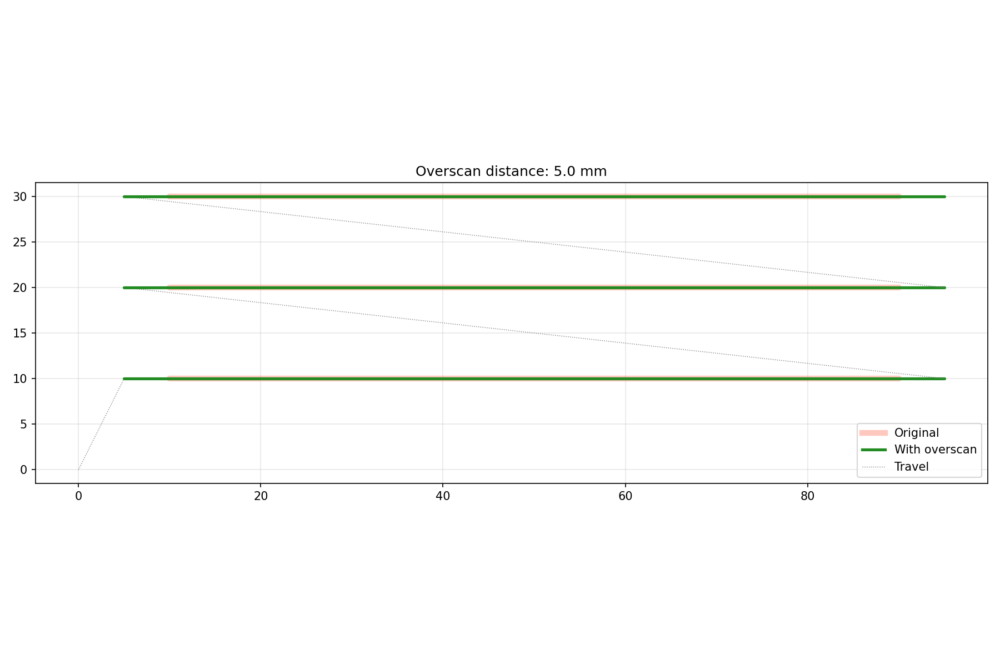
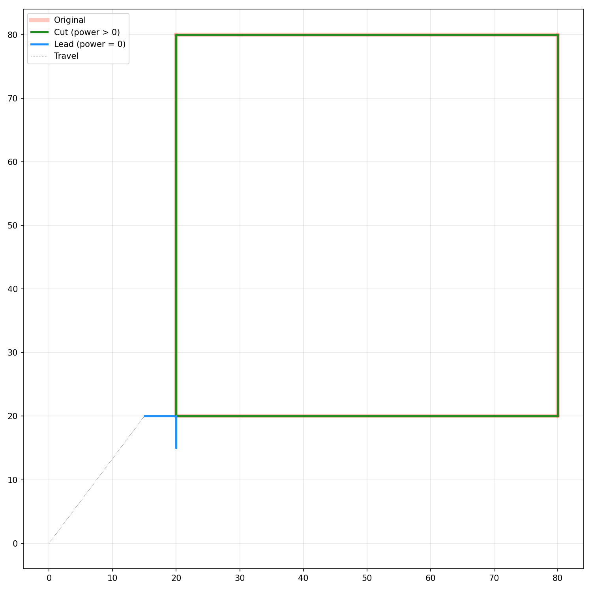

_Tab operations on a rectangle_

_Line merging before and after_

_Overscan applied to raster lines_

_Lead-in and lead-out paths_

Command sequence (Ops) manipulation for laser cutter motion control.

Ops is a container of ordered commands (move, line, arc, bezier, state changes like power/speed)
that defines a complete laser engraving or cutting job. It supports building sequences
programmatically (move_to, line_to, arc_to, etc.), transforming them (translate, rotate, scale,
transform with 4x4 matrices), clipping to rectangles or regions, linearizing curves, estimating
processing time, and serializing to dict or numpy arrays for persistence.

The module also provides command-type enumerations (CommandType, CommandCategory, SectionType),
machine State tracking (power, speed, air assist, frequency), and an Axis bitflag for multi-axis
machines.

## CommandInfo

Detailed information about a single command in an Ops sequence.

Returned by **Ops.inspect** and provides the full set of parameters for any command type in a
structured form.

### `center_offset`

`center_offset: Optional[tuple[float, float]]`

### `clockwise`

`clockwise: Optional[bool]`

### `control`

`control: Optional[tuple[float, float, float]]`

### `control1`

`control1: Optional[tuple[float, float, float]]`

### `control2`

`control2: Optional[tuple[float, float, float]]`

### `duration_ms`

`duration_ms: Optional[float]`

### `end`

`end: Optional[tuple[float, float, float]]`

### `extra_axes`

`extra_axes: Optional[dict]`

### `frequency`

`frequency: Optional[int]`

### `laser_uid`

`laser_uid: Optional[str]`

### `layer_uid`

`layer_uid: Optional[str]`

### `power`

`power: Optional[float]`

### `power_values`

`power_values: Optional[bytes]`

### `pulse_width`

`pulse_width: Optional[float]`

### `section_type`

`section_type: Optional[str]`

### `speed`

`speed: Optional[int]`

### `state`

`state: Optional[state.State]`

### `type_`

`type_: types.CommandType`

### `workpiece_uid`

`workpiece_uid: Optional[str]`

## Ops

A sequence of laser cutting operations (commands).

`Ops` is a container of ordered commands that define a complete laser engraving or cutting job. It
supports building command sequences programmatically, transforming them, clipping, serializing, and
more.

Use the builder methods (`move_to`, `line_to`, `arc_to`, etc.) to construct a sequence, or load from
geometry/dict/numpy arrays.

### `last_move_to`

`last_move_to: tuple[float, float, float]`

The last `(x, y, z)` endpoint from a MoveTo command.

### `scanline_count`

`scanline_count: int`

Return the number of scanline commands in the sequence.

### `apply_lead_in_out()`

`apply_lead_in_out(lead_in_mm: float, lead_out_mm: float) -> None`

Apply lead-in and lead-out to vector contour paths.

For each contour within a VECTOR_OUTLINE section, extends the toolpath with zero-power lead-in and
lead-out segments along the tangent direction at the path start and end.

| Parameter     | Type    | Description                       |
| ------------- | ------- | --------------------------------- |
| `lead_in_mm`  | `float` | Lead-in distance in millimeters.  |
| `lead_out_mm` | `float` | Lead-out distance in millimeters. |
| _Returns_     | `None`  |                                   |

### `apply_overscan()`

`apply_overscan(distance_mm: float) -> None`

Apply overscan to raster lines.

Extends raster line start/end points by `distance_mm` along the line direction, adding zero-power
lead-in and lead-out segments for constant engraving velocity.

| Parameter     | Type    | Description                       |
| ------------- | ------- | --------------------------------- |
| `distance_mm` | `float` | Overscan distance in millimeters. |
| _Returns_     | `None`  |                                   |

### `apply_tab_gaps()`

`apply_tab_gaps(clips: Sequence[tuple[float, float, float]]) -> None`

Apply holding tabs as gaps in the toolpath.

For each clip point, the closest subpath is found and a gap of the specified width is cut at the
nearest point on the path. Only `VECTOR_OUTLINE` sections are modified.

| Parameter | Type                                   | Description                                            |
| --------- | -------------------------------------- | ------------------------------------------------------ |
| `clips`   | `Sequence[tuple[float, float, float]]` | List of `(x, y, width)` tuples defining tab positions. |
| _Returns_ | `None`                                 |                                                        |

### `apply_tab_power()`

`apply_tab_power(clips: Sequence[tuple[float, float, float]], tab_power: float, original_power: float) -> None`

Apply holding tabs by reducing laser power in tab regions.

Instead of cutting a gap, the laser power is lowered in the tab area so the material stays connected
but weaker. Only `VECTOR_OUTLINE` sections are modified.

| Parameter        | Type                                   | Description                                            |
| ---------------- | -------------------------------------- | ------------------------------------------------------ |
| `clips`          | `Sequence[tuple[float, float, float]]` | List of `(x, y, width)` tuples defining tab positions. |
| `tab_power`      | `float`                                | Power level inside tab regions (0.0–1.0).              |
| `original_power` | `float`                                | Normal cutting power to restore after the tab.         |
| _Returns_        | `None`                                 |                                                        |

### `arc_params()`

`arc_params(idx: int) -> tuple[float, float, bool]`

Get the arc parameters (center offset i, j, and clockwise flag).

**Returns:** `(i, j, clockwise)` tuple.

**Raises:** `TypeError` — If the command is not an ArcTo.

| Parameter | Type                        | Description    |
| --------- | --------------------------- | -------------- |
| `idx`     | `int`                       | Command index. |
| _Returns_ | `tuple[float, float, bool]` |                |

### `arc_to()`

`arc_to(x: float, y: float, i: float, j: float, clockwise: bool = True, z: float = 0.0, extra: Optional[dict] = None) -> None`

Add a circular arc to the given coordinates.

| Parameter   | Type                    | Description                                  |
| ----------- | ----------------------- | -------------------------------------------- |
| `x`         | `float`                 | End X coordinate.                            |
| `y`         | `float`                 | End Y coordinate.                            |
| `i`         | `float`                 | I offset from current point to arc center.   |
| `j`         | `float`                 | J offset from current point to arc center.   |
| `clockwise` | `bool = True`           | Whether the arc is clockwise (default True). |
| `z`         | `float = 0.0`           | End Z coordinate (default 0.0).              |
| `extra`     | `Optional[dict] = None` | Optional dict of extra axis values.          |
| _Returns_   | `None`                  |                                              |

### `bezier_params()`

`bezier_params(idx: int) -> tuple[tuple[float, float, float], tuple[float, float, float]]`

Get the cubic bezier control points.

**Returns:** `((c1x, c1y, c1z), (c2x, c2y, c2z))` control points.

**Raises:** `TypeError` — If the command is not a BezierTo.

| Parameter | Type                                                            | Description    |
| --------- | --------------------------------------------------------------- | -------------- |
| `idx`     | `int`                                                           | Command index. |
| _Returns_ | `tuple[tuple[float, float, float], tuple[float, float, float]]` |                |

### `bezier_to()`

`bezier_to(control1: tuple[float, float, float], control2: tuple[float, float, float], end: tuple[float, float, float], extra: Optional[dict] = None) -> None`

Add a cubic bezier curve to the given endpoint.

| Parameter  | Type                         | Description                         |
| ---------- | ---------------------------- | ----------------------------------- |
| `control1` | `tuple[float, float, float]` | First control point `(x, y, z)`.    |
| `control2` | `tuple[float, float, float]` | Second control point `(x, y, z)`.   |
| `end`      | `tuple[float, float, float]` | End point `(x, y, z)`.              |
| `extra`    | `Optional[dict] = None`      | Optional dict of extra axis values. |
| _Returns_  | `None`                       |                                     |

### `category()`

`category(idx: int) -> types.CommandCategory`

Get the **CommandCategory** at the given index.

**Returns:** The category (MOVING, STATE, or MARKER).

| Parameter | Type                    | Description                          |
| --------- | ----------------------- | ------------------------------------ |
| `idx`     | `int`                   | Command index (negative = from end). |
| _Returns_ | `types.CommandCategory` |                                      |

### `clear()`

`clear() -> None`

Remove all commands from this Ops sequence.

| Parameter | Type   | Description |
| --------- | ------ | ----------- |
| _Returns_ | `None` |             |

### `clip_at()`

`clip_at(x: float, y: float, width: float) -> bool`

Clip at a single vertical swath, keeping commands that intersect the band.

**Returns:** True if any commands were kept.

| Parameter | Type    | Description                                       |
| --------- | ------- | ------------------------------------------------- |
| `x`       | `float` | X coordinate of the left edge.                    |
| `y`       | `float` | Y coordinate (used to find the relevant segment). |
| `width`   | `float` | Width of the band.                                |
| _Returns_ | `bool`  |                                                   |

### `clip_ops_to_regions()`

`clip_ops_to_regions(regions: Sequence[Sequence[tuple[float, float]]], tolerance: float = 0.3) -> None`

Clip paths using polygonal regions as boundaries; keeps what is inside.

| Parameter   | Type                                      | Description                                               |
| ----------- | ----------------------------------------- | --------------------------------------------------------- |
| `regions`   | `Sequence[Sequence[tuple[float, float]]]` | List of polygons, each being a list of `(x, y)` vertices. |
| `tolerance` | `float = 0.3`                             | Approximation tolerance (default 0.3).                    |
| _Returns_   | `None`                                    |                                                           |

### `clip_rect()`

`clip_rect(rect: tuple[float, float, float, float]) -> Ops`

Clip this sequence to a rectangle, keeping only commands inside.

**Returns:** A new Ops sequence containing the clipped commands.

| Parameter | Type                                | Description                     |
| --------- | ----------------------------------- | ------------------------------- |
| `rect`    | `tuple[float, float, float, float]` | `(x_min, y_min, x_max, y_max)`. |
| _Returns_ | `Ops`                               |                                 |

### `clip_to_regions()`

`clip_to_regions(regions: Sequence[Sequence[tuple[float, float]]], tolerance: float = 0.3) -> None`

Clip paths to the given polygonal regions, keeping only what is inside.

| Parameter   | Type                                      | Description                                               |
| ----------- | ----------------------------------------- | --------------------------------------------------------- |
| `regions`   | `Sequence[Sequence[tuple[float, float]]]` | List of polygons, each being a list of `(x, y)` vertices. |
| `tolerance` | `float = 0.3`                             | Approximation tolerance (default 0.3).                    |
| _Returns_   | `None`                                    |                                                           |

### `close_path()`

`close_path() -> None`

Close the current sub-path by adding a line back to the start.

| Parameter | Type   | Description |
| --------- | ------ | ----------- |
| _Returns_ | `None` |             |

### `command_type()`

`command_type(idx: int) -> types.CommandType`

Get the **CommandType** at the given index.

**Returns:** The **CommandType** of the command.

| Parameter | Type                | Description                          |
| --------- | ------------------- | ------------------------------------ |
| `idx`     | `int`               | Command index (negative = from end). |
| _Returns_ | `types.CommandType` |                                      |

### `copy()`

`copy() -> Ops`

Return a deep copy of this Ops sequence.

| Parameter | Type  | Description |
| --------- | ----- | ----------- |
| _Returns_ | `Ops` |             |

### `copy_command_from()`

`copy_command_from(source: Ops, idx: int) -> None`

Copy a single command from another Ops sequence into this one.

| Parameter | Type   | Description                   |
| --------- | ------ | ----------------------------- |
| `source`  | `Ops`  | The source Ops sequence.      |
| `idx`     | `int`  | Index of the command to copy. |
| _Returns_ | `None` |                               |

### `cut_distance()`

`cut_distance() -> float`

Compute the total cutting distance (excluding travel moves).

| Parameter | Type    | Description |
| --------- | ------- | ----------- |
| _Returns_ | `float` |             |

### `distance()`

`distance() -> float`

Compute the total distance of all commands.

| Parameter | Type    | Description |
| --------- | ------- | ----------- |
| _Returns_ | `float` |             |

### `distance_at()`

`distance_at(idx: int, last_point: Optional[tuple[float, float, float]] = None) -> float`

Compute the distance traveled up to command _idx_.

**Returns:** Cumulative distance.

| Parameter    | Type                                          | Description                       |
| ------------ | --------------------------------------------- | --------------------------------- |
| `idx`        | `int`                                         | Command index.                    |
| `last_point` | `Optional[tuple[float, float, float]] = None` | Optional starting point override. |
| _Returns_    | `float`                                       |                                   |

### `dump()`

`dump() -> None`

Print a human-readable dump of all commands.

| Parameter | Type   | Description |
| --------- | ------ | ----------- |
| _Returns_ | `None` |             |

### `dwell()`

`dwell(duration_ms: float) -> None`

Pause execution for a given duration.

| Parameter     | Type    | Description                     |
| ------------- | ------- | ------------------------------- |
| `duration_ms` | `float` | Dwell duration in milliseconds. |
| _Returns_     | `None`  |                                 |

### `dwell_duration()`

`dwell_duration(idx: int) -> float`

Get the duration (milliseconds) of a Dwell command.

**Returns:** Duration in milliseconds.

**Raises:** `TypeError` — If the command is not a Dwell.

| Parameter | Type    | Description    |
| --------- | ------- | -------------- |
| `idx`     | `int`   | Command index. |
| _Returns_ | `float` |                |

### `enable_air_assist()`

`enable_air_assist(enabled: bool = True) -> None`

Enable air assist for subsequent cutting.

| Parameter | Type          | Description                                  |
| --------- | ------------- | -------------------------------------------- |
| `enabled` | `bool = True` | Whether to enable air assist (default True). |
| _Returns_ | `None`        |                                              |

### `endpoint()`

`endpoint(idx: int) -> tuple[float, float, float]`

Get the endpoint coordinates of a moving command.

**Returns:** `(x, y, z)` tuple.

| Parameter | Type                         | Description                          |
| --------- | ---------------------------- | ------------------------------------ |
| `idx`     | `int`                        | Command index (negative = from end). |
| _Returns_ | `tuple[float, float, float]` |                                      |

### `estimate_command_times()`

`estimate_command_times(default_cut_speed: float = 1000.0, default_travel_speed: float = 3000.0, acceleration: float = 1000.0) -> list[float]`

Estimate the time of each individual command in the sequence.

Returns a list with one entry per command. Moving commands (MoveTo, LineTo, ArcTo, etc.) yield their
estimated execution time in seconds. Non-moving commands (state changes, markers) yield 0.0.

**Returns:** List of estimated times in seconds, one per command.

| Parameter              | Type             | Description                             |
| ---------------------- | ---------------- | --------------------------------------- |
| `default_cut_speed`    | `float = 1000.0` | Default cutting speed (default 1000.0). |
| `default_travel_speed` | `float = 3000.0` | Default travel speed (default 3000.0).  |
| `acceleration`         | `float = 1000.0` | Acceleration value (default 1000.0).    |
| _Returns_              | `list[float]`    |                                         |

### `estimate_time()`

`estimate_time(default_cut_speed: float = 1000.0, default_travel_speed: float = 3000.0, acceleration: float = 1000.0) -> float`

Estimate the total processing time for this sequence.

**Returns:** Estimated time in seconds.

| Parameter              | Type             | Description                             |
| ---------------------- | ---------------- | --------------------------------------- |
| `default_cut_speed`    | `float = 1000.0` | Default cutting speed (default 1000.0). |
| `default_travel_speed` | `float = 3000.0` | Default travel speed (default 3000.0).  |
| `acceleration`         | `float = 1000.0` | Acceleration value (default 1000.0).    |
| _Returns_              | `float`          |                                         |

### `extend()`

`extend(other: Optional[Ops]) -> None`

Extend this Ops sequence with commands from another.

| Parameter | Type            | Description                                 |
| --------- | --------------- | ------------------------------------------- |
| `other`   | `Optional[Ops]` | The other Ops sequence (or None for no-op). |
| _Returns_ | `None`          |                                             |

### `extra_axes()`

`extra_axes(idx: int) -> Optional[dict]`

Get the extra axes data for a moving command.

**Returns:** Dict mapping axis names to values, or None.

| Parameter | Type             | Description    |
| --------- | ---------------- | -------------- |
| `idx`     | `int`            | Command index. |
| _Returns_ | `Optional[dict]` |                |

### `flip_ops()`

`flip_ops() -> Ops`

Reverse the order of subpaths.

**Returns:** A new Ops with subpath order reversed.

| Parameter | Type  | Description |
| --------- | ----- | ----------- |
| _Returns_ | `Ops` |             |

### `frequency()`

`frequency(idx: int) -> int`

Get the frequency of a SetFrequency command.

**Returns:** Frequency in Hz.

**Raises:** `TypeError` — If the command is not a SetFrequency.

| Parameter | Type  | Description    |
| --------- | ----- | -------------- |
| `idx`     | `int` | Command index. |
| _Returns_ | `int` |                |

### `from_dict()`

`@classmethod from_dict(data: dict) -> Ops`

Create an Ops sequence from a dictionary.

| Parameter | Type   | Description                        |
| --------- | ------ | ---------------------------------- |
| `data`    | `dict` | Dictionary as produced by to_dict. |
| _Returns_ | `Ops`  |                                    |

### `from_geometry()`

`@classmethod from_geometry(geometry: geo.Geometry) -> Ops`

Create an Ops sequence from a Geometry.

| Parameter  | Type           | Description              |
| ---------- | -------------- | ------------------------ |
| `geometry` | `geo.Geometry` | The geometry to convert. |
| _Returns_  | `Ops`          |                          |

### `from_numpy_arrays()`

`@classmethod from_numpy_arrays(arrays: dict) -> Ops`

Create an Ops sequence from numpy arrays.

| Parameter | Type   | Description                                |
| --------- | ------ | ------------------------------------------ |
| `arrays`  | `dict` | Dictionary as produced by to_numpy_arrays. |
| _Returns_ | `Ops`  |                                            |

### `get_frame()`

`get_frame(power: Optional[float] = None, speed: Optional[float] = None) -> Ops`

Extract a frame (first and last endpoints) from the sequence.

**Returns:** A new Ops containing only the frame endpoints.

| Parameter | Type                     | Description                                  |
| --------- | ------------------------ | -------------------------------------------- |
| `power`   | `Optional[float] = None` | Optional power to set on the frame commands. |
| `speed`   | `Optional[float] = None` | Optional speed to set on the frame commands. |
| _Returns_ | `Ops`                    |                                              |

### `group_by_state_continuity()`

`group_by_state_continuity() -> list[Ops]`

Group contiguous commands with the same state into separate Ops sequences.

**Returns:** A list of Ops sequences grouped by state continuity.

| Parameter | Type        | Description |
| --------- | ----------- | ----------- |
| _Returns_ | `list[Ops]` |             |

### `indices_of()`

`indices_of(ct: types.CommandType) -> list[int]`

Return all indices where the command type matches _ct_.

**Returns:** List of matching command indices.

| Parameter | Type                | Description                        |
| --------- | ------------------- | ---------------------------------- |
| `ct`      | `types.CommandType` | The **CommandType** to search for. |
| _Returns_ | `list[int]`         |                                    |

### `inspect()`

`inspect(idx: int) -> CommandInfo`

Return detailed information about a single command.

**Returns:** A CommandInfo object with type, endpoint, state, axes, etc.

| Parameter | Type          | Description        |
| --------- | ------------- | ------------------ |
| `idx`     | `int`         | The command index. |
| _Returns_ | `CommandInfo` |                    |

### `is_cutting()`

`is_cutting(idx: int) -> bool`

Check whether the command at _idx_ is a cutting move.

**Returns:** True if the command is a cutting move.

| Parameter | Type   | Description    |
| --------- | ------ | -------------- |
| `idx`     | `int`  | Command index. |
| _Returns_ | `bool` |                |

### `is_empty()`

`is_empty() -> bool`

Check if the ops sequence is empty.

| Parameter | Type   | Description |
| --------- | ------ | ----------- |
| _Returns_ | `bool` |             |

### `is_marker()`

`is_marker(idx: int) -> bool`

Check whether the command at _idx_ is a marker command.

**Returns:** True if the command is a structural marker (JobStart, LayerStart, etc.).

| Parameter | Type   | Description    |
| --------- | ------ | -------------- |
| `idx`     | `int`  | Command index. |
| _Returns_ | `bool` |                |

### `is_scanline()`

`is_scanline(idx: int) -> bool`

Check whether the command at _idx_ is a scanline command.

**Returns:** True if the command is a ScanLine power command.

| Parameter | Type   | Description    |
| --------- | ------ | -------------- |
| `idx`     | `int`  | Command index. |
| _Returns_ | `bool` |                |

### `is_state()`

`is_state(idx: int) -> bool`

Check whether the command at _idx_ is a state command.

**Returns:** True if the command modifies machine state.

| Parameter | Type   | Description    |
| --------- | ------ | -------------- |
| `idx`     | `int`  | Command index. |
| _Returns_ | `bool` |                |

### `is_travel()`

`is_travel(idx: int) -> bool`

Check whether the command at _idx_ is a travel (non-cutting) move.

**Returns:** True if the command is a travel move.

| Parameter | Type   | Description    |
| --------- | ------ | -------------- |
| `idx`     | `int`  | Command index. |
| _Returns_ | `bool` |                |

### `job_end()`

`job_end() -> None`

Mark the end of a job.

| Parameter | Type   | Description |
| --------- | ------ | ----------- |
| _Returns_ | `None` |             |

### `job_start()`

`job_start() -> None`

Mark the start of a job.

| Parameter | Type   | Description |
| --------- | ------ | ----------- |
| _Returns_ | `None` |             |

### `laser_uid()`

`laser_uid(idx: int) -> str`

Get the laser UID from a SetLaser command.

**Returns:** The laser source identifier.

**Raises:** `TypeError` — If the command is not a SetLaser.

| Parameter | Type  | Description    |
| --------- | ----- | -------------- |
| `idx`     | `int` | Command index. |
| _Returns_ | `str` |                |

### `layer_end()`

`layer_end(layer_uid: str) -> None`

Mark the end of a layer.

| Parameter   | Type   | Description           |
| ----------- | ------ | --------------------- |
| `layer_uid` | `str`  | The layer identifier. |
| _Returns_   | `None` |                       |

### `layer_start()`

`layer_start(layer_uid: str) -> None`

Mark the start of a layer.

| Parameter   | Type   | Description           |
| ----------- | ------ | --------------------- |
| `layer_uid` | `str`  | The layer identifier. |
| _Returns_   | `None` |                       |

### `layer_uid()`

`layer_uid(idx: int) -> str`

Get the layer UID from a LayerStart or LayerEnd command.

**Returns:** The layer identifier.

**Raises:** `TypeError` — If the command is not a Layer command.

| Parameter | Type  | Description    |
| --------- | ----- | -------------- |
| `idx`     | `int` | Command index. |
| _Returns_ | `str` |                |

### `len()`

`len() -> int`

Return the number of commands.

| Parameter | Type  | Description |
| --------- | ----- | ----------- |
| _Returns_ | `int` |             |

### `line_to()`

`line_to(x: float, y: float, z: float = 0.0, extra: Optional[dict] = None) -> None`

Add a cutting line to the given coordinates.

| Parameter | Type                    | Description                         |
| --------- | ----------------------- | ----------------------------------- |
| `x`       | `float`                 | X coordinate.                       |
| `y`       | `float`                 | Y coordinate.                       |
| `z`       | `float = 0.0`           | Z coordinate (default 0.0).         |
| `extra`   | `Optional[dict] = None` | Optional dict of extra axis values. |
| _Returns_ | `None`                  |                                     |

### `linearize()`

`linearize(idx: int, start_point: tuple[float, float, float]) -> Ops`

Decompose a curved command into linear segments.

**Returns:** A new Ops containing the linearized sub-commands.

**Raises:** `TypeError` — If the command at idx is not a curve or line type.

| Parameter     | Type                         | Description                               |
| ------------- | ---------------------------- | ----------------------------------------- |
| `idx`         | `int`                        | Index of the command to linearize.        |
| `start_point` | `tuple[float, float, float]` | The `(x, y, z)` start point of the curve. |
| _Returns_     | `Ops`                        |                                           |

### `linearize_all()`

`linearize_all() -> None`

Replace all curved commands with linear approximations in-place.

| Parameter | Type   | Description |
| --------- | ------ | ----------- |
| _Returns_ | `None` |             |

### `linearize_arcs()`

`linearize_arcs() -> None`

Replace only arc commands with linear approximations.

| Parameter | Type   | Description |
| --------- | ------ | ----------- |
| _Returns_ | `None` |             |

### `linearize_curves()`

`linearize_curves() -> None`

Replace only bezier and quadratic bezier curves with linear approximations.

| Parameter | Type   | Description |
| --------- | ------ | ----------- |
| _Returns_ | `None` |             |

### `merge_overlapping_lines()`

`merge_overlapping_lines(tolerance: float) -> None`

Merge overlapping line segments across all paths.

Detects line segments that are collinear and overlapping and replaces the covered sub-segments with
travel moves to avoid cutting the same line twice.

| Parameter   | Type    | Description                                       |
| ----------- | ------- | ------------------------------------------------- |
| `tolerance` | `float` | Maximum distance for considering lines collinear. |
| _Returns_   | `None`  |                                                   |

### `move_to()`

`move_to(x: float, y: float, z: float = 0.0, extra: Optional[dict] = None) -> None`

Add a rapid (non-cutting) move to the given coordinates.

| Parameter | Type                    | Description                         |
| --------- | ----------------------- | ----------------------------------- |
| `x`       | `float`                 | X coordinate.                       |
| `y`       | `float`                 | Y coordinate.                       |
| `z`       | `float = 0.0`           | Z coordinate (default 0.0).         |
| `extra`   | `Optional[dict] = None` | Optional dict of extra axis values. |
| _Returns_ | `None`                  |                                     |

### `ops_section_end()`

`ops_section_end(section_type: types.SectionType) -> None`

Mark the end of an ops section.

| Parameter      | Type                | Description          |
| -------------- | ------------------- | -------------------- |
| `section_type` | `types.SectionType` | The type of section. |
| _Returns_      | `None`              |                      |

### `ops_section_start()`

`ops_section_start(section_type: types.SectionType, workpiece_uid: str) -> None`

Mark the start of an ops section.

| Parameter       | Type                | Description               |
| --------------- | ------------------- | ------------------------- |
| `section_type`  | `types.SectionType` | The type of section.      |
| `workpiece_uid` | `str`               | The workpiece identifier. |
| _Returns_       | `None`              |                           |

### `optimize_travel()`

`optimize_travel(allow_flip: bool = True, preserve_first: bool = False, preserve_order: Sequence[str] = [], progress_cb: Optional[Any] = None) -> None`

Optimize travel distance by reordering segments.

Performs two-level optimization: workpiece-level reordering (when workpiece markers are present) and
segment-level nearest-neighbor + 2-opt refinement.

| Parameter        | Type                   | Description                             |
| ---------------- | ---------------------- | --------------------------------------- |
| `allow_flip`     | `bool = True`          | Whether to allow flipping subpaths.     |
| `preserve_first` | `bool = False`         | Keep the first workpiece in place.      |
| `preserve_order` | `Sequence[str] = []`   | Workpiece UIDs whose order to preserve. |
| `progress_cb`    | `Optional[Any] = None` | Optional callable(progress, message).   |
| _Returns_        | `None`                 |                                         |

### `power()`

`power(idx: int) -> float`

Get the power level of a SetPower command.

**Returns:** Power level (0.0–1.0 typically).

**Raises:** `TypeError` — If the command is not a SetPower.

| Parameter | Type    | Description    |
| --------- | ------- | -------------- |
| `idx`     | `int`   | Command index. |
| _Returns_ | `float` |                |

### `preload_state()`

`preload_state() -> None`

Pre-compute and store the accumulated state at each moving command.

| Parameter | Type   | Description |
| --------- | ------ | ----------- |
| _Returns_ | `None` |             |

### `pulse_width()`

`pulse_width(idx: int) -> float`

Get the pulse width of a SetPulseWidth command.

**Returns:** Pulse width in microseconds.

**Raises:** `TypeError` — If the command is not a SetPulseWidth.

| Parameter | Type    | Description    |
| --------- | ------- | -------------- |
| `idx`     | `int`   | Command index. |
| _Returns_ | `float` |                |

### `quadratic_bezier_params()`

`quadratic_bezier_params(idx: int) -> tuple[float, float, float]`

Get the quadratic bezier control point.

**Returns:** `(cx, cy, cz)` control point.

**Raises:** `TypeError` — If the command is not a QuadraticBezierTo.

| Parameter | Type                         | Description    |
| --------- | ---------------------------- | -------------- |
| `idx`     | `int`                        | Command index. |
| _Returns_ | `tuple[float, float, float]` |                |

### `quadratic_bezier_to()`

`quadratic_bezier_to(control: tuple[float, float, float], end: tuple[float, float, float], extra: Optional[dict] = None) -> None`

Add a quadratic bezier curve to the given endpoint.

| Parameter | Type                         | Description                         |
| --------- | ---------------------------- | ----------------------------------- |
| `control` | `tuple[float, float, float]` | Control point `(x, y, z)`.          |
| `end`     | `tuple[float, float, float]` | End point `(x, y, z)`.              |
| `extra`   | `Optional[dict] = None`      | Optional dict of extra axis values. |
| _Returns_ | `None`                       |                                     |

### `rect()`

`rect(include_travel: bool = False) -> tuple[float, float, float, float]`

Compute the bounding rectangle of all commands.

**Returns:** `(x_min, y_min, x_max, y_max)`.

| Parameter        | Type                                | Description                                      |
| ---------------- | ----------------------------------- | ------------------------------------------------ |
| `include_travel` | `bool = False`                      | Whether to include travel moves (default False). |
| _Returns_        | `tuple[float, float, float, float]` |                                                  |

### `replace_all()`

`replace_all(source: Ops) -> None`

Replace all commands in this sequence with those from another.

| Parameter | Type   | Description              |
| --------- | ------ | ------------------------ |
| `source`  | `Ops`  | The source Ops sequence. |
| _Returns_ | `None` |                          |

### `replace_with()`

`replace_with(source: Ops) -> None`

Replace the internal buffer of this sequence with a copy from another.

| Parameter | Type   | Description              |
| --------- | ------ | ------------------------ |
| `source`  | `Ops`  | The source Ops sequence. |
| _Returns_ | `None` |                          |

### `rotate()`

`rotate(angle_deg: float, cx: float, cy: float) -> None`

Rotate all coordinates around a pivot point.

| Parameter   | Type    | Description                |
| ----------- | ------- | -------------------------- |
| `angle_deg` | `float` | Rotation angle in degrees. |
| `cx`        | `float` | Pivot X coordinate.        |
| `cy`        | `float` | Pivot Y coordinate.        |
| _Returns_   | `None`  |                            |

### `scale()`

`scale(sx: float, sy: float, sz: float = 1.0) -> None`

Scale all coordinates by the given factors.

| Parameter | Type          | Description                   |
| --------- | ------------- | ----------------------------- |
| `sx`      | `float`       | X scale factor.               |
| `sy`      | `float`       | Y scale factor.               |
| `sz`      | `float = 1.0` | Z scale factor (default 1.0). |
| _Returns_ | `None`        |                               |

### `scan_to()`

`scan_to(x: float, y: float, z: float = 0.0, power_values: Optional[Sequence[int]] = None, extra: Optional[dict] = None) -> None`

Add a scan-line move with per-pixel power values.

| Parameter      | Type                             | Description                            |
| -------------- | -------------------------------- | -------------------------------------- |
| `x`            | `float`                          | End X coordinate.                      |
| `y`            | `float`                          | End Y coordinate.                      |
| `z`            | `float = 0.0`                    | End Z coordinate (default 0.0).        |
| `power_values` | `Optional[Sequence[int]] = None` | Optional per-pixel 8-bit power values. |
| `extra`        | `Optional[dict] = None`          | Optional dict of extra axis values.    |
| _Returns_      | `None`                           |                                        |

### `scanline_data()`

`scanline_data(idx: int) -> bytes`

Get the raw scanline power data for a scanline command.

**Returns:** Raw bytes of scanline power data.

| Parameter | Type    | Description    |
| --------- | ------- | -------------- |
| `idx`     | `int`   | Command index. |
| _Returns_ | `bytes` |                |

### `section_params()`

`section_params(idx: int) -> tuple[types.SectionType, Optional[str]]`

Get the section type and optional workpiece UID from an OpsSection command.

**Returns:** `(SectionType, Optional[workpiece_uid])`.

**Raises:** `TypeError` — If the command is not an OpsSectionStart or OpsSectionEnd.

| Parameter | Type                                      | Description    |
| --------- | ----------------------------------------- | -------------- |
| `idx`     | `int`                                     | Command index. |
| _Returns_ | `tuple[types.SectionType, Optional[str]]` |                |

### `section_ranges()`

`section_ranges() -> list[OpsSectionRange]`

Return the section ranges of the ops as index ranges.

Similar to **sections** but returns contiguous index ranges instead of individual index lists.

**Returns:** List of OpsSectionRange objects.

| Parameter | Type                    | Description |
| --------- | ----------------------- | ----------- |
| _Returns_ | `list[OpsSectionRange]` |             |

### `sections()`

`sections() -> list[OpsSection]`

Return the logical sections of the ops.

Sections are delimited by `OpsSectionStart`/`OpsSectionEnd` markers and group commands into
vector-outline and raster-fill portions.

**Returns:** List of OpsSection objects.

| Parameter | Type               | Description |
| --------- | ------------------ | ----------- |
| _Returns_ | `list[OpsSection]` |             |

### `segment_indices()`

`segment_indices() -> list[list[int]]`

Return index ranges for each contiguous cutting segment.

**Returns:** A list of index lists, one per segment.

| Parameter | Type              | Description |
| --------- | ----------------- | ----------- |
| _Returns_ | `list[list[int]]` |             |

### `set_cut_speed()`

`set_cut_speed(speed: float) -> None`

Set the cutting speed for subsequent commands.

| Parameter | Type    | Description                        |
| --------- | ------- | ---------------------------------- |
| `speed`   | `float` | Cutting speed in units per second. |
| _Returns_ | `None`  |                                    |

### `set_frequency()`

`set_frequency(frequency: int) -> None`

Set the laser pulse frequency.

| Parameter   | Type   | Description      |
| ----------- | ------ | ---------------- |
| `frequency` | `int`  | Frequency in Hz. |
| _Returns_   | `None` |                  |

### `set_laser()`

`set_laser(laser_uid: str) -> None`

Switch to a specific laser by UID.

| Parameter   | Type   | Description           |
| ----------- | ------ | --------------------- |
| `laser_uid` | `str`  | The laser identifier. |
| _Returns_   | `None` |                       |

### `set_power()`

`set_power(power: float) -> None`

Set the laser power for subsequent commands.

| Parameter | Type    | Description            |
| --------- | ------- | ---------------------- |
| `power`   | `float` | Power level (0.0–1.0). |
| _Returns_ | `None`  |                        |

### `set_pulse_width()`

`set_pulse_width(pulse_width: float) -> None`

Set the laser pulse width.

| Parameter     | Type    | Description                  |
| ------------- | ------- | ---------------------------- |
| `pulse_width` | `float` | Pulse width in microseconds. |
| _Returns_     | `None`  |                              |

### `set_state_at()`

`set_state_at(idx: int, state: state.State) -> None`

Overwrite the state at a specific command index.

| Parameter | Type          | Description        |
| --------- | ------------- | ------------------ |
| `idx`     | `int`         | The command index. |
| `state`   | `state.State` | The new state.     |
| _Returns_ | `None`        |                    |

### `set_state_on_moving()`

`set_state_on_moving(state: state.State) -> None`

Apply a state to all moving commands without an explicit state.

| Parameter | Type          | Description         |
| --------- | ------------- | ------------------- |
| `state`   | `state.State` | The state to apply. |
| _Returns_ | `None`        |                     |

### `set_travel_speed()`

`set_travel_speed(speed: float) -> None`

Set the travel (rapid) speed for subsequent commands.

| Parameter | Type    | Description                       |
| --------- | ------- | --------------------------------- |
| `speed`   | `float` | Travel speed in units per second. |
| _Returns_ | `None`  |                                   |

### `speed()`

`speed(idx: int) -> int`

Get the speed value from a SetCutSpeed or SetTravelSpeed command.

**Returns:** Speed in mm/s.

**Raises:** `TypeError` — If the command is not a speed command.

| Parameter | Type  | Description    |
| --------- | ----- | -------------- |
| `idx`     | `int` | Command index. |
| _Returns_ | `int` |                |

### `split_into_subpaths()`

`split_into_subpaths() -> list[Ops]`

Split this Ops sequence into separate subpaths.

**Returns:** A list of Ops sequences, one per subpath.

| Parameter | Type        | Description |
| --------- | ----------- | ----------- |
| _Returns_ | `list[Ops]` |             |

### `state()`

`state(idx: int) -> Optional[state.State]`

Get the machine state stored on a command (if available).

**Returns:** The **State** at that index, or None.

| Parameter | Type                    | Description    |
| --------- | ----------------------- | -------------- |
| `idx`     | `int`                   | Command index. |
| _Returns_ | `Optional[state.State]` |                |

### `state_at()`

`state_at(idx: int) -> state.State`

Return the accumulated state at a given command index.

**Returns:** The state at that point.

**Raises:** `IndexError` — If the index is out of range.

| Parameter | Type          | Description        |
| --------- | ------------- | ------------------ |
| `idx`     | `int`         | The command index. |
| _Returns_ | `state.State` |                    |

### `sub_ops()`

`sub_ops(indices: Sequence[int]) -> Ops`

Extract a subset of commands by index.

**Returns:** A new Ops sequence containing only the specified commands.

| Parameter | Type            | Description                         |
| --------- | --------------- | ----------------------------------- |
| `indices` | `Sequence[int]` | List of command indices to extract. |
| _Returns_ | `Ops`           |                                     |

### `subpath_indices()`

`subpath_indices() -> list[list[int]]`

Return index ranges for each subpath.

**Returns:** A list of index lists, one per subpath.

| Parameter | Type              | Description |
| --------- | ----------------- | ----------- |
| _Returns_ | `list[list[int]]` |             |

### `subtract_regions()`

`subtract_regions(regions: Sequence[Sequence[tuple[float, float]]]) -> None`

Subtract polygonal regions from the cutting paths.

| Parameter | Type                                      | Description                                               |
| --------- | ----------------------------------------- | --------------------------------------------------------- |
| `regions` | `Sequence[Sequence[tuple[float, float]]]` | List of polygons, each being a list of `(x, y)` vertices. |
| _Returns_ | `None`                                    |                                                           |

### `to_dict()`

`to_dict() -> dict`

Serialize this Ops sequence to a dict suitable for JSON export.

**Returns:** A Python dict representation.

| Parameter | Type   | Description |
| --------- | ------ | ----------- |
| _Returns_ | `dict` |             |

### `to_geometry()`

`to_geometry() -> geo.Geometry`

Convert this Ops sequence back into a Geometry.

**Returns:** A Geometry representing the same paths.

| Parameter | Type           | Description |
| --------- | -------------- | ----------- |
| _Returns_ | `geo.Geometry` |             |

### `to_numpy_arrays()`

`to_numpy_arrays() -> dict`

Serialize this Ops sequence to numpy arrays.

**Returns:** A Python dict of numpy arrays.

| Parameter | Type   | Description |
| --------- | ------ | ----------- |
| _Returns_ | `dict` |             |

### `transfer_command_from()`

`transfer_command_from(source: Ops, idx: int) -> None`

Transfer (move) a single command from another Ops sequence into this one.

| Parameter | Type   | Description                       |
| --------- | ------ | --------------------------------- |
| `source`  | `Ops`  | The source Ops sequence.          |
| `idx`     | `int`  | Index of the command to transfer. |
| _Returns_ | `None` |                                   |

### `transform()`

`transform(matrix: geo.types.TransformMatrix) -> None`

Apply a 4x4 affine transformation matrix to all geometry.

See `geo.types.TransformMatrix` for the matrix layout.

| Parameter | Type                        | Description                         |
| --------- | --------------------------- | ----------------------------------- |
| `matrix`  | `geo.types.TransformMatrix` | A 4x4 affine transformation matrix. |
| _Returns_ | `None`                      |                                     |

### `transform_layers()`

`transform_layers(callback: Any) -> None`

Transform each layer by calling a Python callback with the layer UID and ops.

The callback receives `(layer_uid: str, layer_ops: Ops)` and should mutate the layer_ops in place.

| Parameter  | Type   | Description                                    |
| ---------- | ------ | ---------------------------------------------- |
| `callback` | `Any`  | A callable accepting `(layer_uid, layer_ops)`. |
| _Returns_  | `None` |                                                |

### `transform_moving()`

`transform_moving(on_endpoint: Any, on_aux_point: Optional[Any] = None) -> None`

Transform moving commands by calling Python callbacks on each endpoint and aux point.

The `on_endpoint` callback receives `(endpoint, extra_axes)` and should mutate the endpoint list
in-place. The optional `on_aux_point` callback receives control points for curve commands.

| Parameter      | Type                   | Description                                                    |
| -------------- | ---------------------- | -------------------------------------------------------------- |
| `on_endpoint`  | `Any`                  | Callable `(endpoint, extra_axes) -> None`.                     |
| `on_aux_point` | `Optional[Any] = None` | Optional callable `(point,) -> None` for curve control points. |
| _Returns_      | `None`                 |                                                                |

### `translate()`

`translate(dx: float, dy: float, dz: float = 0.0) -> None`

Translate all moving commands by the given offset.

| Parameter | Type          | Description             |
| --------- | ------------- | ----------------------- |
| `dx`      | `float`       | X offset.               |
| `dy`      | `float`       | Y offset.               |
| `dz`      | `float = 0.0` | Z offset (default 0.0). |
| _Returns_ | `None`        |                         |

### `translate_layers()`

`translate_layers(default_offset: tuple[float, float, float], layer_offsets: Optional[dict] = None) -> None`

Translate each layer by its own offset, with a default fallback.

| Parameter        | Type                         | Description                                                    |
| ---------------- | ---------------------------- | -------------------------------------------------------------- |
| `default_offset` | `tuple[float, float, float]` | The `(x, y, z)` offset for layers not listed in layer_offsets. |
| `layer_offsets`  | `Optional[dict] = None`      | Optional dict mapping layer UIDs to `(x, y, z)` offsets.       |
| _Returns_        | `None`                       |                                                                |

### `without_state()`

`without_state() -> Ops`

Return a copy with all state commands removed.

**Returns:** A new Ops containing only moving commands.

| Parameter | Type  | Description |
| --------- | ----- | ----------- |
| _Returns_ | `Ops` |             |

### `workpiece_end()`

`workpiece_end(workpiece_uid: str) -> None`

Mark the end of a workpiece.

| Parameter       | Type   | Description               |
| --------------- | ------ | ------------------------- |
| `workpiece_uid` | `str`  | The workpiece identifier. |
| _Returns_       | `None` |                           |

### `workpiece_start()`

`workpiece_start(workpiece_uid: str) -> None`

Mark the start of a workpiece.

| Parameter       | Type   | Description               |
| --------------- | ------ | ------------------------- |
| `workpiece_uid` | `str`  | The workpiece identifier. |
| _Returns_       | `None` |                           |

### `workpiece_uid()`

`workpiece_uid(idx: int) -> str`

Get the workpiece UID from a WorkpieceStart or WorkpieceEnd command.

**Returns:** The workpiece identifier.

**Raises:** `TypeError` — If the command is not a Workpiece command.

| Parameter | Type  | Description    |
| --------- | ----- | -------------- |
| `idx`     | `int` | Command index. |
| _Returns_ | `str` |                |

## OpsSection

A section of operations parsed into marker and content index groups.

Produced by **Ops.sections** when splitting an Ops sequence into logical sections based on
`OpsSectionStart`/`OpsSectionEnd` markers.

### `content_indices`

`content_indices: list[int]`

Indices of the content commands belonging to this section.

### `marker_indices`

`marker_indices: list[int]`

Indices of the section-marker commands (start/end) for this section.

### `section_type`

`section_type: Optional[types.SectionType]`

The type of this section (VectorOutline or RasterFill), if any.

## OpsSectionRange

A contiguous range of indices that belong to a section.

Similar to **OpsSection** but stores start/end index ranges instead of individual index lists.
Produced by **Ops.section_ranges**.

### `content_indices`

`content_indices: list[int]`

Starting index of the content within this section range.

### `marker_indices`

`marker_indices: list[int]`

Indices of the section-marker commands that bracket this range.

### `section_type`

`section_type: Optional[types.SectionType]`

The type of this section range (VectorOutline or RasterFill), if any.
