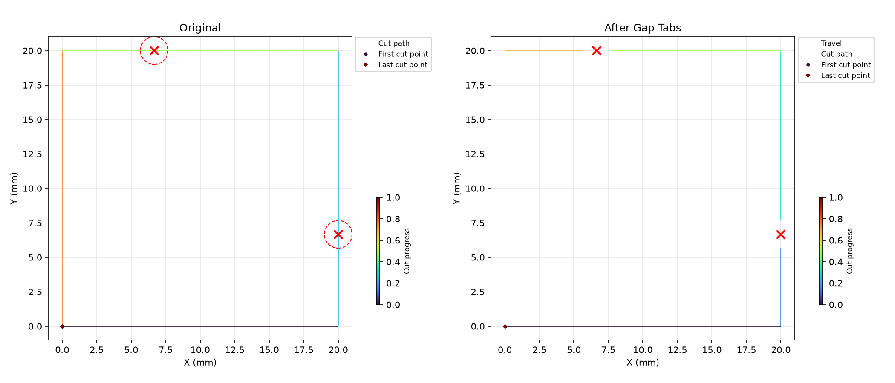
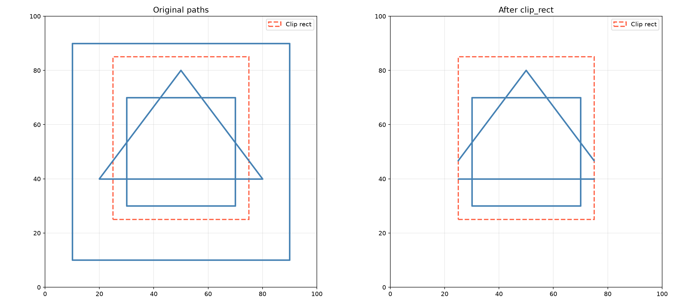
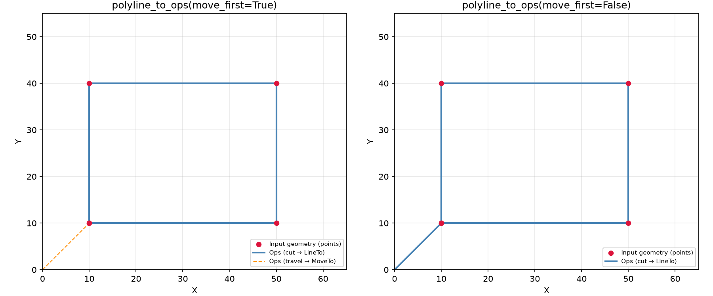
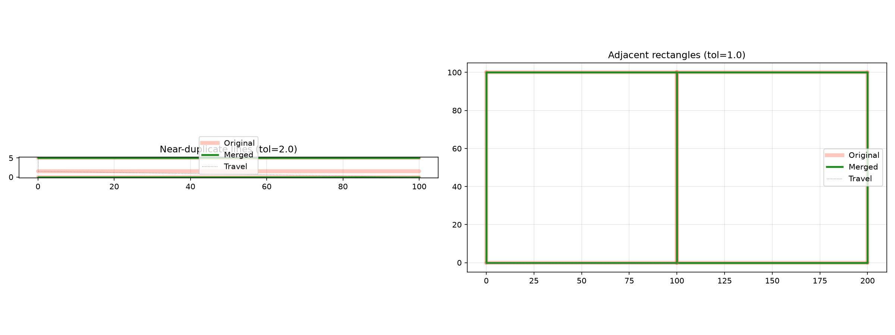
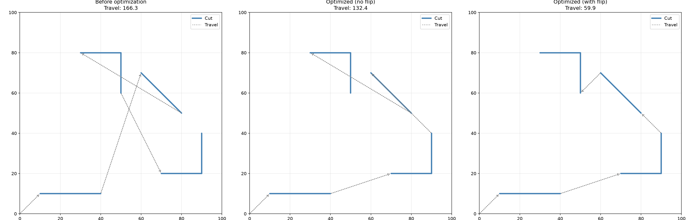

Command sequence (Ops) manipulation for CNC motion control.

Ops is a container of ordered commands (move, line, arc, bezier, state changes like power/feed) that
defines a complete machining job. It supports building sequences programmatically (move_to, line_to,
arc_to, etc.), transforming them (translate, rotate, scale, transform with 4x4 matrices), clipping
to rectangles or regions, linearizing curves, estimating processing time, and serializing to dict or
numpy arrays for persistence.

The module also provides command-type enumerations (CommandType, CommandCategory, SectionType),
machine State tracking (power, feed, coolant, air_assist, head_coolant, frequency), and an Axis
bitflag for multi-axis machines.

## CommandInfo

Detailed information about a single command in an Ops sequence.

Returned by **Ops.inspect** and provides the full set of parameters for any command type in a
structured form.

### `air_assist`

```python
air_assist: Optional[str]
```

Air assist mode string, if a SetAirAssist command.

### `center_offset`

```python
center_offset: Optional[tuple[float, float]]
```

Arc centre offset from start point, if an arc command.

### `clockwise`

```python
clockwise: Optional[bool]
```

Whether an arc is clockwise, if an arc command.

### `control`

```python
control: Optional[tuple[float, float, float]]
```

Quadratic-Bezier control point, if a quad. Bezier command.

### `control1`

```python
control1: Optional[tuple[float, float, float]]
```

First cubic-Bezier control point, if a Bezier command.

### `control2`

```python
control2: Optional[tuple[float, float, float]]
```

Second cubic-Bezier control point, if a Bezier command.

### `coolant`

```python
coolant: Optional[str]
```

Coolant mode string, if a SetCoolant command.

### `duration_ms`

```python
duration_ms: Optional[float]
```

Dwell duration in ms, if a dwell command.

### `end`

```python
end: Optional[tuple[float, float, float]]
```

Endpoint of the command in 3D space, if applicable.

### `extra_axes`

```python
extra_axes: Optional[dict]
```

Extra axis positions, if any.

### `feed_rate`

```python
feed_rate: Optional[int]
```

Feed rate setting, if a SetFeedRate command.

### `frequency`

```python
frequency: Optional[int]
```

Laser frequency (Hz), if a frequency-setting command.

### `head_coolant`

```python
head_coolant: Optional[str]
```

Head coolant mode string, if a SetHeadCoolant command.

### `head_uid`

```python
head_uid: Optional[str]
```

Unique identifier of the active head, if a head-setting command.

### `layer_uid`

```python
layer_uid: Optional[str]
```

Unique identifier of the active layer, if a layer-start command.

### `power`

```python
power: Optional[float]
```

Power level (0–1), if a power-setting command.

### `power_values`

```python
power_values: Optional[bytes]
```

Per-step power byte values for scan-to commands.

### `pulse_width`

```python
pulse_width: Optional[float]
```

Laser pulse width (µs), if a pulse-width-setting command.

### `rapid_rate`

```python
rapid_rate: Optional[int]
```

Rapid rate setting, if a SetRapidRate command.

### `section_type`

```python
section_type: Optional[str]
```

Section type string (e.g. "VectorOutline", "RasterFill"), if a section marker.

### `spindle_rpm`

```python
spindle_rpm: Optional[int]
```

Spindle RPM, if a SetSpindleRpm command.

### `state`

```python
state: Optional[state.State]
```

State snapshot at this command, if present.

### `type_`

```python
type_: types.CommandType
```

The type of this command (e.g. Move, Line, Arc, Bezier, ScanTo, …).

### `workpiece_uid`

```python
workpiece_uid: Optional[str]
```

Unique identifier of the active workpiece, if a workpiece-start command.

## Ops

A sequence of machining operations (commands).

`Ops` is a container of ordered commands that define a complete machining job. It supports building
command sequences programmatically, transforming them, clipping, serializing, and more.

Use the builder methods (`move_to`, `line_to`, `arc_to`, etc.) to construct a sequence, or load from
geometry/dict/numpy arrays.

### `last_move_to`

```python
last_move_to: tuple[float, float, float]
```

The last `(x, y, z)` endpoint from a MoveTo command.

### `scanline_count`

```python
scanline_count: int
```

Return the number of scanline commands in the sequence.

### `air_assist()`

```python
air_assist(idx: int) -> str
```

Get the air assist mode from a SetAirAssist command.

**Raises:** `TypeError` — If the command is not a SetAirAssist.

| Parameter    | Type  | Description                                |
| ------------ | ----- | ------------------------------------------ |
| `idx`        | `int` | Command index.                             |
| _Returns_    | `str` | Air assist mode string (e.g. "Off", "On"). |
| _Complexity_ |       | O(1) time, O(1) space                      |

### `apply_lead_in_out()`

```python
apply_lead_in_out(lead_in_mm: float, lead_out_mm: float) -> None
```

Apply lead-in and lead-out to vector contour paths.

For each contour within a VECTOR_OUTLINE section, extends the toolpath with zero-power lead-in and
lead-out segments along the tangent direction at the path start and end.

| Parameter     | Type    | Description                       |
| ------------- | ------- | --------------------------------- |
| `lead_in_mm`  | `float` | Lead-in distance in millimeters.  |
| `lead_out_mm` | `float` | Lead-out distance in millimeters. |
| _Returns_     | `None`  |                                   |
| _Complexity_  |         | O(n) time, O(n) space             |


*Lead-in and lead-out paths*

### `apply_overscan()`

```python
apply_overscan(distance_mm: float) -> None
```

Apply overscan to raster lines.

Extends raster line start/end points by `distance_mm` along the line direction, adding zero-power
lead-in and lead-out segments for constant engraving velocity.

| Parameter     | Type    | Description                       |
| ------------- | ------- | --------------------------------- |
| `distance_mm` | `float` | Overscan distance in millimeters. |
| _Returns_     | `None`  |                                   |
| _Complexity_  |         | O(n) time, O(n) space             |


*Overscan applied to raster lines*

### `apply_state()`

```python
apply_state(state: state.State) -> None
```

Emit the state commands needed to reach *state*.

Power is always emitted (default 0.0). All other fields are emitted only when set (non-None).
Domain-neutral: does not decide what values to use, just emits them.

| Parameter    | Type          | Description                                          |
| ------------ | ------------- | ---------------------------------------------------- |
| `state`      | `state.State` | The target state to apply.                           |
| _Returns_    | `None`        |                                                      |
| _Complexity_ |               | O(k) time where k = number of set fields, O(k) space |

### `apply_tab_gaps()`

```python
apply_tab_gaps(clips: Sequence[tuple[float, float, float]]) -> None
```

Apply holding tabs as gaps in the toolpath.

For each clip point, the closest subpath is found and a gap of the specified width is cut at the
nearest point on the path. Only `VECTOR_OUTLINE` sections are modified.

| Parameter    | Type                                   | Description                                                  |
| ------------ | -------------------------------------- | ------------------------------------------------------------ |
| `clips`      | `Sequence[tuple[float, float, float]]` | List of `(x, y, width)` tuples defining tab positions.       |
| _Returns_    | `None`                                 |                                                              |
| _Complexity_ |                                        | O(n * k) time, O(1) space where k is the number of tab clips |



*Tab operations on a rectangle*

### `apply_tab_power()`

```python
apply_tab_power(
    clips: Sequence[tuple[float, float, float]],
    tab_power: float,
    original_power: float,
) -> None
```

Apply holding tabs by reducing power in tab regions.

Instead of cutting a gap, the power is lowered in the tab area so the material stays connected but
weaker. Only `VECTOR_OUTLINE` sections are modified.

| Parameter        | Type                                   | Description                                                  |
| ---------------- | -------------------------------------- | ------------------------------------------------------------ |
| `clips`          | `Sequence[tuple[float, float, float]]` | List of `(x, y, width)` tuples defining tab positions.       |
| `tab_power`      | `float`                                | Power level inside tab regions (0.0–1.0).                    |
| `original_power` | `float`                                | Normal cutting power to restore after the tab.               |
| _Returns_        | `None`                                 |                                                              |
| _Complexity_     |                                        | O(n * k) time, O(1) space where k is the number of tab clips |

### `arc_params()`

```python
arc_params(idx: int) -> tuple[float, float, bool]
```

Get the arc parameters (center offset i, j, and clockwise flag).

**Raises:** `TypeError` — If the command is not an ArcTo.

| Parameter    | Type                        | Description                |
| ------------ | --------------------------- | -------------------------- |
| `idx`        | `int`                       | Command index.             |
| _Returns_    | `tuple[float, float, bool]` | `(i, j, clockwise)` tuple. |
| _Complexity_ |                             | O(1) time, O(1) space      |

### `arc_to()`

```python
arc_to(
    x: float,
    y: float,
    i: float,
    j: float,
    clockwise: bool = True,
    z: float = 0.0,
    extra: Optional[dict] = None,
) -> None
```

Add a circular arc to the given coordinates.

| Parameter    | Type                    | Description                                  |
| ------------ | ----------------------- | -------------------------------------------- |
| `x`          | `float`                 | End X coordinate.                            |
| `y`          | `float`                 | End Y coordinate.                            |
| `i`          | `float`                 | I offset from current point to arc center.   |
| `j`          | `float`                 | J offset from current point to arc center.   |
| `clockwise`  | `bool = True`           | Whether the arc is clockwise (default True). |
| `z`          | `float = 0.0`           | End Z coordinate (default 0.0).              |
| `extra`      | `Optional[dict] = None` | Optional dict of extra axis values.          |
| _Returns_    | `None`                  |                                              |
| _Complexity_ |                         | O(1) time, O(1) space                        |

### `bezier_params()`

```python
bezier_params(
    idx: int,
) -> tuple[tuple[float, float, float], tuple[float, float, float]]
```

Get the cubic bezier control points.

**Raises:** `TypeError` — If the command is not a BezierTo.

| Parameter    | Type                                                            | Description                                          |
| ------------ | --------------------------------------------------------------- | ---------------------------------------------------- |
| `idx`        | `int`                                                           | Command index.                                       |
| _Returns_    | `tuple[tuple[float, float, float], tuple[float, float, float]]` | `((c1x, c1y, c1z), (c2x, c2y, c2z))` control points. |
| _Complexity_ |                                                                 | O(1) time, O(1) space                                |

### `bezier_to()`

```python
bezier_to(
    control1: tuple[float, float, float],
    control2: tuple[float, float, float],
    end: tuple[float, float, float],
    extra: Optional[dict] = None,
) -> None
```

Add a cubic bezier curve to the given endpoint.

| Parameter    | Type                         | Description                         |
| ------------ | ---------------------------- | ----------------------------------- |
| `control1`   | `tuple[float, float, float]` | First control point `(x, y, z)`.    |
| `control2`   | `tuple[float, float, float]` | Second control point `(x, y, z)`.   |
| `end`        | `tuple[float, float, float]` | End point `(x, y, z)`.              |
| `extra`      | `Optional[dict] = None`      | Optional dict of extra axis values. |
| _Returns_    | `None`                       |                                     |
| _Complexity_ |                              | O(1) time, O(1) space               |

### `category()`

```python
category(idx: int) -> types.CommandCategory
```

Get the **CommandCategory** at the given index.

| Parameter    | Type                    | Description                              |
| ------------ | ----------------------- | ---------------------------------------- |
| `idx`        | `int`                   | Command index (negative = from end).     |
| _Returns_    | `types.CommandCategory` | The category (MOVING, STATE, or MARKER). |
| _Complexity_ |                         | O(1) time, O(1) space                    |

### `clear()`

```python
clear() -> None
```

Remove all commands from this Ops sequence.

| Parameter    | Type   | Description           |
| ------------ | ------ | --------------------- |
| _Returns_    | `None` |                       |
| _Complexity_ |        | O(1) time, O(1) space |

### `clip_at()`

```python
clip_at(x: float, y: float, width: float) -> bool
```

Clip at a single vertical swath, keeping commands that intersect the band.

| Parameter    | Type    | Description                                       |
| ------------ | ------- | ------------------------------------------------- |
| `x`          | `float` | X coordinate of the left edge.                    |
| `y`          | `float` | Y coordinate (used to find the relevant segment). |
| `width`      | `float` | Width of the band.                                |
| _Returns_    | `bool`  | True if any commands were kept.                   |
| _Complexity_ |         | O(n) time, O(1) space                             |

### `clip_ops_to_regions()`

```python
clip_ops_to_regions(
    regions: Sequence[Sequence[tuple[float, float]]],
    tolerance: float = 0.3,
) -> None
```

Clip paths using polygonal regions as boundaries; keeps what is inside.

| Parameter    | Type                                      | Description                                                         |
| ------------ | ----------------------------------------- | ------------------------------------------------------------------- |
| `regions`    | `Sequence[Sequence[tuple[float, float]]]` | List of polygons, each being a list of `(x, y)` vertices.           |
| `tolerance`  | `float = 0.3`                             | Approximation tolerance (default 0.3).                              |
| _Returns_    | `None`                                    |                                                                     |
| _Complexity_ |                                           | O(n * m) time, O(n) space where m is the number of polygon vertices |

### `clip_rect()`

```python
clip_rect(rect: tuple[float, float, float, float]) -> Ops
```

Clip this sequence to a rectangle, keeping only commands inside.

| Parameter    | Type                                | Description                                         |
| ------------ | ----------------------------------- | --------------------------------------------------- |
| `rect`       | `tuple[float, float, float, float]` | `(x_min, y_min, x_max, y_max)`.                     |
| _Returns_    | `Ops`                               | A new Ops sequence containing the clipped commands. |
| _Complexity_ |                                     | O(n) time, O(n) space                               |



*Ops paths clipped to a rectangle*

### `clip_to_regions()`

```python
clip_to_regions(
    regions: Sequence[Sequence[tuple[float, float]]],
    tolerance: float = 0.3,
) -> None
```

Clip paths to the given polygonal regions, keeping only what is inside.

| Parameter    | Type                                      | Description                                                         |
| ------------ | ----------------------------------------- | ------------------------------------------------------------------- |
| `regions`    | `Sequence[Sequence[tuple[float, float]]]` | List of polygons, each being a list of `(x, y)` vertices.           |
| `tolerance`  | `float = 0.3`                             | Approximation tolerance (default 0.3).                              |
| _Returns_    | `None`                                    |                                                                     |
| _Complexity_ |                                           | O(n * m) time, O(n) space where m is the number of polygon vertices |

### `close_path()`

```python
close_path() -> None
```

Close the current sub-path by adding a line back to the start.

| Parameter    | Type   | Description           |
| ------------ | ------ | --------------------- |
| _Returns_    | `None` |                       |
| _Complexity_ |        | O(1) time, O(1) space |

### `command_type()`

```python
command_type(idx: int) -> types.CommandType
```

Get the **CommandType** at the given index.

| Parameter    | Type                | Description                          |
| ------------ | ------------------- | ------------------------------------ |
| `idx`        | `int`               | Command index (negative = from end). |
| _Returns_    | `types.CommandType` | The **CommandType** of the command.  |
| _Complexity_ |                     | O(1) time, O(1) space                |

### `coolant()`

```python
coolant(idx: int) -> str
```

Get the coolant mode from a SetCoolant command.

**Raises:** `TypeError` — If the command is not a SetCoolant.

| Parameter    | Type  | Description                                        |
| ------------ | ----- | -------------------------------------------------- |
| `idx`        | `int` | Command index.                                     |
| _Returns_    | `str` | Coolant mode string (e.g. "Off", "Flood", "Mist"). |
| _Complexity_ |       | O(1) time, O(1) space                              |

### `copy()`

```python
copy() -> Ops
```

Return a deep copy of this Ops sequence.

| Parameter    | Type  | Description           |
| ------------ | ----- | --------------------- |
| _Returns_    | `Ops` | A new `Ops` instance. |
| _Complexity_ |       | O(n) time, O(n) space |

### `copy_command_from()`

```python
copy_command_from(source: Ops, idx: int) -> None
```

Copy a single command from another Ops sequence into this one.

| Parameter    | Type   | Description                   |
| ------------ | ------ | ----------------------------- |
| `source`     | `Ops`  | The source Ops sequence.      |
| `idx`        | `int`  | Index of the command to copy. |
| _Returns_    | `None` |                               |
| _Complexity_ |        | O(1) time, O(1) space         |

### `count_cutting()`

```python
count_cutting() -> int
```

Return the number of cutting commands in this sequence.

Counts all LineTo, ArcTo, BezierTo, QuadraticBezierTo, and ScanLine commands.

| Parameter    | Type  | Description                 |
| ------------ | ----- | --------------------------- |
| _Returns_    | `int` | Number of cutting commands. |
| _Complexity_ |       | O(n) time, O(1) space       |

### `count_travel()`

```python
count_travel() -> int
```

Return the number of travel (MoveTo) commands in this sequence.

| Parameter    | Type  | Description                |
| ------------ | ----- | -------------------------- |
| _Returns_    | `int` | Number of travel commands. |
| _Complexity_ |       | O(n) time, O(1) space      |

### `cut_distance()`

```python
cut_distance() -> float
```

Compute the total cutting distance (excluding travel moves).

| Parameter    | Type    | Description               |
| ------------ | ------- | ------------------------- |
| _Returns_    | `float` | Total cut distance in mm. |
| _Complexity_ |         | O(n) time, O(1) space     |

### `distance()`

```python
distance() -> float
```

Compute the total distance of all commands.

| Parameter    | Type    | Description                |
| ------------ | ------- | -------------------------- |
| _Returns_    | `float` | Total path distance in mm. |
| _Complexity_ |         | O(n) time, O(1) space      |

### `distance_at()`

```python
distance_at(
    idx: int,
    last_point: Optional[tuple[float, float, float]] = None,
) -> float
```

Compute the distance traveled up to command *idx*.

| Parameter    | Type                                          | Description                       |
| ------------ | --------------------------------------------- | --------------------------------- |
| `idx`        | `int`                                         | Command index.                    |
| `last_point` | `Optional[tuple[float, float, float]] = None` | Optional starting point override. |
| _Returns_    | `float`                                       | Cumulative distance.              |
| _Complexity_ |                                               | O(1) time, O(1) space             |

### `dump()`

```python
dump() -> None
```

Print a human-readable dump of all commands.

| Parameter    | Type   | Description           |
| ------------ | ------ | --------------------- |
| _Returns_    | `None` |                       |
| _Complexity_ |        | O(n) time, O(n) space |

### `dwell()`

```python
dwell(duration_ms: float) -> None
```

Pause execution for a given duration.

| Parameter     | Type    | Description                     |
| ------------- | ------- | ------------------------------- |
| `duration_ms` | `float` | Dwell duration in milliseconds. |
| _Returns_     | `None`  |                                 |
| _Complexity_  |         | O(1) time, O(1) space           |

### `dwell_duration()`

```python
dwell_duration(idx: int) -> float
```

Get the duration (milliseconds) of a Dwell command.

**Raises:** `TypeError` — If the command is not a Dwell.

| Parameter    | Type    | Description               |
| ------------ | ------- | ------------------------- |
| `idx`        | `int`   | Command index.            |
| _Returns_    | `float` | Duration in milliseconds. |
| _Complexity_ |         | O(1) time, O(1) space     |

### `endpoint()`

```python
endpoint(idx: int) -> tuple[float, float, float]
```

Get the endpoint coordinates of a moving command.

| Parameter    | Type                         | Description                          |
| ------------ | ---------------------------- | ------------------------------------ |
| `idx`        | `int`                        | Command index (negative = from end). |
| _Returns_    | `tuple[float, float, float]` | `(x, y, z)` tuple.                   |
| _Complexity_ |                              | O(1) time, O(1) space                |

### `estimate_command_times()`

```python
estimate_command_times(
    default_feed_rate: float = 1000.0,
    default_rapid_rate: float = 3000.0,
    acceleration: float = 1000.0,
) -> list[float]
```

Estimate the time of each individual command in the sequence.

Returns a list with one entry per command. Moving commands (MoveTo, LineTo, ArcTo, etc.) yield their
estimated execution time in seconds. Non-moving commands (state changes, markers) yield 0.0.

| Parameter            | Type             | Description                                          |
| -------------------- | ---------------- | ---------------------------------------------------- |
| `default_feed_rate`  | `float = 1000.0` | Default feed rate (default 1000.0).                  |
| `default_rapid_rate` | `float = 3000.0` | Default rapid rate (default 3000.0).                 |
| `acceleration`       | `float = 1000.0` | Acceleration value (default 1000.0).                 |
| _Returns_            | `list[float]`    | List of estimated times in seconds, one per command. |
| _Complexity_         |                  | O(n) time, O(n) space                                |

### `estimate_time()`

```python
estimate_time(
    default_feed_rate: float = 1000.0,
    default_rapid_rate: float = 3000.0,
    acceleration: float = 1000.0,
) -> float
```

Estimate the total processing time for this sequence.

| Parameter            | Type             | Description                          |
| -------------------- | ---------------- | ------------------------------------ |
| `default_feed_rate`  | `float = 1000.0` | Default feed rate (default 1000.0).  |
| `default_rapid_rate` | `float = 3000.0` | Default rapid rate (default 3000.0). |
| `acceleration`       | `float = 1000.0` | Acceleration value (default 1000.0). |
| _Returns_            | `float`          | Estimated time in seconds.           |
| _Complexity_         |                  | O(n) time, O(1) space                |

### `extend()`

```python
extend(other: Optional[Ops]) -> None
```

Extend this Ops sequence with commands from another.

| Parameter    | Type            | Description                                 |
| ------------ | --------------- | ------------------------------------------- |
| `other`      | `Optional[Ops]` | The other Ops sequence (or None for no-op). |
| _Returns_    | `None`          |                                             |
| _Complexity_ |                 | O(n) time, O(n) space                       |

### `extra_axes()`

```python
extra_axes(idx: int) -> Optional[dict]
```

Get the extra axes data for a moving command.

| Parameter    | Type             | Description                                 |
| ------------ | ---------------- | ------------------------------------------- |
| `idx`        | `int`            | Command index.                              |
| _Returns_    | `Optional[dict]` | Dict mapping axis names to values, or None. |
| _Complexity_ |                  | O(1) time, O(1) space                       |

### `flip_ops()`

```python
flip_ops() -> Ops
```

Reverse the order of subpaths.

| Parameter    | Type  | Description                            |
| ------------ | ----- | -------------------------------------- |
| _Returns_    | `Ops` | A new Ops with subpath order reversed. |
| _Complexity_ |       | O(n) time, O(n) space                  |

### `frequency()`

```python
frequency(idx: int) -> int
```

Get the frequency of a SetFrequency command.

**Raises:** `TypeError` — If the command is not a SetFrequency.

| Parameter    | Type  | Description           |
| ------------ | ----- | --------------------- |
| `idx`        | `int` | Command index.        |
| _Returns_    | `int` | Frequency in Hz.      |
| _Complexity_ |       | O(1) time, O(1) space |

### `from_dict()`

```python
@classmethod from_dict(data: dict) -> Ops
```

Create an Ops sequence from a dictionary.

| Parameter    | Type   | Description                        |
| ------------ | ------ | ---------------------------------- |
| `data`       | `dict` | Dictionary as produced by to_dict. |
| _Returns_    | `Ops`  | A new `Ops` instance.              |
| _Complexity_ |        | O(n) time, O(n) space              |

### `from_geometry()`

```python
@classmethod from_geometry(geometry: geo.Geometry) -> Ops
```

Create an Ops sequence from a Geometry.

| Parameter    | Type           | Description              |
| ------------ | -------------- | ------------------------ |
| `geometry`   | `geo.Geometry` | The geometry to convert. |
| _Returns_    | `Ops`          | A new `Ops` instance.    |
| _Complexity_ |                | O(n) time, O(n) space    |

### `from_mask_lines()`

```python
from_mask_lines(
    mask: Any,
    pixels_per_mm: tuple[float, float],
    offset_x_mm: float,
    offset_y_mm: float,
    line_interval_mm: float,
    z: float = 0.0,
    angle: float = 0.0,
    scan_mode: scan.ScanMode = scan.ScanMode.SEGMENTED,
) -> Ops
```

Rasterise a binary mask into line-to commands (no power).

Similar to **from_mask_scan** but emits move-to/line-to commands with a Z offset instead of scan-to
with power values. Useful for simple contour or hatch patterns.

| Parameter          | Type                                      | Description                                                                         |
| ------------------ | ----------------------------------------- | ----------------------------------------------------------------------------------- |
| `mask`             | `Any`                                     | 2-D binary mask array.                                                              |
| `pixels_per_mm`    | `tuple[float, float]`                     | `(x, y)` pixel density in px/mm.                                                    |
| `offset_x_mm`      | `float`                                   | Global X offset in mm.                                                              |
| `offset_y_mm`      | `float`                                   | Global Y offset in mm.                                                              |
| `line_interval_mm` | `float`                                   | Spacing between scan lines in mm.                                                   |
| `z`                | `float = 0.0`                             | Z offset for the lines in mm.                                                       |
| `angle`            | `float = 0.0`                             | Scan angle in degrees.                                                              |
| `scan_mode`        | `scan.ScanMode = scan.ScanMode.SEGMENTED` | `ScanMode.SEGMENTED` or `ScanMode.FULL_SWEEP`.                                      |
| _Returns_          | `Ops`                                     | A new **Ops** container.                                                            |
| _Complexity_       |                                           | O(h * w + n * p) where h, w = image dimensions, n = scan lines, p = pixels per line |

### `from_mask_scan()`

```python
from_mask_scan(
    mask: Any,
    pixels_per_mm: tuple[float, float],
    offset_x_mm: float,
    offset_y_mm: float,
    line_interval_mm: float,
    step_power: float = 1.0,
    angle: float = 0.0,
    scan_mode: scan.ScanMode = scan.ScanMode.SEGMENTED,
) -> Ops
```

Rasterise a binary mask into scan-to commands.

Generates scan lines covering the mask's bounding box, samples the mask along each line, and emits
move-to/scan-to commands for each non-zero segment (or the full sweep).

| Parameter          | Type                                      | Description                                                                         |
| ------------------ | ----------------------------------------- | ----------------------------------------------------------------------------------- |
| `mask`             | `Any`                                     | 2-D binary mask array.                                                              |
| `pixels_per_mm`    | `tuple[float, float]`                     | `(x, y)` pixel density in px/mm.                                                    |
| `offset_x_mm`      | `float`                                   | Global X offset in mm.                                                              |
| `offset_y_mm`      | `float`                                   | Global Y offset in mm.                                                              |
| `line_interval_mm` | `float`                                   | Spacing between scan lines in mm.                                                   |
| `step_power`       | `float = 1.0`                             | Power value (0-1) for exposed pixels.                                               |
| `angle`            | `float = 0.0`                             | Scan angle in degrees.                                                              |
| `scan_mode`        | `scan.ScanMode = scan.ScanMode.SEGMENTED` | `ScanMode.SEGMENTED` or `ScanMode.FULL_SWEEP`.                                      |
| _Returns_          | `Ops`                                     | A new **Ops** container.                                                            |
| _Complexity_       |                                           | O(h * w + n * p) where h, w = image dimensions, n = scan lines, p = pixels per line |

### `from_multi_pass_image()`

```python
from_multi_pass_image(
    gray_image: Any,
    pixels_per_mm: tuple[float, float],
    offset_x_mm: float,
    offset_y_mm: float,
    line_interval_mm: float,
    num_depth_levels: int,
    z_step_down: float,
    angle: float = 0.0,
    angle_increment: float = 0.0,
    scan_mode: scan.ScanMode = scan.ScanMode.SEGMENTED,
) -> Ops
```

Rasterise a grayscale image as multiple Z-depth passes.

Decomposes the grayscale image into *num_depth_levels* layers by depth-slicing, then rasterises each
layer with a progressive Z offset and optional per-pass angle increment.

| Parameter          | Type                                      | Description                                                                                           |
| ------------------ | ----------------------------------------- | ----------------------------------------------------------------------------------------------------- |
| `gray_image`       | `Any`                                     | 2-D grayscale image (0 = black, 255 = white).                                                         |
| `pixels_per_mm`    | `tuple[float, float]`                     | `(x, y)` pixel density in px/mm.                                                                      |
| `offset_x_mm`      | `float`                                   | Global X offset in mm.                                                                                |
| `offset_y_mm`      | `float`                                   | Global Y offset in mm.                                                                                |
| `line_interval_mm` | `float`                                   | Spacing between scan lines in mm.                                                                     |
| `num_depth_levels` | `int`                                     | Number of depth layers to produce.                                                                    |
| `z_step_down`      | `float`                                   | Z decrement per depth layer in mm.                                                                    |
| `angle`            | `float = 0.0`                             | Initial scan angle in degrees.                                                                        |
| `angle_increment`  | `float = 0.0`                             | Angle added per depth layer in degrees.                                                               |
| `scan_mode`        | `scan.ScanMode = scan.ScanMode.SEGMENTED` | `ScanMode.SEGMENTED` or `ScanMode.FULL_SWEEP`.                                                        |
| _Returns_          | `Ops`                                     | A new **Ops** container.                                                                              |
| _Complexity_       |                                           | O(d * (h * w + n * p)) where d = depth levels, h, w = image dims, n = scan lines, p = pixels per line |

### `from_numpy_arrays()`

```python
@classmethod from_numpy_arrays(arrays: dict) -> Ops
```

Create an Ops sequence from numpy arrays.

| Parameter    | Type   | Description                                |
| ------------ | ------ | ------------------------------------------ |
| `arrays`     | `dict` | Dictionary as produced by to_numpy_arrays. |
| _Returns_    | `Ops`  | A new `Ops` instance.                      |
| _Complexity_ |        | O(n) time, O(n) space                      |

### `from_polyline()`

```python
from_polyline(
    points: Sequence[tuple[float, float, float]],
    move_first: bool = True,
    state: Optional[state.State] = None,
) -> Ops
```

Build an Ops sequence from a 3-D polyline.

When *move_first* is `True` the first point is emitted as a MoveTo and subsequent points as LineTo.
When *move_first* is `False` every point is emitted as a LineTo (useful for appending a polyline to
an in-progress cut).

When *state* is provided, its commands (power, feed rate, etc.) are applied before the polyline
points.

| Parameter    | Type                                   | Description                                      |
| ------------ | -------------------------------------- | ------------------------------------------------ |
| `points`     | `Sequence[tuple[float, float, float]]` | List of `(x, y, z)` tuples.                      |
| `move_first` | `bool = True`                          | Whether to emit the first point as a MoveTo.     |
| `state`      | `Optional[state.State] = None`         | Optional machine state to apply before the path. |
| _Returns_    | `Ops`                                  | A new `Ops` instance.                            |
| _Complexity_ |                                        | O(n) where n = number of points                  |



*Ops.from_polyline with move_first=True vs move_first=False*

### `from_power_modulated_image()`

```python
from_power_modulated_image(
    gray_image: Any,
    alpha: Any,
    pixels_per_mm: tuple[float, float],
    offset_x_mm: float,
    offset_y_mm: float,
    line_interval_mm: float,
    sample_interval_mm: float,
    min_power: float = 0.0,
    max_power: float = 1.0,
    step_power: float = 1.0,
    num_power_levels: int = 256,
    angle: float = 0.0,
    scan_mode: scan.ScanMode = scan.ScanMode.SEGMENTED,
) -> Ops
```

Rasterise a grayscale image with power-modulated scans.

Samples the image along scan lines and computes per-pixel power values from the grayscale intensity
and alpha channel, then emits move-to/scan-to commands with the modulated power.

| Parameter            | Type                                      | Description                                                                         |
| -------------------- | ----------------------------------------- | ----------------------------------------------------------------------------------- |
| `gray_image`         | `Any`                                     | 2-D grayscale image (0 = black, 255 = white).                                       |
| `alpha`              | `Any`                                     | 2-D alpha mask (0 = transparent/no emission).                                       |
| `pixels_per_mm`      | `tuple[float, float]`                     | `(x, y)` pixel density in px/mm.                                                    |
| `offset_x_mm`        | `float`                                   | Global X offset in mm.                                                              |
| `offset_y_mm`        | `float`                                   | Global Y offset in mm.                                                              |
| `line_interval_mm`   | `float`                                   | Spacing between scan lines in mm.                                                   |
| `sample_interval_mm` | `float`                                   | Output sample spacing in mm.                                                        |
| `min_power`          | `float = 0.0`                             | Minimum power fraction (for white pixels).                                          |
| `max_power`          | `float = 1.0`                             | Maximum power fraction (for black pixels).                                          |
| `step_power`         | `float = 1.0`                             | Global power multiplier.                                                            |
| `num_power_levels`   | `int = 256`                               | Number of quantised power levels.                                                   |
| `angle`              | `float = 0.0`                             | Scan angle in degrees.                                                              |
| `scan_mode`          | `scan.ScanMode = scan.ScanMode.SEGMENTED` | `ScanMode.SEGMENTED` or `ScanMode.FULL_SWEEP`.                                      |
| _Returns_            | `Ops`                                     | A new **Ops** container.                                                            |
| _Complexity_         |                                           | O(h * w + n * p) where h, w = image dimensions, n = scan lines, p = pixels per line |

### `get_frame()`

```python
get_frame(
    power: Optional[float] = None,
    feed_rate: Optional[float] = None,
) -> Ops
```

Extract a frame (first and last endpoints) from the sequence.

| Parameter    | Type                     | Description                                      |
| ------------ | ------------------------ | ------------------------------------------------ |
| `power`      | `Optional[float] = None` | Laser power value (0.0 to 1.0).                  |
| `feed_rate`  | `Optional[float] = None` | Optional feed rate to set on the frame commands. |
| _Returns_    | `Ops`                    | A new Ops containing only the frame endpoints.   |
| _Complexity_ |                          | O(n) time, O(n) space                            |

### `group_by_auxiliary_state()`

```python
group_by_auxiliary_state() -> list[Ops]
```

Group contiguous commands with the same auxiliary state into separate Ops sequences.

Groups by continuity of auxiliary state (coolant, air_assist, head_coolant) only. For full
parameter-regime grouping, use **OpsSection.state_blocks** with `StateBlockStart`/`StateBlockEnd`
markers.

| Parameter    | Type        | Description                                                    |
| ------------ | ----------- | -------------------------------------------------------------- |
| _Returns_    | `list[Ops]` | A list of Ops sequences grouped by auxiliary state continuity. |
| _Complexity_ |             | O(n) time, O(n) space                                          |

### `head_coolant()`

```python
head_coolant(idx: int) -> str
```

Get the head coolant mode from a SetHeadCoolant command.

**Raises:** `TypeError` — If the command is not a SetHeadCoolant.

| Parameter    | Type  | Description                                  |
| ------------ | ----- | -------------------------------------------- |
| `idx`        | `int` | Command index.                               |
| _Returns_    | `str` | Head coolant mode string (e.g. "Off", "On"). |
| _Complexity_ |       | O(1) time, O(1) space                        |

### `head_uid()`

```python
head_uid(idx: int) -> str
```

Get the head UID from a SetHead command.

**Raises:** `TypeError` — If the command is not a SetHead.

| Parameter    | Type  | Description           |
| ------------ | ----- | --------------------- |
| `idx`        | `int` | Command index.        |
| _Returns_    | `str` | The head identifier.  |
| _Complexity_ |       | O(1) time, O(1) space |

### `indices_of()`

```python
indices_of(ct: types.CommandType) -> list[int]
```

Return all indices where the command type matches *ct*.

| Parameter    | Type                | Description                        |
| ------------ | ------------------- | ---------------------------------- |
| `ct`         | `types.CommandType` | The **CommandType** to search for. |
| _Returns_    | `list[int]`         | List of matching command indices.  |
| _Complexity_ |                     | O(n) time, O(n) space              |

### `inspect()`

```python
inspect(idx: int) -> CommandInfo
```

Return detailed information about a single command.

| Parameter    | Type          | Description                                                 |
| ------------ | ------------- | ----------------------------------------------------------- |
| `idx`        | `int`         | The command index.                                          |
| _Returns_    | `CommandInfo` | A CommandInfo object with type, endpoint, state, axes, etc. |
| _Complexity_ |               | O(1) time, O(1) space                                       |

### `is_cutting()`

```python
is_cutting(idx: int) -> bool
```

Check whether the command at *idx* is a cutting move.

| Parameter    | Type   | Description                            |
| ------------ | ------ | -------------------------------------- |
| `idx`        | `int`  | Command index.                         |
| _Returns_    | `bool` | True if the command is a cutting move. |
| _Complexity_ |        | O(1) time, O(1) space                  |

### `is_empty()`

```python
is_empty() -> bool
```

Check if the ops sequence is empty.

| Parameter    | Type   | Description                       |
| ------------ | ------ | --------------------------------- |
| _Returns_    | `bool` | `True` if the container is empty. |
| _Complexity_ |        | O(1) time, O(1) space             |

### `is_marker()`

```python
is_marker(idx: int) -> bool
```

Check whether the command at *idx* is a marker command.

| Parameter    | Type   | Description                                                              |
| ------------ | ------ | ------------------------------------------------------------------------ |
| `idx`        | `int`  | Command index.                                                           |
| _Returns_    | `bool` | True if the command is a structural marker (JobStart, LayerStart, etc.). |
| _Complexity_ |        | O(1) time, O(1) space                                                    |

### `is_scanline()`

```python
is_scanline(idx: int) -> bool
```

Check whether the command at *idx* is a scanline command.

| Parameter    | Type   | Description                                      |
| ------------ | ------ | ------------------------------------------------ |
| `idx`        | `int`  | Command index.                                   |
| _Returns_    | `bool` | True if the command is a ScanLine power command. |
| _Complexity_ |        | O(1) time, O(1) space                            |

### `is_state()`

```python
is_state(idx: int) -> bool
```

Check whether the command at *idx* is a state command.

| Parameter    | Type   | Description                                 |
| ------------ | ------ | ------------------------------------------- |
| `idx`        | `int`  | Command index.                              |
| _Returns_    | `bool` | True if the command modifies machine state. |
| _Complexity_ |        | O(1) time, O(1) space                       |

### `is_travel()`

```python
is_travel(idx: int) -> bool
```

Check whether the command at *idx* is a travel (non-cutting) move.

| Parameter    | Type   | Description                           |
| ------------ | ------ | ------------------------------------- |
| `idx`        | `int`  | Command index.                        |
| _Returns_    | `bool` | True if the command is a travel move. |
| _Complexity_ |        | O(1) time, O(1) space                 |

### `job_end()`

```python
job_end() -> None
```

Mark the end of a job.

| Parameter    | Type   | Description           |
| ------------ | ------ | --------------------- |
| _Returns_    | `None` |                       |
| _Complexity_ |        | O(1) time, O(1) space |

### `job_start()`

```python
job_start() -> None
```

Mark the start of a job.

| Parameter    | Type   | Description           |
| ------------ | ------ | --------------------- |
| _Returns_    | `None` |                       |
| _Complexity_ |        | O(1) time, O(1) space |

### `layer_end()`

```python
layer_end(layer_uid: str) -> None
```

Mark the end of a layer.

| Parameter    | Type   | Description           |
| ------------ | ------ | --------------------- |
| `layer_uid`  | `str`  | The layer identifier. |
| _Returns_    | `None` |                       |
| _Complexity_ |        | O(1) time, O(1) space |

### `layer_start()`

```python
layer_start(layer_uid: str) -> None
```

Mark the start of a layer.

| Parameter    | Type   | Description           |
| ------------ | ------ | --------------------- |
| `layer_uid`  | `str`  | The layer identifier. |
| _Returns_    | `None` |                       |
| _Complexity_ |        | O(1) time, O(1) space |

### `layer_uid()`

```python
layer_uid(idx: int) -> str
```

Get the layer UID from a LayerStart or LayerEnd command.

**Raises:** `TypeError` — If the command is not a Layer command.

| Parameter    | Type  | Description           |
| ------------ | ----- | --------------------- |
| `idx`        | `int` | Command index.        |
| _Returns_    | `str` | The layer identifier. |
| _Complexity_ |       | O(1) time, O(1) space |

### `len()`

```python
len() -> int
```

Return the number of commands.

| Parameter    | Type  | Description                          |
| ------------ | ----- | ------------------------------------ |
| _Returns_    | `int` | Number of commands in the container. |
| _Complexity_ |       | O(1) time, O(1) space                |

### `line_to()`

```python
line_to(
    x: float,
    y: float,
    z: float = 0.0,
    extra: Optional[dict] = None,
) -> None
```

Add a cutting line to the given coordinates.

| Parameter    | Type                    | Description                         |
| ------------ | ----------------------- | ----------------------------------- |
| `x`          | `float`                 | X coordinate.                       |
| `y`          | `float`                 | Y coordinate.                       |
| `z`          | `float = 0.0`           | Z coordinate (default 0.0).         |
| `extra`      | `Optional[dict] = None` | Optional dict of extra axis values. |
| _Returns_    | `None`                  |                                     |
| _Complexity_ |                         | O(1) time, O(1) space               |

### `linearize()`

```python
linearize(idx: int, start_point: tuple[float, float, float]) -> Ops
```

Decompose a curved command into linear segments.

**Raises:** `TypeError` — If the command at idx is not a curve or line type.

| Parameter     | Type                         | Description                                       |
| ------------- | ---------------------------- | ------------------------------------------------- |
| `idx`         | `int`                        | Index of the command to linearize.                |
| `start_point` | `tuple[float, float, float]` | The `(x, y, z)` start point of the curve.         |
| _Returns_     | `Ops`                        | A new Ops containing the linearized sub-commands. |
| _Complexity_  |                              | O(n) time, O(n) space                             |

### `linearize_all()`

```python
linearize_all() -> None
```

Replace all curved commands with linear approximations in-place.

| Parameter    | Type   | Description           |
| ------------ | ------ | --------------------- |
| _Returns_    | `None` |                       |
| _Complexity_ |        | O(n) time, O(n) space |

### `linearize_arcs()`

```python
linearize_arcs() -> None
```

Replace only arc commands with linear approximations.

| Parameter    | Type   | Description           |
| ------------ | ------ | --------------------- |
| _Returns_    | `None` |                       |
| _Complexity_ |        | O(n) time, O(n) space |

### `linearize_curves()`

```python
linearize_curves() -> None
```

Replace only bezier and quadratic bezier curves with linear approximations.

| Parameter    | Type   | Description           |
| ------------ | ------ | --------------------- |
| _Returns_    | `None` |                       |
| _Complexity_ |        | O(n) time, O(n) space |

### `merge_overlapping_lines()`

```python
merge_overlapping_lines(tolerance: float) -> None
```

Merge overlapping line segments across all paths.

Detects line segments that are collinear and overlapping and replaces the covered sub-segments with
travel moves to avoid cutting the same line twice.

| Parameter    | Type    | Description                                       |
| ------------ | ------- | ------------------------------------------------- |
| `tolerance`  | `float` | Maximum distance for considering lines collinear. |
| _Returns_    | `None`  |                                                   |
| _Complexity_ |         | O(n log n) average time, O(n) space               |



*Line merging before and after*

### `move_to()`

```python
move_to(
    x: float,
    y: float,
    z: float = 0.0,
    extra: Optional[dict] = None,
) -> None
```

Add a rapid (non-cutting) move to the given coordinates.

| Parameter    | Type                    | Description                         |
| ------------ | ----------------------- | ----------------------------------- |
| `x`          | `float`                 | X coordinate.                       |
| `y`          | `float`                 | Y coordinate.                       |
| `z`          | `float = 0.0`           | Z coordinate (default 0.0).         |
| `extra`      | `Optional[dict] = None` | Optional dict of extra axis values. |
| _Returns_    | `None`                  |                                     |
| _Complexity_ |                         | O(1) time, O(1) space               |

### `ops_section_end()`

```python
ops_section_end(section_type: types.SectionType) -> None
```

Mark the end of an ops section.

| Parameter      | Type                | Description           |
| -------------- | ------------------- | --------------------- |
| `section_type` | `types.SectionType` | The type of section.  |
| _Returns_      | `None`              |                       |
| _Complexity_   |                     | O(1) time, O(1) space |

### `ops_section_end_with_mode()`

```python
ops_section_end_with_mode(
    section_type: types.SectionType,
    *,
    raster_mode: Optional[types.RasterMode] = None,
) -> None
```

Mark the end of an ops section with a raster mode.

| Parameter      | Type                         | Description           |
| -------------- | ---------------------------- | --------------------- |
| `section_type` | `types.SectionType`          | The type of section.  |
| `raster_mode`  | `Optional[types.RasterMode]` | Optional raster mode. |
| _Returns_      | `None`                       |                       |
| _Complexity_   |                              | O(1) time, O(1) space |

### `ops_section_start()`

```python
ops_section_start(section_type: types.SectionType, workpiece_uid: str) -> None
```

Mark the start of an ops section.

| Parameter       | Type                | Description               |
| --------------- | ------------------- | ------------------------- |
| `section_type`  | `types.SectionType` | The type of section.      |
| `workpiece_uid` | `str`               | The workpiece identifier. |
| _Returns_       | `None`              |                           |
| _Complexity_    |                     | O(1) time, O(1) space     |

### `ops_section_start_with_mode()`

```python
ops_section_start_with_mode(
    section_type: types.SectionType,
    workpiece_uid: str,
    *,
    raster_mode: Optional[types.RasterMode] = None,
) -> None
```

Mark the start of an ops section with a raster mode.

| Parameter       | Type                         | Description               |
| --------------- | ---------------------------- | ------------------------- |
| `section_type`  | `types.SectionType`          | The type of section.      |
| `workpiece_uid` | `str`                        | The workpiece identifier. |
| `raster_mode`   | `Optional[types.RasterMode]` | Optional raster mode.     |
| _Returns_       | `None`                       |                           |
| _Complexity_    |                              | O(1) time, O(1) space     |

### `optimize_travel()`

```python
optimize_travel(
    allow_flip: bool = True,
    preserve_first: bool = False,
    preserve_order: Sequence[str] = [],
    progress_cb: Optional[Any] = None,
) -> None
```

Optimize travel distance by reordering segments.

Performs two-level optimization: workpiece-level reordering (when workpiece markers are present) and
segment-level nearest-neighbor + 2-opt refinement.

| Parameter        | Type                   | Description                             |
| ---------------- | ---------------------- | --------------------------------------- |
| `allow_flip`     | `bool = True`          | Whether to allow flipping subpaths.     |
| `preserve_first` | `bool = False`         | Keep the first workpiece in place.      |
| `preserve_order` | `Sequence[str] = []`   | Workpiece UIDs whose order to preserve. |
| `progress_cb`    | `Optional[Any] = None` | Optional callable(progress, message).   |
| _Returns_        | `None`                 |                                         |
| _Complexity_     |                        | O(n²) average time, O(n) space          |



*Travel path before and after optimization*

### `power()`

```python
power(idx: int) -> float
```

Get the power level of a SetPower command.

**Raises:** `TypeError` — If the command is not a SetPower.

| Parameter    | Type    | Description                      |
| ------------ | ------- | -------------------------------- |
| `idx`        | `int`   | Command index.                   |
| _Returns_    | `float` | Power level (0.0–1.0 typically). |
| _Complexity_ |         | O(1) time, O(1) space            |

### `preload_state()`

```python
preload_state() -> None
```

Pre-compute and store the accumulated state at each moving command.

| Parameter    | Type   | Description           |
| ------------ | ------ | --------------------- |
| _Returns_    | `None` |                       |
| _Complexity_ |        | O(n) time, O(n) space |

### `pulse_width()`

```python
pulse_width(idx: int) -> float
```

Get the pulse width of a SetPulseWidth command.

**Raises:** `TypeError` — If the command is not a SetPulseWidth.

| Parameter    | Type    | Description                  |
| ------------ | ------- | ---------------------------- |
| `idx`        | `int`   | Command index.               |
| _Returns_    | `float` | Pulse width in microseconds. |
| _Complexity_ |         | O(1) time, O(1) space        |

### `quadratic_bezier_params()`

```python
quadratic_bezier_params(idx: int) -> tuple[float, float, float]
```

Get the quadratic bezier control point.

**Raises:** `TypeError` — If the command is not a QuadraticBezierTo.

| Parameter    | Type                         | Description                   |
| ------------ | ---------------------------- | ----------------------------- |
| `idx`        | `int`                        | Command index.                |
| _Returns_    | `tuple[float, float, float]` | `(cx, cy, cz)` control point. |
| _Complexity_ |                              | O(1) time, O(1) space         |

### `quadratic_bezier_to()`

```python
quadratic_bezier_to(
    control: tuple[float, float, float],
    end: tuple[float, float, float],
    extra: Optional[dict] = None,
) -> None
```

Add a quadratic bezier curve to the given endpoint.

| Parameter    | Type                         | Description                         |
| ------------ | ---------------------------- | ----------------------------------- |
| `control`    | `tuple[float, float, float]` | Control point `(x, y, z)`.          |
| `end`        | `tuple[float, float, float]` | End point `(x, y, z)`.              |
| `extra`      | `Optional[dict] = None`      | Optional dict of extra axis values. |
| _Returns_    | `None`                       |                                     |
| _Complexity_ |                              | O(1) time, O(1) space               |

### `rate()`

```python
rate(idx: int) -> int
```

Get the feed/rapid rate from a SetFeedRate or SetRapidRate command.

**Raises:** `TypeError` — If the command is not a rate command.

| Parameter    | Type  | Description           |
| ------------ | ----- | --------------------- |
| `idx`        | `int` | Command index.        |
| _Returns_    | `int` | Rate in mm/s.         |
| _Complexity_ |       | O(1) time, O(1) space |

### `rect()`

```python
rect(include_travel: bool = False) -> tuple[float, float, float, float]
```

Compute the bounding rectangle of all commands.

| Parameter        | Type                                | Description                                      |
| ---------------- | ----------------------------------- | ------------------------------------------------ |
| `include_travel` | `bool = False`                      | Whether to include travel moves (default False). |
| _Returns_        | `tuple[float, float, float, float]` | `(x_min, y_min, x_max, y_max)`.                  |
| _Complexity_     |                                     | O(n) time, O(1) space                            |

### `replace_all()`

```python
replace_all(source: Ops) -> None
```

Replace all commands in this sequence with those from another.

| Parameter    | Type   | Description              |
| ------------ | ------ | ------------------------ |
| `source`     | `Ops`  | The source Ops sequence. |
| _Returns_    | `None` |                          |
| _Complexity_ |        | O(n) time, O(n) space    |

### `replace_with()`

```python
replace_with(source: Ops) -> None
```

Replace the internal buffer of this sequence with a copy from another.

| Parameter    | Type   | Description              |
| ------------ | ------ | ------------------------ |
| `source`     | `Ops`  | The source Ops sequence. |
| _Returns_    | `None` |                          |
| _Complexity_ |        | O(n) time, O(n) space    |

### `rotate()`

```python
rotate(angle_deg: float, cx: float, cy: float) -> None
```

Rotate all coordinates around a pivot point.

| Parameter    | Type    | Description                |
| ------------ | ------- | -------------------------- |
| `angle_deg`  | `float` | Rotation angle in degrees. |
| `cx`         | `float` | Pivot X coordinate.        |
| `cy`         | `float` | Pivot Y coordinate.        |
| _Returns_    | `None`  |                            |
| _Complexity_ |         | O(n) time, O(1) space      |

### `scale()`

```python
scale(sx: float, sy: float, sz: float = 1.0) -> None
```

Scale all coordinates by the given factors.

| Parameter    | Type          | Description                   |
| ------------ | ------------- | ----------------------------- |
| `sx`         | `float`       | X scale factor.               |
| `sy`         | `float`       | Y scale factor.               |
| `sz`         | `float = 1.0` | Z scale factor (default 1.0). |
| _Returns_    | `None`        |                               |
| _Complexity_ |               | O(n) time, O(1) space         |

### `scan_to()`

```python
scan_to(
    x: float,
    y: float,
    z: float = 0.0,
    power_values: Optional[Sequence[int]] = None,
    extra: Optional[dict] = None,
) -> None
```

Add a scan-line move with per-pixel power values.

| Parameter      | Type                             | Description                            |
| -------------- | -------------------------------- | -------------------------------------- |
| `x`            | `float`                          | End X coordinate.                      |
| `y`            | `float`                          | End Y coordinate.                      |
| `z`            | `float = 0.0`                    | End Z coordinate (default 0.0).        |
| `power_values` | `Optional[Sequence[int]] = None` | Optional per-pixel 8-bit power values. |
| `extra`        | `Optional[dict] = None`          | Optional dict of extra axis values.    |
| _Returns_      | `None`                           |                                        |
| _Complexity_   |                                  | O(1) time, O(1) space                  |

### `scanline_data()`

```python
scanline_data(idx: int) -> bytes
```

Get the raw scanline power data for a scanline command.

| Parameter    | Type    | Description                       |
| ------------ | ------- | --------------------------------- |
| `idx`        | `int`   | Command index.                    |
| _Returns_    | `bytes` | Raw bytes of scanline power data. |
| _Complexity_ |         | O(1) time, O(1) space             |

### `section_content()`

```python
section_content(section: OpsSection) -> Ops
```

Extract the commands belonging to a section.

| Parameter    | Type         | Description                                            |
| ------------ | ------------ | ------------------------------------------------------ |
| `section`    | `OpsSection` | The OpsSection to extract.                             |
| _Returns_    | `Ops`        | A new Ops containing only the content of that section. |
| _Complexity_ |              | O(n) time, O(n) space                                  |

### `section_params()`

```python
section_params(
    idx: int,
) -> tuple[types.SectionType, Optional[str], Optional[types.RasterMode]]
```

Get the section type, optional workpiece UID, and optional raster mode from an OpsSection command.

**Raises:** `TypeError` — If the command is not an OpsSectionStart or OpsSectionEnd.

| Parameter    | Type                                                                  | Description                                           |
| ------------ | --------------------------------------------------------------------- | ----------------------------------------------------- |
| `idx`        | `int`                                                                 | Command index.                                        |
| _Returns_    | `tuple[types.SectionType, Optional[str], Optional[types.RasterMode]]` | `(SectionType, Optional[str], Optional[RasterMode])`. |
| _Complexity_ |                                                                       | O(1) time, O(1) space                                 |

### `section_ranges()`

```python
section_ranges() -> list[OpsSectionRange]
```

Return the section ranges of the ops as index ranges.

Similar to **sections** but returns contiguous index ranges instead of individual index lists.

| Parameter    | Type                    | Description                      |
| ------------ | ----------------------- | -------------------------------- |
| _Returns_    | `list[OpsSectionRange]` | List of OpsSectionRange objects. |
| _Complexity_ |                         | O(n) time, O(n) space            |

### `sections()`

```python
sections() -> list[OpsSection]
```

Return the logical sections of the ops.

Sections are delimited by `OpsSectionStart`/`OpsSectionEnd` markers and group commands into
vector-outline and raster-fill portions.

| Parameter    | Type               | Description                 |
| ------------ | ------------------ | --------------------------- |
| _Returns_    | `list[OpsSection]` | List of OpsSection objects. |
| _Complexity_ |                    | O(n) time, O(n) space       |

### `sections_by_mode()`

```python
sections_by_mode(raster_mode: types.RasterMode) -> list[OpsSection]
```

Return sections matching a given raster mode.

| Parameter     | Type               | Description                          |
| ------------- | ------------------ | ------------------------------------ |
| `raster_mode` | `types.RasterMode` | The RasterMode to filter by.         |
| _Returns_     | `list[OpsSection]` | List of matching OpsSection objects. |
| _Complexity_  |                    | O(n) time, O(n) space                |

### `sections_by_type()`

```python
sections_by_type(section_type: types.SectionType) -> list[OpsSection]
```

Return sections matching a given section type.

| Parameter      | Type                | Description                          |
| -------------- | ------------------- | ------------------------------------ |
| `section_type` | `types.SectionType` | The SectionType to filter by.        |
| _Returns_      | `list[OpsSection]`  | List of matching OpsSection objects. |
| _Complexity_   |                     | O(n) time, O(n) space                |

### `segment_indices()`

```python
segment_indices() -> list[list[int]]
```

Return index ranges for each contiguous cutting segment.

| Parameter    | Type              | Description                             |
| ------------ | ----------------- | --------------------------------------- |
| _Returns_    | `list[list[int]]` | A list of index lists, one per segment. |
| _Complexity_ |                   | O(n) time, O(n) space                   |

### `set_air_assist()`

```python
set_air_assist(mode: state.AirAssistMode) -> None
```

Set the air assist mode for subsequent commands.

| Parameter    | Type                  | Description           |
| ------------ | --------------------- | --------------------- |
| `mode`       | `state.AirAssistMode` | Air assist mode.      |
| _Returns_    | `None`                |                       |
| _Complexity_ |                       | O(1) time, O(1) space |

### `set_coolant()`

```python
set_coolant(mode: state.CoolantMode) -> None
```

Set the coolant mode for subsequent commands.

| Parameter    | Type                | Description           |
| ------------ | ------------------- | --------------------- |
| `mode`       | `state.CoolantMode` | Coolant mode.         |
| _Returns_    | `None`              |                       |
| _Complexity_ |                     | O(1) time, O(1) space |

### `set_feed_rate()`

```python
set_feed_rate(feed_rate: float) -> None
```

Set the feed rate for subsequent commands.

| Parameter    | Type    | Description                    |
| ------------ | ------- | ------------------------------ |
| `feed_rate`  | `float` | Feed rate in units per second. |
| _Returns_    | `None`  |                                |
| _Complexity_ |         | O(1) time, O(1) space          |

### `set_frequency()`

```python
set_frequency(frequency: int) -> None
```

Set the laser pulse frequency.

| Parameter    | Type   | Description           |
| ------------ | ------ | --------------------- |
| `frequency`  | `int`  | Frequency in Hz.      |
| _Returns_    | `None` |                       |
| _Complexity_ |        | O(1) time, O(1) space |

### `set_head()`

```python
set_head(head_uid: str) -> None
```

Switch to a specific head by UID.

| Parameter    | Type   | Description           |
| ------------ | ------ | --------------------- |
| `head_uid`   | `str`  | The head identifier.  |
| _Returns_    | `None` |                       |
| _Complexity_ |        | O(1) time, O(1) space |

### `set_head_coolant()`

```python
set_head_coolant(mode: state.HeadCoolantMode) -> None
```

Set the head coolant mode for subsequent commands.

| Parameter    | Type                    | Description           |
| ------------ | ----------------------- | --------------------- |
| `mode`       | `state.HeadCoolantMode` | Head coolant mode.    |
| _Returns_    | `None`                  |                       |
| _Complexity_ |                         | O(1) time, O(1) space |

### `set_power()`

```python
set_power(power: float) -> None
```

Set the cutting power for subsequent commands.

| Parameter    | Type    | Description            |
| ------------ | ------- | ---------------------- |
| `power`      | `float` | Power level (0.0–1.0). |
| _Returns_    | `None`  |                        |
| _Complexity_ |         | O(1) time, O(1) space  |

### `set_pulse_width()`

```python
set_pulse_width(pulse_width: float) -> None
```

Set the laser pulse width.

| Parameter     | Type    | Description                  |
| ------------- | ------- | ---------------------------- |
| `pulse_width` | `float` | Pulse width in microseconds. |
| _Returns_     | `None`  |                              |
| _Complexity_  |         | O(1) time, O(1) space        |

### `set_rapid_rate()`

```python
set_rapid_rate(rapid_rate: float) -> None
```

Set the rapid (traverse) rate for subsequent commands.

| Parameter    | Type    | Description                     |
| ------------ | ------- | ------------------------------- |
| `rapid_rate` | `float` | Rapid rate in units per second. |
| _Returns_    | `None`  |                                 |
| _Complexity_ |         | O(1) time, O(1) space           |

### `set_spindle_rpm()`

```python
set_spindle_rpm(rpm: int) -> None
```

Set the spindle RPM for subsequent commands.

| Parameter    | Type   | Description           |
| ------------ | ------ | --------------------- |
| `rpm`        | `int`  | Spindle RPM.          |
| _Returns_    | `None` |                       |
| _Complexity_ |        | O(1) time, O(1) space |

### `set_state_at()`

```python
set_state_at(idx: int, state: state.State) -> None
```

Overwrite the state at a specific command index.

| Parameter    | Type          | Description           |
| ------------ | ------------- | --------------------- |
| `idx`        | `int`         | The command index.    |
| `state`      | `state.State` | The new state.        |
| _Returns_    | `None`        |                       |
| _Complexity_ |               | O(1) time, O(1) space |

### `set_state_on_moving()`

```python
set_state_on_moving(state: state.State) -> None
```

Apply a state to all moving commands without an explicit state.

| Parameter    | Type          | Description           |
| ------------ | ------------- | --------------------- |
| `state`      | `state.State` | The state to apply.   |
| _Returns_    | `None`        |                       |
| _Complexity_ |               | O(n) time, O(1) space |

### `smooth()`

```python
smooth(amount: int, corner_angle_threshold: float) -> None
```

Smooth all line-only segments using a Gaussian filter.

Arcs are linearized first. Segments containing curves are transferred unchanged. The smoothing
operates in place.

| Parameter                | Type    | Description                                                                  |
| ------------------------ | ------- | ---------------------------------------------------------------------------- |
| `amount`                 | `int`   | Smoothing strength (0-100). 0 is a no-op.                                    |
| `corner_angle_threshold` | `float` | Corners with an internal angle (in degrees) smaller than this are preserved. |
| _Returns_                | `None`  |                                                                              |
| _Complexity_             |         | O(n * k) time, O(n) space where k is the kernel size                         |

### `spindle_rpm()`

```python
spindle_rpm(idx: int) -> int
```

Get the spindle RPM from a SetSpindleRpm command.

**Raises:** `TypeError` — If the command is not a SetSpindleRpm.

| Parameter    | Type  | Description           |
| ------------ | ----- | --------------------- |
| `idx`        | `int` | Command index.        |
| _Returns_    | `int` | Spindle RPM.          |
| _Complexity_ |       | O(1) time, O(1) space |

### `split_at()`

```python
split_at(command_type: Any) -> list[Ops]
```

Split the sequence at paired markers of the given type.

Returns a list of `Ops` sequences. Each matched start/end marker pair yields one `Ops` containing
the markers and their content. Commands that fall outside any pair are returned as additional `Ops`
segments, so concatenating all returned sequences reproduces the original.

**Raises:** `ValueError` — If `command_type` is not a supported start marker.

| Parameter      | Type        | Description                                                                        |
| -------------- | ----------- | ---------------------------------------------------------------------------------- |
| `command_type` | `Any`       | `CommandType.LAYER_START`, `WORKPIECE_START`, `OPS_SECTION_START`, or `JOB_START`. |
| _Returns_      | `list[Ops]` | A list of `Ops` sequences.                                                         |
| _Complexity_   |             | O(n) time, O(n) space                                                              |

### `split_into_subpaths()`

```python
split_into_subpaths() -> list[Ops]
```

Split this Ops sequence into separate subpaths.

| Parameter    | Type        | Description                               |
| ------------ | ----------- | ----------------------------------------- |
| _Returns_    | `list[Ops]` | A list of Ops sequences, one per subpath. |
| _Complexity_ |             | O(n) time, O(n) space                     |

### `state()`

```python
state(idx: int) -> Optional[state.State]
```

Get the machine state stored on a command (if available).

| Parameter    | Type                    | Description                           |
| ------------ | ----------------------- | ------------------------------------- |
| `idx`        | `int`                   | Command index.                        |
| _Returns_    | `Optional[state.State]` | The **State** at that index, or None. |
| _Complexity_ |                         | O(1) time, O(1) space                 |

### `state_at()`

```python
state_at(idx: int) -> state.State
```

Return the accumulated state at a given command index.

**Raises:** `IndexError` — If the index is out of range.

| Parameter    | Type          | Description              |
| ------------ | ------------- | ------------------------ |
| `idx`        | `int`         | The command index.       |
| _Returns_    | `state.State` | The state at that point. |
| _Complexity_ |               | O(1) time, O(1) space    |

### `state_block_end()`

```python
state_block_end() -> None
```

Mark the end of a state block.

| Parameter    | Type   | Description           |
| ------------ | ------ | --------------------- |
| _Returns_    | `None` |                       |
| _Complexity_ |        | O(1) time, O(1) space |

### `state_block_start()`

```python
state_block_start(name: Optional[str]) -> None
```

Mark the start of a state block.

| Parameter    | Type            | Description           |
| ------------ | --------------- | --------------------- |
| `name`       | `Optional[str]` | Optional block name.  |
| _Returns_    | `None`          |                       |
| _Complexity_ |                 | O(1) time, O(1) space |

### `state_blocks()`

```python
state_blocks() -> list[types.StateBlock]
```

Return all state blocks across all sections.

**Raises:** `RuntimeError` — If state block nesting is invalid.

| Parameter    | Type                     | Description                 |
| ------------ | ------------------------ | --------------------------- |
| _Returns_    | `list[types.StateBlock]` | List of StateBlock objects. |
| _Complexity_ |                          | O(n) time, O(n) space       |

### `sub_ops()`

```python
sub_ops(indices: Sequence[int]) -> Ops
```

Extract a subset of commands by index.

| Parameter    | Type            | Description                                                |
| ------------ | --------------- | ---------------------------------------------------------- |
| `indices`    | `Sequence[int]` | List of command indices to extract.                        |
| _Returns_    | `Ops`           | A new Ops sequence containing only the specified commands. |
| _Complexity_ |                 | O(n) time, O(n) space                                      |

### `subpath_indices()`

```python
subpath_indices() -> list[list[int]]
```

Return index ranges for each subpath.

| Parameter    | Type              | Description                             |
| ------------ | ----------------- | --------------------------------------- |
| _Returns_    | `list[list[int]]` | A list of index lists, one per subpath. |
| _Complexity_ |                   | O(n) time, O(n) space                   |

### `subtract_regions()`

```python
subtract_regions(regions: Sequence[Sequence[tuple[float, float]]]) -> None
```

Subtract polygonal regions from the cutting paths.

| Parameter    | Type                                      | Description                                                         |
| ------------ | ----------------------------------------- | ------------------------------------------------------------------- |
| `regions`    | `Sequence[Sequence[tuple[float, float]]]` | List of polygons, each being a list of `(x, y)` vertices.           |
| _Returns_    | `None`                                    |                                                                     |
| _Complexity_ |                                           | O(n * m) time, O(n) space where m is the number of polygon vertices |

### `to_dict()`

```python
to_dict() -> dict
```

Serialize this Ops sequence to a dict suitable for JSON export.

| Parameter    | Type   | Description                   |
| ------------ | ------ | ----------------------------- |
| _Returns_    | `dict` | A Python dict representation. |
| _Complexity_ |        | O(n) time, O(n) space         |

### `to_geometry()`

```python
to_geometry() -> geo.Geometry
```

Convert this Ops sequence back into a Geometry.

| Parameter    | Type           | Description                             |
| ------------ | -------------- | --------------------------------------- |
| _Returns_    | `geo.Geometry` | A Geometry representing the same paths. |
| _Complexity_ |                | O(n) time, O(n) space                   |

### `to_numpy_arrays()`

```python
to_numpy_arrays() -> dict
```

Serialize this Ops sequence to numpy arrays.

| Parameter    | Type   | Description                    |
| ------------ | ------ | ------------------------------ |
| _Returns_    | `dict` | A Python dict of numpy arrays. |
| _Complexity_ |        | O(n) time, O(n) space          |

### `to_vertex_arrays()`

```python
to_vertex_arrays() -> Any
```

Encode all commands into GPU-friendly vertex arrays.

Returns four flat numpy arrays:
`(powered_vertices, powered_colors, travel_vertices, zero_power_vertices)`.

Powered vertices and colors are paired (2 vertices + 2 colors per segment). Travel and zero-power
vertices are also paired (2 vertices per segment). All vertex data is 3-component (x, y, z); colors
are 4-component (r, g, b, a).

| Parameter    | Type  | Description                                                                                                                |
| ------------ | ----- | -------------------------------------------------------------------------------------------------------------------------- |
| _Returns_    | `Any` | Tuple of `(powered_vertices[N,3], powered_colors[N,4], travel_vertices[M,3], zero_power_vertices[K,3])` as float32 arrays. |
| _Complexity_ |       | O(n) time, O(n) space                                                                                                      |

### `transfer_command_from()`

```python
transfer_command_from(source: Ops, idx: int) -> None
```

Transfer (move) a single command from another Ops sequence into this one.

| Parameter    | Type   | Description                       |
| ------------ | ------ | --------------------------------- |
| `source`     | `Ops`  | The source Ops sequence.          |
| `idx`        | `int`  | Index of the command to transfer. |
| _Returns_    | `None` |                                   |
| _Complexity_ |        | O(1) time, O(1) space             |

### `transform()`

```python
transform(matrix: geo.types.TransformMatrix) -> None
```

Apply a 4x4 affine transformation matrix to all geometry.

See `geo.types.TransformMatrix` for the matrix layout.

| Parameter    | Type                        | Description                         |
| ------------ | --------------------------- | ----------------------------------- |
| `matrix`     | `geo.types.TransformMatrix` | A 4x4 affine transformation matrix. |
| _Returns_    | `None`                      |                                     |
| _Complexity_ |                             | O(n) time, O(n) space               |

### `transform_layers()`

```python
transform_layers(callback: Any) -> None
```

Transform each layer by calling a Python callback with the layer UID and ops.

The callback receives `(layer_uid: str, layer_ops: Ops)` and should mutate the layer_ops in place.

| Parameter    | Type   | Description                                    |
| ------------ | ------ | ---------------------------------------------- |
| `callback`   | `Any`  | A callable accepting `(layer_uid, layer_ops)`. |
| _Returns_    | `None` |                                                |
| _Complexity_ |        | O(n) time, O(n) space                          |

### `transform_moving()`

```python
transform_moving(on_endpoint: Any, on_aux_point: Optional[Any] = None) -> None
```

Transform moving commands by calling Python callbacks on each endpoint and aux point.

The `on_endpoint` callback receives `(endpoint, extra_axes)` and should mutate the endpoint list
in-place. The optional `on_aux_point` callback receives control points for curve commands.

| Parameter      | Type                   | Description                                                    |
| -------------- | ---------------------- | -------------------------------------------------------------- |
| `on_endpoint`  | `Any`                  | Callable `(endpoint, extra_axes) -> None`.                     |
| `on_aux_point` | `Optional[Any] = None` | Optional callable `(point,) -> None` for curve control points. |
| _Returns_      | `None`                 |                                                                |
| _Complexity_   |                        | O(n) time, O(1) space                                          |

### `translate()`

```python
translate(dx: float, dy: float, dz: float = 0.0) -> None
```

Translate all moving commands by the given offset.

| Parameter    | Type          | Description             |
| ------------ | ------------- | ----------------------- |
| `dx`         | `float`       | X offset.               |
| `dy`         | `float`       | Y offset.               |
| `dz`         | `float = 0.0` | Z offset (default 0.0). |
| _Returns_    | `None`        |                         |
| _Complexity_ |               | O(n) time, O(1) space   |

### `translate_layers()`

```python
translate_layers(
    default_offset: tuple[float, float, float],
    layer_offsets: Optional[dict] = None,
) -> None
```

Translate each layer by its own offset, with a default fallback.

| Parameter        | Type                         | Description                                                    |
| ---------------- | ---------------------------- | -------------------------------------------------------------- |
| `default_offset` | `tuple[float, float, float]` | The `(x, y, z)` offset for layers not listed in layer_offsets. |
| `layer_offsets`  | `Optional[dict] = None`      | Optional dict mapping layer UIDs to `(x, y, z)` offsets.       |
| _Returns_        | `None`                       |                                                                |
| _Complexity_     |                              | O(n) time, O(1) space                                          |

### `without_state()`

```python
without_state() -> Ops
```

Return a copy with all state commands removed.

| Parameter    | Type  | Description                                |
| ------------ | ----- | ------------------------------------------ |
| _Returns_    | `Ops` | A new Ops containing only moving commands. |
| _Complexity_ |       | O(n) time, O(n) space                      |

### `workpiece_end()`

```python
workpiece_end(workpiece_uid: str) -> None
```

Mark the end of a workpiece.

| Parameter       | Type   | Description               |
| --------------- | ------ | ------------------------- |
| `workpiece_uid` | `str`  | The workpiece identifier. |
| _Returns_       | `None` |                           |
| _Complexity_    |        | O(1) time, O(1) space     |

### `workpiece_start()`

```python
workpiece_start(workpiece_uid: str) -> None
```

Mark the start of a workpiece.

| Parameter       | Type   | Description               |
| --------------- | ------ | ------------------------- |
| `workpiece_uid` | `str`  | The workpiece identifier. |
| _Returns_       | `None` |                           |
| _Complexity_    |        | O(1) time, O(1) space     |

### `workpiece_uid()`

```python
workpiece_uid(idx: int) -> str
```

Get the workpiece UID from a WorkpieceStart or WorkpieceEnd command.

**Raises:** `TypeError` — If the command is not a Workpiece command.

| Parameter    | Type  | Description               |
| ------------ | ----- | ------------------------- |
| `idx`        | `int` | Command index.            |
| _Returns_    | `str` | The workpiece identifier. |
| _Complexity_ |       | O(1) time, O(1) space     |

## OpsSection

A section of operations parsed into marker and content index groups.

Produced by **Ops.sections** when splitting an Ops sequence into logical sections based on
`OpsSectionStart`/`OpsSectionEnd` markers.

### `content_indices`

```python
content_indices: list[int]
```

Indices of the content commands belonging to this section.

### `marker_indices`

```python
marker_indices: list[int]
```

Indices of the section-marker commands (start/end) for this section.

### `raster_mode`

```python
raster_mode: Optional[types.RasterMode]
```

The raster mode of this section, if any.

### `section_type`

```python
section_type: Optional[types.SectionType]
```

The type of this section (VectorOutline or RasterFill), if any.

### `content()`

```python
content(ops: Ops) -> Ops
```

Extract the content commands of this section from an Ops sequence.

| Parameter    | Type  | Description                                            |
| ------------ | ----- | ------------------------------------------------------ |
| `ops`        | `Ops` | The Ops sequence containing this section.              |
| _Returns_    | `Ops` | A new Ops containing only the content of this section. |
| _Complexity_ |       | O(n) time, O(n) space                                  |

### `state_block_content()`

```python
state_block_content(ops: Ops, block: types.StateBlock) -> Ops
```

Extract a specific state block's content as Ops.

| Parameter    | Type               | Description                                    |
| ------------ | ------------------ | ---------------------------------------------- |
| `ops`        | `Ops`              | The parent Ops sequence.                       |
| `block`      | `types.StateBlock` | The StateBlock to extract.                     |
| _Returns_    | `Ops`              | A new Ops containing only the block's content. |
| _Complexity_ |                    | O(n) time, O(n) space                          |

### `state_blocks()`

```python
state_blocks(ops: Ops) -> list[types.StateBlock]
```

Return the state blocks within this section.

**Raises:** `RuntimeError` — If state block nesting is invalid.

| Parameter    | Type                     | Description                 |
| ------------ | ------------------------ | --------------------------- |
| `ops`        | `Ops`                    | The parent Ops sequence.    |
| _Returns_    | `list[types.StateBlock]` | List of StateBlock objects. |
| _Complexity_ |                          | O(n) time, O(n) space       |

### `state_blocks_by_name()`

```python
state_blocks_by_name(ops: Ops, pattern: str) -> list[types.StateBlock]
```

Find state blocks by name pattern (`*` prefix match or exact).

**Raises:** `RuntimeError` — If state block nesting is invalid.

| Parameter    | Type                     | Description                                                 |
| ------------ | ------------------------ | ----------------------------------------------------------- |
| `ops`        | `Ops`                    | The parent Ops sequence.                                    |
| `pattern`    | `str`                    | Name pattern (`"cell-*"` for prefix, `"labels"` for exact). |
| _Returns_    | `list[types.StateBlock]` | List of matching StateBlock objects.                        |
| _Complexity_ |                          | O(n) time, O(n) space                                       |

## OpsSectionRange

A contiguous range of indices that belong to a section.

Similar to **OpsSection** but stores start/end index ranges instead of individual index lists.
Produced by **Ops.section_ranges**.

### `content_indices`

```python
content_indices: list[int]
```

Starting index of the content within this section range.

### `marker_indices`

```python
marker_indices: list[int]
```

Indices of the section-marker commands that bracket this range.

### `raster_mode`

```python
raster_mode: Optional[types.RasterMode]
```

The raster mode of this section range, if any.

### `section_type`

```python
section_type: Optional[types.SectionType]
```

The type of this section range (VectorOutline or RasterFill), if any.

### `content()`

```python
content(ops: Ops) -> Ops
```

Extract the content commands of this section range from an Ops sequence.

Extract the content commands of this section range from an Ops sequence.

| Parameter    | Type  | Description                                                  |
| ------------ | ----- | ------------------------------------------------------------ |
| `ops`        | `Ops` | The Ops sequence containing this section.                    |
| _Returns_    | `Ops` | A new Ops containing only the content of this section range. |
| _Complexity_ |       | O(n) time, O(n) space                                        |
