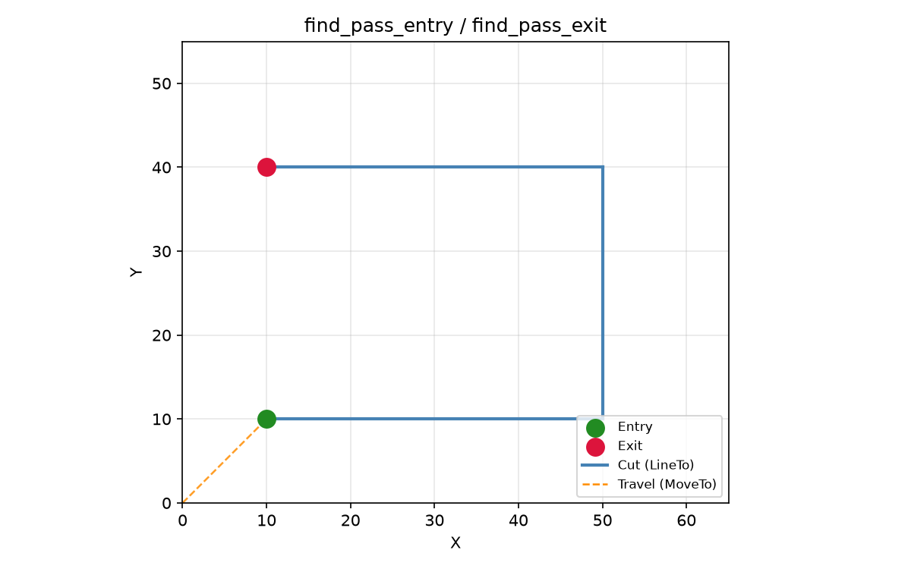
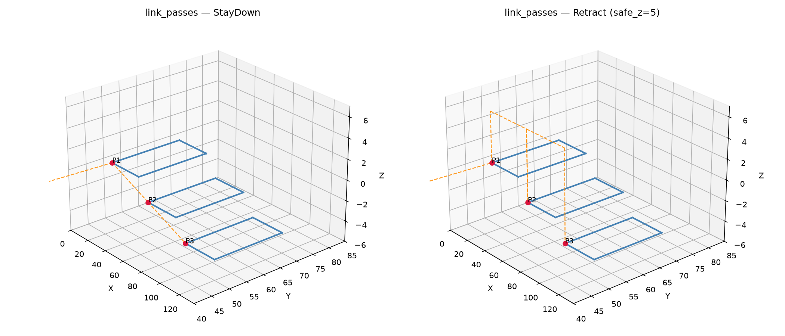
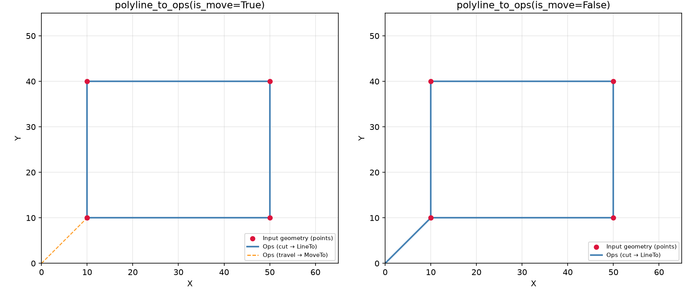

## LinkStrategy

## Functions

### `find_pass_entry()`

```python
find_pass_entry(ops: ops.Ops) -> tuple[float, float, float] | None
```

Find the entry point of an Ops sequence.

Scans for the first travel (MoveTo) endpoint, falling back to the first moving command endpoint.

| Parameter | Type                                     | Description                                        |
| --------- | ---------------------------------------- | -------------------------------------------------- |
| `ops`     | `ops.Ops`                                | An **~raygeo.ops.Ops** container.                  |
| _Returns_ | `tuple[float, float, float] &#124; None` | `(x, y, z)` or `None` if no moving commands exist. |



_Entry and exit points from find_pass_entry / find_pass_exit_

### `find_pass_exit()`

```python
find_pass_exit(ops: ops.Ops) -> tuple[float, float, float] | None
```

Find the exit point of an Ops sequence.

Scans backwards for the last moving command endpoint.

| Parameter | Type                                     | Description                                        |
| --------- | ---------------------------------------- | -------------------------------------------------- |
| `ops`     | `ops.Ops`                                | An **~raygeo.ops.Ops** container.                  |
| _Returns_ | `tuple[float, float, float] &#124; None` | `(x, y, z)` or `None` if no moving commands exist. |

### `link_passes()`

```python
link_passes(
    passes: list[ops.Ops],
    safe_z: float,
    strategy: str | LinkStrategy,
) -> ops.Ops
```

Join ordered machining passes into a single Ops sequence.

The first pass is emitted as-is; subsequent passes are prefixed with travel moves according to
_strategy_:

- `"retract"` / `LinkStrategy.RETRACT` — retract to _safe_z_, move XY at that height, then descend
  to the next pass start Z.
- `"stay_down"` / `LinkStrategy.STAY_DOWN` — move directly from the previous pass end to the next
  pass start without retracting.

| Parameter  | Type                      | Description                                 |
| ---------- | ------------------------- | ------------------------------------------- |
| `passes`   | `list[ops.Ops]`           | Ordered list of **~raygeo.ops.Ops** passes. |
| `safe_z`   | `float`                   | Z height for retract moves (mm).            |
| `strategy` | `str &#124; LinkStrategy` | Linking strategy.                           |
| _Returns_  | `ops.Ops`                 | A single \*\*~raygeo.ops.Ops\*\* container. |



_Three passes linked with StayDown vs Retract strategies_

### `polyline_to_ops()`

```python
polyline_to_ops(
    points: list[tuple[float, float, float]],
    move_first: bool = True,
) -> ops.Ops
```

Convert a 3-D polyline into an Ops command sequence.

When _move_first_ is `True` the first point is emitted as a MoveTo and subsequent points as LineTo.
When _move_first_ is `False` every point is emitted as a LineTo (useful for appending a polyline to
an in-progress cut).

| Parameter    | Type                               | Description                                  |
| ------------ | ---------------------------------- | -------------------------------------------- |
| `points`     | `list[tuple[float, float, float]]` | List of `(x, y, z)` tuples.                  |
| `move_first` | `bool = True`                      | Whether to emit the first point as a MoveTo. |
| _Returns_    | `ops.Ops`                          | An \*\*~raygeo.ops.Ops\*\* container.        |



_polyline_to_ops with move_first=True vs move_first=False_
