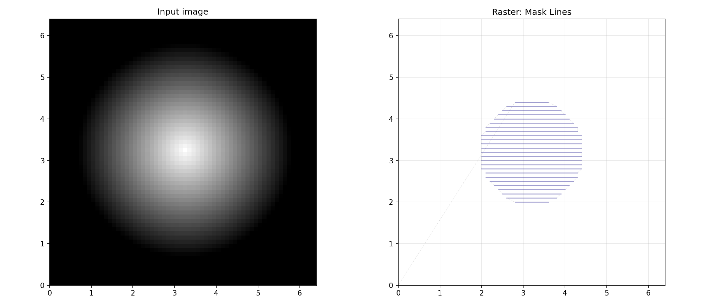
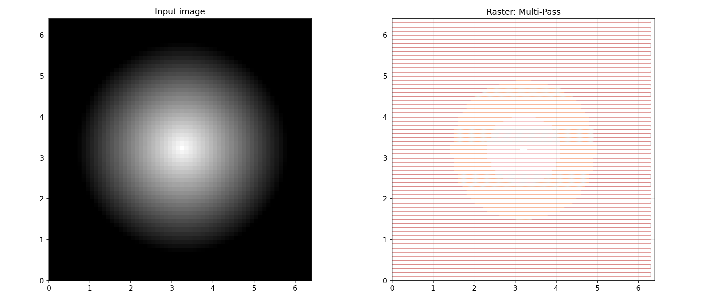
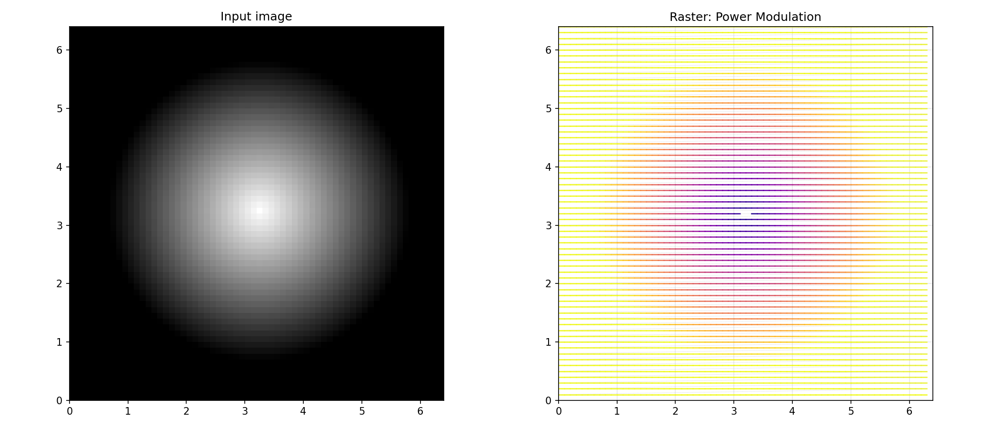

## ScanLine

### `end_mm`

`end_mm: tuple[float, float]`

### `index`

`index: int`

### `line_interval_mm`

`line_interval_mm: float`

### `pixels`

`pixels: list[tuple[int, int]]`

### `start_mm`

`start_mm: tuple[float, float]`

### `direction()`

`direction() -> tuple[float, float]`

| Parameter | Type                  | Description |
| --------- | --------------------- | ----------- |
| _Returns_ | `tuple[float, float]` |             |

### `length_mm()`

`length_mm() -> float`

| Parameter | Type    | Description |
| --------- | ------- | ----------- |
| _Returns_ | `float` |             |

### `pixel_to_mm()`

`pixel_to_mm(px: int, py: int, pixels_per_mm: tuple[float, float]) -> tuple[float, float]`

| Parameter       | Type                  | Description |
| --------------- | --------------------- | ----------- |
| `px`            | `int`                 |             |
| `py`            | `int`                 |             |
| `pixels_per_mm` | `tuple[float, float]` |             |
| _Returns_       | `tuple[float, float]` |             |

## ScanMode

## Functions

### `downsample_power_values()`

`downsample_power_values(power_values: numpy.ndarray, start_mm: tuple[float, float], end_mm: tuple[float, float], sample_interval_mm: float) -> tuple[numpy.ndarray, numpy.ndarray, numpy.ndarray]`

| Parameter            | Type                                                 | Description |
| -------------------- | ---------------------------------------------------- | ----------- |
| `power_values`       | `numpy.ndarray`                                      |             |
| `start_mm`           | `tuple[float, float]`                                |             |
| `end_mm`             | `tuple[float, float]`                                |             |
| `sample_interval_mm` | `float`                                              |             |
| _Returns_            | `tuple[numpy.ndarray, numpy.ndarray, numpy.ndarray]` |             |

### `find_mask_bounding_box()`

`find_mask_bounding_box(mask: numpy.ndarray) -> tuple[int, int, int, int] | None`

| Parameter | Type                                    | Description |
| --------- | --------------------------------------- | ----------- |
| `mask`    | `numpy.ndarray`                         |             |
| _Returns_ | `tuple[int, int, int, int] &#124; None` |             |

### `find_segments()`

`find_segments(values: numpy.ndarray) -> list[tuple[int, int]]`

| Parameter | Type                    | Description |
| --------- | ----------------------- | ----------- |
| `values`  | `numpy.ndarray`         |             |
| _Returns_ | `list[tuple[int, int]]` |             |

### `generate_horizontal_scan_positions()`

`generate_horizontal_scan_positions(y_min_px: int, y_max_px: int, height_px: int, pixels_per_mm: tuple[float, float], line_interval_mm: float, offset_y_mm: float) -> tuple[list[float], list[float]]`

| Parameter          | Type                              | Description |
| ------------------ | --------------------------------- | ----------- |
| `y_min_px`         | `int`                             |             |
| `y_max_px`         | `int`                             |             |
| `height_px`        | `int`                             |             |
| `pixels_per_mm`    | `tuple[float, float]`             |             |
| `line_interval_mm` | `float`                           |             |
| `offset_y_mm`      | `float`                           |             |
| _Returns_          | `tuple[list[float], list[float]]` |             |

### `generate_scan_lines()`

`generate_scan_lines(bbox: tuple[int, int, int, int], image_size: tuple[int, int], pixels_per_mm: tuple[float, float], line_interval_mm: float, direction_degrees: float = 0, offset_x_mm: float = 0, offset_y_mm: float = 0, global_center_mm: tuple[float, float] | None = None) -> list[ScanLine]`

| Parameter           | Type                                     | Description |
| ------------------- | ---------------------------------------- | ----------- |
| `bbox`              | `tuple[int, int, int, int]`              |             |
| `image_size`        | `tuple[int, int]`                        |             |
| `pixels_per_mm`     | `tuple[float, float]`                    |             |
| `line_interval_mm`  | `float`                                  |             |
| `direction_degrees` | `float = 0`                              |             |
| `offset_x_mm`       | `float = 0`                              |             |
| `offset_y_mm`       | `float = 0`                              |             |
| `global_center_mm`  | `tuple[float, float] &#124; None = None` |             |
| _Returns_           | `list[ScanLine]`                         |             |

### `line_pixels()`

`line_pixels(start: tuple[float, float], end: tuple[float, float], width: int, height: int) -> list[tuple[int, int]]`

| Parameter | Type                    | Description |
| --------- | ----------------------- | ----------- |
| `start`   | `tuple[float, float]`   |             |
| `end`     | `tuple[float, float]`   |             |
| `width`   | `int`                   |             |
| `height`  | `int`                   |             |
| _Returns_ | `list[tuple[int, int]]` |             |

### `rasterize_mask_lines()`

`rasterize_mask_lines(mask: numpy.NDArray[numpy.uint8], pixels_per_mm: tuple[float, float], offset_x_mm: float, offset_y_mm: float, line_interval_mm: float, z: float = 0, angle: float = 0, scan_mode: ScanMode = ScanMode.Segmented) -> ops.Ops`

| Parameter          | Type                            | Description |
| ------------------ | ------------------------------- | ----------- |
| `mask`             | `numpy.NDArray[numpy.uint8]`    |             |
| `pixels_per_mm`    | `tuple[float, float]`           |             |
| `offset_x_mm`      | `float`                         |             |
| `offset_y_mm`      | `float`                         |             |
| `line_interval_mm` | `float`                         |             |
| `z`                | `float = 0`                     |             |
| `angle`            | `float = 0`                     |             |
| `scan_mode`        | `ScanMode = ScanMode.Segmented` |             |
| _Returns_          | `ops.Ops`                       |             |

_Rasterization: Mask Lines_

### `rasterize_mask_scan()`

`rasterize_mask_scan(mask: numpy.NDArray[numpy.uint8], pixels_per_mm: tuple[float, float], offset_x_mm: float, offset_y_mm: float, line_interval_mm: float, step_power: float = 1, angle: float = 0, scan_mode: ScanMode = ScanMode.Segmented) -> ops.Ops`

| Parameter          | Type                            | Description |
| ------------------ | ------------------------------- | ----------- |
| `mask`             | `numpy.NDArray[numpy.uint8]`    |             |
| `pixels_per_mm`    | `tuple[float, float]`           |             |
| `offset_x_mm`      | `float`                         |             |
| `offset_y_mm`      | `float`                         |             |
| `line_interval_mm` | `float`                         |             |
| `step_power`       | `float = 1`                     |             |
| `angle`            | `float = 0`                     |             |
| `scan_mode`        | `ScanMode = ScanMode.Segmented` |             |
| _Returns_          | `ops.Ops`                       |             |

_Rasterization: Mask Scan_

### `rasterize_multi_pass()`

`rasterize_multi_pass(gray_image: numpy.NDArray[numpy.uint8], pixels_per_mm: tuple[float, float], offset_x_mm: float, offset_y_mm: float, line_interval_mm: float, num_depth_levels: int, z_step_down: float, angle: float = 0, angle_increment: float = 0, scan_mode: ScanMode = ScanMode.Segmented) -> ops.Ops`

| Parameter          | Type                            | Description |
| ------------------ | ------------------------------- | ----------- |
| `gray_image`       | `numpy.NDArray[numpy.uint8]`    |             |
| `pixels_per_mm`    | `tuple[float, float]`           |             |
| `offset_x_mm`      | `float`                         |             |
| `offset_y_mm`      | `float`                         |             |
| `line_interval_mm` | `float`                         |             |
| `num_depth_levels` | `int`                           |             |
| `z_step_down`      | `float`                         |             |
| `angle`            | `float = 0`                     |             |
| `angle_increment`  | `float = 0`                     |             |
| `scan_mode`        | `ScanMode = ScanMode.Segmented` |             |
| _Returns_          | `ops.Ops`                       |             |

_Rasterization: Multi-Pass_

### `rasterize_power_modulation()`

`rasterize_power_modulation(gray_image: numpy.NDArray[numpy.uint8], alpha: numpy.NDArray[numpy.uint8], pixels_per_mm: tuple[float, float], offset_x_mm: float, offset_y_mm: float, line_interval_mm: float, sample_interval_mm: float, min_power: float = 0, max_power: float = 1, step_power: float = 1, num_power_levels: int = 256, angle: float = 0, scan_mode: ScanMode = ScanMode.Segmented) -> ops.Ops`

| Parameter            | Type                            | Description |
| -------------------- | ------------------------------- | ----------- |
| `gray_image`         | `numpy.NDArray[numpy.uint8]`    |             |
| `alpha`              | `numpy.NDArray[numpy.uint8]`    |             |
| `pixels_per_mm`      | `tuple[float, float]`           |             |
| `offset_x_mm`        | `float`                         |             |
| `offset_y_mm`        | `float`                         |             |
| `line_interval_mm`   | `float`                         |             |
| `sample_interval_mm` | `float`                         |             |
| `min_power`          | `float = 0`                     |             |
| `max_power`          | `float = 1`                     |             |
| `step_power`         | `float = 1`                     |             |
| `num_power_levels`   | `int = 256`                     |             |
| `angle`              | `float = 0`                     |             |
| `scan_mode`          | `ScanMode = ScanMode.Segmented` |             |
| _Returns_            | `ops.Ops`                       |             |

_Rasterization: Power Modulation_

### `resample_rows()`

`resample_rows(image: numpy.NDArray[numpy.uint8], y_coords_px: numpy.ndarray) -> numpy.NDArray[numpy.uint8]`

| Parameter     | Type                         | Description |
| ------------- | ---------------------------- | ----------- |
| `image`       | `numpy.NDArray[numpy.uint8]` |             |
| `y_coords_px` | `numpy.ndarray`              |             |
| _Returns_     | `numpy.NDArray[numpy.uint8]` |             |
