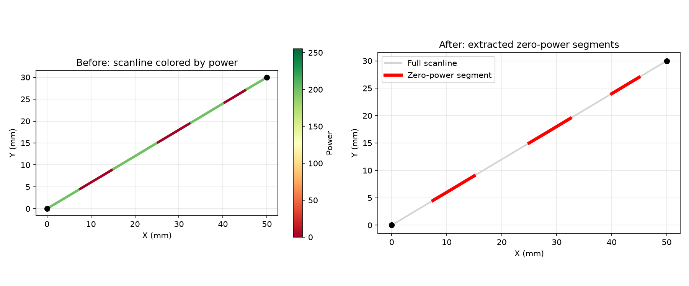
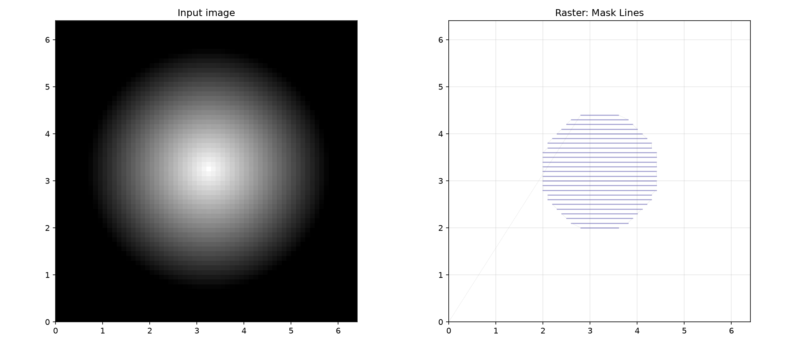
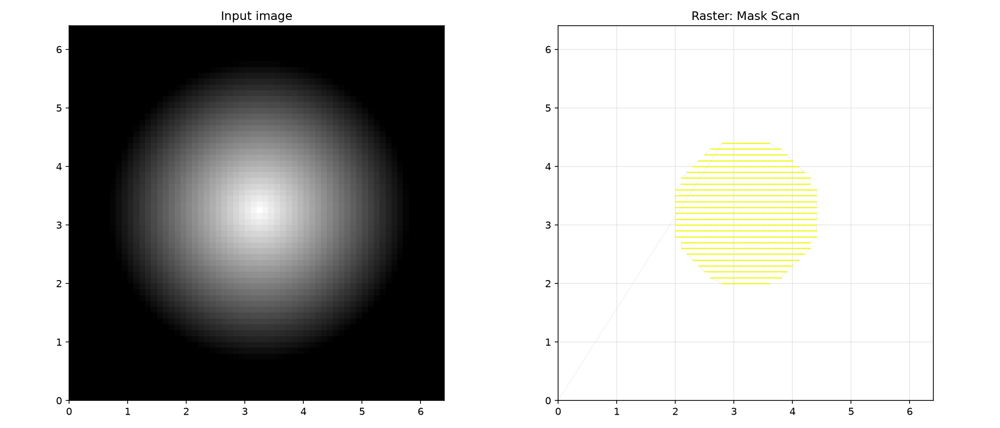
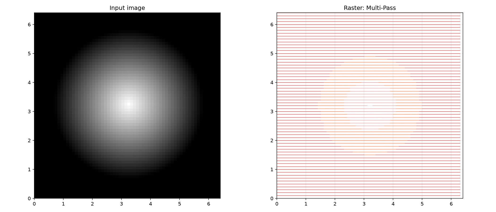
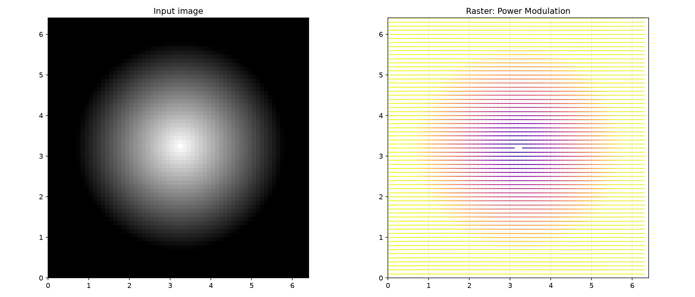

## ScanLine

A single scan line with its pixel coverage and mm-space endpoints.

Produced by **generate_scan_lines**. Each line has a unique index, start/end positions in mm, and
the set of pixels it intersects in the image.

### `end_mm`

```python
end_mm: tuple[float, float]
```

End position of the scan line in mm space.

### `index`

```python
index: int
```

The index of this scan line (used to determine alternating direction).

### `line_interval_mm`

```python
line_interval_mm: float
```

Spacing between scan lines in mm.

### `pixels`

```python
pixels: list[tuple[int, int]]
```

Pixel coordinates covered by this scan line.

### `start_mm`

```python
start_mm: tuple[float, float]
```

Start position of the scan line in mm space.

### `direction()`

```python
direction() -> tuple[float, float]
```

Normalised direction vector from start to end in mm space.

| Parameter    | Type                  | Description             |
| ------------ | --------------------- | ----------------------- |
| _Returns_    | `tuple[float, float]` | `(dx, dy)` unit vector. |
| _Complexity_ |                       | O(1)                    |

### `length_mm()`

```python
length_mm() -> float
```

Compute the length of this scan line in mm.

| Parameter    | Type    | Description |
| ------------ | ------- | ----------- |
| _Returns_    | `float` |             |
| _Complexity_ |         | O(1)        |

### `pixel_to_mm()`

```python
pixel_to_mm(
    px: int,
    py: int,
    pixels_per_mm: tuple[float, float],
) -> tuple[float, float]
```

Convert pixel coordinates to mm space, projected onto this scan line.

| Parameter       | Type                  | Description                                            |
| --------------- | --------------------- | ------------------------------------------------------ |
| `px`            | `int`                 | X pixel coordinate.                                    |
| `py`            | `int`                 | Y pixel coordinate.                                    |
| `pixels_per_mm` | `tuple[float, float]` | `(x, y)` pixel density in px/mm.                       |
| _Returns_       | `tuple[float, float]` | `(x, y)` position in mm, projected onto the scan line. |
| _Complexity_    |                       | O(1)                                                   |

## ScanMode

Scan mode for raster operations.

`SEGMENTED` skips zero-power gaps within a scan line. `FULL_SWEEP` emits the full line with power
values (zeros included).

## Functions

### `downsample_power_values()`

```python
downsample_power_values(
    power_values: numpy.ndarray,
    start_mm: tuple[float, float],
    end_mm: tuple[float, float],
    sample_interval_mm: float,
) -> tuple[numpy.ndarray, numpy.ndarray, numpy.ndarray]
```

Downsample power values along a scan segment.

If the sample interval is larger than the native pixel spacing, the power values are resampled by
nearest-neighbour at the target spacing. Otherwise the original values are returned with their
corresponding positions.

| Parameter            | Type                                                 | Description                                   |
| -------------------- | ---------------------------------------------------- | --------------------------------------------- |
| `power_values`       | `numpy.ndarray`                                      | 1-D array of byte power values.               |
| `start_mm`           | `tuple[float, float]`                                | `(x, y)` start position of the segment in mm. |
| `end_mm`             | `tuple[float, float]`                                | `(x, y)` end position of the segment in mm.   |
| `sample_interval_mm` | `float`                                              | Desired sample spacing in mm.                 |
| _Returns_            | `tuple[numpy.ndarray, numpy.ndarray, numpy.ndarray]` | `(power, x_mm, y_mm)` of downsampled values.  |
| _Complexity_         |                                                      | O(n) where n = number of power values         |

### `extract_zero_power_segments()`

```python
extract_zero_power_segments(
    start: tuple[float, float, float],
    end: tuple[float, float, float],
    power_values: bytes,
) -> list[float]
```

Extract zero-power segment endpoints from scanline power data.

Finds contiguous runs of zero values in _power_values_ and computes their 3D start/end points via
linear interpolation along the scanline segment from _start_ to _end_.

| Parameter      | Type                         | Description                                            |
| -------------- | ---------------------------- | ------------------------------------------------------ |
| `start`        | `tuple[float, float, float]` | (x, y, z) start position of the scanline in mm.        |
| `end`          | `tuple[float, float, float]` | (x, y, z) end position of the scanline in mm.          |
| `power_values` | `bytes`                      | Per-step power bytes.                                  |
| _Returns_      | `list[float]`                | Flat list of `[sx, sy, sz, ex, ey, ez, ...]` segments. |
| _Complexity_   |                              | O(n) where n = number of steps                         |



_Zero-power segment extraction_

### `find_mask_bounding_box()`

```python
find_mask_bounding_box(mask: numpy.ndarray) -> tuple[int, int, int, int] | None
```

Find the bounding box of non-zero pixels in a binary mask.

Scans the mask and returns the (y_min, y_max, x_min, x_max) of the smallest axis-aligned rectangle
covering all non-zero pixels.

| Parameter    | Type                                    | Description                                                                               |
| ------------ | --------------------------------------- | ----------------------------------------------------------------------------------------- |
| `mask`       | `numpy.ndarray`                         | 2-D binary mask array.                                                                    |
| _Returns_    | `tuple[int, int, int, int] &#124; None` | `(y_min, y_max, x_min, x_max)` pixel coordinates, or `None` if the mask is entirely zero. |
| _Complexity_ |                                         | O(h\*w)                                                                                   |

### `find_segments()`

```python
find_segments(values: numpy.ndarray) -> list[tuple[int, int]]
```

Find contiguous non-zero segments in a 1-D array.

Returns a list of `(start, end)` index pairs covering every run of consecutive non-zero values.

| Parameter    | Type                    | Description                         |
| ------------ | ----------------------- | ----------------------------------- |
| `values`     | `numpy.ndarray`         | 1-D array of byte values.           |
| _Returns_    | `list[tuple[int, int]]` | List of `(start, end)` index pairs. |
| _Complexity_ |                         | O(n)                                |

### `generate_horizontal_scan_positions()`

```python
generate_horizontal_scan_positions(
    y_min_px: int,
    y_max_px: int,
    height_px: int,
    pixels_per_mm: tuple[float, float],
    line_interval_mm: float,
    offset_y_mm: float,
) -> tuple[list[float], list[float]]
```

Compute Y positions for horizontal scan lines.

Given a vertical pixel range, computes the mm and pixel Y coordinates of evenly-spaced scan lines
(aligned to a global grid defined by _line_interval_mm_ and _offset_y_mm_).

| Parameter          | Type                              | Description                                        |
| ------------------ | --------------------------------- | -------------------------------------------------- |
| `y_min_px`         | `int`                             | Minimum Y pixel coordinate.                        |
| `y_max_px`         | `int`                             | Maximum Y pixel coordinate.                        |
| `height_px`        | `int`                             | Image height in pixels.                            |
| `pixels_per_mm`    | `tuple[float, float]`             | `(x, y)` pixel density in px/mm.                   |
| `line_interval_mm` | `float`                           | Spacing between scan lines in mm.                  |
| `offset_y_mm`      | `float`                           | Global Y offset in mm.                             |
| _Returns_          | `tuple[list[float], list[float]]` | `(y_coords_mm, y_coords_px)` tuple of Y positions. |
| _Complexity_       |                                   | O(n) where n = number of scan lines                |

### `generate_scan_lines()`

```python
generate_scan_lines(
    bbox: tuple[int, int, int, int],
    image_size: tuple[int, int],
    pixels_per_mm: tuple[float, float],
    line_interval_mm: float,
    direction_degrees: float = 0,
    offset_x_mm: float = 0,
    offset_y_mm: float = 0,
    global_center_mm: tuple[float, float] | None = None,
) -> list[ScanLine]
```

Generate scan lines covering a bounding box.

Creates a set of parallel scan lines at a given angle and spacing that cover the bounding box
region. Each line is rasterised to pixels and stored as a **ScanLine**.

| Parameter           | Type                                     | Description                                                           |
| ------------------- | ---------------------------------------- | --------------------------------------------------------------------- |
| `bbox`              | `tuple[int, int, int, int]`              | `(y_min, y_max, x_min, x_max)` of the region.                         |
| `image_size`        | `tuple[int, int]`                        | `(width, height)` of the image in pixels.                             |
| `pixels_per_mm`     | `tuple[float, float]`                    | `(x, y)` pixel density in px/mm.                                      |
| `line_interval_mm`  | `float`                                  | Spacing between scan lines in mm.                                     |
| `direction_degrees` | `float = 0`                              | Scan direction angle in degrees.                                      |
| `offset_x_mm`       | `float = 0`                              | Global X offset in mm.                                                |
| `offset_y_mm`       | `float = 0`                              | Global Y offset in mm.                                                |
| `global_center_mm`  | `tuple[float, float] &#124; None = None` | Optional rotation centre in mm; defaults to the bbox centre + offset. |
| _Returns_           | `list[ScanLine]`                         | List of \*\*ScanLine\*\* objects.                                     |
| _Complexity_        |                                          | O(n \* p) where n = number of lines, p = pixels per line              |

### `line_pixels()`

```python
line_pixels(
    start: tuple[float, float],
    end: tuple[float, float],
    width: int,
    height: int,
) -> list[tuple[int, int]]
```

Rasterise a line segment into pixel coordinates.

Uses Bresenham's line algorithm to enumerate all integer pixel positions intersecting the line from
_start_ to _end_, clipped to the image dimensions `(width, height)`.

| Parameter    | Type                    | Description                                     |
| ------------ | ----------------------- | ----------------------------------------------- |
| `start`      | `tuple[float, float]`   | (x, y) start position in pixel coordinates.     |
| `end`        | `tuple[float, float]`   | (x, y) end position in pixel coordinates.       |
| `width`      | `int`                   | Image width in pixels.                          |
| `height`     | `int`                   | Image height in pixels.                         |
| _Returns_    | `list[tuple[int, int]]` | List of `(x, y)` pixel coordinates on the line. |
| _Complexity_ |                         | O(n) where n = number of pixels on the line     |

### `rasterize_mask_lines()`

```python
rasterize_mask_lines(
    mask: numpy.NDArray[numpy.uint8],
    pixels_per_mm: tuple[float, float],
    offset_x_mm: float,
    offset_y_mm: float,
    line_interval_mm: float,
    z: float = 0,
    angle: float = 0,
    scan_mode: ScanMode = ScanMode.SEGMENTED,
) -> ops.Ops
```

Rasterise a binary mask into line-to commands (no power).

Similar to **rasterize_mask_scan** but emits move-to/line-to commands with a Z offset instead of
scan-to with power values. Useful for simple contour or hatch patterns.

| Parameter          | Type                            | Description                                                                           |
| ------------------ | ------------------------------- | ------------------------------------------------------------------------------------- |
| `mask`             | `numpy.NDArray[numpy.uint8]`    | 2-D binary mask array.                                                                |
| `pixels_per_mm`    | `tuple[float, float]`           | `(x, y)` pixel density in px/mm.                                                      |
| `offset_x_mm`      | `float`                         | Global X offset in mm.                                                                |
| `offset_y_mm`      | `float`                         | Global Y offset in mm.                                                                |
| `line_interval_mm` | `float`                         | Spacing between scan lines in mm.                                                     |
| `z`                | `float = 0`                     | Z offset for the lines in mm.                                                         |
| `angle`            | `float = 0`                     | Scan angle in degrees.                                                                |
| `scan_mode`        | `ScanMode = ScanMode.SEGMENTED` | `ScanMode.SEGMENTED` or `ScanMode.FULL_SWEEP`.                                        |
| _Returns_          | `ops.Ops`                       | An \*\*~raygeo.ops.Ops\*\* container.                                                 |
| _Complexity_       |                                 | O(h \* w + n \* p) where h, w = image dimensions, n = scan lines, p = pixels per line |



_Rasterization: Mask Lines_

### `rasterize_mask_scan()`

```python
rasterize_mask_scan(
    mask: numpy.NDArray[numpy.uint8],
    pixels_per_mm: tuple[float, float],
    offset_x_mm: float,
    offset_y_mm: float,
    line_interval_mm: float,
    step_power: float = 1,
    angle: float = 0,
    scan_mode: ScanMode = ScanMode.SEGMENTED,
) -> ops.Ops
```

Rasterise a binary mask into scan-to commands.

Generates scan lines covering the mask's bounding box, samples the mask along each line, and emits
move-to/scan-to commands for each non-zero segment (or the full sweep).

| Parameter          | Type                            | Description                                                                           |
| ------------------ | ------------------------------- | ------------------------------------------------------------------------------------- |
| `mask`             | `numpy.NDArray[numpy.uint8]`    | 2-D binary mask array.                                                                |
| `pixels_per_mm`    | `tuple[float, float]`           | `(x, y)` pixel density in px/mm.                                                      |
| `offset_x_mm`      | `float`                         | Global X offset in mm.                                                                |
| `offset_y_mm`      | `float`                         | Global Y offset in mm.                                                                |
| `line_interval_mm` | `float`                         | Spacing between scan lines in mm.                                                     |
| `step_power`       | `float = 1`                     | Power value (0-1) for exposed pixels.                                                 |
| `angle`            | `float = 0`                     | Scan angle in degrees.                                                                |
| `scan_mode`        | `ScanMode = ScanMode.SEGMENTED` | `ScanMode.SEGMENTED` or `ScanMode.FULL_SWEEP`.                                        |
| _Returns_          | `ops.Ops`                       | An \*\*~raygeo.ops.Ops\*\* container.                                                 |
| _Complexity_       |                                 | O(h \* w + n \* p) where h, w = image dimensions, n = scan lines, p = pixels per line |



_Rasterization: Mask Scan_

### `rasterize_multi_pass()`

```python
rasterize_multi_pass(
    gray_image: numpy.NDArray[numpy.uint8],
    pixels_per_mm: tuple[float, float],
    offset_x_mm: float,
    offset_y_mm: float,
    line_interval_mm: float,
    num_depth_levels: int,
    z_step_down: float,
    angle: float = 0,
    angle_increment: float = 0,
    scan_mode: ScanMode = ScanMode.SEGMENTED,
) -> ops.Ops
```

Rasterise a grayscale image as multiple Z-depth passes.

Decomposes the grayscale image into _num_depth_levels_ layers by depth-slicing, then rasterises each
layer with a progressive Z offset and optional per-pass angle increment.

| Parameter          | Type                            | Description                                                                                              |
| ------------------ | ------------------------------- | -------------------------------------------------------------------------------------------------------- |
| `gray_image`       | `numpy.NDArray[numpy.uint8]`    | 2-D grayscale image (0 = black, 255 = white).                                                            |
| `pixels_per_mm`    | `tuple[float, float]`           | `(x, y)` pixel density in px/mm.                                                                         |
| `offset_x_mm`      | `float`                         | Global X offset in mm.                                                                                   |
| `offset_y_mm`      | `float`                         | Global Y offset in mm.                                                                                   |
| `line_interval_mm` | `float`                         | Spacing between scan lines in mm.                                                                        |
| `num_depth_levels` | `int`                           | Number of depth layers to produce.                                                                       |
| `z_step_down`      | `float`                         | Z decrement per depth layer in mm.                                                                       |
| `angle`            | `float = 0`                     | Initial scan angle in degrees.                                                                           |
| `angle_increment`  | `float = 0`                     | Angle added per depth layer in degrees.                                                                  |
| `scan_mode`        | `ScanMode = ScanMode.SEGMENTED` | `ScanMode.SEGMENTED` or `ScanMode.FULL_SWEEP`.                                                           |
| _Returns_          | `ops.Ops`                       | An \*\*~raygeo.ops.Ops\*\* container.                                                                    |
| _Complexity_       |                                 | O(d \* (h \* w + n \* p)) where d = depth levels, h, w = image dims, n = scan lines, p = pixels per line |



_Rasterization: Multi-Pass_

### `rasterize_power_modulation()`

```python
rasterize_power_modulation(
    gray_image: numpy.NDArray[numpy.uint8],
    alpha: numpy.NDArray[numpy.uint8],
    pixels_per_mm: tuple[float, float],
    offset_x_mm: float,
    offset_y_mm: float,
    line_interval_mm: float,
    sample_interval_mm: float,
    min_power: float = 0,
    max_power: float = 1,
    step_power: float = 1,
    num_power_levels: int = 256,
    angle: float = 0,
    scan_mode: ScanMode = ScanMode.SEGMENTED,
) -> ops.Ops
```

Rasterise a grayscale image with power-modulated scans.

Samples the image along scan lines and computes per-pixel power values from the grayscale intensity
and alpha channel, then emits move-to/scan-to commands with the modulated power.

| Parameter            | Type                            | Description                                                                           |
| -------------------- | ------------------------------- | ------------------------------------------------------------------------------------- |
| `gray_image`         | `numpy.NDArray[numpy.uint8]`    | 2-D grayscale image (0 = black, 255 = white).                                         |
| `alpha`              | `numpy.NDArray[numpy.uint8]`    | 2-D alpha mask (0 = transparent/no emission).                                         |
| `pixels_per_mm`      | `tuple[float, float]`           | `(x, y)` pixel density in px/mm.                                                      |
| `offset_x_mm`        | `float`                         | Global X offset in mm.                                                                |
| `offset_y_mm`        | `float`                         | Global Y offset in mm.                                                                |
| `line_interval_mm`   | `float`                         | Spacing between scan lines in mm.                                                     |
| `sample_interval_mm` | `float`                         | Output sample spacing in mm.                                                          |
| `min_power`          | `float = 0`                     | Minimum power fraction (for white pixels).                                            |
| `max_power`          | `float = 1`                     | Maximum power fraction (for black pixels).                                            |
| `step_power`         | `float = 1`                     | Global power multiplier.                                                              |
| `num_power_levels`   | `int = 256`                     | Number of quantised power levels.                                                     |
| `angle`              | `float = 0`                     | Scan angle in degrees.                                                                |
| `scan_mode`          | `ScanMode = ScanMode.SEGMENTED` | `ScanMode.SEGMENTED` or `ScanMode.FULL_SWEEP`.                                        |
| _Returns_            | `ops.Ops`                       | An \*\*~raygeo.ops.Ops\*\* container.                                                 |
| _Complexity_         |                                 | O(h \* w + n \* p) where h, w = image dimensions, n = scan lines, p = pixels per line |



_Rasterization: Power Modulation_

### `resample_rows()`

```python
resample_rows(
    image: numpy.NDArray[numpy.uint8],
    y_coords_px: numpy.ndarray,
) -> numpy.NDArray[numpy.uint8]
```

Resample image rows at arbitrary Y coordinates.

Performs linear interpolation between adjacent rows to sample the image at the given (potentially
fractional) Y positions.

| Parameter     | Type                         | Description                                       |
| ------------- | ---------------------------- | ------------------------------------------------- |
| `image`       | `numpy.NDArray[numpy.uint8]` | 2-D input image array.                            |
| `y_coords_px` | `numpy.ndarray`              | 1-D array of Y pixel coordinates.                 |
| _Returns_     | `numpy.NDArray[numpy.uint8]` | 2-D array with shape `(len(y_coords_px), width)`. |
| _Complexity_  |                              | O(m \* w) where m = output rows, w = image width  |
